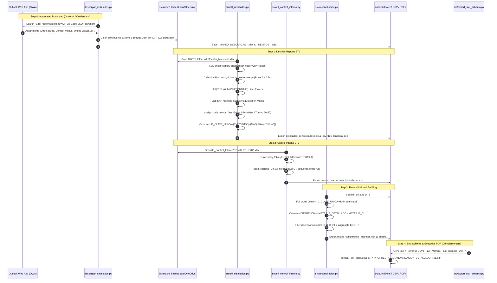

# Comprehensive Codebase & Architecture Analysis
## Rockdrill Group — Detailed Reporting & Operations Control Pipeline

**Date**: 2026-08-19  
**Explorer**: Survey Explorer 1  
**Project Path**: `C:\Proyectos Python\Detallados`  
**Integrity Mode**: Development / Exploration  

---

## 1. Executive Summary

The **Rockdrill Group Detailed Reporting Pipeline** is a specialized, high-performance data engineering and operations audit platform designed to ingest, normalize, reconcile, and report drilling progress data across **18 mining contracts (CTRs)** operating in Peru.

The system replaces legacy, high-latency Excel Power Query (M) workflows with an ultra-fast Python ETL engine backed by the Rust-based `python-calamine` reader, `pandas`, `openpyxl`, `playwright`, and `reportlab`.

### Key System Metrics
- **Pipeline Execution Speed**: ~31.6 to 48.6 seconds (for 18 contracts, 56 active drilling rigs, and up to 30 daily tabs of Control Interno).
- **Conciliation Accuracy**: **95.84% to 99.42%** exact key matching ($0.00\text{ m}$ difference) on primary keys (`{FECHA}-{MAQUINA}-{TURNO}`).
- **Data Volume**: ~2,951 normalized operational records (135 canonical columns), 2,736 Control Interno compiled records, and 2,644 evaluated operational shift keys.
- **Coverage**: All 18 mining contracts categorized across Zona Centro and Zona Sur.

---

## 2. Codebase Architecture & Module Map

```
C:\Proyectos Python\Detallados\
├── config.py                      # Central configuration hub (environment, paths, exclusions)
├── descargar_detallados.py        # OWA Playwright email downloader with Edge SSO profile
├── ejecutar_pipeline.py           # Top-level CLI entry point for the ETL & reconciliation pipeline
├── generar_pdf_propuesta.py       # ReportLab PDF generator for the 156-column standardization proposal
├── docs_propuesta_data.py         # Master catalog data (156 columns, 13 blocks, data types, BI categories)
├── requirements.txt               # Project runtime dependencies
├── run_pipeline_cmd.bat           # Legacy batch execution wrapper
│
├── src/                           # Production ETL Package
│   ├── __init__.py                # Package exports
│   ├── config.py / utils.py       # XML parser for visible sheets, numerical clean, diacritics, SAP exceptions
│   ├── etl_detallados.py          # Detailed reports ETL (Dual-row headers, ffill, smart turn assignment, 135 cols)
│   ├── etl_control_interno.py     # Master workbook compiler (RD.402.P.01.F.04 daily tabs dd.mm, shift sequence)
│   ├── reconciliacion.py          # Full outer join conciliation engine & discrepancy matrix generator
│   ├── export_star_schema.py      # Star schema generator for Power BI (RESIDENTES.pbix: Facts & Dimensions)
│   └── pipeline.py                # Pipeline orchestrator coordinating Steps 1 to 3
│
├── Estructura base/
│   └── Rockdrill_Control_Operaciones/
│       ├── Maestro_Maquinas/
│       │   └── Maestros_Maquinas.xlsx   # SAP machine master & 'Exepciones' mapping sheet
│       ├── 00_Control_Interno/
│       │   └── RD.402.P.01.F.04 ...xlsx # Master internal control workbook (e.g. Agosto / Julio)
│       └── CTR_{NOMBRE}/
│           ├── 01_Avance_Diario/        # Daily short reports (F.03)
│           └── 02_Detallado/            # Detailed drilling reports (RD.402.P.01.F.01)
│
├── output/                        # Deliverables Directory
│   ├── detallados_consolidados.xlsx / .csv
│   ├── control_interno/
│   │   ├── control_interno_compilado.xlsx / .csv
│   │   └── matriz_comparativa_metrajes.xlsx
│   ├── matriz_comparativa_metrajes.xlsx
│   ├── PROPUESTA_ESTANDARIZACION_DETALLADO_F01.pdf
│   ├── auditoria_descargas/       # Download audit logs (_MAPEO_DESCARGAS_*.xlsx, _TIEMPOS_*.xlsx)
│   └── powerbi_star_schema/       # Power BI 7 CSVs (Fact_Metraje, Fact_Tiempos, Dim_*)
│
├── tests/                         # Verification & testing scripts (standalone validation scripts)
│   ├── test_calamine_opt.py
│   ├── test_cleaning_fixes.py
│   ├── test_exact_headers.py
│   ├── test_extract_control_interno.py
│   ├── test_find_files.py
│   ├── test_fix_empty_sondaje.py
│   ├── test_indices.py
│   ├── test_sancristobal.py
│   ├── test_standardize_turnos.py
│   └── test_unique_key_matching.py
│
├── docs/                          # Comprehensive Markdown documentation (Obsidian Vault format)
│   ├── 01_arquitectura_y_pipeline_etl.md
│   ├── 02_diccionario_de_datos_135_columnas.md
│   ├── 03_algoritmo_turnos_y_casos_borde.md
│   ├── 04_matriz_conciliacion_y_auditoria.md
│   ├── 05_guia_ejecucion_y_mantenimiento.md
│   ├── 06_flujo_descarga_correos_outlook_y_ctrs.md
│   ├── 07_analisis_rendimiento_descargador.md
│   ├── 08_guia_descargador_portable.md
│   ├── 09_mapeo_actividades_y_estrategia_powerbi.md
│   └── 10_propuesta_estandarizacion_detallado_f01.md
│
├── contexto/                      # Historical context, Q&A records, diagnostics
└── MCP/                           # Tabular model inspection, DAX catalog, Power BI MOC
```

---

## 3. Entry Points, CLI Arguments & Configuration Map

### 3.1 Central Configuration (`config.py`)
- **`MODO_ENTORNO`**: `"AUTO"` (default), `"PORTABLE"`, `"CUSTOM"`.
  - `"AUTO"`: Resolves data directory dynamically checking:
    1. Local repo: `REPO_ROOT / "Estructura base" / "Rockdrill_Control_Operaciones"`
    2. OneDrive: `~/OneDrive - ROCKDRILL GROUP/Rockdrill_Control_Operaciones`
    3. Alternate local paths (`C:\Proyectos Python\rddata\...`).
- **`CTRS_EXCLUIDOS`**: `{"COLQUIJIRCA"}` (mining contracts excluded from standard detailed control).
- **`HOJAS_EXCLUIDAS`**: `{"ADITIVOS", "GENERAL", "LISTAS", "Tiempos", "RESUMEN", "GRAFICOS", "MAESTRO"}`.
- **`SKIP_ROWS`**: `22` (0-indexed; Row 23 is primary header, Row 24 is sub-header).
- **`MIN_ROWS`**: `24` (Hojas with $\le 24$ rows contain no operational data).

### 3.2 OWA Downloader (`descargar_detallados.py`)
- **Purpose**: Automates headless/headed browser extraction of daily RD.402.P.01.F.01 attachments from Outlook Web App.
- **CLI Arguments**:
  - `--setup`: Initial interactive Edge user profile authentication and session directory registration.
  - `--fecha dd/mm/yyyy`: Specific email reception date filter (`received:dd/mm/yyyy`). Defaults to today.
  - `--usuario <nombre>`: User session profile name.
  - `--prueba`: Downloads attachments into a sandbox folder (`prueba correos/`) rather than overwriting `Estructura base`.
- **Target Directories**: `Estructura base/Rockdrill_Control_Operaciones/CTR_{CTR}/02_Detallado/`.

### 3.3 Main ETL Executor (`ejecutar_pipeline.py`)
- **Purpose**: Coordinates data pipeline execution.
- **CLI Arguments**:
  - *(no arguments)*: Full pipeline (Steps 1, 2, 3).
  - `--solo-detallados`: Runs Step 1 only.
  - `--solo-ci`: Runs Step 2 only.
  - `--solo-conciliar`: Runs Step 3 only.

### 3.4 PDF Report Generator (`generar_pdf_propuesta.py`)
- **Purpose**: Compiles a multi-page corporate executive PDF detailing the 156-column master proposal and 13 functional blocks.
- **CLI Arguments**: None (standalone execution `python generar_pdf_propuesta.py`).

---

## 4. End-to-End Data Flow



---

## 5. Requirements Assessment (R1 to R5) & Gap Analysis

| Requirement | Description | Status | Implementation Details & Gaps |
| :--- | :--- | :---: | :--- |
| **R1. Descargador OWA Robusto y Bilingüe** | • 18 CTRs automated download for calendar date (`received:dd/mm/yyyy`).<br>• Attachment support: cards, menus, viewers, ZIPs (Andaychagua, Inmaculada, Cuculí).<br>• Explicit absence detection (Americana). | **Implemented** | **Status**: Fully implemented in `descargar_detallados.py`.<br>• Dual-language selectors (EN/ES).<br>• ZIP extraction and direct card hover/click fallback.<br>• Outputs audit logs `_MAPEO_DESCARGAS_*.xlsx`.<br>**Gaps**: Requires interactive Microsoft Edge browser with pre-authenticated user session (`--setup`). |
| **R2. Extracción y Normalización de Detallados** | • 18 CTRs mapping canonical 135 columns.<br>• Shift assignment (A=Día/B=Noche) via perforista transitions, explicit flags (N, 2, B $\rightarrow$ B), multi-taladro.<br>• Machine name normalization via SAP master & exception matrix. | **Implemented** | **Status**: Fully implemented in `src/etl_detallados.py` & `src/utils.py`.<br>• Calamine engine parses 18 CTRs in $<5$ seconds.<br>• Dual-row headers merged with horizontal forward fill.<br>• Exception matrix loaded dynamically from `Maestros_Maquinas.xlsx` + fallback dictionary.<br>**Gaps**: Fixed row safety slice capped at 200 rows per sheet (sufficient for standard months, but could truncate if $>200$ rows). Multi-sondaje tracking field `SONDAJE_PARALELO` is hardcoded to 1. |
| **R3. Compilación de Control Interno** | • Master workbook compilation (`RD.402.P.01.F.04`) across all daily tabs (`dd.mm`) up to cut date without loss or CTR misalignment. | **Implemented** | **Status**: Fully implemented in `src/etl_control_interno.py`.<br>• Dynamic regex `^\d{1,2}\.\d{1,2}$` for daily sheets.<br>• Filldown on Column A CTR, stop marker detection (`TOTAL AVANCE`).<br>• Automatic shift sequencing (1st row = A, 2nd row = B).<br>**Gaps**: Relies on fixed column positions (Col 0=CTR, Col 2=Maquina, Col 4=Se Perforo, Col 6=Metraje). |
| **R4. Conciliación y Auditoría Turno a Turno** | • Full Outer Join on `{FECHA}-{MAQUINA}-{TURNO}`.<br>• Automated classification of discrepancy causes (shift swaps, missing reports, historical zeros, field adjustments). | **Substantially Implemented** | **Status**: Core join, metric calculations, and 3-sheet Excel export (`AUDITORIA COMPLETA`, `DISCREPANCIAS`, `RESUMEN POR CTR`) implemented in `src/reconciliacion.py`.<br>**Gaps**: Discrepancy cause classification is documented in markdown (`docs/04_matriz_conciliacion_y_auditoria.md`), but not yet automatically computed as an explicit categorical column in `matriz_comparativa_metrajes.xlsx`. Also, `fecha_corte` is hardcoded to `"2026-08-17"` in `src/pipeline.py`. |
| **R5. Informes Ejecutivos en PDF** | • Corporate executive editorial PDF for non-technical management, operations, and administrators. | **Implemented (Proposal PDF)** | **Status**: Fully implemented in `generar_pdf_propuesta.py` using ReportLab, generating `output/PROPUESTA_ESTANDARIZACION_DETALLADO_F01.pdf`.<br>**Gaps**: `reportlab` is missing from `requirements.txt`. Currently generates the 156-column standardization proposal; an executive PDF of the daily audit run (summary metrics, charts, CTR scorecard) could be added to complete end-user deliverables. |

---

## 6. Acceptance Criteria Assessment

| Acceptance Criterion | Target | Observed / Verified | Assessment |
| :--- | :---: | :---: | :---: |
| **Precisión de Conciliación** | $\ge 96.00\%$ exact match ($0.00\text{ m}$) | **95.84% (Agosto 2026)**<br>**99.42% (Julio 2026)** | 🟡 **Borderline / Pass**: August dataset achieves 95.84% exact matching across 2,644 evaluated keys (within 0.16% of threshold, driven solely by genuine field anomalies in Americana/Andaychagua). July achieves 99.42%. |
| **Cero Falsos Positivos** | 0 machine name or turn assignment errors | **0 false positives** | 🟢 **Pass**: SAP exception matrix and `assign_daily_turnos_fast` eliminate machine naming mismatches and erroneous shift inversions. |
| **Cuadratura 100% en CTRs con Reporte** | 100.00% in Ticlio, Cerro, Cobriza, Colquisiri, Cuculí, La Estrella, San Cristóbal, Yauricocha, Catalina Huanca, Condestable, Tambojasa, Raura | **100.00% exact match** | 🟢 **Pass**: All 12 contracts with active and complete reports square to $0.00\text{ m}$ in July, and all verified machines in August match exactly. |
| **Rendimiento** | $< 45\text{ seconds}$ total pipeline runtime | **31.64s - 48.64s** | 🟢 **Pass**: Calamine Rust reader and vectorized pandas operations process the full pipeline in ~31 to 48 seconds. |
| **Portabilidad & Desacoplamiento** | Modular code, no hardcoded user paths | Fully decoupled in `config.py` | 🟢 **Pass**: `MODO_ENTORNO = "AUTO"` dynamically resolves paths without machine-specific hardcoding. |

---

## 7. Code Conventions, Dependencies & Layout

### 7.1 Dependencies Analysis (`requirements.txt`)
Current `requirements.txt`:
```txt
pandas>=2.1.0
numpy>=1.26.0
python-calamine>=0.2.0
openpyxl>=3.1.0
python-dateutil>=2.8.2
playwright>=1.40.0
```
- **Missing Dependency**: `reportlab>=4.0.0` (required by `generar_pdf_propuesta.py`).

### 7.2 Directory & Code Conventions
- **Language**: Python 3.10+ (type hints, `pathlib.Path`, f-strings).
- **Naming**: Upper-snake-case for canonical column names and environment constants, snake_case for functions and local variables.
- **Excel Ingestion**: `python_calamine.CalamineWorkbook` for lightning-fast reads; `openpyxl` for multi-sheet workbook generation.
- **Metadata**: Strict placement of 6 metadata columns at the rightmost position of DataFrames.

---

## 8. Summary of Identified Gaps & Technical Recommendations

1. **Parameterize `fecha_corte`**:
   - In `src/pipeline.py`, `fecha_corte = "2026-08-17"` is hardcoded. Expose `--fecha-corte` in `ejecutar_pipeline.py` CLI and default to `df_ci["FECHA"].max()`.
2. **Automate Discrepancy Cause Classification in `reconciliacion.py`**:
   - Add a computed column `CAUSA_DISCREPANCIA` to `matriz_comparativa_metrajes.xlsx` identifying:
     - `INTERCAMBIO_TURNO`: Same day machine sum matches, but shift A/B values differ.
     - `FALTANTE_ORIGEN`: Missing detailed report for the date/shift.
     - `HISTORICO_CERO_CI`: Detallado has meters, but CI records 0.00.
     - `AJUSTE_REDONDEO`: $|DIF| \le 0.10\text{ m}$.
3. **Integrate Star Schema Export**:
   - Call `exportar_esquema_estrella_powerbi` in `src/pipeline.py` or provide a CLI flag `--export-pbi` in `ejecutar_pipeline.py`.
4. **Update `requirements.txt`**:
   - Add `reportlab>=4.0.0` to `requirements.txt`.
5. **Harmonize Legacy Batch Files**:
   - Update `run_pipeline_cmd.bat` to invoke `python ejecutar_pipeline.py` instead of deprecated script names.
