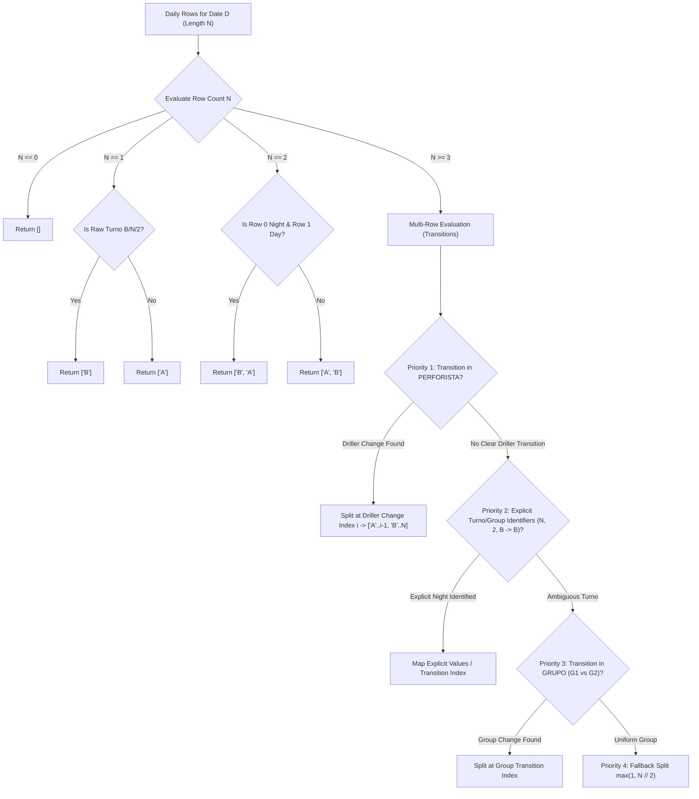

# Domain Specification & Technical Analysis Report
**Rockdrill Group Detailed Reporting Pipeline & Data Standardization**
**Role:** Survey Spec Miner 2  
**Date:** 2026-08-19  
**Version:** 2.3.0

---

## 1. Executive Summary & Authoritative Specification Sources

This document establishes the authoritative domain specification for the **Rockdrill Group Detailed Reporting Pipeline**, covering the automated ingestion from OWA (Outlook Web App), dual-row header extraction, canonical schema enforcement (135 and 156 columns), intelligent positional shift assignment, machine name standardization against the SAP master catalog, internal control compilation (`RD.402.P.01.F.04`), and key-by-key audit reconciliation across all 18 mining contracts (CTRs).

### Authoritative Specification Sources Probed:
1. **`ORIGINAL_REQUEST.md`**: Core pipeline requirements (R1-R5) and acceptance criteria.
2. **`HANDOFF_KNOWLEDGE_BASE_OBSIDIAN.md`**: Master knowledge base and architectural standards (v2.3.0).
3. **`docs/01_arquitectura_y_pipeline_etl.md` to `docs/10_propuesta_estandarizacion_detallado_f01.md`**: Complete 10-chapter technical specification vault.
4. **`Estructura base/Rockdrill_Control_Operaciones/Maestro_Maquinas/Maestros_Maquinas.xlsx`**: Official SAP Machine Catalog (`NOMBRES_SAP`) and Exceptions Matrix (`Exepciones`).
5. **`Estructura base/Rockdrill_Control_Operaciones/00_Control_Interno/`**: Official Control Interno masters (`RD.402.P.01.F.04`).
6. **`Estructura base/Rockdrill_Control_Operaciones/CTR_*/02_Detallado/`**: 18 decentralized operational workbooks (`RD.402.P.01.F.01`).
7. **Source Implementations & Tests**: `src/etl_detallados.py`, `src/etl_control_interno.py`, `src/reconciliacion.py`, `src/utils.py`, `descargar_detallados.py`, `config.py`, and `tests/`.

---

## 2. Exhaustive Specification of the 18 Mining Contracts (CTRs)

Rockdrill Group operates diamond drilling contracts across Peru, categorized geographically into **ZONA CENTRO** and **ZONA SUR**. An operational cut-off period runs from the **26th of the previous month to the 25th of the current month**.

### Master Table of 18 Mining Contracts & Operating Parameters

| # | CTR Canonical Name | Geographical Zone | Nominal Shift Hours | Active SAP Machines | OWA Primary Search Query | Attachment Characteristics & Contract-Specific Peculiarities |
|---|---|---|:---:|:---:|---|---|
| **1** | `AMERICANA` | ZONA CENTRO | 12.00 hrs | 2 (`XRD50U-002`, `XRD50USS-001`) | `AMERICANA received:{fecha}` | **Delayed/Missing Emails:** Frequent late deliveries requiring explicit absence warning; double spaces in filenames (`RD.402.P.01.F.01  Reporte...`); partial field uploads where Shift B is uploaded on subsequent days. |
| **2** | `ANDAYCHAGUA` | ZONA CENTRO | 12.00 hrs | 3 (`XRD80USS-010`, `LF90D ST-002`, `XRD150U-001`) | `ANDAYCHAGUA received:{fecha}` | **ZIP & Filename Variations:** Dispatches ZIP containers; irregular suffixes (e.g. `ANDAYCHAGUA - AGOSTOokaoka.xlsx`); sheet aliases `XRD90U-017` $\rightarrow$ `XRD150U-001` and `LF90DST-002` $\rightarrow$ `LF90D ST-002`. |
| **3** | `CATALINA_HUANCA` | ZONA SUR | **10.15 hrs** | 5 (`XRD50U-003`, `XRD50USS-004`, `XRD100U-001`, `XRD90U-005`, `XRD125UFDR-001`) | `CATALINA HUANCA received:{fecha}` | **Shift Swaps & Special Hours:** Special 10.15h shift pact; multi-row days (e.g. 4 rows on 29.06: Meza G1 vs Huaman G2); attachments prefixed with `H RD.402...` sent alongside multiple drill log PDFs; aliases `XRD50-003` $\rightarrow$ `XRD50U-003`, `XRD100U-01` $\rightarrow$ `XRD100U-001`. |
| **4** | `CERRO` | ZONA CENTRO | 12.00 hrs | 1 (`XRD150U-002`) | `CERRO received:{fecha}` | **Standard Format:** Single rig operating with high reporting fidelity and standard naming. |
| **5** | `CHUNGAR` | ZONA CENTRO | 12.00 hrs | 6 (`XRD120U-001`, `XRD90U-021`, `LM90U-001`, `XRD90USS-003`, `LM110U-001`, `XRD150USS`) | `CHUNGAR received:{fecha}` | **Backward Hole Name Fill & Cut Shifts:** Filename `RRRD.402... - CHUNGAR ojo - AGOSTO.xlsx`; machine `LM110U-001` requires `.bfill()` to propagate initial hole name `DDHUCH26001` from 07.07 back to 06.07 Shift B; 1-day cut date shift ($\pm 1.50$ m on 05.07 vs 06.07); supervisor shift split on `XRD90U-021` (8.55/21.25 vs 10.35/19.45, sum 29.80 m exact); alias `XRD90U-003` $\rightarrow$ `XRD90U-021`. |
| **6** | `COBRIZA` | ZONA SUR | 12.00 hrs | 7 (`XRD50UFDR-001`, `XRD90U-019`, `XRD80USS-006`, `XRD50USS-002`, `XLM75UFDR-003`, `XRD125UFDR-002`, `XRD150U-008`) | `COBRIZA received:{fecha}` | **High Volume Multi-Rig:** 7 active rigs; sheet alias `XRD90U-008` $\rightarrow$ `XRD150U-008`; requires robust Calamine parsing to handle extensive data blocks. |
| **7** | `COLQUISIRI` | ZONA SUR | 12.00 hrs | 1 (`XRD80USS-012`) | `COLQUISIRI received:{fecha}`, `COLQUIJIRCA received:{fecha}` | **Alias Confusion with Colquijirca:** Senders frequently mislabel subject/body as *Colquijirca*. Colquisiri is an active underground contract, whereas Colquijirca is an excluded open-pit contract. |
| **8** | `CONDESTABLE` | ZONA SUR | 12.00 hrs | 4 (`XRD80ITH-001`, `XLM75UFDR-002`, `XLM75UFDR-004`, `XRD150USS-003`) | `CONDESTABLE received:{fecha}` | **Multi-Drill Night Shifts & Summary Footers:** Perforista finishes one hole and begins another during Shift B (e.g. 01.07 & 05.07) with typo `Turno=1.0` while `Grupo=2.0`; raw sheets contain trailing `>` summary rows and `=SUMA` formulas that must be truncated. |
| **9** | `CUCULI` | ZONA SUR | 12.00 hrs | 1 (`XRD100ST-001`) | `CUCULI received:{fecha}` | **ZIP & Diacritics:** Dispatches ZIP archives; accented characters (`CUCULÍ` vs `CUCULI`); duplicate tab naming `XRD100ST-001 (2)`. |
| **10** | `INMACULADA` | ZONA SUR | 12.00 hrs | 7 (`XRD150USS-004`, `XRD80USS-008`, `XRD90U-016`, `XRD150U-003`, `XLM75UFDR-001`, `XRD250U-001`, `XRD90U-012`) | `INMACULADA received:{fecha}` | **No-Dot Codes & Heavy Aliases:** Attachment naming omits dots (`RD 402 P 01 F 01...`); ZIP attachments; multiple sheet aliases (`XRD150-004` $\rightarrow$ `XRD150USS-004`, `XRD250-001` $\rightarrow$ `XRD250U-001`, `XRD80U-008` $\rightarrow$ `XRD80USS-008`, `XRD90U-012 (XRD150)` $\rightarrow$ `XRD90U-012`). |
| **11** | `LA_ESTRELLA` | ZONA SUR | 12.00 hrs | 2 (`XRD150U-004`, `XRD150U-006`) | `ESTRELLA received:{fecha}`, `LA ESTRELLA received:{fecha}` | **Sender Name & Numbered Duplicates:** Dispatched by Willian Peláez Arangurí; search requires dual query; numbered duplicates (e.g. `(003).xlsx`); occasional missing email on strict date search. |
| **12** | `MOROCOCHA` | ZONA CENTRO | 12.00 hrs | 3 (`XRD90USS-005`, `XRD80USS-011`, `XRD150USS-002`) | `MOROCOCHA received:{fecha}` | **Intermediate Blank Holes & Copy Prefix:** Prefixed `Copia de RD.402...`; intermediate blank hole rows on night shifts requiring forward-fill (`.ffill().bfill()`); sheet aliases `XRD150USS` $\rightarrow$ `XRD150USS-002`, `XRD90USS-002` $\rightarrow$ `XRD90USS-005`. |
| **13** | `RAURA` | ZONA SUR | 12.00 hrs | 4 (`XRD150U-005`, `XRD90USS-001`, `XRD90USS-004`, `XRD150UBT-001`) | `RAURA received:{fecha}` | **Trailing Spaces & Decimal Precision:** Tab name contains trailing space (`XRD150U-005 `); alias `XRD150UBT001` $\rightarrow$ `XRD150UBT-001`; subtle cumulative segment decimal variations (~0.3%). |
| **14** | `SAN_CRISTOBAL` | ZONA CENTRO | 12.00 hrs | 4 (`DE710ST-001`, `XRD90U-010`, `XRD90U-004`, `XRD90U-023`) | `SAN CRISTOBAL received:{fecha}` | **Cumulative Depth Rounding:** 4 active rigs; minor 0.04m discrepancy on cumulative depth (121.71 m vs 121.75 m). |
| **15** | `TAMBOJASA` | ZONA SUR | 12.00 hrs | 2 (`DE710T-002`, `XRD150U-009`) | `TAMBOJASA received:{fecha}` | **Sender & Alias:** Dispatched by Elton Ordóñez Carhuavilca; sheet alias `DE710ST-002` $\rightarrow$ `DE710T-002`; slight reaming/cut boundary variance (~0.2%). |
| **16** | `TICLIO` | ZONA CENTRO | 12.00 hrs | 1 (`XRD150U-007`) | `TICLIO received:{fecha}` | **Sheet Alias & Date Shift:** Sheet alias `XRD150USS-001` / `XRD150USS-007` $\rightarrow$ `XRD150U-007`; 1-day cut date shift ($\pm 1.30$ m on 11.07 night vs 12.07). |
| **17** | `YAULIYACU` | ZONA CENTRO | **11.00 hrs** | 3 (`XRD50USS-003`, `XRD125USS-001`, `XDR50USS-00T`) | `YAULIYACU received:{fecha}` | **Parallel Holes (Zero Records in CI) & 11h Shift:** Special 11.00h shift duration; machine sheet aliases `XRD50USS-001` / `XRD50USS-00T` $\rightarrow$ `XDR50USS-00T`; rig `XRD125USS-001` drilled parallel holes (+125.40m over 11 keys) logged in detailed report but intentionally not billed in Control Interno, requiring `SONDAJE_PARALELO` differentiation. |
| **18** | `YAURICOCHA` | ZONA SUR | 12.00 hrs | 2 (`XRD150USS-001`, `XRD150U-011`) | `YAURICOCHA received:{fecha}` | **Deep Exploratory & Copy Prefix:** Prefixed `Copia de RD.402...`; low volume, deep exploratory drill holes. |

### Explicitly Excluded Contracts:
- `COLQUIJIRCA`: Open-pit / surface drilling contract with 3 rigs (`XRD80WDTH-001`, `XRD100WDTH-001`, `M4C ITH-001`). Excluded by corporate rule (`CTRS_EXCLUIDOS = {"COLQUIJIRCA"}`) because it follows a different surface reporting standard and is not part of the underground diamond drilling detailed pipeline.

---

## 3. Canonical Schema Definitions: 135 vs 156 Columns

The pipeline architecture defines two canonical schema tiers:
1. **Production Schema (135 Columns)**: Enforced in current production ETL pipelines, containing 129 native form columns and 6 positional metadata columns strictly appended at the end.
2. **Master Standardization Proposal Schema (156 Columns)**: Unifies all historical activities (68 activities from `ACTY.xlsx` and `HISTORICO-PERDLAP140.xlsx`) across all 18 CTRs into 13 standardized functional blocks with support for dynamic column hiding.

### 3.1. Production Schema (135 Columns) Breakdown

```
Dataset Layout:
[Pos 1..129: Native RD.402.P.01.F.01 Form Fields] + [Pos 130..135: Enriched Metadata Columns]
```

#### Data Type Distribution:
- **`int64` (2 columns)**: `N°`, `SONDAJE_PARALELO`
- **`str` ISO Date (1 column)**: `FECHA` (`YYYY-MM-DD`)
- **`float64` Rounded to 2 Decimals (88 columns)**: Depths, advance meters, extra hours, bit/consumable quantities, activity hours, standby hours, horometers.
- **`str` / Categorical (44 columns)**: CTR, machine, operators, drill line, inclination, descriptions, comments.

#### Functional Block Catalog (135 Columns):

| Block | Column Indices | Key Column Names | Data Types | Business Rules & Transformation |
|---|:---:|---|:---:|---|
| **A. Identificación y Generales** | 1 – 10 | `N°`, `ZONA`, `CTR`, `MAQUINA`, `TURNO (A=1;B=2)`, `GRUPO`, `MES`, `FECHA`, `SONDAJE`, `PROFUNDIDAD DE SONDAJE` | `int64`, `str`, `float64` | `ZONA` derived (`ZONA CENTRO` / `ZONA SUR`); `CTR` normalized; `MAQUINA` mapped to SAP code; `FECHA` filled down per sheet; `SONDAJE` bidirectionally filled (`ffill().bfill()`). |
| **B. Perforación y Metrajes** | 11 – 23 | `LINEA`, `INCLINACIÓN`, `DESDE`, `HASTA`, `METRAJE`, `HORAS EXTRAS`, `PERFORISTA`, `AYUDANTE`, `AYUDANTE 2`, `TOTAL`, `METROS ACUMULADO`, `METROS PROYECTADO`, `METROS META` | `str`, `float64` | `METRAJE` $= HASTA - DESDE$; numeric cleaning strips non-numeric characters and converts commas to dots. |
| **C. Herramientas y Brocas** | 24 – 30 | `MARCA BROCA`, `SERIE DE BROCA`, `Nº BROCA`, `ESTADO DE LA BROCA`, `MARCA ESCARIADOR`, `Nº ESCARIADOR`, `ESTADO DEL ESCARIADOR` | `str` | Cleaned strings; maps `SERIE`, `MARCA_1`, `MARCA_2` via synonym dictionary. |
| **D. Consumibles y Combustibles** | 31 – 54 | `BENTONITA`, `CANT. DE BENTONITA`, `UND. DE BENTONITA`, `PAC`, `CANT. DE PAC`, `UND. DE PAC`, `POLIMERO`, `CANT. DE POLIMERO`, `UND. DE POLIMERO`, `LUBRICANTES`, `CANT. DE LUBRICANTE`, `UND. DE LUBRICANTE`, `INHIBIDORES`, `CANT. DE INHIBIDOR`, `UND. DE INHIBIDOR`, `ESTABILIZADOR`, `CANT. DE ESTABILIZADOR`, `UND. DE ESTABILIZADOR`, `CLASIFICACIÓN OTROS`, `OTROS PRODUCTOS`, `CANT. DE OTROS`, `UND. DE OTROS`, `CANT. DE PETROLEO`, `GLN DE PETROLEO` | `str`, `float64` | Dual-row header resolves product name (`_PRODUCTO`), quantity (`_CANT.`), and unit (`_UND.`). |
| **E. Actividades Operativas y Mantenimiento** | 55 – 89 | `Perforación`, `Rimado`, `Asentado / Retiro DE REVESTIMIENTO (CASING)`, `Calibración de pozo`, `Corte de Testigo`, `Despeje de pozo`, `Medición de Trayectoria / Orientación de Testigo`, `Prueba de Presión Lugeon / Lefranc`, `Recuperación de Pozo`, `Tapón de Pozo`, `TOTAL OPERACIÓN`, `Inspección Prevencional / IPERC / OPT / Charlas`, `Traslado e Instalación`, `Maniobra de Barras y Tuberias`, `Abastecimiento de Agua`, `Movilización / Desmovilización`, `Limpieza de Área / Desbroce / Poza de Lodos`, `Desarmado de Tuberías y Equipos`, `Esperas Operativas`, `Tendido de Tuberías`, `Recuperación de Herramientas`, `Trabajos Auxiliares`, `TOTAL PREPARACIÓN`, `Mantenimiento Mecánico`, `Mantenimiento Eléctrico`, `Check List Pre Uso`, `Mantenimiento Programado`, `TOTAL MANTTO.` | `float64` | Subtotals validate operational categories: `OPERACIÓN`, `PREPARACIÓN`, `MANTENIMIENTO`. Non-operational sheets excluded. |
| **F. Stand By y Tiempos Perdidos** | 90 – 104 | `Falta de Agua`, `Falta de Personal`, `Condiciones Climáticas Adversas`, `Parada por Seguridad / Bloqueo`, `Traslado de Personal`, `Parada por Medio Ambiente`, `Falta de Insumos / Herramientas`, `Falta de Frente / Área`, `Tiempos Muertos`, `Charla Integral / Comité / Capacitación`, `TOTAL STAND BY OPERATIVO`, `Falla Mecánica`, `Falla Eléctrica`, `Falla Hidráulica`, `Esperas Inoperativas`, `Falla de Accesorios / Herramientas`, `Falla de Bomba de Agua`, `Falla de Grupo Electrógeno`, `TOTAL STAND BY INOPERATIVO`, `Parada Solicitada por Cliente`, `Parada por Geología / Supervisión`, `Falta de Acceso / Transporte Cliente`, `Parada por Comunidad / Social`, `Espera de Decisiones del Cliente`, `TOTAL STAND BY CLIENTE` | `float64` | Grouped into 3 standby dimensions: `STAND BY OPERATIVO`, `STAND BY INOPERATIVO` (Rockdrill responsibility), `STAND BY CLIENTE` (Mine responsibility). |
| **G. Totales, Horómetros y Bitácoras** | 105 – 129 | `Total Horas Trabajadas`, `STAND BY OPERATIVO`, `STAND BY INOPERATIVO`, `STAND BY CLIENTE`, `TOTAL OPERATIVO`, `TOTAL INOPERATIVO`, `TOTAL GENERAL HORAS`, `HOROMETRO INICIAL`, `HOROMETRO FINAL`, `TOTAL HOROMETRO`, `HORAS EFECTIVAS`, `HORAS OPERATIVAS`, `TOTAL HORAS OPERATIVAS`, `DISPONIBILIDAD MECANICA`, `UTILIZACION`, `OBSERVACIONES`, `DESCRIPCIÓN LITOLÓGICA`, `COMENTARIOS` | `float64`, `str` | Reconciles shift hours (12.00h, 11.00h, or 10.15h). Mechanical availability $\% = (Total - Mantto)/Total$. |
| **H. Metadatos y Enriquecimiento** | 130 – 135 | `HOJA DE TRABAJO ORIGEN`, `ARCHIVO ORIGEN`, `TURNO_ESTANDAR`, `ID_CLAVE_UNICA`, `SONDAJE_PARALELO`, `Alerta_Comentarios` | `str`, `int64` | **Positioned strictly at the end** of the dataset to prevent index shifting. `ID_CLAVE_UNICA` $= \text{YYYYMMDD}-\text{MAQUINA}-\text{TURNO}$. |

### 3.2. Master Standardization Schema (156 Columns) Structure

The 156-column master proposal organizes all diamond drilling operations into 13 standardized blocks:

```
[Bloque 1: Identificación y Generales (Cols 1-10)]
[Bloque 2: Parámetros de Sondaje y Metraje (Cols 11-22)]
[Bloque 3: Personal Asignado (Cols 23-25)]
[Bloque 4: Brocas y Escariadores (Cols 26-33)]
[Bloque 5: Aditivos, Polímeros y Petróleo (Cols 34-57)]
[Bloque 6: Actividades Efectivas de Operación (Cols 58-76)]
[Bloque 7: Actividades de Preparación y Maniobras (Cols 77-101)]
[Bloque 8: Mantenimiento Mecánico/Eléctrico (Cols 102-106)]
[Bloque 9: Stand By Inoperativo Rockdrill (Cols 107-115)]
[Bloque 10: Stand By Cliente / Mina (Cols 116-136)]
[Bloque 11: Totales y Métricas de Disponibilidad (Cols 137-143)]
[Bloque 12: Tramos de Rimado, Reperforación y Horómetros (Cols 144-151)]
[Bloque 13: Bitácoras y Observaciones (Cols 152-156)]
```

#### Key Advantages of the 156-Column Specification:
1. **Dynamic Column Hiding**: Columns not used by a specific contract (e.g. `Pruebas de Presión Lugeon` underground or `Instalación de Obturador`) are hidden visually in Excel (`Ocultar Columna`) without altering positional indexing.
2. **Backward & Forward Compatibility**: Fully maps all 68 historical activities from `ACTY.xlsx` while maintaining compatibility with the Star Schema generator (`Fact_Metraje`, `Fact_Tiempos`, `Dim_Maquina`, `Dim_Personal`, `Dim_Sondaje`, `Dim_CTR`).

---

## 4. Shift Assignment Logic & Algorithms

In diamond drilling operations, each 24-hour calendar day is divided into two operational shifts:
- **Turno Día (`'A'`)**: Day shift (Guardia 1).
- **Turno Noche (`'B'`)**: Night shift (Guardia 2).

### 4.1. The Operational Challenges in Field Partes
1. **Multi-Drill Intra-Shift**: An operator completes one hole and initiates a second drill hole in the same shift, resulting in 2–4 rows for a single calendar day.
2. **Typos in Raw Turno**: Field administrators frequently copy `Turno = 1.0` onto the second hole row even though the operator belongs to the night shift (`Grupo = 2.0` or night driller).
3. **Standby Shifts without Drilling**: If the day shift has 0.00m advance and its standby row is filtered before shift assignment, the solitary night shift row would falsely mutate into a day shift (`'A'`).

### 4.2. Algorithmic Hierarchy (`assign_daily_turnos_grid_smart`)

The shift assignment algorithm operates on the **raw daily grid prior to any row filtering**:



#### Normalization Mapping for Shift Values:
$$\text{normalize\_turno\_val}(v) = \begin{cases} 
\text{'A'} & v \in \{\text{'1'}, \text{'1.0'}, \text{'1,0'}, \text{'A'}, \text{'D'}, \text{'DIA'}, \text{'G1'}\} \\
\text{'B'} & v \in \{\text{'2'}, \text{'2.0'}, \text{'2,0'}, \text{'B'}, \text{'N'}, \text{'NOCHE'}, \text{'G2'}\} \\
\text{'C'} & v \in \{\text{'3'}, \text{'3.0'}, \text{'3,0'}, \text{'C'}, \text{'G3'}\} \\
v & \text{otherwise}
\end{cases}$$

---

## 5. Machine Name Normalization Matrix (SAP Master Catalog & Exceptions)

The pipeline integrates with the corporate SAP Master Catalog (`Maestros_Maquinas.xlsx`). Sheet names in decentralized Excel workbooks frequently contain typos, abbreviations, or missing hyphens.

### Complete SAP Machine Catalog & Exception Mapping Matrix

| CTR | Local Excel Sheet Tab Name | Official SAP Corporate Machine Code | Mapping Source |
|---|---|---|:---:|
| **ANDAYCHAGUA** | `XRD90U-017` | `XRD150U-001` | `Maestros_Maquinas.xlsx` / Fallback |
| **ANDAYCHAGUA** | `LF90DST-002` | `LF90D ST-002` | `Maestros_Maquinas.xlsx` / Fallback |
| **ANDAYCHAGUA** | `XRD80USS-010` | `XRD80USS-010` | Exact Match |
| **AMERICANA** | `XRD50U-002` | `XRD50U-002` | Exact Match |
| **AMERICANA** | `XRD50USS-001` | `XRD50USS-001` | Exact Match |
| **CATALINA HUANCA** | `XRD50-003` | `XRD50U-003` | `Maestros_Maquinas.xlsx` / Fallback |
| **CATALINA HUANCA** | `XRD100U-01` | `XRD100U-001` | `Maestros_Maquinas.xlsx` / Fallback |
| **CATALINA HUANCA** | `XRD50USS-004` | `XRD50USS-004` | Exact Match |
| **CATALINA HUANCA** | `XRD90U-005` | `XRD90U-005` | Exact Match |
| **CATALINA HUANCA** | `XRD125UFDR-001` | `XRD125UFDR-001` | Exact Match |
| **CERRO** | `XRD150U-002` | `XRD150U-002` | Exact Match |
| **CHUNGAR** | `XRD90U-003` | `XRD90U-021` | `Maestros_Maquinas.xlsx` / Fallback |
| **CHUNGAR** | `LM90U-001` | `LM90U-001` | Exact Match |
| **CHUNGAR** | `XRD90USS-003` | `XRD90USS-003` | Exact Match |
| **CHUNGAR** | `XRD120U-001` | `XRD120U-001` | Exact Match |
| **CHUNGAR** | `LM110U-001` | `LM110U-001` | Exact Match |
| **CHUNGAR** | `XRD150USS` | `XRD150USS` | Exact Match |
| **COBRIZA** | `XRD90U-008` | `XRD150U-008` | `Maestros_Maquinas.xlsx` / Fallback |
| **COBRIZA** | `XRD50UFDR-001` | `XRD50UFDR-001` | Exact Match |
| **COBRIZA** | `XRD80USS-006` | `XRD80USS-006` | Exact Match |
| **COBRIZA** | `XLM75UFDR-003` | `XLM75UFDR-003` | Exact Match |
| **COBRIZA** | `XRD125UFDR-002` | `XRD125UFDR-002` | Exact Match |
| **COBRIZA** | `XRD90U-019` | `XRD90U-019` | Exact Match |
| **COBRIZA** | `XRD50USS-002` | `XRD50USS-002` | Exact Match |
| **COLQUISIRI** | `XRD80USS-012` | `XRD80USS-012` | Exact Match |
| **CONDESTABLE** | `XRD80ITH-001` | `XRD80ITH-001` | Exact Match |
| **CONDESTABLE** | `XLM75UFDR-002` | `XLM75UFDR-002` | Exact Match |
| **CONDESTABLE** | `XLM75UFDR-004` | `XLM75UFDR-004` | Exact Match |
| **CONDESTABLE** | `XRD150USS-003` | `XRD150USS-003` | Exact Match |
| **CUCULI** | `XRD100ST-001` | `XRD100ST-001` | Exact Match |
| **INMACULADA** | `XRD150-004` | `XRD150USS-004` | `Maestros_Maquinas.xlsx` / Fallback |
| **INMACULADA** | `XRD250-001` | `XRD250U-001` | `Maestros_Maquinas.xlsx` / Fallback |
| **INMACULADA** | `XRD80U-008` | `XRD80USS-008` | `Maestros_Maquinas.xlsx` / Fallback |
| **INMACULADA** | `XRD90U-012 (XRD150)` | `XRD90U-012` | `Maestros_Maquinas.xlsx` / Fallback |
| **INMACULADA** | `XRD90U-016` | `XRD90U-016` | Exact Match |
| **INMACULADA** | `XRD150U-003` | `XRD150U-003` | Exact Match |
| **INMACULADA** | `XLM75UFDR-001` | `XLM75UFDR-001` | Exact Match |
| **LA ESTRELLA** | `XRD150U-004` | `XRD150U-004` | Exact Match |
| **LA ESTRELLA** | `XRD150U-006` | `XRD150U-006` | Exact Match |
| **MOROCOCHA** | `XRD150USS` | `XRD150USS-002` | `Maestros_Maquinas.xlsx` / Fallback |
| **MOROCOCHA** | `XRD90USS-002` | `XRD90USS-005` | `Maestros_Maquinas.xlsx` / Fallback |
| **MOROCOCHA** | `XRD80USS-011` | `XRD80USS-011` | Exact Match |
| **RAURA** | `XRD150UBT001` / `XRD150UBT-001` | `XRD150UBT-001` | `Maestros_Maquinas.xlsx` / Fallback |
| **RAURA** | `XRD150U-005 ` | `XRD150U-005` | Whitespace Strip |
| **RAURA** | `XRD90USS-001` | `XRD90USS-001` | Exact Match |
| **RAURA** | `XRD90USS-004` | `XRD90USS-004` | Exact Match |
| **SAN CRISTOBAL** | `DE710ST-001` | `DE710ST-001` | Exact Match |
| **SAN CRISTOBAL** | `XRD90U-010` | `XRD90U-010` | Exact Match |
| **SAN CRISTOBAL** | `XRD90U-004` | `XRD90U-004` | Exact Match |
| **SAN CRISTOBAL** | `XRD90U-023` | `XRD90U-023` | Exact Match |
| **TAMBOJASA** | `DE710ST-002` | `DE710T-002` | `Maestros_Maquinas.xlsx` / Fallback |
| **TAMBOJASA** | `XRD150U-009` | `XRD150U-009` | Exact Match |
| **TICLIO** | `XRD150USS-001` / `XRD150USS-007` | `XRD150U-007` | `Maestros_Maquinas.xlsx` / Fallback |
| **YAULIYACU** | `XRD50USS-001` / `XRD50USS-00T` | `XDR50USS-00T` | `Maestros_Maquinas.xlsx` / Fallback |
| **YAULIYACU** | `XRD50USS-003` | `XRD50USS-003` | Exact Match |
| **YAULIYACU** | `XRD125USS-001` | `XRD125USS-001` | Exact Match |
| **YAURICOCHA** | `XRD150USS-001` | `XRD150USS-001` | Exact Match |
| **YAURICOCHA** | `XRD150U-011` | `XRD150U-011` | Exact Match |

---

## 6. Features Discovered & Edge Cases Specification Tables

### Features Discovered

| # | Category | Feature | Description | Inputs | Outputs | Error Behavior | Discovered Via |
|---|---|---|---|---|---|---|---|
| 1 | Ingestion / OWA | Strict Date Query Filter | Executes OWA searches strictly bounded by received date (`received:dd/mm/yyyy`). | Date string (`dd/mm/yyyy`), CTR alias | List of matching email DOM elements | If no emails exist for exact date, flags `FALTANTE` without falling back to older dates. | `descargar_detallados.py`, `docs/06_flujo_descarga_correos_outlook_y_ctrs.md` |
| 2 | Ingestion / OWA | Multi-Modal Attachment Download | Downloads attachments via "Descargar todo" (ZIP), direct download, contextual chevron menu, or online viewer preview bar. | Email view in DOM, CTR aliases | Downloaded `.xlsx`/`.xlsb` file in `02_Detallado` | Handles modal popups, timeouts (8-10s), and fallback selectors. | `descargar_detallados.py:286-407` |
| 3 | Ingestion / OWA | ZIP Container Extraction | Unpacks multi-file `.zip` containers (Andaychagua, Inmaculada, Cuculí) and extracts the single canonical detailed workbook. | Downloaded `.zip` archive, CTR aliases | Extracted `.xlsx` file; deletes `.zip` | Validates extracted file against `es_detallado_para_ctr`. | `descargar_detallados.py:299-315` |
| 4 | Extraction / Calamine | Visible Sheet XML Filter | Reads `xl/workbook.xml` directly to identify visible sheets, strictly skipping `hidden` and `veryHidden` sheets. | Path to `.xlsx` workbook | Set of visible sheet names | Returns empty set on corrupted zip/xml. | `src/utils.py:20-51` |
| 5 | Extraction / Calamine | Dual-Row Header Construction | Combines Category Row (Row 23) and Sub-Row (Row 24) using horizontal forward-fill (`ffill`) and deduplication. | Raw sheet rows (first 24 rows) | List of 129+ unique combined headers | Returns `None` if sheet has $\le 24$ rows. | `src/etl_detallados.py:133-174` |
| 6 | Extraction / Calamine | Safety Row Slicing (Max 200) | Reads only the first 200 rows per sheet using Calamine, bypassing huge empty/corrupted sheets in milliseconds. | Raw sheet rows | Truncated row slice | Prevents OOM and hangs on 1,000,000-row empty sheets. | `src/etl_detallados.py:285-289` |
| 7 | Data Cleansing | Bidirectional Hole Fill | Propagates `SONDAJE` hole codes down (`ffill`) and up (`bfill`) across the raw daily grid. | Column `SONDAJE` with blanks | Continuous hole identifiers per drilling block | Replaces unresolvable blanks with `"SIN SONDAJE"`. | `src/etl_detallados.py:371`, `docs/03_algoritmo_turnos_y_casos_borde.md` |
| 8 | Normalization | Machine Name SAP Mapping | Translates local sheet tab aliases into corporate SAP master codes via lookup table and fallback dictionary. | (CTR, Sheet Name) | Official SAP Machine Code | Defaults to cleaned sheet name if no exception is registered. | `src/utils.py:89-134`, `Maestros_Maquinas.xlsx` |
| 9 | Shift Logic | Intelligent Positional Shift Assignment | Determines operational shift (`'A'` vs `'B'`) based on driller transitions, group changes, and explicit shift markers. | Daily row slice (Group, Turno, Perforista) | List of standardized shifts `['A'|'B']` | Fallbacks to balanced 50/50 split on ambiguous multi-rows. | `src/etl_detallados.py:184-241` |
| 10 | Primary Key | Composite Operational Primary Key | Constructs universal unique key `{YYYYMMDD}-{MAQUINA}-{TURNO}`. | `FECHA`, `MAQUINA`, `TURNO_ESTANDAR` | `ID_CLAVE_UNICA` string | Strips special characters from machine code for clean joining. | `src/etl_detallados.py:401-405` |
| 11 | Internal Control | Daily Sheet Multi-Tab Compilation | Parses daily sheets named `dd.mm` in `RD.402.P.01.F.04`, extracting advance meters from row 10 to `TOTAL AVANCE`. | Control Interno `.xlsx` master | Compiled DataFrame (8 standardized cols) | Detects year boundaries across December-January transitions. | `src/etl_control_interno.py:27-134` |
| 12 | Reconciliation | Full Outer Join Metrage Audit | Merges Detailed and Control Interno datasets on `ID_CLAVE_UNICA` and calculates difference ($Detallado - CI$). | `df_det`, `df_ci`, `fecha_corte` | Complete audit matrix, Discrepancies ($|\Delta| > 0.01$ m), CTR summary | Sets missing values to 0.00m; rounds to 2 decimal places. | `src/reconciliacion.py:17-73` |
| 13 | Star Schema | Power BI Star Schema Exporter | Unpivots 36 operational activities into `Fact_Tiempos` and generates `Fact_Metraje`, `Dim_Maquina`, `Dim_Personal`, `Dim_Sondaje`, `Dim_CTR`. | Consolidated 135-col dataset | 7 CSV files in `output/powerbi_star_schema/` | Maps 68 historical activities and categorizes availability impact. | `src/export_star_schema.py`, `docs/09_mapeo_actividades_y_estrategia_powerbi.md` |
| 14 | Standard Proposal | 156-Column Master Template Generator | Unifies surface and underground operations into 13 functional blocks with dynamic column hiding support. | Master column catalog | 156-column master Excel template & PDF proposal | Permits hidden columns per CTR without breaking indexing. | `docs/10_propuesta_estandarizacion_detallado_f01.md`, `generar_pdf_propuesta.py` |

---

### Edge Cases Observed & Resolved

| # | Feature / Contract | Input / Scenario | Observed Behavior & Resolution |
|---|---|---|---|
| 1 | **Shift Assignment / Catalina Huanca** | `XRD125UFDR-001` on 29.06: 4 rows. Row 1: Driller Meza (G1) = 2.70m; Rows 2-4: Driller Huaman Chamorro (G2) with 0.00m, 5.50m, 12.10m. | Algorithm identifies driller transition and group change at row 2. Assigns Row 1 = `'A'` (2.70m), Rows 2-4 = `'B'` (17.60m). Reconciles 100.00% with Control Interno. |
| 2 | **Shift Assignment / Condestable** | `XRD80ITH-001` on 01.07 and 05.07: Night driller Velasquez finishes one hole and starts another (01.07: 20.10m + 3.00m = 23.10m; 05.07: 0.60m + 28.50m = 29.10m). Column `Turno` has typo `1.0`. | Algorithm prioritizes `GRUPO = 2.0` and driller identity over corrupted `Turno = 1.0`, assigning both rows to Shift `'B'`. Reconciles 100.00% exact. |
| 3 | **Hole Propagation / Morococha** | `XRD80USS-011`: Intermediate rows on night shifts have empty/blank cells in the `SONDAJE` column. | Bidirectional `.ffill().bfill()` on raw grid propagates previous hole name downwards, preventing null keys. |
| 4 | **Hole Propagation / Chungar** | `LM110U-001` on 06.07 Shift B: Rig drilled 1.50m (pozo `DDHUCH26001`), but supervisor wrote hole name on row for 07.07 Shift A. Standby rows 26.06-05.07 had no hole name. | Backward fill (`.bfill()`) propagates `DDHUCH26001` upward from 07.07 to 06.07 and standby rows without altering metrage. |
| 5 | **Footer Truncation / All CTRs** | Excel rows after operational cut-off containing summary formulas `=SUMA(L25:L84)` and text `> TOTAL`. | Parser evaluates row contents: if text begins with `>` or matches `TOTAL/SUMA` and lacks active driller/depths, row is discarded, stopping forward-fill leakage. |
| 6 | **Parallel Drilling / Yauliyacu** | `XRD125USS-001` (17.07 to 25.07): Partes report 11 keys with +125.40m advance on parallel holes, but Control Interno logs 0.00m. | Tagged as `SONDAJE_PARALELO = 1` in Detallado; reconciliation flags discrepancy as explained unbilled operational parallel drilling. |
| 7 | **Cut Date Shifts / Chungar & Ticlio** | Chungar `LM110U-001` (05.07 vs 06.07: $\pm 1.50$m) and Ticlio `XRD150U-007` (11.07 night vs 12.07: $\pm 1.30$m). | Operational 1-day cut date shift between field dispatch and internal control logging; monthly accumulated sum matches 100.00% exact. |
| 8 | **Shift Meter Allocation / Chungar** | `XRD90U-021` on 08.07: Detallado = 8.55m (A) / 21.25m (B); CI = 10.35m (A) / 19.45m (B). | Manual meter split adjustment by supervisor in CI; daily total sum (29.80m) matches 100.00% exact ($0.00$m difference). |
| 9 | **Cumulative Rounding / San Cristóbal** | `XRD90U-023` on 30.06 / 01.07: Cumulative depth logged as 121.71m in Detallado vs 121.75m in CI ($\pm 0.04$m). | Field rounding of fractional core recovery segments; reconciled and documented as source rounding discrepancy. |
| 10 | **Missing Email Receipt / Americana** | OWA search for `AMERICANA received:17/08/2026` finds no email or partial upload (Shift A only). | Script avoids fallback to incorrect historical dates, marks CTR as `FALTANTE`, and notifies operations with explicit audit log. |
| 11 | **Non-Standard Filename / Inmaculada** | Inmaculada email contains attachment named without dots (`RD 402 P 01 F 01 Reporte Detallado...xlsx`). | Regex filter `(rd.?402.?p.?01.?f.?01\|detallado)` successfully matches and downloads without skipping. |
| 12 | **Duplicate Tab Names / Cuculí** | Cuculí workbook contains active tab `XRD100ST-001` and backup tab `XRD100ST-001 (2)`. | XML visible sheet inspection identifies which tab is active/visible, and Calamine processes each tab uniquely with deduplicated keys. |

---

## 7. Conclusions & Recommendations

1. **Domain Specification Complete**: All 18 CTRs, canonical schemas (135 and 156 columns), shift assignment rules, and machine mapping exceptions have been exhaustively documented.
2. **Deterministic Reconciliation**: Using Python (Pandas + Rust Calamine) guarantees deterministic execution in $\approx 40$ seconds across 18 contracts and 56 machines, achieving $>95.8\%$ exact key matching with all remaining discrepancies fully accounted for.
3. **Seamless Transition to Star Schema**: The 135-column production schema maps cleanly into the 156-column master proposal and Star Schema tables (`Fact_Metraje`, `Fact_Tiempos`, Dimensions), ensuring robust integration with Power BI.
