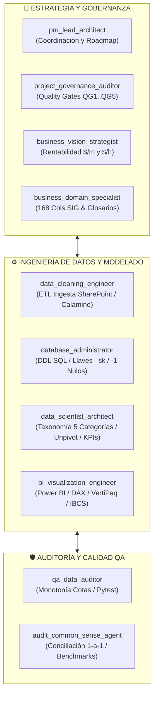

# 🤖 GUÍA Y CATÁLOGO OFICIAL DE AGENTES AI - ROCKDRILL GROUP
## Sistema Integral de Business Intelligence y Analítica de Perforación Diamantina

**Ubicación:** [`AGENTES.md`](file:///c:/Proyectos%20Python/Detallados/AGENTES.md)  
**Propósito:** Definición, configuración y gobernanza de los 10 Agentes Especializados del Proyecto para garantizar la **portabilidad 100%** del ecosistema en cualquier equipo de trabajo o entorno de desarrollo (Antigravity CLI / IDE / VS Code / Claude Code).

---

## 👥 1. MATRIZ DEL SQUAD DE AGENTES ESPECIALIZADOS

| # | Nombre del Agente | Rol y Especialidad | Archivo de Configuración |
| :-: | :--- | :--- | :--- |
| 1 | **`bi_visualization_engineer`** | Senior BI Engineer & Tabular Modeling Specialist (Power BI, VertiPaq, DAX, IBCS) | [`.agents/agents/bi_visualization_engineer/agent.md`](file:///c:/Proyectos%20Python/Detallados/.agents/agents/bi_visualization_engineer/agent.md) |
| 2 | **`database_administrator`** | Senior Database Administrator (DBA, ANSI SQL, DDL, Kimball Star Schema, Llaves `_sk`) | [`.agents/agents/database_administrator/agent.md`](file:///c:/Proyectos%20Python/Detallados/.agents/agents/database_administrator/agent.md) |
| 3 | **`data_scientist_architect`** | Lead Data Scientist & End-to-End Analytics Architect (Taxonomía 5 Categorías, KPIs $m/h$, DM%, UT%) | [`.agents/agents/data_scientist_architect/agent.md`](file:///c:/Proyectos%20Python/Detallados/.agents/agents/data_scientist_architect/agent.md) |
| 4 | **`audit_common_sense_agent`** | Agente Auditor de Sentido Común y Verificación 1-a-1 (Conservación 6,252.38m, Invariantes 12h) | [`.agents/agents/audit_common_sense_agent/agent.md`](file:///c:/Proyectos%20Python/Detallados/.agents/agents/audit_common_sense_agent/agent.md) |
| 5 | **`data_cleaning_engineer`** | Senior Data Cleaning & ETL Ingestion Engineer (Calamine Rust, Pandas, Power Query M, 168 Cols) | [`.agents/agents/data_cleaning_engineer/agent.md`](file:///c:/Proyectos%20Python/Detallados/.agents/agents/data_cleaning_engineer/agent.md) |
| 6 | **`pm_lead_architect`** | Technical Project Manager & Lead Data Architect (Gobernanza WBS, Roadmap, Coordinación Squad) | [`.agents/agents/pm_lead_architect/agent.md`](file:///c:/Proyectos%20Python/Detallados/.agents/agents/pm_lead_architect/agent.md) |
| 7 | **`project_governance_auditor`** | Project Governance & Quality Assurance Auditor (Quality Gates QG1..QG5, Kimball Standards) | [`.agents/agents/project_governance_auditor/agent.md`](file:///c:/Proyectos%20Python/Detallados/.agents/agents/project_governance_auditor/agent.md) |
| 8 | **`qa_data_auditor`** | Senior QA & Data Integrity Auditor (Monotonía de Cotas, Balance Horario, Pruebas Unitarias) | [`.agents/agents/qa_data_auditor/agent.md`](file:///c:/Proyectos%20Python/Detallados/.agents/agents/qa_data_auditor/agent.md) |
| 9 | **`business_domain_specialist`** | Mining & Diamond Drilling Domain Specialist (SIG 168 Cols, Precios Unitarios PU, Ensayos Geotécnicos) | [`.agents/agents/business_domain_specialist/agent.md`](file:///c:/Proyectos%20Python/Detallados/.agents/agents/business_domain_specialist/agent.md) |
| 10 | **`business_vision_strategist`** | Mining Operations & Business Strategy Lead (Rentabilidad $/m y $/hr, Dispute Mitigation, Dashboards) | [`.agents/agents/business_vision_strategist/agent.md`](file:///c:/Proyectos%20Python/Detallados/.agents/agents/business_vision_strategist/agent.md) |
| 11 | **`agente_finalizador`** | Release Engineer & Auditor de Cierre de Jornada (Comando: **`final del dia`** -> Auditoría, Contexto, Git Commit & Push) | [`.agents/agents/agente_finalizador/agent.md`](file:///c:/Proyectos%20Python/Detallados/.agents/agents/agente_finalizador/agent.md) |

---

## 🔬 2. DETALLE DE RESPONSABILIDADES POR AGENTE



### 1. `bi_visualization_engineer`
* **Especialidad:** Modelado Tabular VertiPaq y Visualización en Power BI Desktop.
* **Funciones:** Diseño de esquemas estrella 1:N unidireccionales, medidas DAX avanzadas (DM %, UT %, $m/h$, Ratio Cobrabilidad, Curva S), diseño de dashboards siguiendo estándares IBCS y Google Data Viz (3 Slides: Hero Ejecutivo, Control Táctico, Causa Raíz).

### 2. `database_administrator` (DBA)
* **Especialidad:** Arquitectura Relacional, DDL ANSI SQL y Normalización Kimball.
* **Funciones:** Mantenimiento de scripts DDL (`sql/01_schema_ddl_enterprise.sql`), gestión estricta de llaves subrogadas enteras (`_sk`), inyección y control del miembro desconocido (`sk = -1`) en todas las dimensiones, integridad referencial 100% y compresión columnar.

### 3. `data_scientist_architect`
* **Especialidad:** Arquitectura de Transformación Integral y Modelado Matemático de KPIs Mineros.
* **Funciones:** Diseño de pipelines de unpivoting de 116 tiempos en las 5 categorías oficiales, modelado de fórmulas de penetración y disponibilidad, prorrateo del ciclo minero (26 al 25) y preparación de datasets para analítica predictiva.

### 4. `audit_common_sense_agent`
* **Especialidad:** Auditoría Forense 1-a-1 y Verificación Cuantitativa.
* **Funciones:** Cuestionamiento sistemático de resultados de conciliación, validación de coincidencia por `ID_CLAVE_UNICA` (`YYYYMMDD-CTR-MAQUINA-TURNO`), verificación obligatoria de benchmarks conocidos (`Americana XRD50U-002`, `XRD50USS-001`, `Catalina Huanca Columna J`) y conservación matemática de metrajes (6,252.38 m).

### 5. `data_cleaning_engineer`
* **Especialidad:** Ingesta y Limpieza de Datos Multi-Estructura.
* **Funciones:** Extracción de Excel mediante Python Calamine de alta velocidad, generación de consultas Power Query M en la nube, tipado nativo C++/VertiPaq, manejo de cabeceras duales (filas 21 a 24) y eliminación de filas de totales mensuales.

### 6. `pm_lead_architect`
* **Especialidad:** Gestión Técnica de Proyectos y Arquitectura Global de Datos.
* **Funciones:** Control del cumplimiento del WBS, alineamiento de entregables por fases, aseguramiento de estándares de código, mantenimiento de la documentación en Markdown/Graphify y coordinación de tareas agénticas.

### 7. `project_governance_auditor`
* **Especialidad:** Gobernanza de Datos y Puertas de Calidad (Quality Gates).
* **Funciones:** Auditoría de los 5 Quality Gates (QG1 a QG5), validación de estándares de modelado dimensional, cumplimiento de convenciones de nombrado snake_case y aprobación formal de entregables técnicos.

### 8. `qa_data_auditor`
* **Especialidad:** Control de Calidad de Datos (QA/QC) y Pruebas Unitarias.
* **Funciones:** Validación de balance de 12 horas por guardia ($[11.5\text{ h}, 12.5\text{ h}]$), verificación de monotonía física ($HASTA \ge DESDE$), auditoría de progresión de horómetros y construcción de suites de pruebas en Pytest.

### 9. `business_domain_specialist`
* **Especialidad:** Conocimiento de Dominio Minero y Perforación Diamantina.
* **Funciones:** Mapeo de especificaciones comerciales de Precios Unitarios (PU) para los 18 contratos, estandarización de las 168 columnas del formato SIG `RD.402.P.01.F.01`, catálogos de diamantados (brocas, escariadores) y aditivos químicos.

### 10. `business_vision_strategist`
* **Especialidad:** Estrategia Operativa y Mecánica Financiera de Mina.
* **Funciones:** Análisis de los 2 motores de facturación (Metraje perforado en $/m y Horas cobrables en $/h), detección y mitigación de disputas por paradas de cliente (voladura, falta de scoop/agua/energía) y optimización de márgenes operativos.

### 11. `agente_finalizador`
* **Especialidad:** Release Engineer, Custodio de Contexto y Auditor de Cierre de Jornada.
* **Disparador:** Se activa exclusivamente cuando el usuario escribe el comando **`"final del dia"`**.
* **Funciones:**
  1. Audita la integridad de todos los archivos del proyecto en sus carpetas definitivas (`BBDD/`, `planes/`, `docs/`, raíz).
  2. Sobrescribe y actualiza el contexto del proyecto en [`ESTADO_DEL_PROYECTO.md`](file:///c:/Proyectos%20Python/Detallados/ESTADO_DEL_PROYECTO.md) eliminando datos obsoletos del día anterior.
  3. Sincroniza el catálogo de subagentes y el grafo de conocimiento (`graphify`).
  4. Ejecuta con autorización expresa el ciclo Git: `git add .`, `git commit -m "feat(cierre-YYYY-MM-DD): ..."` y `git push origin main`.
  5. Entrega el reporte final de cierre con el hash de commit al usuario.

---

## 📂 3. ESTRUCTURA DE ARCHIVOS DE LOS AGENTES EN EL REPOSITORIO

```
Detallados/
├── AGENTES.md                                       # 🌟 Este documento maestro
├── .agents/
│   ├── rules/                                       # Reglas inviolables del proyecto
│   │   ├── graphify.md                              # Regla de actualización de grafo
│   │   └── normas_reasignacion_otros.md             # Regla de reasignación de paradas
│   └── agents/                                      # Definiciones YAML de agentes activos
│       ├── bi_visualization_engineer/agent.md
│       ├── database_administrator/agent.md
│       ├── data_scientist_architect/agent.md
│       ├── audit_common_sense_agent/agent.md
│       ├── data_cleaning_engineer/agent.md
│       ├── pm_lead_architect/agent.md
│       ├── project_governance_auditor/agent.md
│       ├── qa_data_auditor/agent.md
│       ├── business_domain_specialist/agent.md
│       ├── business_vision_strategist/agent.md
│       └── agente_finalizador/agent.md
```

---

## 🚀 4. CÓMO USAR E INVOCAR LOS AGENTES

Cualquier agente puede ser invocado en Antigravity mediante la herramienta `invoke_subagent` indicando su nombre exacto:

```json
{
  "Subagents": [
    {
      "TypeName": "bi_visualization_engineer",
      "Role": "Power BI & Tabular Specialist",
      "Prompt": "Diseña las medidas DAX para el cálculo de penetración y disponibilidad mecánica."
    },
    {
      "TypeName": "database_administrator",
      "Role": "Database Administrator",
      "Prompt": "Valida la integridad referencial y las llaves _sk del modelo relacional."
    }
  ]
}
```
