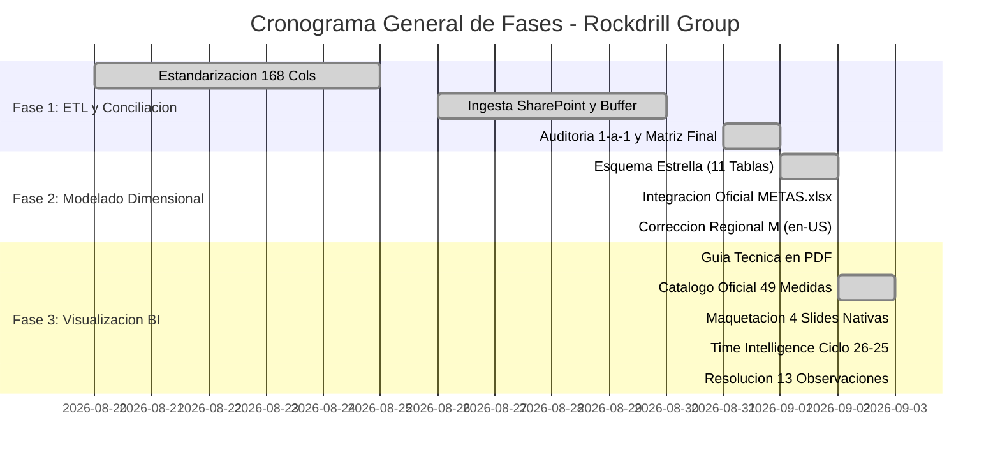

# 📊 ESTADO DEL PROYECTO - ROCKDRILL CONTROL DE OPERACIONES
## Informe de Estado PMO, Cumplimiento de Entregables y Contexto Oficial para Agentes AI

**Última Actualización:** 03 de Setiembre de 2026  
**Fase Actual:** **FASE 3 ETAPA 1 CERRADA AL 100% (MODELO TABULAR VERTIPAQ + DAX + 4 SLIDES CORPORATIVAS PBI)**  
**Repositorio Oficial:** `chihuacoaudaz-png/revision-detallado` (Rama: `main`)  
**Autoridad de Control:** PMO & Control de Proyectos - Rockdrill Group  

---

## 🎯 1. FICHA TÉCNICA DEL PROYECTO Y ESTADO DEL MODELO

| Atributo | Detalle Validado en Datos |
| :--- | :--- |
| **Nombre del Proyecto** | Sistema Integral de Ingesta, Modelado Dimensional Kimball y Dashboard Power BI |
| **Alcance** | 22 Contratos Mineros Activos en Perú (Superficie e Interior Mina) y 96 Perforadoras |
| **Base Operativa Oficial** | `CONSOLIDADOR_DETALLADOS_POWERQUERY.xlsx` (176 Columnas, 3,505 Filas) |
| **Maestro de Metas Oficial** | `METAS.xlsx` (1,052 Registros Históricos de Metas por CTR y Máquina, 2025–2026) |
| **Metraje Perforado Auditado** | **`7,502.91 m`** en 3,505 guardias (100% exacto, verificado en Power BI) |
| **Horas Reportadas Auditadas** | **`7,687.00 h`** en 4,747 eventos operativos categorizados en 5 grupos SIG |
| **Meta Activa Setiembre 2026** | **`52,295.17 m`** distribuidos en 64 máquinas activas |
| **Esquema Relacional Power BI** | **16 de 16 Relaciones Físicas Activas (`1:*`)** en `DASH.pbix` + Tablas de Gobernanza |
| **Catálogo de Medidas DAX** | **49 Medidas Oficiales en 7 Folders** + Carpeta 08 (Time Intelligence y Comparabilidad Histórica) |
| **Duración de Jornadas** | 12.0h general | Excepciones: Catalina Huanca (10.15h) y Yauliyacu (11.0h) |
| **Gobernanza de Flota** | Tabla de exclusión operativa `tbl_maquinas_excluidas` para sinceramiento de flota |
| **Arquitectura Visual** | **100% Visuales Nativos Power BI** (cero dependencias de visuales de pago/licencia) |

---

## 📈 2. TABLERO DE CONTROL PMO (CUMPLIMIENTO POR FASES)

### Resumen de Entregables Clave (WBS):

| Fase | Entregable / Hito | Estado | Ubicación / Evidencia |
| :--- | :--- | :---: | :--- |
| **Fase 2** | Generador Dimensional Python | ✅ CERRADO | `BBDD/generar_base_datos_dimensional.py` (24.7 s) |
| **Fase 2** | Ejecutable Autónomo sin Python | ✅ CERRADO | `BBDD/EJECUTAR_BBDD.bat` y `BBDD/EJECUTAR_BBDD/` |
| **Fase 2** | Salida Dimensional (11 Tablas) | ✅ CERRADO | `BBDD/output_star_schema/` (.csv, .parquet, .xlsx) |
| **Fase 2** | Ingesta Oficial de Metas | ✅ CERRADO | `METAS.xlsx` integrado en `fact_metas_mensuales` |
| **Fase 2** | Corrección Regional Power Query | ✅ CERRADO | `QUERYS_POWER_QUERY_M_ESTRELLA.txt` (Cultura en-US) |
| **Fase 3** | Modelo Power BI Desktop Activo | ✅ VALIDADO | `DASH.pbix` (16 relaciones activas, 7,502.91 m auditados) |
| **Fase 3** | Catálogo Oficial Medidas DAX | ✅ CERRADO | `planes/04_GUIA_PASO_A_PASO_MEDIDAS_Y_CARPETAS_POWER_BI.md` & `docs/CATALOGO_OFICIAL_49_MEDIDAS_DAX.txt` |
| **Fase 3** | Maquetación 4 Slides Nativas | ✅ CERRADO | `planes/05_GUIA_PASO_A_PASO_CONSTRUCCION_SLIDES_Y_VISUALES_PBI.md` (y `.html`) |
| **Fase 3** | Resolución 13 Observaciones | ✅ CERRADO | `planes/06_RESOLUCION_OBSERVACIONES_VISUALES_PBI.md` & `docs/OBSERVACIONES_FEEDBACK_USUARIO_PBI.txt` |
| **Fase 3** | Diseño Time Intelligence Ciclo 26-25 | ✅ CERRADO | `planes/07_DISENO_TIME_INTELLIGENCE_Y_RESILIENCIA_TEMPORAL.md` |
| **Fase 3** | Script Automatización TOM | ✅ CERRADO | `scripts/apply_dim_tiempo_columns_tom.ps1` (SortByColumn en VertiPaq) |
| **Fase 3** | DDL Corporativo Actualizado | ✅ CERRADO | `sql/01_schema_ddl_enterprise.sql` (columnas tiempo y nombre contrato corto) |
| **Gobierno** | Squad de 11 Agentes Especializados | ✅ CERRADO | `AGENTES.md` y `.agents/agents/` |

---

## 🏛️ 3. ACUERDOS Y DEFINICIONES DE ARQUITECTURA VIGENTES

1. **Esquema Estrella Puro y Desconexión de Puentes Innecesarios:** No existen enlaces entre dimensiones. Se mantienen activas las 16 relaciones físicas `1:*` hacia las tablas de hechos en VertiPaq.
2. **Cultura 'en-US' Obligatoria en Power Query M:** Todo archivo CSV se procesa con cultura `"en-US"` para garantizar la integridad de valores decimales y fechas en cualquier configuración regional de Windows.
3. **Resiliencia Temporal y Blindaje contra Segmentadores Vacíos:**
   * Las medidas maestras (`[Meta Mensual (m)]`, `[Dias Mes Operativo]`, etc.) implementan `TREATAS` y `ISFILTERED` para responder limpiamente tanto cuando hay filtros de fecha activos como cuando el usuario desmarca o no selecciona ninguna fecha.
   * `[Proyeccion Cierre Run-Rate (m)]` y `[Dias Restantes]` utilizan `COALESCE` para evitar propagación de valores nulos o división por cero.
4. **Visuales 100% Nativos (Cero Dependencias de Licencia Externa):**
   * El Dumbbell Chart se implementa mediante Matriz nativa con barras de datos condicionales o Gráfico de Líneas y Columnas Agrupadas.
   * El Bullet Chart se implementa con Tarjeta de Varias Filas (Multi-row card) o Gráfico de Barras con líneas de referencia de meta.
   * El Pareto y la Curva S se construyen con Gráfico de Líneas y Columnas Apiladas nativo.
   * El análisis de desglose utiliza el Decomposition Tree nativo de Power BI.
5. **Guardias Sinceras y Gobernanza de Flota Activa:**
   * Denominador de guardias programadas calibrado estrictamente a 12h por máquina con actividad operativa real en el periodo, evitando castigar la disponibilidad por máquinas desmovilizadas o en stand-by de contrato.
   * Incorporación de la tabla `tbl_maquinas_excluidas` para documentar la flota desmovilizada.
6. **Cascada Dinámica sin Hardcoding:** Desglose de variaciones de horas y metraje mediante modelo relacional puente, asegurando que nuevas paradas o motivos no requieran reescritura de fórmulas DAX.
7. **Ordenamiento Cronológico Minero:** `dim_tiempo_calendario` cuenta con `fecha_operativa_dt`, `fecha_corta_label` (ordenada por `calendario_sk`) y `dia_ciclo_label` (ordenada por `dia_ciclo_operativo`), garantizando orden estricto de series de tiempo del día 26 al 25.
8. **Nombres Cortos de Contratos:** Incorporación del campo `nombre_contrato_corto` (ej. 'Catalina Huanca', 'Cobriza') para visualización limpia en leyendas y matrices sin prefijos técnicos tipo `CTR_`.
