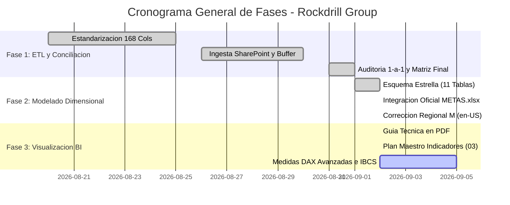

# 📊 ESTADO DEL PROYECTO - ROCKDRILL CONTROL DE OPERACIONES
## Informe de Estado PMO, Cumplimiento de Entregables y Contexto Oficial para Agentes AI

**Última Actualización:** 02 de Setiembre de 2026  
**Fase Actual:** **FASE 2 CERRADA AL 100% | FASE 3 EN EJECUCIÓN (POWER BI DASHBOARD)**  
**Repositorio Oficial:** `chihuacoaudaz-png/revision-detallado` (Rama: `main`)  
**Autoridad de Control:** PMO & Control de Proyectos - Rockdrill Group  

---

## 🎯 1. FICHA TÉCNICA DEL PROYECTO Y ESTADO DEL MODELO

| Atributo | Detalle Validado en Datos |
| :--- | :--- |
| **Nombre del Proyecto** | Sistema Integral de Ingesta, Modelado Dimensional Kimball y Dashboard Power BI |
| **Alcance** | 22 Contratos Mineros Activos en Perú (Superficie e Interior Mina) y 96 Perforadoras |
| **Base Operativa Oficial** | `CONSOLIDADOR_DETALLADOS_POWERQUERY.xlsx` (176 Columnas, 3,505 Filas) |
| **Maestro de Metas Oficial** | `METAS.xlsx` (1,052 Registros Históricos de Metas por CTR y Máquina, 2025–2026) |
| **Metraje Perforado Auditado** | **`7,502.91 m`** en 3,505 guardias (100% exacto, verificado en Power BI) |
| **Horas Reportadas Auditadas** | **`7,687.00 h`** en 4,747 eventos operativos categorizados en 5 grupos SIG |
| **Meta Activa Setiembre 2026** | **`52,295.17 m`** distribuidos en 64 máquinas activas |
| **Esquema Relacional Power BI** | **16 de 16 Relaciones Físicas Activas (`1:*`)** en `DASH.pbix` (0 huérfanos) |
| **Duración de Jornadas** | 12.0h general | Excepciones: Catalina Huanca (10.15h) y Yauliyacu (11.0h) |

---

## 📈 2. TABLERO DE CONTROL PMO (CUMPLIMIENTO POR FASES)

### Resumen de Entregables Clave (WBS):

| Fase | Entregable / Hito | Estado | Ubicación / Evidencia |
| :--- | :--- | :---: | :--- |
| **Fase 2** | Generador Dimensional Python | ✅ CERRADO | `BBDD/generar_base_datos_dimensional.py` (24.7 s) |
| **Fase 2** | Ejecutable Autónomo sin Python | ✅ CERRADO | `BBDD/EJECUTAR_BBDD.bat` y `BBDD/EJECUTAR_BBDD/` |
| **Fase 2** | Salida Dimensional (11 Tablas) | ✅ CERRADO | `BBDD/output_star_schema/` (.csv, .parquet, .xlsx) |
| **Fase 2** | Ingesta Oficial de Metas | ✅ CERRADO | `METAS.xlsx` integrado en `fact_metas_mensuales` |
| **Fase 2** | Corrección Regional Power Query | ✅ CERRADO | `QUERYS_POWER_QUERY_M_ESTRELLA.txt` (Cultura en-US) |
| **Fase 3** | Modelo Power BI Desktop Activo | ✅ EN REGLA | `DASH.pbix` (16 relaciones activas, 7,502.91 m) |
| **Fase 3** | Guía Técnica del Modelo (PDF) | ✅ CERRADO | `GUIA_TECNICA_OPERATIVA_DASHBOARD_BI.pdf` (3 Págs) |
| **Fase 3** | Plan Maestro de Visualizaciones | ✅ CERRADO | `planes/03_PLAN_VISUALIZACIONES_E_INDICADORES_AVANZADOS.md` |
| **Fase 3** | Catálogo Oficial 49 Medidas DAX| ✅ CERRADO | `planes/04_GUIA_PASO_A_PASO_MEDIDAS_Y_CARPETAS_POWER_BI.md` & `docs/CATALOGO_OFICIAL_49_MEDIDAS_DAX.txt` |
| **Gobierno** | Squad de 11 Agentes Especializados | ✅ CERRADO | `AGENTES.md` y `.agents/agents/agente_finalizador/` |

---

## 🏛️ 3. ACUERDOS Y DEFINICIONES DE ARQUITECTURA VIGENTES

1. **Esquema Estrella Puro:** No existen enlaces entre dimensiones. La relación `dim_sondaje_taladro -> dim_contrato_minero` fue suprimida para mantener activas las 16 relaciones físicas con las tablas de hechos.
2. **Cultura 'en-US' Obligatoria en Power Query M:** Todo archivo CSV debe transformarse usando cultura `"en-US"` para evitar que Windows en español trate el punto decimal como separador de miles.
3. **Estructura Dual de Horas Meta:**
   * *Pilar I (Fijo):* Mantenimiento Mecánico Meta = 15.0% (mínimo 85% DM). Perforación Efectiva Meta calculada según el ratio m/h del mes récord de cumplimiento.
   * *Pilar II (Paramétrico):* Standbys Operativo, Cliente e Inoperativo calibrables mediante estudios de tiempos (actividades recurrentes) o convenciones de Gerencia.
4. **Doble Ratio para Metros Perdidos:** Conmutable vía selector DAX entre Ratio Real del Mes y Ratio Promedio Ponderado de 3 Meses (Rolling 3M).
5. **Gobernanza de Medidas:** Organización estricta de las 49 medidas DAX en 7 Display Folders dentro de la tabla contenedora `_Medidas` y 2 tablas estáticas de gobernanza (`tbl_selector_ratio` y `tbl_parametros_umbrales`).
