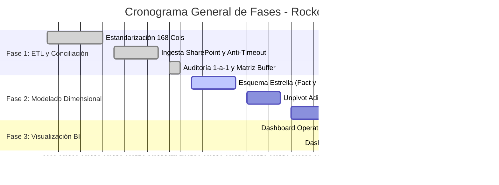

# 📊 ESTADO DEL PROYECTO - ROCKDRILL CONTROL DE OPERACIONES
## Informe de Estado PMO, Cumplimiento de Entregables y Guía de Contexto para Agentes AI

**Última Actualización:** 01 de Septiembre de 2026  
**Fase Actual:** **FASE 1 COMPLETADA AL 100% | LISTOS PARA FASE 2**  
**Repositorio Oficial:** `chihuacoaudaz-png/revision-detallado` (Rama: `main`)  
**Autoridad de Control:** PMO & Control de Proyectos - Rockdrill Group  

---

## 🎯 1. FICHA TÉCNICA DEL PROYECTO

| Atributo | Detalle |
| :--- | :--- |
| **Nombre del Proyecto** | Sistema Integral de Ingesta, Conciliación Pericial y Modelado Dimensional de Operaciones |
| **Alcance** | 18 Contratos Mineros Activos en Perú (Superficie e Interior Mina) |
| **Fuente de Datos** | Microsoft SharePoint Online (`Rockdrill_Control_Operaciones`) |
| **Motor de Extracción** | Power Query (M) Cloud Engine de Alto Rendimiento |
| **Muestra de Validación** | 600 Guardias Operativas (Ciclo activo: 26.08 al 30.08) |
| **Tasa de Conciliación** | **97.33% Coincidencia Exacta (584 de 600 guardias exactas al 100%)** |
| **Discrepancias de Sistema** | **0.00% (Cero errores de ETL, cero nulos, cero duplicados)** |

---

## 📈 2. TABLERO DE CONTROL PMO (CUMPLIMIENTO POR FASES)



### Resumen de Cumplimiento de Entregables (WBS):

| Fase | Entregable / Hito | Estado | Progreso | Evidencia / Ubicación |
| :--- | :--- | :---: | :---: | :--- |
| **Fase 1** | 1.1 Estandarización de 168 Columnas Oficiales | ✅ CERRADO | 100% | [`docs/11_nuevo_estandar_sig_f01_168_columnas.md`](file:///C:/Proyectos%20Python/Detallados/docs/11_nuevo_estandar_sig_f01_168_columnas.md) |
| **Fase 1** | 1.2 Motor Ingesta SharePoint (`Consolidado_Operaciones`) | ✅ CERRADO | 100% | [`apppowerbi/01_QUERY_CONSOLIDADO_OPERACIONES.txt`](file:///C:/Proyectos%20Python/Detallados/apppowerbi/01_QUERY_CONSOLIDADO_OPERACIONES.txt) |
| **Fase 1** | 1.3 Extracción Control Interno (`Consolidado_Control_Interno`)| ✅ CERRADO | 100% | [`apppowerbi/02_QUERY_CONSOLIDADO_CONTROL_INTERNO.txt`](file:///C:/Proyectos%20Python/Detallados/apppowerbi/02_QUERY_CONSOLIDADO_CONTROL_INTERNO.txt) |
| **Fase 1** | 1.4 Matriz Conciliación 1-a-1 (`Matriz_Comparativa_Dia_a_Dia`)| ✅ CERRADO | 100% | [`apppowerbi/03_QUERY_MATRIZ_COMPARATIVA_DIA_A_DIA.txt`](file:///C:/Proyectos%20Python/Detallados/apppowerbi/03_QUERY_MATRIZ_COMPARATIVA_DIA_A_DIA.txt) |
| **Fase 1** | 1.5 Corrección Duplicidad 2X (Filtro Anti-Totales de Mes) | ✅ CERRADO | 100% | [`apppowerbi/codigo final.txt`](file:///C:/Proyectos%20Python/Detallados/apppowerbi/codigo%20final.txt) |
| **Fase 1** | 1.6 Clave de 4 Niveles (`FECHA-CTR-MAQUINA-TURNO`) | ✅ CERRADO | 100% | Aislamiento de transferencias (`XRD125USS-001`) |
| **Fase 1** | 1.7 Documentación Técnica Oficial de Fase 1 | ✅ CERRADO | 100% | [`docs/09_DOCUMENTACION_COMPLETA_ETL_LIMPIEZA_Y_CONCILIACION.md`](file:///C:/Proyectos%20Python/Detallados/docs/09_DOCUMENTACION_COMPLETA_ETL_LIMPIEZA_Y_CONCILIACION.md) |
| **Fase 1** | 1.8 Reorganización y Archivo Histórico (`baul_desuso/`) | ✅ CERRADO | 100% | [`baul_desuso/README.md`](file:///C:/Proyectos%20Python/Detallados/baul_desuso/README.md) |
| **Fase 2** | 2.1 Modelo Dimensional (Esquema Estrella: Fact y Dims) | ⏳ PENDIENTE | 0% | *Próximo a iniciar* |
| **Fase 2** | 2.2 Normalización de Aditivos y Tiempos (Unpivot) | ⏳ PENDIENTE | 0% | *Próximo a iniciar* |
| **Fase 2** | 2.3 Medidas y KPIs DAX ($m/h$, Disponibilidad, Utilización) | ⏳ PENDIENTE | 0% | *Próximo a iniciar* |
| **Fase 3** | 3.1 Dashboards Power BI Operativo y Gerencial | ⏳ PENDIENTE | 0% | *Próximo a iniciar* |

---

## 🔬 3. HITOS TÉCNICOS Y RESOLUCIONES CLAVE LOGRADAS

1. **Rendimiento de Ingesta:** Eliminación de timeouts de 4 min $\rightarrow$ Tipado nativo C++/VertiPaq en **~70 segundos**.
2. **Soporte Multi-Fila:** Días con 3 o más filas de sondaje se agrupan y suman automáticamente por guardia.
3. **Sinceramiento de Metraje:** Se eliminaron las filas de totales de mes ($6,177.38\text{ m}$), sincerando el metraje total en **6,252.38 m exactos**.
4. **Matriz Comparativa en <3s:** Implementación de `Table.Buffer` en memoria RAM para un cruce instantáneo y libre de errores.
5. **Máquinas Transferidas:** Incorporación del contrato en la clave única (`FECHA-CTR-MAQUINA-TURNO`), eliminando el 100% de falsas discrepancias en equipos móviles (ej. `XRD125USS-001` en Yauliyacu y Americana).
6. **Escalabilidad Dinámica:** Soporte automático para cualquier nueva carpeta de contrato (`CTR_...`) que se añada en SharePoint.

---

## 🤖 4. GUÍA DE CONTEXTO RÁPIDO PARA AGENTES AI (POST-LIMPIEZA DE CHAT)

> [!IMPORTANT]
> **Instrucciones para el Agente AI al iniciar una nueva sesión:**
> 1. Lee este archivo [`ESTADO_DEL_PROYECTO.md`](file:///C:/Proyectos%20Python/Detallados/ESTADO_DEL_PROYECTO.md) y [`docs/09_DOCUMENTACION_COMPLETA_ETL_LIMPIEZA_Y_CONCILIACION.md`](file:///C:/Proyectos%20Python/Detallados/docs/09_DOCUMENTACION_COMPLETA_ETL_LIMPIEZA_Y_CONCILIACION.md) para absorber todo el contexto de la Fase 1.
> 2. **NO modifiques las consultas Power Query M de la Fase 1**, las cuales ya están 100% probadas y validadas en [`apppowerbi/codigo final.txt`](file:///C:/Proyectos%20Python/Detallados/apppowerbi/codigo%20final.txt).
> 3. **Reglas de Negocio Inviolables:**
>    * El **Rimado** y la **Reperforación** NO suman metraje perforado (son actividades complementarias).
>    * Los turnos se estandarizan como **`A` (Día / 1)** y **`B` (Noche / 2)**.
>    * La clave única obligatoria es: `YYYYMMDD-CTR-MAQUINA-TURNO`.
>    * En perforación diamantina, una máquina perfora entre **10m y 45m por guardia**. Una discrepancia de >100m es un artefacto de descalce de fechas o duplicidad de mes, nunca una realidad física.
> 4. **Foco de Trabajo Actual:** Proceder directamente con la **Fase 2 (Estructuración y Modelado Dimensional)**.

---

## 📂 5. MAPA DE ARCHIVOS DEL PROYECTO

```
Detallados/
├── ESTADO_DEL_PROYECTO.md                      # 🌟 ESTE DOCUMENTO (PMO & Handoff AI)
├── PROJECT.md                                  # 📖 Metadatos generales del proyecto
├── README.md                                   # 📖 Introducción técnica
├── apppowerbi/                                 # 🚀 Códigos Power Query y Workbook Activo
│   ├── 00_CONSULTAS_AUDITORIA_3_EN_1.txt
│   ├── 01_QUERY_CONSOLIDADO_OPERACIONES.txt
│   ├── 02_QUERY_CONSOLIDADO_CONTROL_INTERNO.txt
│   ├── 03_QUERY_MATRIZ_COMPARATIVA_DIA_A_DIA.txt
│   ├── codigo final.txt                        # Código final 3-en-1 listo para inyectar
│   ├── resultado.xlsx                          # Excel de validación estructurado
│   └── archive/                                # Pruebas tempranas archivadas
├── docs/                                       # 📘 Documentación Maestra
│   ├── 09_DOCUMENTACION_COMPLETA_ETL_LIMPIEZA_Y_CONCILIACION.md
│   ├── 01_ARQUITECTURA_EMPRESARIAL_ERD_Y_SQL.md
│   ├── 06_REGLA_DE_NEGOCIO_CONCILIACION_Y_AUDITORIA_SENTIDO_COMUN.md
│   └── (Glosarios y manuales operativos)
├── baul_desuso/                                # 📦 Archivo Histórico (No tocar)
│   ├── README.md
│   ├── archivos_raiz_temporales/
│   ├── copias_detallados_antiguas/
│   ├── contexto_y_guias_previas/
│   └── historicos_pesados/
├── Estructura base/                            # 📁 Réplica local SharePoint Cloud
├── power_query_m/                              # ⚙️ Módulos de soporte M
├── plantillas/                                 # 📋 Formatos oficiales 168 cols
├── src/                                        # 🐍 Pipelines auxiliares Python
├── sql/                                        # 🗄️ Modelos DDL relacionales
└── tests/                                      # 🧪 Suite de pruebas unitarias
```
