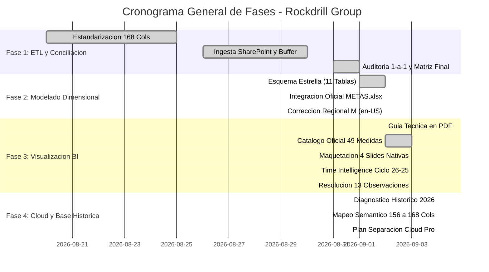

# 📊 ESTADO DEL PROYECTO - ROCKDRILL CONTROL DE OPERACIONES
## Informe de Estado PMO, Cumplimiento de Entregables y Contexto Oficial para Agentes AI

**Última Actualización:** 04 de Setiembre de 2026  
**Fase Actual:** **FASE 3 ETAPA 1 CERRADA AL 100% | PLANIFICACIÓN CLOUD (POWER BI PRO) Y DIAGNÓSTICO HISTÓRICO 2026 CERRADOS**  
**Repositorio Oficial:** `chihuacoaudaz-png/revision-detallado` (Rama: `main`)  
**Autoridad de Control:** PMO & Control de Proyectos - Rockdrill Group  

---

## 🎯 1. FICHA TÉCNICA DEL PROYECTO Y ESTADO DEL MODELO

| Atributo | Detalle Validado en Datos |
| :--- | :--- |
| **Nombre del Proyecto** | Sistema Integral de Ingesta, Modelado Dimensional Kimball y Dashboard Power BI |
| **Alcance Operativo** | 22 Contratos Mineros Activos en Perú (Superficie e Interior Mina) y 96 Perforadoras |
| **Base Operativa Oficial** | `CONSOLIDADOR_DETALLADOS_POWERQUERY.xlsx` (176 Columnas, 3,505 Filas) |
| **Maestro de Metas Oficial** | `METAS.xlsx` (1,052 Registros Históricos de Metas por CTR y Máquina, 2025–2026) |
| **Metraje Perforado Auditado (Activo)** | **`7,502.91 m`** en 3,505 guardias (100% exacto, verificado en Power BI) |
| **Horas Reportadas Auditadas (Activo)** | **`7,687.00 h`** en 4,747 eventos operativos categorizados en 5 grupos SIG |
| **Meta Activa Setiembre 2026** | **`52,295.17 m`** distribuidos en 64 máquinas activas |
| **Esquema Relacional Power BI** | **16 de 16 Relaciones Físicas Activas (`1:*`)** en `DASH.pbix` + Tablas de Gobernanza |
| **Catálogo de Medidas DAX** | **49 Medidas Oficiales en 7 Folders** + Carpeta 08 (Time Intelligence y Comparabilidad Histórica) |
| **Duración de Jornadas** | 12.0h general | Excepciones: Catalina Huanca (10.15h) y Yauliyacu (11.0h) |
| **Gobernanza de Flota** | Tabla de exclusión operativa `tbl_maquinas_excluidas` para sinceramiento de flota |
| **Arquitectura Visual** | **100% Visuales Nativos Power BI** (cero dependencias de visuales de pago/licencia) |
| **Base Histórica Auditada (Foco 2026)**| **25,736 filas y 270,069.9 m** analizados (diagnóstico de desplazamientos y mapeo 156➔168 cerrado) |

---

## 📈 2. TABLERO DE CONTROL PMO (CUMPLIMIENTO POR FASES)

### Resumen de Entregables Clave (WBS):

| Fase | Entregable / Hito | Estado | Ubicación / Evidencia |
| :--- | :--- | :---: | :--- |
| **Fase 2** | Generador Dimensional Python | ✅ CERRADO | `BBDD/generar_base_datos_dimensional.py` (24.7 s) |
| **Fase 2** | Ejecutable Autónomo sin Python | ✅ CERRADO | `BBDD/EJECUTAR_BBDD.bat` y `BBDD/EJECUTAR_BBDD/` |
| **Fase 2** | Salida Dimensional (11 Tablas) | ✅ CERRADO | `BBDD/output_star_schema/` (.csv, .parquet, .xlsx) |
| **Fase 2** | Ingesta Oficial de Metas | ✅ CERRADO | `METAS.xlsx` integrado en `fact_metas_mensuales` |
| **Fase 2** | Corrección Regional Power Query | ✅ CERRADO | `QUERYS_POWER_QUERY_M_ESTRELLA.txt` (Cultura en-US) |
| **Fase 3** | Modelo Power BI Desktop Activo | ✅ VALIDADO | `DASH.pbix` (16 relaciones activas, 7,502.91 m auditados) |
| **Fase 3** | Catálogo Oficial Medidas DAX | ✅ CERRADO | `planes/04_GUIA_PASO_A_PASO_MEDIDAS_Y_CARPETAS_POWER_BI.md` & `docs/CATALOGO_OFICIAL_49_MEDIDAS_DAX.txt` |
| **Fase 3** | Maquetación 4 Slides Nativas | ✅ CERRADO | `planes/05_GUIA_PASO_A_PASO_CONSTRUCCION_SLIDES_Y_VISUALES_PBI.md` (y `.html`) |
| **Fase 3** | Resolución 13 Observaciones | ✅ CERRADO | `planes/06_RESOLUCION_OBSERVACIONES_VISUALES_PBI.md` & `docs/OBSERVACIONES_FEEDBACK_USUARIO_PBI.txt` |
| **Fase 3** | Diseño Time Intelligence Ciclo 26-25 | ✅ CERRADO | `planes/07_DISENO_TIME_INTELLIGENCE_Y_RESILIENCIA_TEMPORAL.md` |
| **Fase 3** | Script Automatización TOM | ✅ CERRADO | `scripts/apply_dim_tiempo_columns_tom.ps1` (SortByColumn en VertiPaq) |
| **Fase 3** | Habilitación Contrato CAPITANA | ✅ CERRADO | `observaciones.txt`, `config.py`, `apppowerbi/` (Cuadratura 1-a-1, 57.20 m) |
| **Fase 4** | Diagnóstico Base Histórica 2026 | ✅ CERRADO | `docs/10_DIAGNOSTICO_Y_PLAN_MIGRACION_BASE_HISTORICA_2026.md` (25,736 filas, Tambojasa, Otros vs anexas) |
| **Fase 4** | Plan Separación Power Query Nube Pro | ✅ CERRADO | `planes/08_PLAN_FLUJO_SEPARACION_TABLAS_POWER_QUERY_NUBE_PRO.md` (Dataflow Frío + Caliente, límites Pro) |
| **Gobierno** | Vault Técnico en Obsidian | ✅ CERRADO | `MCP/docs/obsidian/` (Módulos 00 a 09, inclusión oficial de Capitana) |
| **Gobierno** | Squad de 11 Agentes Especializados | ✅ CERRADO | `AGENTES.md` y `.agents/agents/` |

---

## 🏛️ 3. ACUERDOS Y DEFINICIONES DE ARQUITECTURA VIGENTES

1. **Esquema Estrella Puro y Desconexión de Puentes Innecesarios:** No existen enlaces entre dimensiones. Se mantienen activas las 16 relaciones físicas `1:*` hacia las tablas de hechos en VertiPaq.
2. **Cultura 'en-US' Obligatoria en Power Query M:** Todo archivo CSV o Dataflow se procesa con cultura `"en-US"` para garantizar la integridad de valores decimales y fechas en cualquier configuración regional.
3. **Resiliencia Temporal y Blindaje contra Segmentadores Vacíos:**
   * Las medidas maestras implementan `TREATAS` y `ISFILTERED` para responder limpiamente tanto cuando hay filtros de fecha activos como cuando el usuario desmarca o no selecciona ninguna fecha.
   * `[Proyeccion Cierre Run-Rate (m)]` y `[Dias Restantes]` utilizan `COALESCE` para evitar división por cero.
4. **Visuales 100% Nativos (Cero Dependencias de Licencia Externa):** Dumbbell nativo (matriz/líneas), Bullet chart nativo (multi-row / barras con línea meta), Pareto y Curva S nativos, Decomposition tree nativo.
5. **Guardias Sinceras y Gobernanza de Flota Activa:** Denominador de guardias programadas calibrado estrictamente a 12h por máquina con actividad operativa real en el periodo, documentando desmovilizadas en `tbl_maquinas_excluidas`.
6. **Ordenamiento Cronológico Minero:** `dim_tiempo_calendario` con `fecha_operativa_dt`, `fecha_corta_label` (ordenada por `calendario_sk`) y `dia_ciclo_label` (ordenada por `dia_ciclo_operativo`), garantizando orden estricto del día 26 al 25.
7. **Nombres Cortos de Contratos:** Campo `nombre_contrato_corto` (ej. 'Catalina Huanca', 'Cobriza') para visualización limpia sin prefijos técnicos.
8. **Arquitectura Desacoplada Cloud (Cold/Hot) para Power BI Pro:**
   * Para cumplir el límite de 2 horas (120 min) y ~1.5 GB de memoria Mashup de la licencia Pro, los datos históricos cerrados (2024–2026 Ene-Ago) residirán en un **Dataflow Frío estático sin refresco programado**.
   * El **Dataflow Caliente diario** solo procesará el mes activo (~3,500 filas), ejecutándose en < 3 minutos.
   * La unión de hechos ocurre en la capa semántica de VertiPaq (`Table.Combine`), comprimiendo 3 millones de eventos a < 25 MB en segundos.
9. **Neutralización de Duplicidad en 'Otros':** Al migrar a las 168 columnas oficiales, las horas deben asignarse a la categoría específica (ej. Falta de personal, Pare CIA) y dejar en 0.0 la columna genérica `OTROS` para evitar dobles contabilidades (guardias de 24h).
