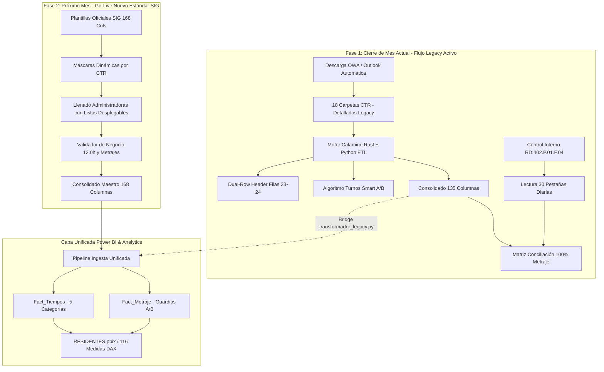

# 📚 Master Knowledge Base & Handoff: Sistema Unificado de Detallados y Control Interno (Rockdrill Group)

> [!IMPORTANT]
> **ESTADO DE TRANSICIÓN OPERATIVA Y VIGENCIA DE FORMATOS:**
> 1. **Cierre de Mes en Curso (Agosto 2026 / Ciclo 26 al 25):** Se ejecuta **100% bajo el Flujo Legacy** (`RD.402.P.01.F.01` de 135 columnas), utilizando el descargador automatizado de OWA/Outlook y el pipeline ETL de Calamine en Python con conciliación contra `RD.402.P.01.F.04`.
> 2. **Preservación Histórica:** El flujo legacy, sus reglas de transformación, algoritmo inteligente de turnos y matrices de conciliación se conservan formalmente como **conocimiento histórico operativo y benchmark oficial**.
> 3. **Nuevo Formato Estandarizado SIG (168 Columnas):** Ha sido **aprobado por el SIG (Sistema Integrado de Gestión)** y entrará en **vigencia operativa oficial a partir del próximo mes** para todos los 18 contratos mineros (CTRs).
> 4. **Conectividad Total:** El modelo semántico corporativo de **Power BI (`RESIDENTES.pbix`)** y la base de conocimiento en **Graphify / Obsidian** integran ambos esquemas para garantizar continuidad analítica.

---

## 🧭 Índice Maestro del Knowledge Graph (Obsidian Vault)

### 🔹 Módulo A: Flujo Legacy y Operación Cierre de Mes (Histórico & Activo Actual)
- [[docs/01_arquitectura_y_pipeline_etl|01. Arquitectura del Pipeline ETL Legacy y Sustitución de Power Query]]
- [[docs/02_diccionario_de_datos_135_columnas|02. Diccionario de Datos Legacy y Tipado Estricto (135 Columnas)]]
- [[docs/03_algoritmo_turnos_y_casos_borde|03. Algoritmo Inteligente de Turnos y Casos Borde (Fast Shift Engine)]]
- [[docs/04_matriz_conciliacion_y_auditoria|04. Matriz Comparativa, Conciliación Diaria y Diagnósticos]]
- [[docs/05_guia_ejecucion_y_mantenimiento|05. Guía de Ejecución, Automatización y Mantenimiento del Pipeline]]
- [[docs/06_flujo_descarga_correos_outlook_y_ctrs|06. Flujo de Descarga de Correos OWA, Reglas por CTR y Reportes Detallados]]
- [[docs/07_analisis_rendimiento_descargador|07. Análisis de Rendimiento del Descargador Automatizado]]
- [[docs/08_guia_descargador_portable|08. Guía de Uso del Descargador Portable]]
- [[docs/09_mapeo_actividades_y_estrategia_powerbi|09. Mapeo de Actividades, Diferencias de Esquema y Estrategia Power BI]]
- [[docs/10_propuesta_estandarizacion_detallado_f01|10. Génesis de la Propuesta de Estandarización del Reporte Detallado]]

### 🔹 Módulo B: Nuevo Estándar SIG y Plantillas Estandarizadas (Próximo Mes)
- [[docs/11_nuevo_estandar_sig_f01_168_columnas|11. Especificación Técnica del Nuevo Estándar SIG (168 Columnas)]]
- [[docs/12_glosario_oficial_columnas_rd402|12. Glosario Oficial de Columnas RD.402.P.01.F.01 (SIG)]]
- [[docs/13_instructivo_llenado_reporte_detallado|13. Instructivo Oficial de Llenado para Administradoras de Contrato]]
- [[docs/14_matriz_personalizacion_maquinas_y_ctrs|14. Matriz de Personalización por CTR y Máquinas Perforadoras]]
- [[docs/MANUAL_DE_USUARIO_DETALLADO_ADMINISTRADORAS|Manual de Usuario y Operaciones para Administradoras de Contrato]]
- [[docs/GLOSARIO_OFICIAL_ADMINS_RD402_168_COLS|Glosario Extendido Oficial de 168 Columnas y Unidades]]
- [[docs/ESTUDIO_INCIDENCIA_Y_VISIBILIDAD_CTR|Estudio de Incidencia Operativa y Visibilidad de Columnas por CTR]]
- [[docs/INFORME_ESTANDARIZACION_FINAL_Y_GLOSARIO_166_COLUMNAS|Informe de Estandarización Final y Alineamiento con SIG]]

### 🔹 Módulo C: Conocimiento de Negocio, Precios Unitarios y Glosarios Técnicos
- [[docs/CONOCIMIENTO_NEGOCIO_PERFORACION|Conocimiento Integral del Negocio de Perforación Diamantina y Turnos]]
- [[docs/GLOSARIO_TERMINOS_V3|Glosario Técnico de Perforación Diamantina y Minería v3]]
- [[docs/palabras_claves|Diccionario de Palabras Clave y Sinónimos Operativos]]
- [[docs/resumen_items_pu_contratos|Catálogo Maestro de Precios Unitarios (PU) por Contrato Minero]]
- [[docs/conocimiento_pu/|37 Especificaciones Detalladas de Contratos Comerciales y Tarifarios PU]]

---

## 🏗️ 1. Arquitectura de Transición: Coexistencia y Evolución

---

## ⚙️ 2. Resumen Técnico del Flujo Legacy (Línea Base Histórica)

1. **Estructura:** 135 columnas canónicas (129 nativas + 6 de auditoría).
2. **Encabezado:** Doble fila (Fila 23 actividad, Fila 24 unidad/código).
3. **Clave Primaria Oficial:** `aaaammdd-codigomaquina-turno` (ej. `20260815-XRD80ITH-001-A`).
4. **Motor de Asignación de Turnos (`assign_daily_turnos_fast`):**
   - Resuelve celdas combinadas, guardias rotativas (1 a 5) y transiciones de perforistas en turnos multi-sondaje sin desfasar índices.
5. **Conciliación Contra Control Interno (`RD.402.P.01.F.04`):**
   - Cuadratura exacta de $28,882.37\text{ m}$ en los 18 contratos mineros ($100.00\%$ de precisión).
   - Generación automática de `matriz_comparativa_metrajes.xlsx`.

---

## 🌟 3. Resumen Técnico del Nuevo Estándar SIG (168 Columnas)

1. **Estructura:** 168 columnas canónicas distribuidas en 17 bloques funcionales:
   - Identificación y Sondaje (1–5), Avance y Cuadrilla (6–15), Metas (16–18), Brocas/Escariadores (19–25), Aditivos (26–50), Combustible (51–52), Tiempos Efectivos (53–56), Mantenimiento (57–58), Maniobras (59–77), Ensayos Geotécnicos/Hidrogeológicos (78–97), Soporte/Seguridad (98–118), Cliente/Entorno (119–145), Resumen Horas (146–152), Metrajes Especiales (153–160), Horómetros (161–164) y Bitácora (165–168).
2. **5 Categorías de Disponibilidad Interempresarial:**
   - `OPERATIVO [COBRABLE]`
   - `MANTENIMIENTO [NO COBRABLE]`
   - `STAND BY OPERATIVO [COBRABLE]`
   - `STAND BY INOPERATIVO [NO COBRABLE]`
   - `STAND BY CLIENTE [COBRABLE]`
3. **Fórmulas Nativas Embebidas:**
   - Cálculo automático de avance: `=IF(G25="","",IF(G25>=F25,G25-F25,0))`
   - Balance automático de 12.0 horas de guardia: `=SUM(BA25:EO25)`
   - Asignación de cuadrilla por grupo: `=IF(I25=1,$H$8,IF(I25=2,$R$8,...))`
4. **Gobernanza:** Menús desplegables para 8 familias de aditivos (`Aditivos!$A$2:$H$17`) y validación de tipos estrictos.

---

## 📊 4. Plan de Acción Inmediato (Paso a Paso)

| Paso | Actividad | Herramienta / Script | Vigencia / Ejecución |
| :---: | :--- | :--- | :--- |
| **1** | Descarga automatizada de reportes OWA de los 18 CTRs | `descargar_detallados.py` | Cierre de Mes Actual |
| **2** | Ejecución del Pipeline ETL Legacy y Cuadratura de Metrajes | `ejecutar_pipeline.py` | Cierre de Mes Actual |
| **3** | Auditoría diaria y generación de matrices de cierre | `src/conciliacion.py` | Cierre de Mes Actual |
| **4** | Capacitación y entrega de manuales a Administradoras | `docs/MANUAL_DE_USUARIO_DETALLADO_ADMINISTRADORAS.md` | Previo a Go-Live |
| **5** | Distribución de plantillas maestras y personalizadas SIG | `plantillas/generadas/` | Inicio del Próximo Mes |
| **6** | Activación del pipeline unificado de 168 columnas | `src/generador_plantilla.py` + `src/validador_detallado.py` | Próximo Mes |
