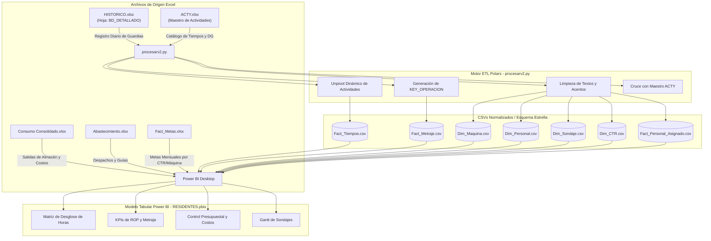

# 🏗️ Arquitectura de Datos y Pipeline ETL

> [!INFO]
> Este documento detalla el flujo de datos desde los registros diarios de perforación en Excel hasta el esquema estrella que alimenta a Power BI mediante el script de alto rendimiento **`procesarv2.py`** escrito en **Polars**.

---

## 1. Diagrama de Flujo de Datos (Data Lineage)



---

## 2. Configuración de Rutas del Entorno

### 📂 Rutas de Entrada (Input)
* **Histórico Operativo:**
  `OneDrive - ROCK DRILL/REPORTES BI EXCEL/BD/HISTORICO-PERDLAP140.xlsx` (Hoja: `BD_DETALLADO`)
* **Catálogo de Actividades:**
  `OneDrive - ROCK DRILL/REPORTES BI EXCEL/BD/ACTY.xlsx`

### 📂 Rutas de Salida (Output)
* **Carpeta de CSVs Procesados:**
  `OneDrive - ROCK DRILL/REPORTES BI EXCEL/BD/`
  * `Fact_Tiempos.csv` (Registro transaccional de horas por actividad)
  * `Fact_Metraje.csv` (Registro de metros perforados por guardia)
  * `Dim_Maquina.csv` (Catálogo único de máquinas)
  * `Dim_Personal.csv` (Catálogo único de perforistas y ayudantes normalizados)
  * `Dim_Sondaje.csv` (Catálogo y avance acumulado de sondajes)
  * `Dim_CTR.csv` (Centros de costos y proyectos activos)
  * `Fact_Personal_Asignado.csv` (Puente de personal por operación)

### 📊 Archivo Power BI
* **PBIX Activo:**
  `C:\Users\PERDLAP33\OneDrive - ROCK DRILL\Archivos de Pedro Gamarra - CONTROL DE PROYECTOS\12. DASHBOARD\Dashboard Previo\Residentes\BD\DashboardsV2\RESIDENTES.pbix`

---

## 3. Lógica de Transformación en Python (`procesarv2.py`)

El script utiliza el motor **Polars** con el lector `calamine` para máxima velocidad en archivos Excel pesados.

### A. Normalización de Nombres y Llaves
```python
def normalizar_nombre(nombre):
    """Normaliza nombres: mayúsculas, sin acentos, sin puntos, espacios limpios"""
    if nombre is None or str(nombre).strip() == "" or str(nombre).upper() == "NAN": 
        return ""
    n = str(nombre).strip().upper()
    n = unidecode(n)
    n = re.sub(r'[,\.]', '', n)
    n = re.sub(r'\s+', ' ', n).strip()
    return n
```

### B. Generación de Llave Primaria Operativa (`KEY_OPERACION`)
Une la fecha (en formato `YYYYMMDD`), el código de la máquina y el turno para permitir la correlación entre tiempos y metrajes:
$$\text{KEY\_OPERACION} = \text{FECHA}(YYYYMMDD) + \text{"-"} + \text{MAQUINA} + \text{"-"} + \text{TURNO}$$

### C. Unpivot de Actividades (Normalización de Tiempos)
El Excel original almacena las actividades como múltiples columnas de horas (tabla ancha). El script realiza un `unpivot` dinámico para convertirlo en tabla transaccional (tabla larga), vinculando cada actividad con `ACTY.xlsx` para clasificar:
* **`Categoria`:** `EFECTIVAS`, `OPERATIVO`, `MANTENIMIENTO`, `STAND BY CLIENTE`, `STAND BY INOPERATIVO`.
* **`Afecta_Disp`:** `AFECTA`, `NO AFECTA`.
* **`Responsable`:** `CLIENTE`, `OPERACIONES`, `MANTENIMIENTO`, `LOGISTICA`, `GESTION HUMANA`, `HELIX`.

---

## 4. Frecuencia y Procedimiento de Actualización

1. Registrar la información diaria en `HISTORICO-PERDLAP140.xlsx`.
2. Ejecutar el script ETL:
   ```bash
   python "src/etl/procesarv2.py"
   ```
3. Abrir `RESIDENTES.pbix` y presionar **Actualizar (Refresh)** en Power BI Desktop.
4. Guardar los cambios (`Ctrl + S`) y publicar en Power BI Service si aplica.
