# 🔗 Modelo Relacional y Esquema Tabular

> [!NOTE]
> El modelo de datos de `RESIDENTES.pbix` implementa una arquitectura **Estrella Extendida** con tablas de hechos transaccionales (`Fact_Metraje`, `Fact_Tiempos`, `Fact_Abastecimiento`, `Consumo Consolidado`) conectadas a dimensiones compartidas (`Dim_Calendario`, `Dim_CTR`, `Dim_Maquina`, `Dim_Sondaje`, `Dim_Personal`, `Dim_Familias`).

---

## 1. Diagrama Entidad-Relación (Mermaid ERD)

```mermaid
erDiagram
    Dim_Calendario ||--o{ Fact_Metraje : "FECHA -> Date (1:N)"
    Dim_Calendario ||--o{ Fact_Tiempos : "FECHA -> Date (1:N)"
    Dim_Calendario ||--o{ Fact_Abastecimiento : "FECHA -> Date (1:N)"
    Dim_Calendario ||--o{ Consumo_Consolidado : "Fecha -> Date (1:N)"
    Dim_Calendario ||--o{ Fact_Metas : "MES OPERATIVO -> Date (1:N)"

    Dim_CTR ||--o{ Fact_Metraje : "CTR -> CTR (1:N)"
    Dim_CTR ||--o{ Fact_Tiempos : "CTR -> CTR (1:N)"
    Dim_CTR ||--o{ Fact_Abastecimiento : "CONTRATO -> CTR (1:N)"
    Dim_CTR ||--o{ Consumo_Consolidado : "CTR -> CTR (1:N)"
    Dim_CTR ||--o{ Fact_Metas : "CTR -> CTR (1:N)"

    Dim_Maquina ||--o{ Fact_Metraje : "MAQUINA -> MAQUINA (1:N Both)"
    Dim_Maquina ||--o{ Fact_Tiempos : "MAQUINA -> MAQUINA (1:N)"
    Dim_Maquina ||--o{ Consumo_Consolidado : "Maquina -> MAQUINA (1:N)"
    Dim_Maquina ||--o{ Fact_Metas : "MAQUINA -> MAQUINA (1:N)"

    Dim_Sondaje ||--o{ Fact_Metraje : "SONDAJE -> SONDAJE (1:N)"
    Dim_Sondaje ||--o{ Fact_Tiempos : "SONDAJE -> SONDAJE (1:N)"

    Dim_Personal ||--o{ Fact_Personal_Asignado : "PERFORISTA -> NOMBRE (1:N)"
    Fact_Personal_Asignado }o--o{ Fact_Metraje : "KEY_OPERACION (M:M Both)"
    Fact_Personal_Asignado }o--o{ Fact_Tiempos : "KEY_OPERACION (M:M Single)"

    Dim_Familias ||--o{ Fact_Abastecimiento : "FAMILIA -> FAMILIA (1:N)"
    Dim_Familias ||--o{ Consumo_Consolidado : "Familia -> ID_FAMILIA (1:N)"

    Reporte_Brocas ||--o{ Fact_Metraje : "Nº_BROCA -> Nº_BROCA (1:N)"
    Reporte_Brocas ||--o{ Consumo_Consolidado : "Serie -> Nº_BROCA (1:N)"
```

---

## 2. Matriz Exhaustiva de Relaciones

| # | Tabla Origen (From) | Columna Origen | Tabla Destino (To) | Columna Destino | Cardinalidad | Filtro Cruzado | Estado |
| :-: | :--- | :--- | :--- | :--- | :---: | :---: | :---: |
| 1 | `Fact_Metraje` | `MAQUINA` | `Dim_Maquina` | `MAQUINA` | M:1 | **Both (Bidireccional)** | Activa |
| 2 | `Fact_Tiempos` | `CTR` | `Dim_CTR` | `CTR` | M:1 | Single | Activa |
| 3 | `Fact_Metraje` | `CTR` | `Dim_CTR` | `CTR` | M:1 | Single | Activa |
| 4 | `Fact_Metas` | `CTR` | `Dim_CTR` | `CTR` | M:1 | Single | Activa |
| 5 | `Fact_Metraje` | `FECHA` | `Dim_Calendario` | `Date` | M:1 | Single | Activa |
| 6 | `Fact_Abastecimiento`| `FECHA` | `Dim_Calendario` | `Date` | M:1 | Single | Activa |
| 7 | `Fact_Tiempos` | `FECHA` | `Dim_Calendario` | `Date` | M:1 | Single | Activa |
| 8 | `Fact_Abastecimiento`| `CONTRATO` | `Dim_CTR` | `CTR` | M:1 | Single | Activa |
| 9 | `Fact_Metraje` | `Nº_BROCA` | `Reporte_Brocas` | `Nº_BROCA` | M:1 | Single | Activa |
| 10 | `Fact_Metas` | `MAQUINA` | `Dim_Maquina` | `MAQUINA` | M:1 | Single | Activa |
| 11 | `Fact_Metas` | `MES OPERATIVO` | `Dim_Calendario` | `Date` | M:1 | Single | Activa |
| 12 | `Fact_Tiempos` | `MAQUINA` | `Dim_Maquina` | `MAQUINA` | M:1 | Single | Activa |
| 13 | `Consumo Consolidado`| `CTR` | `Dim_CTR` | `CTR` | M:1 | Single | Activa |
| 14 | `Consumo Consolidado`| `Maquina` | `Dim_Maquina` | `MAQUINA` | M:1 | Single | Activa |
| 15 | `Consumo Consolidado`| `Fecha` | `Dim_Calendario` | `Date` | M:1 | Single | Activa |
| 16 | `Fact_Metraje` | `SONDAJE` | `Dim_Sondaje` | `SONDAJE` | M:1 | Single | Activa |
| 17 | `Fact_Tiempos` | `SONDAJE` | `Dim_Sondaje` | `SONDAJE` | M:1 | Single | Activa |
| 18 | `Fact_Personal_Asignado`| `NOMBRE_TRABAJADOR`| `Dim_Personal` | `PERFORISTA` | M:1 | Single | Activa |
| 19 | `Fact_Personal_Asignado`| `KEY_OPERACION` | `Fact_Metraje` | `KEY_OPERACION` | M:M | **Both (Bidireccional)** | Activa |
| 20 | `Fact_Tiempos` | `KEY_OPERACION` | `Fact_Personal_Asignado` | `KEY_OPERACION` | M:M | Single | Activa |
| 21 | `Fact_Abastecimiento`| `FAMILIA` | `Dim_Familias` | `FAMILIA` | M:1 | Single | Activa |
| 22 | `Consumo Consolidado`| `Serie` | `Reporte_Brocas` | `Nº_BROCA` | M:1 | Single | Activa |
| 23 | `Consumo Consolidado`| `Familia` | `Dim_Familias` | `ID_FAMILIA` | M:1 | Single | Activa |

---

## 3. Consideraciones Críticas de Filtrado

> [!WARNING]
> **Relaciones Many-to-Many (M:M):**
> La tabla `Fact_Personal_Asignado` actúa como puente entre el personal (`Dim_Personal`) y las operaciones (`Fact_Metraje` / `Fact_Tiempos`). Esto permite que un perforista y dos ayudantes compartan los metros y tiempos de la guardia. Al escribir DAX que involucre personal, debe tenerse en cuenta esta duplicación a nivel de personal usando `DISTINCTCOUNT` o `AVERAGEX`.

> [!IMPORTANT]
> **Dim_Calendario y Periodo Operativo:**
> El corte mensual en Rock Drill **no es calendario natural** (1 al 31), sino **operativo** (del 26 del mes anterior al 25 del mes actual).
> La columna `Dim_Calendario[Periodo Sort]` y `Dim_Calendario[Mes Operativo]` deben utilizarse en todos los visuales y filtros temporales.
