# 🔗 Modelo Relacional y Esquema Tabular Kimball Empresarial

> [!NOTE]
> El sistema implementa una arquitectura **Kimball Star Schema de Grado Empresarial** optimizada para motores columnares (VertiPaq en Power BI, Delta Lake en Microsoft Fabric, PostgreSQL y Snowflake).
> 
> Utiliza **Llaves Subrogadas Enteras (`_sk`)**, soporte para miembros desconocidos (`sk = -1`), unpivoting de 116 columnas de tiempos operativos en `fact_horas_operativas` y una tabla puente (`brg_cuadrilla_guardia`) para modelar cuadrillas M:N de forma óptima sin relaciones bidireccionales ambiguas.

---

## 1. Diagrama Entidad-Relación Enterprise (Mermaid ERD)

```mermaid
erDiagram
    %% DIMENSIONES
    dim_tiempo_calendario ||--o{ fact_perforacion_avance : "calendario_sk (1:N)"
    dim_tiempo_calendario ||--o{ fact_horas_operativas : "calendario_sk (1:N)"
    dim_tiempo_calendario ||--o{ brg_cuadrilla_guardia : "calendario_sk (1:N)"
    
    dim_contrato_minero ||--o{ fact_perforacion_avance : "contrato_sk (1:N)"
    dim_contrato_minero ||--o{ fact_horas_operativas : "contrato_sk (1:N)"
    dim_contrato_minero ||--o{ fact_metas_mensuales : "contrato_sk (1:N)"
    
    dim_equipo_perforadora ||--o{ fact_perforacion_avance : "equipo_sk (1:N)"
    dim_equipo_perforadora ||--o{ fact_horas_operativas : "equipo_sk (1:N)"
    dim_equipo_perforadora ||--o{ fact_metas_mensuales : "equipo_sk (1:N)"
    dim_equipo_perforadora ||--o{ brg_cuadrilla_guardia : "equipo_sk (1:N)"
    
    dim_linea_diametro ||--o{ fact_perforacion_avance : "linea_sk (1:N)"
    
    dim_personal ||--o{ fact_perforacion_avance : "perforista_sk -> personal_sk (1:N)"
    dim_personal ||--o{ brg_cuadrilla_guardia : "personal_sk (1:N)"
    
    dim_sondaje_taladro ||--o{ fact_perforacion_avance : "sondaje_sk (1:N)"
    dim_taxonomia_actividad ||--o{ fact_horas_operativas : "actividad_sk (1:N)"

    %% ATRIBUTOS PRINCIPALES
    dim_tiempo_calendario {
        INT calendario_sk PK
        DATE fecha_dt
        INT anio_operativo
        VARCHAR mes_nom_operativo
        INT periodo_operativo_sort
        BOOLEAN es_cierre_operativo
    }

    dim_contrato_minero {
        SMALLINT contrato_sk PK
        VARCHAR contrato_cd
        VARCHAR nombre_contrato
        VARCHAR zona_geografica
        VARCHAR tipo_operacion
    }

    dim_equipo_perforadora {
        SMALLINT equipo_sk PK
        VARCHAR equipo_cd
        VARCHAR codigo_sap
        VARCHAR modelo_fabricante
        SMALLINT contrato_sk_asignado FK
    }

    dim_linea_diametro {
        SMALLINT linea_sk PK
        VARCHAR linea_cd
        VARCHAR tipo_tuberia
        DECIMAL diametro_corona_mm
    }

    dim_personal {
        INT personal_sk PK
        VARCHAR personal_cd
        VARCHAR nombre_completo
        VARCHAR rol_estandarizado
    }

    dim_sondaje_taladro {
        INT sondaje_sk PK
        VARCHAR sondaje_cd
        SMALLINT contrato_sk FK
        VARCHAR tipo_taladro
    }

    dim_taxonomia_actividad {
        SMALLINT actividad_sk PK
        VARCHAR nombre_actividad
        VARCHAR bloque_funcional
        VARCHAR categoria_disponibilidad
        BOOLEAN es_cobrable
        BOOLEAN impacta_disp_mecanica
    }

    fact_perforacion_avance {
        BIGINT avance_id PK
        INT calendario_sk FK
        SMALLINT contrato_sk FK
        SMALLINT equipo_sk FK
        INT sondaje_sk FK
        INT perforista_sk FK
        SMALLINT linea_sk FK
        VARCHAR turno_guardia
        DECIMAL desde_m
        DECIMAL hasta_m
        DECIMAL metraje_guardia_m
        VARCHAR id_clave_unica
    }

    fact_horas_operativas {
        BIGINT hora_evento_id PK
        INT calendario_sk FK
        SMALLINT contrato_sk FK
        SMALLINT equipo_sk FK
        SMALLINT actividad_sk FK
        VARCHAR turno_guardia
        DECIMAL horas_reportadas
        BOOLEAN es_cobrable
        VARCHAR categoria_disponibilidad
        VARCHAR id_clave_unica
    }

    brg_cuadrilla_guardia {
        BIGINT asignacion_id PK
        INT calendario_sk FK
        SMALLINT equipo_sk FK
        INT personal_sk FK
        VARCHAR rol_desempenado
        DECIMAL horas_laboradas
        VARCHAR id_clave_unica
    }

    fact_metas_mensuales {
        BIGINT meta_id PK
        SMALLINT contrato_sk FK
        SMALLINT equipo_sk FK
        INT periodo_operativo_sort
        DECIMAL meta_metraje_m
        DECIMAL horas_programadas_mes
    }
```

---

## 2. Matriz de Tablas del Esquema Estrella en Producción

Las tablas generadas por `src/modelado_dimensional.py` se ubican en [`output/powerbi_star_schema/`](file:///C:/Proyectos%20Python/Detallados/output/powerbi_star_schema):

| Tabla | Tipo | Filas Generadas | Columnas | Formatos Disponibles |
| :--- | :--- | :---: | :---: | :--- |
| **`dim_tiempo_calendario`** | Dimensión | 62 | 17 | `.parquet`, `.csv`, `.xlsx` |
| **`dim_contrato_minero`** | Dimensión | 19 | 7 | `.parquet`, `.csv`, `.xlsx` |
| **`dim_equipo_perforadora`** | Dimensión | 57 | 9 | `.parquet`, `.csv`, `.xlsx` |
| **`dim_linea_diametro`** | Dimensión | 5 | 5 | `.parquet`, `.csv`, `.xlsx` |
| **`dim_personal`** | Dimensión | 418 | 7 | `.parquet`, `.csv`, `.xlsx` |
| **`dim_sondaje_taladro`** | Dimensión | 97 | 7 | `.parquet`, `.csv`, `.xlsx` |
| **`dim_taxonomia_actividad`** | Dimensión | 94 | 6 | `.parquet`, `.csv`, `.xlsx` |
| **`fact_perforacion_avance`** | Hechos | 933 | 13 | `.parquet`, `.csv`, `.xlsx` |
| **`fact_horas_operativas`** | Hechos | 3,965 | 10 | `.parquet`, `.csv`, `.xlsx` |
| **`brg_cuadrilla_guardia`** | Puente M:N | 1,640 | 7 | `.parquet`, `.csv`, `.xlsx` |
| **`fact_metas_mensuales`** | Hechos | 56 | 6 | `.parquet`, `.csv`, `.xlsx` |

---

## 3. Principios de Diseño de Ingeniería

1. **Llaves Subrogadas Enteras (`_sk`):**  
   Garantizan un consumo de memoria mínimo (compresión VertiPaq) y JOINs en microsegundos.
2. **Registro Miembro Desconocido (`sk = -1`):**  
   Todas las dimensiones contienen la fila `sk = -1` (`[NO ASIGNADO]`), haciendo al modelo inmune a celdas vacías o registros incompletos de campo.
3. **Dirección de Filtro Única (Single Direction 1:N):**  
   Elimina filtros bidireccionales y ambigüedad en DAX.
4. **Tabla Puente de Cuadrilla (`brg_cuadrilla_guardia`):**  
   Permite calcular KPIs por perforista, ayudante 1 y ayudante 2 sin duplicar metrajes en la tabla de hechos.
