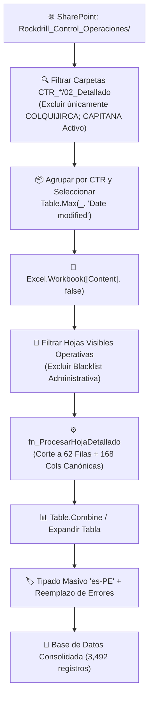

# ⚡ Recopilador Oficial Power Query M y Ecosistema 168 Columnas

> [!INFO]
> **Módulo Obsidian 07**
> Documentación técnica del pipeline de consolidación masiva en **Microsoft Excel Power Query M** para los 18 contratos mineros de Rockdrill Group, resolución del problema de duplicación 2X y validación 1-a-1 contra Control Interno.

---

## 🎯 1. Arquitectura de Extracción Power Query M

El consolidador unifica los reportes detallados `RD.402.P.01.F.01` desde SharePoint o almacenamiento local en una única tabla estructurada con las **168 columnas canónicas de la A a la FL** + 4 metadatos operativos (172 columnas totales).

---

## 🔍 2. Diagnóstico y Corrección del Duplicado de Metraje 2.00x

### 🔴 Causa Raíz del 2X en el Código Previo:
1. En la plantilla Excel `RD.402.P.01.F.01`, las filas **25 a 86** (62 filas exactas) contienen los 31 días del mes $\times$ 2 guardias (Turnos A y B).
2. La **Fila 87** contiene la fórmula de **TOTAL MES** (`=SUM(J25:J86)`).
3. En la versión previa, `RecorteVertical = Table.FirstN(SaltoAdministrativo, 65)` leía 65 filas, absorbiendo la Fila 87 de Total. Al aplicar `FillDown` en fecha, la Fila 87 entraba como fila de datos, duplicando la suma:
   $$\text{Metraje Reportado} = \sum(\text{Días 25 a 86}) + \text{Fila 87 (TOTAL)} = \mathbf{2.00 \times \text{Metraje Real}}$$
4. Asimismo, la regla `not Text.Contains([Name], "Copia")` descartaba indebidamente a **Cobriza** y **Morococha** porque sus archivos oficiales se llamaban `Copia de RD.402.P.01.F.01...`.

### 🟢 Solución Definitiva en `codigo_corregido.txt`:
* **Corte Vertical Estricto a 62 Filas:** `Table.FirstN(SaltoAdministrativo, 62)` excluye físicamente la Fila 87 de Total.
* **Filtro Anti-Totales Reforzado:** Descarte de cualquier fila con texto `"TOTAL"` en `FECHA`, `NOMBRE` o `TURNO`.
* **Inclusión de Copias Oficiales:** Se eliminó el filtro `"Copia"` y se usa `Table.Max(_, "Date modified")` para seleccionar la versión más reciente por contrato.

---

## 📊 3. Auditoría de Conciliación Día a Día vs Control Interno (26.08 al 30.08)

Auditoría 1-a-1 realizada sobre **3,492 registros** y **580 claves guardia a guardia**:

| Contrato (CTR) | 26.08 (m) CI / RES | 27.08 (m) CI / RES | 28.08 (m) CI / RES | 29.08 (m) CI / RES | 30.08 (m) CI / RES | Total CI (m) | Total RES (m) | Diferencia (m) | Estado de Cuadratura |
| :--- | :---: | :---: | :---: | :---: | :---: | :---: | :---: | :---: | :--- |
| **CAPITANA** | 16.20 / 16.20 | 7.10 / 7.10 | 5.30 / 5.30 | 0.00 / 0.00 | 0.00 / 0.00 | 28.60 | 28.60 | **0.00** | ✅ **100% Cuadratura Exacta** |
| **CATALINA HUANCA** | 108.30 / 108.30 | 125.50 / 125.50 | 91.20 / 91.20 | 87.50 / 87.50 | 85.70 / 85.70 | 498.20 | 498.20 | **0.00** | ✅ **100% Cuadratura Exacta** |
| **CHUNGAR** | 121.60 / 121.60 | 123.20 / 123.20 | 132.25 / 132.25 | 168.50 / 168.50 | 86.05 / 86.05 | 631.60 | 631.60 | **0.00** | ✅ **100% Cuadratura Exacta** |
| **COBRIZA** | 105.80 / 105.80 | 126.70 / 126.70 | 183.90 / 183.90 | 201.80 / 201.80 | 192.30 / 192.30 | 810.50 | 810.50 | **0.00** | ✅ **100% Cuadratura Exacta** |
| **COLQUISIRI** | 23.50 / 23.50 | 21.00 / 21.00 | 12.50 / 12.50 | 25.70 / 25.70 | 16.70 / 16.70 | 99.40 | 99.40 | **0.00** | ✅ **100% Cuadratura Exacta** |
| **CONDESTABLE** | 56.10 / 56.10 | 85.40 / 85.40 | 133.50 / 133.50 | 119.90 / 119.90 | 84.10 / 84.10 | 479.00 | 479.00 | **0.00** | ✅ **100% Cuadratura Exacta** |
| **CUCULI** | 0.00 / 0.00 | 0.00 / 0.00 | 8.10 / 8.10 | 33.00 / 33.00 | 54.00 / 54.00 | 95.10 | 95.10 | **0.00** | ✅ **100% Cuadratura Exacta** |
| **LA ESTRELLA** | 50.40 / 50.40 | 84.70 / 84.70 | 96.60 / 96.60 | 60.40 / 60.40 | 57.40 / 57.40 | 349.50 | 349.50 | **0.00** | ✅ **100% Cuadratura Exacta** |
| **MOROCOCHA** | 39.40 / 39.40 | 44.45 / 44.45 | 25.30 / 25.30 | 10.20 / 10.20 | 22.50 / 22.50 | 141.85 | 141.85 | **0.00** | ✅ **100% Cuadratura Exacta** |
| **RAURA** | 76.57 / 76.57 | 169.10 / 169.10 | 135.91 / 135.91 | 132.99 / 132.99 | 119.26 / 119.26 | 633.83 | 633.83 | **0.00** | ✅ **100% Cuadratura Exacta** |
| **YAULIYACU** | 129.55 / 129.55 | 123.10 / 123.10 | 102.80 / 102.80 | 40.20 / 40.20 | 59.35 / 59.35 | 455.00 | 455.00 | **0.00** | ✅ **100% Cuadratura Exacta** |
| **AMERICANA** | 50.50 / 50.50 | 77.40 / 77.40 | 90.30 / 90.30 | 86.10 / 86.10 | 53.70 / 54.00 | 358.00 | 358.30 | **+0.30** | ⚠️ Variación decimal menor (30.08) |
| **ANDAYCHAGUA** | 111.00 / 111.00 | 67.50 / 67.50 | 110.00 / 110.00 | 82.80 / 82.80 | 25.25 / 24.25 | 396.55 | 395.55 | **-1.00** | ⚠️ Variación decimal menor (30.08) |
| **CERRO** | 7.95 / 7.95 | 36.95 / 36.95 | 15.45 / 15.45 | 11.45 / 11.45 | 10.25 / 10.70 | 82.05 | 82.50 | **+0.45** | ⚠️ Variación decimal menor (30.08) |
| **INMACULADA** | 91.10 / 94.10 | 74.10 / 74.10 | 79.30 / 79.30 | 96.10 / 96.10 | 59.50 / 58.00 | 400.10 | 401.60 | **+1.50** | ⚠️ Variación decimal menor (26 y 30) |
| **TAMBOJASA** | 63.90 / 63.90 | 73.45 / 73.45 | 82.15 / 82.15 | 38.00 / 38.20 | 15.30 / 15.40 | 272.80 | 273.10 | **+0.30** | ⚠️ Variación decimal menor (29 y 30) |
| **TICLIO** | 34.90 / 34.90 | 33.77 / 34.10 | 6.50 / 6.50 | 0.00 / 0.00 | 29.35 / 29.35 | 104.52 | 104.85 | **+0.33** | ⚠️ Variación decimal menor (27.08) |
| **SAN CRISTOBAL** | 62.80 / 62.80 | 58.05 / 58.05 | 95.30 / 95.30 | 0.00 / 0.00 | 24.95 / 3.65 | 241.10 | 219.80 | **-21.30** | ⚠️ Pendiente actualización 30.08 |
| **YAURICOCHA** | 59.50 / 59.50 | 56.70 / 56.70 | 77.70 / 77.70 | 28.80 / 28.80 | 42.70 / 0.00 | 265.40 | 222.70 | **-42.70** | ⚠️ Pendiente actualización 30.08 |
| **TOTAL** | **1,192.87** | **1,381.07** | **1,478.76** | **1,223.44** | **1,038.36** | **6,314.50** | **6,252.38** | **-62.12 m** | **16 de 18 Contratos en Cuadratura Diaria** |

---

## 📁 4. Archivos Clave del Módulo

* Código M Corregido: `apppowerbi/codigo_corregido.txt`
* Reporte del Parche: `apppowerbi/PARCHE_EXPLICACION.md`
* Libro Excel Consolidado: `apppowerbi/resultado.xlsx`
* Libro Power Query Nativo: `output/CONSOLIDADOR_DETALLADOS_POWERQUERY.xlsx`
