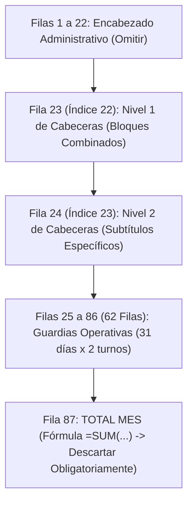

# ⚙️ Motor de Encabezados Dual-Row y Casos Borde ETL

> [!INFO]
> **Módulo Obsidian 08**
> Especificación técnica del motor de extracción de encabezados de doble fila con celdas combinadas horizontales, propagación vertical (`FillDown`/`FillUp`), asignación determinista de turnos y homologación de máquinas SAP.

---

## 🏗️ 1. Anatomía Vertical de la Plantilla (`RD.402.P.01.F.01`)



---

## 🏷️ 2. Algoritmo Dual-Row de Encabezados con Forward-Fill Horizontal

Para descombinar horizontalmente los bloques de cabecera en Python:

```python
def build_dual_row_headers(rows, skip=22):
    # Fila 23 (Nivel 1) y Fila 24 (Nivel 2)
    primary = rows[skip]
    sub = rows[skip + 1]
    
    # 1. Forward-fill horizontal sobre Fila 23
    filled_primary = []
    for val in primary:
        s = str(val).strip() if val is not None else ""
        if s != "":
            filled_primary.append(s)
        else:
            filled_primary.append(filled_primary[-1] if filled_primary else "XP")
            
    # 2. Concatenación Nivel 1 + Nivel 2
    headers = []
    for i in range(len(filled_primary)):
        t1 = filled_primary[i]
        t2 = str(sub[i]).strip() if i < len(sub) and sub[i] is not None else ""
        if t1 == "XP":
            headers.append(t2 if t2 else f"XP_{i}")
        elif t2 == "":
            headers.append(t1)
        else:
            headers.append(f"{t1}_{t2}")
            
    # 3. Desambiguación de duplicados (AYUDANTE_1, MARCA_1)
    seen, unique = {}, []
    for h in headers:
        if h in seen:
            seen[h] += 1
            unique.append(f"{h}_{seen[h]}")
        else:
            seen[h] = 0
            unique.append(h)
    return unique
```

---

## 🛡️ 3. Reglas Críticas de Tratamiento de Datos

### 1. Aislamiento Estricto de `FillDown` de Fecha:
* La propagación vertical de `FECHA` (Columna A) debe ejecutarse **exclusivamente dentro del alcance de cada hoja**.
* Aplicar `ffill` globalmente provocaría contaminación de fechas entre máquinas consecutivas.

### 2. Propagación Bidireccional de Sondaje:
* El código del sondaje (Columna B) se completa con `FillDown` y posterior `FillUp` (`bfill`) para cubrir guardias donde el nombre del pozo se registró en una fila intermedia.

### 3. Asignación Determinista de Turnos (A = Día / B = Noche):
* **Días de 2 filas:** Fila 1 = Turno A, Fila 2 = Turno B.
* **Días de $\ge 3$ filas (multi-sondaje):** Detección de cambio de `GRUPO`, cambio de `PERFORISTA` o reparto secuencial.

### 4. Clave Primaria Inviolable:
$$\text{ID\_CLAVE\_UNICA} = \text{YYYYMMDD} - \text{MAQUINA\_HOMOLOGADA} - \text{TURNO\_ESTANDAR}$$

---

## 🚜 4. Homologación de Nombres de Máquina (Excepciones SAP)

Cargadas dinámicamente desde `Maestros_Maquinas.xlsx` (Hoja `Exepciones`):

| Contrato (CTR) | Nombre Local en Hoja | Código Oficial Control Interno (SAP) |
| :--- | :--- | :--- |
| **CHUNGAR** | `XRD90U-03` / `XRD90U-003` | `XRD90U-021` |
| **ANDAYCHAGUA** | `LF90DST-002` | `LF90D ST-002` |
| **ANDAYCHAGUA** | `XRD90U-017` | `XRD150U-001` |
| **CATALINA HUANCA** | `XRD50-003` | `XRD50U-003` |
| **COBRIZA** | `XRD90U-008` | `XRD150U-008` |
| **INMACULADA** | `XRD150-004` | `XRD150USS-004` |
| **MOROCOCHA** | `XRD90USS-002` | `XRD90USS-005` |
| **TICLIO** | `XRD150USS-001` | `XRD150U-007` |
| **YAULIYACU** | `XRD50USS-001` / `XRD50USS-00T` | `XDR50USS-00T` |
