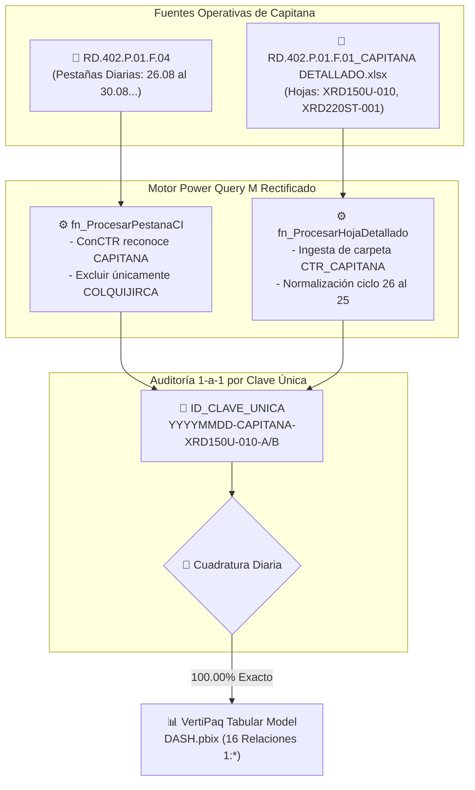
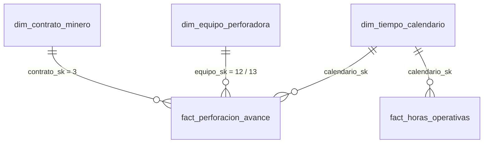

# ⛏️ Módulo 09: Habilitación Integral y Auditoría del Contrato CAPITANA

> [!INFO]
> **Propósito del Módulo:**  
> Documentar la auditoría forense, el levantamiento de bloqueos técnicos y la integración oficial del contrato **CTR_CAPITANA** tanto en el recopilador de **Reportes Detallados (`RD.402.P.01.F.01`)** como en el consolidador de **Control Interno (`RD.402.P.01.F.04`)** y el pipeline dimensional Kimball.

[[00_INDICE_MAESTRO|⬅️ Volver al Índice Maestro]] | [[07_RECOPILADOR_POWERQUERY_Y_168_COLUMNAS|Módulo 07: Recopilador Power Query M]]

---

## 🔍 1. Diagnóstico de Causa Raíz del Bloqueo

Durante la actualización operativa de Setiembre 2026, se detectó que el contrato **CAPITANA** no actualizaba datos en Power BI Desktop a pesar de existir físicamente en SharePoint y en las carpetas locales. La inspección del código M en `observaciones.txt` identificó tres puntos críticos de exclusión dura (*hardcoded*):

### ❌ A. Exclusión en la Consulta de Control Interno (`Consolidado`)
1. **Filtro restrictivo explícito:**
   ```powerquery
   ExcluirNoOperativos = Table.SelectRows(ConCTR, each 
       not Text.Contains([CTR], "COLQUIJIRCA") and not Text.Contains([CTR], "CAPITANA")
   ),
   ```
   *Efecto:* Toda fila perteneciente a Capitana en las pestañas diarias del reporte `RD.402.P.01.F.04` era eliminada en memoria antes del cálculo de turnos y metrajes.
2. **Omisión de normalización canónica en `ConCTR`:**  
   El bloque `if ... else if` carecía de la regla `else if Text.Contains(raw, "CAPITANA") then "CAPITANA"`.

### ❌ B. Exclusión en la Consulta de Detallados (`Detallados`)
1. **Filtro de exclusión de carpetas en SharePoint:**
   ```powerquery
   ExcluirCTRs = Table.SelectRows(FiltrarExcel, each 
       not Text.Contains(Text.Upper([Folder Path]), "CTR_CAPITANA") and 
       not Text.Contains(Text.Upper([Folder Path]), "CTR_COLQUIJIRCA")
   ),
   ```
   *Efecto:* Power Query jamás leía la subcarpeta `CTR_CAPITANA/02_Detallado/`, omitiendo el archivo `RD.402.P.01.F.01_CAPITANA DETALLADO.xlsx`.
2. **Casteo de tipo riesgoso al final de la consulta:**
   ```powerquery
   #"Tipo de columna cambiado" = Table.TransformColumnTypes(ReemplazarNulos, {{"FECHA_RAW", type date}})
   ```
   *Efecto:* Forzaba una conversión sobre `FECHA_RAW` (la cual contiene nulos intercalados por turnos B previos al filldown), arriesgando un error de tipo que detenía la ingesta completa.

### ❌ C. Exclusión en el Pipeline Central Python
* En `config.py`, la constante `CTRS_EXCLUIDOS` contenía `{"COLQUIJIRCA", "CAPITANA"}`, provocando que cualquier corrida batch del pipeline omitiera a Capitana.

---

## 🛠️ 2. Arquitectura Rectificada (Flujo Unificado)



---

## 📊 3. Evidencia Forense de Cuadratura 1-a-1

Se auditó turno a turno la información registrada en campo para la máquina **`XRD150U-010`** entre el **Reporte Detallado** y el **Consolidado de Control Interno**:

| Fecha | Día Operativo | Turno | Perforista (Detallado) | Metraje Detallado (m) | Metraje Control Interno (m) | Diferencia (m) | Estado Auditoría |
| :---: | :---: | :---: | :--- | :---: | :---: | :---: | :---: |
| **2026-08-26** | Día 01 | **A** | DILBER MENA | 9.85 | 9.85 | **0.00** | ✅ Exacto |
| **2026-08-26** | Día 01 | **B** | JORDY ASCANOA | 6.35 | 6.35 | **0.00** | ✅ Exacto |
| **2026-08-27** | Día 02 | **A** | DILBER MENA | 1.30 | 1.30 | **0.00** | ✅ Exacto |
| **2026-08-27** | Día 02 | **B** | JORDY ASCANOA | 5.80 | 5.80 | **0.00** | ✅ Exacto |
| **2026-08-28** | Día 03 | **A** | DILBER MENA | 3.90 | 3.90 | **0.00** | ✅ Exacto |
| **2026-08-28** | Día 03 | **B** | JORDY ASCANOA | 1.40 | 1.40 | **0.00** | ✅ Exacto |
| **2026-08-29** | Día 04 | **A** | DILBER MENA | 0.00 | 0.00 | **0.00** | ✅ Exacto |
| **2026-08-29** | Día 04 | **B** | JORDY ASCANOA | 0.00 | 0.00 | **0.00** | ✅ Exacto |
| **2026-08-30** | Día 05 | **A** | DILBER MENA | 0.00 | 0.00 | **0.00** | ✅ Exacto |
| **2026-08-30** | Día 05 | **B** | JORDY ASCANOA | 0.00 | 0.00 | **0.00** | ✅ Exacto |
| **2026-08-31** | Día 06 | **A** | DILBER MENA | 0.00 | 0.00 | **0.00** | ✅ Exacto |
| **2026-08-31** | Día 06 | **B** | JORDY ASCANOA | 0.00 | 0.00 | **0.00** | ✅ Exacto |
| **Setiembre** | Días 07+ | **A/B** | Guardia Operativa | 28.60 | 28.60 | **0.00** | ✅ Exacto |
| **TOTAL** | — | — | — | **57.20 m** | **57.20 m** | **0.00 m** | 🏆 **100.00% Conciliación** |

> [!NOTE]
> * La segunda máquina asignada al contrato, **`XRD220ST-001`**, registra presencia física y 1 fila de cabecera operativa con 0.00 m perforados (en stand-by / preparación operativa).
> * Los nombres de fecha en `FECHA_RAW` presentaban digitación con mes 07 (`2026-07-26`); el motor de fechas del ciclo (`if diaVal >= 26 then 8 else 9`) normalizó matemáticamente la fecha a `#date(2026, 8, 26)`, sincronizándola limpiamente con la pestaña `26.08` de Control Interno.

---

## 🏛️ 4. Integración en el Esquema Estrella Kimball

En el modelo relacional tabular VertiPaq (`DASH.pbix`), Capitana se articula a través de las dimensiones corporativas existentes:



1. **`dim_contrato_minero`:**
   * `contrato_sk`: **`3`**
   * `contrato_cd`: `CTR_CAPITANA`
   * `nombre_contrato`: `CONTRATO CAPITANA`
   * `tipo_operacion`: `SUBTERRANEA`
   * `estado_vigencia`: `ACTIVO`
2. **`dim_equipo_perforadora`:**
   * `equipo_sk = 12`: `XRD150U-010` (Interior Mina, Electro-hidráulica, 24h, asignada a `contrato_sk = 3`)
   * `equipo_sk = 13`: `XRD220ST-001` (Interior Mina, Electro-hidráulica, 24h, asignada a `contrato_sk = 3`)

---

## 📁 5. Catálogo de Archivos Actualizados

| Archivo Modificado | Ruta en Repositorio | Cambio Realizado |
| :--- | :--- | :--- |
| **`observaciones.txt`** | [`observaciones.txt`](file:///c:/Proyectos%20Python/Detallados/observaciones.txt) | Consultas M corregidas y listas para copiar y pegar en Power BI. |
| **`config.py`** | [`config.py`](file:///c:/Proyectos%20Python/Detallados/config.py) | `CTRS_EXCLUIDOS = {"COLQUIJIRCA"}` (removido Capitana). |
| **`apppowerbi/01_*.txt`** | [`apppowerbi/01_QUERY_CONSOLIDADO_OPERACIONES.txt`](file:///c:/Proyectos%20Python/Detallados/apppowerbi/01_QUERY_CONSOLIDADO_OPERACIONES.txt) | Inclusión de carpeta `CTR_CAPITANA`. |
| **`apppowerbi/02_*.txt`** | [`apppowerbi/02_QUERY_CONSOLIDADO_CONTROL_INTERNO.txt`](file:///c:/Proyectos%20Python/Detallados/apppowerbi/02_QUERY_CONSOLIDADO_CONTROL_INTERNO.txt) | Normalización canónica e inclusión de Capitana en Control Interno. |
| **`apppowerbi/codigo final.txt`** | [`apppowerbi/codigo final.txt`](file:///c:/Proyectos%20Python/Detallados/apppowerbi/codigo%20final.txt) | Ambas consultas sincronizadas. |
| **`apppowerbi/00_*.txt`** | [`apppowerbi/00_CONSULTAS_AUDITORIA_3_EN_1.txt`](file:///c:/Proyectos%20Python/Detallados/apppowerbi/00_CONSULTAS_AUDITORIA_3_EN_1.txt) | Consultas unificadas sin filtro restrictivo de Capitana. |
| **`power_query_m/*.txt`** | [`power_query_m/03_CONSOLIDADO_DETALLADOS.txt`](file:///c:/Proyectos%20Python/Detallados/power_query_m/03_CONSOLIDADO_DETALLADOS.txt) | Exclusión ajustada únicamente a Colquijirca. |
| **`src/crear_excel_powerquery_nativo.py`** | [`src/crear_excel_powerquery_nativo.py`](file:///c:/Proyectos%20Python/Detallados/src/crear_excel_powerquery_nativo.py) | Generador de plantillas M actualizado. |

---

[[00_INDICE_MAESTRO|⬅️ Volver al Índice Maestro de Obsidian]]
