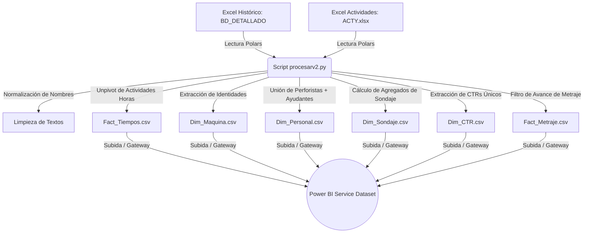

# Documentación y Análisis Estructural: Reporte Power BI - RESIDENTES_PRUEBAS

Este documento detalla la estructura, flujo de datos, modelo lógico y componentes visuales del reporte de Power BI **`RESIDENTES_PRUEBAS.pbix`**, localizado en `C:\Mis Archivos Locales\MCP BI`. El análisis se realiza con miras a una futura reconstrucción y estandarización del dashboard bajo mejores prácticas de ingeniería y análisis de datos (siguiendo lineamientos del **Google Data Analytics Certificate**).

---

## 1. Resumen de Arquitectura y Conexión de Datos

### 🔗 Estado de Conexión: Live Connection (Conexión Directa)
El archivo `.pbix` local analizado no contiene datos importados ni un modelo de datos físico editable a nivel local. Está configurado bajo una **Conexión Directa (Live Connection)** a un conjunto de datos remoto en la nube (Power BI Service):

*   **Dataset ID (Nube):** `6a011419-bacf-4a88-a6c1-8ef2b8cf3cdc`
*   **Report ID (Nube):** `e2134548-aae5-4ee2-83a0-649d83ae0405`

> [!IMPORTANT]
> **Implicación Técnica para el Rediseño:**
> Dado que es una Live Connection, todas las consultas en Power Query, relaciones lógicas de datos y fórmulas DAX de modelo residen en Power BI Service y no en el archivo local. El archivo `.pbix` local funciona estrictamente como una **capa visual de presentación** que referencia los campos y medidas del dataset remoto. Al reconstruir el modelo desde cero, se deberá crear un nuevo archivo de tipo **Import** o un **DirectQuery sobre modelo semántico** para poder redefinir y estandarizar las tablas físicas y medidas.

---

## 2. Flujo de Datos y ETL (Script de Python: `procesarv2.py`)

La actualización de los datos del reporte involucra un script de Python de automatización local llamado `procesarv2.py`. Este script implementa un ETL relacional utilizando la biblioteca **Polars** (una alternativa de alto rendimiento a Pandas).

### 🔄 Diagrama del Proceso de Datos Actual



### 🛠️ Detalles Técnicos del Script ETL
1.  **Fuentes de Entrada:**
    *   `HISTORICO-PERDLAP140.xlsx` (Hoja: `BD_DETALLADO`): Registro histórico diario de la operación.
    *   `ACTY.xlsx`: Catálogo maestro de actividades y demoras.
2.  **Transformaciones Clave:**
    *   **Normalización de Texto:** Los nombres de los perforistas y ayudantes se estandarizan (mayúsculas, remoción de acentos, eliminación de caracteres especiales como puntos y comas, y remoción de espacios múltiples).
    *   **Generación de Claves Primarias:** Se crea `KEY_OPERACION` concatenando `FECHA` (YYYYMMDD), `MAQUINA` y `TURNO` para vincular los tiempos con los metrajes.
    *   **Unpivot de Actividades (Normalización de Tiempos):** Convierte la estructura de "tabla ancha" del Excel original (donde cada actividad es una columna de horas) a una "tabla larga" (`Fact_Tiempos.csv`) donde cada fila representa una única actividad y sus horas registradas. Esto se cruza mediante `JOIN_KEY` con `ACTY.xlsx` para clasificar si es una demora global (DG), traslado, etc.
3.  **Archivos de Salida (Esquema Estrella):**
    *   `Fact_Tiempos.csv`: Horas transcurridas clasificadas por actividad.
    *   `Fact_Metraje.csv`: Registros de avance físico de perforación.
    *   `Dim_Maquina.csv`: Catálogo único de equipos.
    *   `Dim_Personal.csv`: Consolida perforistas principales y ayudantes en una sola lista para evitar inconsistencias en reportes.
    *   `Dim_Sondaje.csv`: Datos acumulativos del sondaje (fecha inicio, fecha fin, avance acumulado y profundidad programada).
    *   `Dim_CTR.csv`: Centros de costos de los proyectos.

> [!WARNING]
> **Fuentes de Datos No Cubiertas por el Script:**
> Existen tablas usadas en el visual (como `Consumo Consolidado`, `Dim_Broca`, `Reporte_Brocas` y `Dim_Familias`) que no se procesan en `procesarv2.py`. Esto significa que el reporte se alimenta de un origen híbrido. Para la reconstrucción, estas tablas extras de consumo de brocas deben integrarse en el script de Python o modelarse explícitamente en el nuevo Power BI.

---

## 3. Protocolo de Estandarización de Datos (Buenas Prácticas Google Data Analytics)

Actualmente, el modelo lógico presenta inconsistencias en la nomenclatura de tablas, columnas y medidas (mezcla de idiomas, tildes, caracteres especiales, y estilos de escritura como `CamelCase` y `UPPER_SNAKE_CASE`). 

Se propone aplicar las siguientes reglas de estandarización en la fase de rediseño:

### 🏷️ 1. Nombres de Tablas
*   **Regla:** Mantener prefijos claros (`Dim_` para dimensiones, `Fact_` para tablas de hechos) y nombres en singular en español, usando `PascalCase`.
*   **Ejemplos de Corrección:**
    *   *Actual:* `Consumo Consolidado` ➡️ *Recomendado:* `Fact_Consumo_Consolidado` (es una tabla de hechos de consumos).
    *   *Actual:* `Reporte_Brocas` ➡️ *Recomendado:* `Dim_Broca_Detalle` o `Fact_Rendimiento_Broca`.

### 🗂️ 2. Nombres de Columnas
*   **Regla:** Estandarizar a `snake_case` o `CamelCase` a nivel de base de datos, eliminando completamente caracteres especiales, tildes, símbolos y espacios. Las etiquetas legibles (ej: "Año Operativo") se configuran únicamente en la interfaz visual de Power BI, no en el nombre del campo técnico.
*   **Ejemplos de Corrección:**
    *   `Dim_Calendario[Año Operativo]` ➡️ `Dim_Calendario[año_operativo]`
    *   `Dim_Calendario[Periodo Sort]` ➡️ `Dim_Calendario[periodo_sort]`
    *   `Consumo Consolidado[ALTURA_BROCA]` ➡️ `Fact_Consumo[altura_broca]`
    *   `Consumo Consolidado[Descripcion]` (Sin tilde) ➡️ `Fact_Consumo[descripcion_articulo]`

### 📊 3. Nombres de Medidas DAX
*   **Regla:** Las medidas deben ser legibles, autoexplicativas, evitar abreviaturas oscuras y no incluir unidades de medida ni símbolos en el nombre técnico (se configuran en el formato de visualización).
*   **Ejemplos de Corrección:**
    *   `Medidas[CXM ADIT]` ➡️ `Costo_Metro_Aditivos`
    *   `Medidas[CXM PDD]` ➡️ `Costo_Metro_Perforacion`
    *   `Medidas[Costo Consumo  ($)]` (Tiene doble espacio y $) ➡️ `Costo_Consumo_Total`
    *   `Medidas[Costo Abastecimiento x Metro ($/m)]` ➡️ `Costo_Abastecimiento_Por_Metro`
    *   `Presupuesto[Presupuesto Proyectado 15 días V2]` ➡️ `Presupuesto_Proyectado_Quincenal`

---

## 4. Desglose Estructural Hoja por Hoja del Dashboard

A continuación se detalla cómo está estructurada cada página en la versión actual del Power BI:

### Página 1: Principal
*   **Propósito:** Dashboard general de control que resume los costos de abastecimiento y consumo por metro, el avance físico versus la meta mensual y el cronograma de sondajes en ejecución.
*   **Filtros (Slicers):**
    *   Centro de Costos: `Dim_CTR[CTR]`
    *   Tiempo: `Dim_Calendario[Año Operativo]`, `Dim_Calendario[Periodo Sort]`
    *   Equipos: `Dim_Maquina[MAQUINA]`
*   **Tarjetas e Indicadores (KPIs/Cards):**
    *   *KPI Costo Abastecimiento:* Muestra `Medidas[Costo Abastecimiento x Metro ($/m)]` vs `Medidas[Meta Costo CTR]` sobre el eje `Dim_Calendario[Mes Operativo]`.
    *   *KPI Costo Consumo:* Muestra `Medidas[Costo Consumo x Metro ($/m)]` vs `Medidas[Meta Costo CTR]` sobre `Dim_Calendario[Mes Operativo]`.
    *   *KPI Metraje:* Muestra `Medidas[Total Metros]` vs `Medidas[Meta al Día]` sobre `Dim_Calendario[Periodo Sort]`.
    *   *Card Restante:* `Medidas[Dias Operativos Restantes]`.
    *   *Card Costo:* `Medidas[Costo Consumo x Metro ($/m)]`.
*   **Visuales Principales:**
    *   *Gantt de Sondaje (Gantt Custom Visual):* Eje de máquinas (`Dim_Maquina[MAQUINA]`), barras temporales por sondaje (`Dim_Sondaje[SONDAJE]`, `Dim_Sondaje[Etiqueta_Gantt]`, `Dim_Sondaje[FECHA_INICIO_REAL]`, `MAX(Dim_Sondaje[FECHA_FIN_REAL])`), con porcentaje de avance de perforación (`Medidas[% Avance Gantt]`).
    *   *Gráfico de Área (Ejecutado vs Meta):* Muestra `Medidas[Ejecutado Acumulado]` y `Medidas[Meta Acumulada]` a lo largo del tiempo.
    *   *Tabla Matriz de Desempeño:* Detalle por máquina (`Dim_Maquina[MAQUINA]`) evaluando `Total Metros`, `ROP (m/hr)`, `Promedio Horas Por Dia`, `Proyección base` y `Desviación Proyectado %`.

---

### Página 2: Presupuesto
*   **Propósito:** Análisis financiero detallado para contrastar los costos operativos del mes actual contra el presupuesto asignado, evaluando el porcentaje de cumplimiento histórico por Centro de Costos (CTR).
*   **Filtros (Slicers):**
    *   Tiempo: `Dim_Calendario[Año Operativo]`, `Dim_Calendario[Mes Operativo]`
    *   Zona Geográfica: `Dim_CTR[ZONA]`
    *   Centro de Costos: `Dim_CTR[CTR]`
*   **Tarjetas e Indicadores (Cards):**
    *   Nombre del CTR seleccionado: `MAX(Dim_CTR[CTR])`
    *   Costo de Abastecimiento Presupuestado: `Presupuesto[PRESUPUESTO FINAL]`
    *   Presupuesto base: `Presupuesto[Presupuesto]`
    *   Meta Acumulada del Periodo: `Medidas[Meta Acumulada Periodo]`
    *   Presupuesto Ajustado Semanal: `Presupuesto[Presupuesto Semanal PDD Ajustado]`
    *   Meta de Costo por Metro: `Presupuesto[metaCosto por Metro CTR]`
*   **Visuales Principales:**
    *   *Tabla Detallada de Presupuesto:* Filas por `Dim_CTR[CTR]`. Muestra la meta acumulada del periodo, cumplimiento del periodo actual (`Cumplimiento % Operativo`), cumplimiento de periodos pasados (`Cumplimiento % Hace 1 Periodo`, `Cumplimiento % Hace 2 Periodos`), el presupuesto total y el presupuesto proyectado a 15 días (`Presupuesto Proyectado 15 días V2`).
    *   *Matriz de Costo por Familia de Repuesto:* Desglose de familias de insumos (`Dim_Familias[FAMILIA]`) cruzando `Medidas[Costo Abastecimiento MTD Operativo ($)]`, `Presupuesto[Presupuesto]` y `Presupuesto[PRESUPUESTO FINAL]`.

---

### Página 3: Criticidad
*   **Propósito:** Identificación de desviaciones operativas y cuellos de botella por máquina y coordinador, evaluando la distribución de horas según la actividad y el avance de metraje semanal.
*   **Filtros (Slicers):**
    *   Tiempo: `Dim_Calendario[Periodo Sort]`
    *   Centro de Costos: `Dim_CTR[CTR]`
    *   Líder / Coordinador: `Dim_CTR[COORDINADOR]`
*   **Visuales Principales:**
    *   *Matriz de Desviación por Equipo:* Muestra por máquina (`Dim_Maquina[MAQUINA]`) y CTR (`Dim_CTR[CTR]`) el avance de metraje (`Total Metros`), la desviación proyectada (`Desviación Proyectado %`), las metas y las horas promedio operadas por día.
    *   *Tabla de Distribución de Horas:* Muestra las horas consumidas (`Total Horas`) por cada actividad detallada de la tabla `Fact_Tiempos[Actividad]`.
    *   *Gráfico de Líneas Temporal:* Evolución semanal del metraje (`Total Metros`) sobre el eje `Dim_Calendario[Semana Operativa]`.

---

### Página 4: Disponibilidad Global
*   **Propósito:** Análisis exhaustivo de los tiempos inoperativos o de demoras globales (DG) que impactan directamente el rendimiento y provocan "metros no perforados".
*   **Filtros (Slicers):**
    *   Centro de Costos: `Dim_CTR[CTR]`
    *   Filtros Temporales: `Dim_Calendario[Año Operativo]`, `Dim_Calendario[Periodo Sort]`, `Dim_Calendario[Date]`
    *   Sondajes: `Fact_Metraje[SONDAJE]`
    *   Equipos: `Dim_Maquina[MAQUINA]`
*   **Tarjetas e Indicadores (Cards / Multi-Row Cards):**
    *   *Resumen Operativo:* Muestra `Total Metros`, `Meta Mensual por maquina` y `Costo Consumo x Metro ($/m)`.
    *   *Pérdidas por Inactividad:* Muestra `Dias Sin Perforar`, `Turnos Sin Perforar`, `Metros NO PERFORADOS` y `Valor no ganado`.
*   **Visuales Principales:**
    *   *Gráfico de Líneas Temporal:* Avance de metraje y comentarios de demoras (`MAX(Fact_Tiempos[COMENTARIOS])`) por semana operativa.
    *   *Matriz de Pérdida por Actividad:* Detalle por máquina de las pérdidas por demora (`Disponibilidad global[Metros DG]`, `Disponibilidad global[VAR Horas_disminuyen_dg]`, `Disponibilidad global[Valor Perdido]`) asociadas a `Fact_Tiempos[Actividad]`.
    *   *Matriz de Categorías de Tiempos:* Horas de duración y metros perdidos por categoría (`Fact_Tiempos[Categoria]`, `Fact_Tiempos[Actividad]`).

---

### Página 5: Sondaje
*   **Propósito:** Seguimiento específico y detallado del ciclo de vida de los proyectos de sondaje, analizando el rendimiento litológico y la correlación con el consumo de brocas.
*   **Filtros (Slicers):**
    *   Centro de Costos: `Dim_CTR[CTR]`
    *   Tiempo: `Dim_Calendario[Año Operativo]`, `Dim_Calendario[Periodo Sort]`
    *   Equipos: `Dim_Maquina[MAQUINA]`
*   **Tarjetas (Cards):**
    *   Total de guardias / fechas operadas: `COUNT(Fact_Metraje[FECHA])`.
    *   Card Combinado: `Total Metros` y `Cantidad Brocas CONSUMO`.
*   **Visuales Principales:**
    *   *Gantt de Proyectos:* Cronograma detallado por sondaje.
    *   *Gráfico de Líneas por Litología:* Metraje perforado (`Total Metros`) en relación con la formación rocosa o terreno (`Reporte_Brocas[DESCRIPCION_LITOLOGICA]`).
    *   *Tabla de Insumos de Perforación:* Lista de brocas usadas (`Dim_Broca[Marca]`, `[Modelo]`, `[Serie]`, `[Linea]`) y los metros acumulados por cada una.
    *   *Matriz de Consumo de Materiales:* Detalla la cantidad y el consumo por sondaje según la descripción del material de la tabla `Consumo Consolidado`.

---

### Página 6: Perforistas
*   **Propósito:** Dashboard de control de recursos humanos y productividad. Mide la eficiencia y costos individuales de la mano de obra operativa (perforistas y ayudantes).
*   **Filtros (Slicers):**
    *   Centro de Costos: `Dim_CTR[CTR]`
    *   Tiempo: `Dim_Calendario[Año Operativo]`, `Dim_Calendario[Periodo Sort]`
    *   Rol/Puesto: `Dim_Personal[PUESTO]`
    *   Equipos: `Dim_Maquina[MAQUINA]`
*   **Tarjetas (KPIs / Cards):**
    *   KPIs de Costos Unitarios:
        *   Costo de Abastecimiento vs Meta.
        *   Costo de Consumo vs Meta.
        *   Costo Aditivos (`CXM ADIT`).
        *   Costo de Perforación Directa (`CXM PDD`).
    *   Guardias Totales Trabajadas: `COUNT(Fact_Metraje[FECHA])`.
*   **Visuales Principales:**
    *   *Gráfico de Barras - Metraje por Perforista:* Muestra `Total Metros` por cada `Dim_Personal[PERFORISTA]`.
    *   *Tabla de Rendimiento Promedio:* Detalla el promedio de metros alcanzados por guardia por cada perforista.
    *   *Gráfico de Columnas Agrupadas - Productividad Horaria:* Relaciona el perforista con su tasa de penetración (`ROP EFECTIVAS (m/hr)`) y horas promedio efectivas operadas.

---

### Página 7: Reprogramación Metraje
*   **Propósito:** Simulación y planificación reactiva de metas semanales de perforación. Calcula el ritmo diario necesario para cubrir desviaciones acumuladas respecto al plan original.
*   **Filtros (Slicers):**
    *   Tiempo: `Dim_Calendario[Periodo Sort]`
    *   Centro de Costos: `Dim_CTR[CTR]`
    *   Equipos: `Dim_Maquina[MAQUINA]`
*   **Tarjetas de Simulación (Card Visual):**
    *   Contiene tres métricas simuladas dinámicas: `Total Metros`, `Meta Mensual` y el `Ritmo Diario Requerido` para cumplir el objetivo a fin de mes.
*   **Visuales Principales:**
    *   *Tabla de Control Operativo:* Matriz detallada por máquina y CTR evaluando metros, horas y desviaciones.
    *   *Gráfico Combinado (Línea y Columnas):* Compara semanalmente los metros ejecutados (`Total Metros`) contra la meta dinámica recalculada (`Meta Dinamica Semanal`) y muestra la desviación porcentual.

---

### Página 8: Consumo - Abastecimiento
*   **Propósito:** Monitoreo y control presupuestario de las compras de abastecimiento y consumos en almacén clasificados por familia de repuestos.
*   **Filtros (Slicers):**
    *   CTR, Año, Periodo.
    *   Familias: `Dim_Familias[ID_FAMILIA]`
    *   Equipos: `Dim_Maquina[MAQUINA]`
*   **KPIs:**
    *   Costo de Abastecimiento por Metro vs Meta.
    *   Costo de Consumo por Metro vs Meta.
*   **Visuales Principales:**
    *   *Gráfico de Líneas de Tendencia:* Compara el costo de abastecimiento por metro vs el costo de consumo por metro mes a mes.
    *   *Gráfico de Columnas - Costos por Familia y Equipo:* Detalla el costo acumulado por artículo e insumo.

---

### Página 9: Consumo por Familia
*   **Propósito:** Análisis de inventario y rotación de insumos de perforación (brocas y aditivos) clasificados estrictamente por marca y tipo de producto.
*   **Filtros (Slicers):**
    *   CTR, Periodo, Máquina.
    *   Insumo: `Consumo Consolidado[Familia]`, `Consumo Consolidado[Descripcion]`
    *   Brocas: `Dim_Broca[LINEA]`, `Dim_Broca[MODELO]`
*   **Visuales Principales:**
    *   *Gráfico de Columnas (Costo por Metro):* Costo de consumo por metro indexado por mes.
    *   *Gráfico de Líneas (Metraje vs Litología):* Muestra el desgaste teórico correlacionando metros totales con el tipo de roca.
    *   *Tabla de Consumos Físicos:* Cantidad física despachada por artículo y mes.

---

### Página 10: Rendimiento Brocas
*   **Propósito:** Dashboard de ingeniería de brocas. Mide la vida útil en metros y la tasa de penetración (ROP) de las brocas para evaluar la calidad de los proveedores por marca y modelo.
*   **Filtros (Slicers):**
    *   CTR, Año, Periodo.
    *   Brocas: `Fact_Metraje[MARCA_BROCA]`, `Consumo Consolidado[LINEA]`
*   **Tarjetas:**
    *   Metros totales perforados: `Total Metros`.
    *   Brocas consumidas: `Cantidad Brocas`.
    *   Guardias evaluadas: `COUNT(Fact_Metraje[FECHA])`.
*   **Visuales Principales:**
    *   *Tabla Maestra de Vida Útil de Brocas:* Cruza altura de broca, descarga, línea, marca y modelo con la velocidad de penetración (`ROP Corregido`) y metros promedio rendidos (`Rendimiento Promedio Corregido`).
    *   *Gráfico de Barras - Rendimiento por Marca y Equipo:* Compara qué marcas operan mejor en qué máquinas.

---

### Página 11: Ejecutado Histórico
*   **Propósito:** Reporte consolidado histórico a largo plazo para evaluar tendencias interanuales y contrastar el desempeño real contra las metas corporativas.
*   **Filtros (Slicers):**
    *   CTR, Periodo, Año, Línea de Broca, Máquina.
*   **Visuales Principales:**
    *   *Gráfico de Columnas Clustered (Metraje vs Meta):* Compara barras mensuales de ejecutado vs la línea de la meta histórica (`SUM(Fact_Metas[META METRAJE])`).
    *   *Gráfico de Columnas por Turno:* Distribución del avance de perforación según el turno de trabajo e incidencias.

---

### Página 12: RESUMEN CONSUMO
*   **Propósito:** Vista ejecutiva final que resume los costos de consumo de inventario totales de la operación y el conteo de equipos activos.
*   **Filtros (Slicers):**
    *   CTR, Periodo, Familia de Material, Máquina.
*   **Visuales Principales:**
    *   *Gráfico de Líneas:* Tendencia del costo de consumo por metro y volumen de metros perforados.
    *   *Pivot Table Ejecutiva:* Detalle de costos por descripción de repuesto y mes.
    *   *Gráfico de Barras - Flota Activa:* Cantidad de máquinas operativas registradas al mes.

---

## 5. Recomendaciones de Mejores Prácticas para el Rediseño

Basado en el **Google Data Analytics Certificate**, un dashboard de alto impacto debe priorizar la **claridad, accesibilidad y eficiencia en el procesamiento de datos**. Al reconstruir este Power BI, se sugiere implementar las siguientes mejoras:

1.  **Reducción de Sobrecarga Cognitiva (Hoja Principal):**
    La hoja `Principal` tiene actualmente 11 elementos visuales muy densos. Se recomienda consolidar los 3 visuales de tipo KPI en un único banner superior, y utilizar técnicas de "Drill-Through" (navegación a detalle) en lugar de saturar una sola página con tablas gigantes y gráficos de Gantt simultáneos.
2.  **Estandarización del Modelo Estrella en Power Query:**
    En lugar de importar tablas sueltas (como `Consumo Consolidado` e `HISTORICO`), se debe centralizar toda la lógica ETL en el script de Python o bien dentro de Power Query en Power BI. El modelo lógico debe verse de la siguiente forma limpia:
    ```mermaid
    erDiagram
        Dim_Calendario ||--o{ Fact_Tiempos : "fecha"
        Dim_Calendario ||--o{ Fact_Metraje : "fecha"
        Dim_Calendario ||--o{ Fact_Consumo_Consolidado : "fecha"
        Dim_Maquina ||--o{ Fact_Tiempos : "maquina"
        Dim_Maquina ||--o{ Fact_Metraje : "maquina"
        Dim_Maquina ||--o{ Fact_Consumo_Consolidado : "maquina"
        Dim_Personal ||--o{ Fact_Tiempos : "perforista_id"
        Dim_Personal ||--o{ Fact_Metraje : "perforista_id"
        Dim_CTR ||--o{ Fact_Metraje : "ctr"
        Dim_CTR ||--o{ Fact_Tiempos : "ctr"
        Dim_Sondaje ||--o{ Fact_Metraje : "sondaje_id"
    ```
3.  **Migración de Medidas Implícitas a DAX Explícito:**
    Actualmente existen visuales que usan agregaciones directas sobre columnas (por ejemplo, `SUM(Fact_Metas[META METRAJE])` o `MAX(Dim_CTR[CTR])`). Es una buena práctica estricta de Power BI crear **medidas explícitas** escritas en DAX para cada cálculo, asegurando un mejor rendimiento de procesamiento y consistencia de datos en todo el informe.
4.  **Optimización del ETL de Python (`procesarv2.py`):**
    *   **Manejo de Rutas:** El script contiene rutas fijas a perfiles locales del usuario (`C:/Users/PERDLAP140.VILBRAGROUP/...`). Se debe parametrizar el script usando variables de entorno o archivos de configuración `.env` para que pueda ejecutarse en cualquier estación de trabajo o en un pipeline de automatización en la nube.
    *   **Integración de Datos:** El script debe ampliarse para procesar también el consolidado de consumos de brocas y aditivos, evitando la carga de archivos Excel paralelos sin normalizar.
