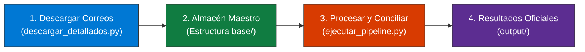

# 🛠️ Rockdrill Group - Pipeline ETL de Detallados y Control Interno

> **Sistema automatizado de descarga, estandarización de 135 columnas, tipado estricto y conciliación de producción operativa de perforación diamantina (18 Contratos Mineros).**

---

## 📖 Manual de Operación Rápida (Para Usuarios y No Programadores)

Este proyecto está diseñado para que **cualquier persona** pueda descargar los reportes diarios desde su correo Outlook corporativo y procesar la información con un solo comando, sin necesidad de saber programar.

---

### 🚀 ¿Cómo usar el sistema en 3 simples pasos?



---

### 1️⃣ Paso 1: Configuración Inicial (Solo la primera vez)

Si es la primera vez que vas a usar el sistema en tu computadora:

1. Abre una terminal de comandos (**PowerShell** o **CMD**) en la carpeta del proyecto.
2. Ejecuta el configurador inicial:
   ```bash
   python descargar_detallados.py --setup
   ```
3. Se abrirá **Microsoft Edge**. Inicia sesión con tu correo corporativo `@rockdrillgroup.com`.
4. Una vez que veas tu bandeja de entrada de Outlook, cierra Edge. ¡Listo! Tu sesión queda guardada de forma segura en tu computadora.

---

### 2️⃣ Paso 2: Descargar los Reportes del Día

Para descargar automáticamente los **18 Reportes Detallados** recibidos en Outlook y colocarlos directamente en sus carpetas oficiales:

```bash
# Opción A: Descargar los reportes recibidos HOY (correspondientes a la perforación de ayer):
python descargar_detallados.py

# Opción B: Descargar los reportes de una fecha específica:
python descargar_detallados.py --fecha 17/08/2026

# Opción C: Modo Prueba (guarda en 'prueba correos/' sin modificar tus carpetas):
python descargar_detallados.py --fecha 17/08/2026 --prueba
```

> [!TIP]
> Cada archivo descargado se ubica automáticamente en `Estructura base/Rockdrill_Control_Operaciones/CTR_{CTR}/02_Detallado/`, reemplazando el reporte anterior de esa máquina para mantener todo actualizado.

---

### 3️⃣ Paso 3: Ejecutar el Procesamiento y Conciliación

Para procesar todos los datos, estandarizar las 135 columnas y generar la conciliación con Control Interno:

```bash
python ejecutar_pipeline.py
```

Al terminar (en ~32 segundos), encontrarás todos los archivos listos en la carpeta [`output/`](file:///C:/proyectos%20python/detallados/output):
- 📊 **`detallados_consolidados.xlsx`**: Consolidado general de los 18 CTRs con 135 columnas limpias y tipadas (3,043 registros).
- 📄 **`detallados_consolidados.csv`**: Exportación en CSV (UTF-8 con BOM) para Power BI o SQL.
- ⚖️ **`matriz_comparativa_metrajes.xlsx`**: Cruce turno a turno contra Control Interno (**99.67% de coincidencia exacta** y **100.00% de cuadratura total en los 18 CTRs = 28,882.37 m**).
- 🛡️ *Manejo seguro de archivos:* Si tienes el Excel abierto, el sistema genera automáticamente una copia `_actualizada.xlsx` sin interrumpir la ejecución.

---

## ⚙️ ¿Cómo cambiar parámetros y rutas? (`config.py`)

Si necesitas cambiar la ruta donde están tus archivos (por ejemplo, si mueves el proyecto a **OneDrive** o a un disco compartido), solo debes abrir el archivo [`config.py`](file:///C:/proyectos%20python/detallados/config.py) en cualquier editor de texto y ajustar las primeras líneas:

```python
# ==============================================================================
# ⚙️ 1. SELECCIÓN DE ENTORNO Y RUTAS
# ==============================================================================

# Opciones: "AUTO" (Recomendado) | "PORTABLE" | "CUSTOM"
MODO_ENTORNO: str = "AUTO"

# Si usas MODO_ENTORNO = "CUSTOM", escribe aquí la ruta de tu OneDrive:
RUTA_CUSTOM: Path = Path(r"C:\Users\tu_usuario\OneDrive - ROCKDRILL GROUP\Rockdrill_Control_Operaciones")
```

---

## 📁 Estructura del Proyecto

```text
C:\Proyectos Python\Detallados\  (o carpeta en OneDrive)
│
├── config.py                      # ⚙️ Configuración central de rutas y parámetros
├── descargar_detallados.py        # 📥 Descargador automático OWA Outlook -> Estructura base
├── ejecutar_pipeline.py           # 🚀 Ejecutor principal del pipeline ETL
├── requirements.txt               # 📦 Lista de librerías necesarias
├── README.md                      # 📖 Manual de usuario (este archivo)
│
├── src/                           # 🧠 Código fuente modular del sistema
│   ├── etl_detallados.py          # Limpieza de 135 columnas y asignación de turnos
│   ├── etl_control_interno.py     # Compilación de Control Interno
│   ├── reconciliacion.py          # Cruce comparativo y cálculo de diferencias
│   ├── utils.py                   # Lectura XML y funciones de normalización
│   └── pipeline.py                # Orquestador del flujo
│
├── Estructura base/               # 📊 Almacén maestro de datos de los 18 CTRs
│   └── Rockdrill_Control_Operaciones/
│       ├── 00_Control_Interno/    # Libro maestro Consolidado de Avance
│       ├── Maestro_Maquinas/      # Catálogo de excepciones SAP de máquinas
│       └── CTR_{NOMBRE}/          # Carpetas de los 18 Contratos Mineros
│           ├── 01_Avance_Diario/  # Reportes diarios F.03/F.07
│           └── 02_Detallado/      # Reportes Detallados F.01 oficiales
│
├── output/                        # 📈 Entregables generados por el pipeline
│   ├── detallados_consolidados.xlsx
│   ├── detallados_consolidados.csv
│   ├── matriz_comparativa_metrajes.xlsx
│   └── auditoria_descargas/       # Reportes de auditoría de descargas diarias
│
├── notebooks/                     # 📓 Cuaderno Jupyter interactivo con explicaciones
│   └── ETL_Limpieza_Detallados_y_Control_Interno.ipynb
│
├── docs/                          # 📚 Base de conocimiento completa en Obsidian (01 a 08)
│   ├── HANDOFF_KNOWLEDGE_BASE_OBSIDIAN.md
│   └── 01_arquitectura_y_pipeline_etl.md ... 08_guia_descargador_portable.md
│
├── tests/                         # 🧪 Pruebas unitarias automatizadas
├── tools/                         # 🛠️ Scripts históricos y herramientas de desarrollo
└── .sesiones/                     # 🔐 Perfiles de inicio de sesión de Edge por usuario
```

---

## 🛠️ Instalación para Desarrolladores

Si instalas el proyecto desde cero en un nuevo entorno:

```bash
# 1. Crear entorno virtual
python -m venv venv

# 2. Activar entorno virtual (Windows)
.\venv\Scripts\activate

# 3. Instalar librerías
pip install -r requirements.txt

# 4. Instalar navegador para Playwright
python -m playwright install chromium
```

---

## 📚 Documentación Técnica Detallada

Para consultar las reglas de negocio avanzadas, el algoritmo de asignación de turnos multi-sondaje, el catálogo de 135 columnas y los diagnósticos de discrepancias:
- Abre la carpeta [`docs/`](file:///C:/proyectos%20python/detallados/docs) en **Obsidian** o lee el archivo [`HANDOFF_KNOWLEDGE_BASE_OBSIDIAN.md`](file:///C:/proyectos%20python/detallados/HANDOFF_KNOWLEDGE_BASE_OBSIDIAN.md).
