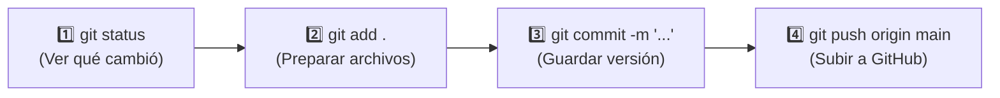

# 🚀 Guía Rápida de Git para este Repositorio
**Proyecto**: Sistema de Consolidación Operativa y Detallados (Rockdrill Group)  
**Repositorio Remoto**: `https://github.com/chihuacoaudaz-png/revision-detallado.git`  
**Rama Principal**: `main`  
**Sistema Operativo**: Windows (PowerShell / Terminal)  

---

## ⚡ 1. El Flujo de Trabajo Diario en 4 Pasos (El Ciclo Estándar)

Cada vez que hagas cambios en tus archivos (`.py`, `.xlsx`, `.md`, `.txt`, etc.) y quieras subirlos a GitHub, sigue estos 4 pasos en tu terminal PowerShell:



---

## 🛠️ 2. Catálogo de Comandos Esenciales (Explicación Breve)

### 1. `git status` (Ver el Estado Actual)
Muestra qué archivos fueron modificados, creados o eliminados.
```powershell
git status
```
> **Tip:**
> - En **rojo**: Archivos modificados que aún no has preparado.
> - En **verde**: Archivos listos para el commit.

---

### 2. `git add` (Preparar Archivos para Guardar)
Indica qué archivos deseas incluir en el próximo guardado.

* **Preparar todos los cambios del proyecto:**
  ```powershell
  git add -A
  ```
  *(o también: `git add .`)*

* **Preparar una carpeta o archivo específico:**
  ```powershell
  git add apppowerbi/
  git add docs/
  git add src/etl_detallados.py
  ```

---

### 3. `git commit -m "Mensaje descriptivo"` (Guardar Versión Local)
Crea una instantánea (*checkpoint*) en tu historial local con un mensaje claro de lo que hiciste.
```powershell
git commit -m "feat: actualizacion de detallados y cuadratura guardia a guardia"
```
```powershell
git commit -m "fix: correccion en codigo M de power query para metrajes"
```
```powershell
git commit -m "docs: actualizacion de manuales y notas en obsidian"
```

---

### 4. `git push origin main` (Subir a GitHub en la Nube)
Envía todos tus commits locales al servidor remoto de GitHub.
```powershell
git push origin main
```
*(Si ya tienes la rama configurada por defecto, simplemente puedes escribir `git push`).*

---

### 5. `git pull origin main` (Descargar Cambios de la Nube)
Si realizaste cambios directamente en la web de GitHub o desde otra máquina, este comando descarga e integra las novedades a tu PC local.
```powershell
git pull origin main
```
> **Buena Práctica:** Es recomendable ejecutar `git pull` al inicio de tu jornada antes de empezar a programar.

---

## 🏎️ 3. Atajo en 1 Sola Línea para PowerShell (Guardar y Subir Rápido)

En Windows PowerShell puedes encadenar los 3 comandos con punto y coma (`;`):

```powershell
git add -A ; git commit -m "actualizacion de avance y reportes" ; git push origin main
```

*(Copia esa línea, cámbiale el texto entre comillas a lo que hiciste, pégala en la terminal y presiona Enter).*

---

## 🔍 4. Comandos Útiles de Consulta y Corrección de Errores

| Qué deseas hacer | Comando a ejecutar en PowerShell |
| :--- | :--- |
| **Ver los últimos 5 commits realizados** | `git log --oneline -n 5` |
| **Ver qué líneas exactas cambiaron** | `git diff` |
| **Deshacer cambios de un archivo antes de hacer commit** | `git restore nombre_del_archivo.py` |
| **Quitar un archivo que agregaste por error con `git add`** | `git restore --staged nombre_del_archivo.py` |
| **Ver a qué URL remota está conectado tu proyecto** | `git remote -v` |

---

## ⚠️ 5. Reglas Importantes para Este Repositorio

1. **Archivos Temporales de Excel (`~$*.xlsx`):**  
   Si tienes un archivo Excel abierto, se crea un archivo temporal oculto (ej. `~$resultado.xlsx`). **No te preocupes:** nuestro `.gitignore` ya está configurado para ignorarlos automáticamente y no ensuciar el repositorio.
2. **Archivos Grandes (`.xlsx` de varios MBs):**  
   Este repositorio tiene **Git LFS (Large File Storage)** activado. Cuando subas libros pesados, Git los gestionará automáticamente sin dar error de límite de 100MB.
3. **Encadenamiento en PowerShell:**  
   En Windows PowerShell se usa `;` para separar comandos. No uses `&&` ya que en versiones estándar de PowerShell puede arrojar error de sintaxis.
