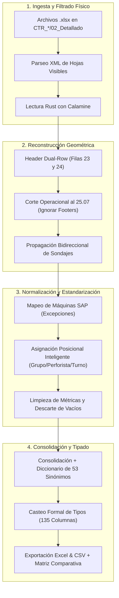

# 🏗️ 01. Arquitectura del Pipeline ETL y Sustitución de Power Query

[[HANDOFF_KNOWLEDGE_BASE_OBSIDIAN|⬅️ Volver a la Base de Conocimiento Principal]]

---

## 1. Justificación de la Migración Técnica

Anteriormente, el procesamiento se intentó realizar en **Power Query (M)** dentro de libros de Microsoft Excel (`bbdd.xlsx`, `lienzo.xlsx`). Sin embargo, se identificaron cuellos de botella estructurales:

1. **Problema de Memoria y Rendimiento**:
   - Power Query reevalúa recursivamente consultas anidadas. Procesar 18 libros con más de 50 hojas provocaba congelamientos del motor Mashup y tiempos de refresco superiores a 20 minutos.
   - En **Python + Calamine (Rust)**, la lectura directa de bytes comprimidos en ZIP procesa todo el mes en **menos de 5 segundos**.
2. **Hojas Ocultas y Descarte de Basura**:
   - Power Query lee todas las hojas listadas en el workbook, absorbiendo pestañas inactivas como `Máquina 2` o `Hoja3`.
   - Python inspecciona `xl/workbook.xml` con `zipfile` y `xml.etree.ElementTree`, descartando con 100% de precisión hojas con atributo `state="hidden"` o `state="veryHidden"`.
3. **Control Estricto de Esquemas**:
   - En Power Query, un cambio en una fila genera conversiones involuntarias a `type any`.
   - En Python, se impone un catálogo de **135 columnas fijas con casting forzado** a tipos nativos (`float64`, `int64`, `string`, `date`).

---

## 2. Diagrama de Flujo Modular del Pipeline

---

## 3. Componentes y Módulos de Código

* **`python_calamine.CalamineWorkbook`**: Driver de lectura ultrarrápido para hojas `.xlsx` y `.xls`.
* **`get_visible_sheet_names(excel_path)`**: Analiza el árbol XML del paquete Office Open XML.
* **`build_dual_row_headers(rows)`**: Genera encabezados combinados y deduplicados aplicando *Forward-Fill* horizontal en la fila de categoría primaria.
* **`assign_daily_turnos_fast(grupos, turnos, perfs)`**: Determina la guardia exacta basada en la jerarquía determinista y cambio de grupo/perforista.
* **Alineación por Índice (`df.loc[idxs]`):** Asignación directa a las posiciones de fila del DataFrame para evitar desfases.
* **Clave Primaria Corporativa (`ID_CLAVE_UNICA`)**: Formato estandarizado `{YYYYMMDD}-{MAQUINA_SAP}-{TURNO}`.
* **Manejo Seguro de Archivos (Permission-Safe):** Exportación con respaldo `_actualizada.xlsx` si los libros están abiertos en Microsoft Excel.

---

## 🔗 Notas Relacionadas

- [[docs/02_diccionario_de_datos_135_columnas|02. Diccionario de Datos y Tipado Estricto (135 Columnas)]]
- [[docs/03_algoritmo_turnos_y_casos_borde|03. Algoritmo Inteligente de Turnos y Casos Borde]]
- [[docs/05_guia_ejecucion_y_mantenimiento|05. Guía de Ejecución, Automatización y Mantenimiento]]
