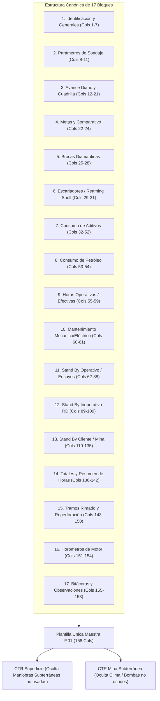

# 📑 Propuesta de Estandarización del Reporte Detallado (`RD.402.P.01.F.01`)

> [!NOTE]
> **Objetivo del Documento:**
> Presentar la especificación técnica integral, estandarizada y universal de la nueva plantilla del **Reporte Detallado por Equipo (`RD.402.P.01.F.01`)** de **Rockdrill Group**.
> 
> Esta propuesta:
> 1. **Conserva la estructura base visual y lógica** del formato F.01 familiar para que las administradoras de contrato (admins) y supervisores mantengan total familiaridad y ergonomía de llenado en campo.
> 2. **Unifica todas las actividades históricas, comerciales (PU) y operacionales (158 columnas)** cubriendo los 18 contratos mineros (superficie e interior mina).
> 3. **Respeta la convención interempresarial estricta** de 5 categorías de horas (`OPERATIVO [COBRABLE]`, `MANTENIMIENTO [NO COBRABLE]`, `STAND BY OPERATIVO [COBRABLE]`, `STAND BY INOPERATIVO [NO COBRABLE]`, `STAND BY CLIENTE [COBRABLE]`).
> 4. **Permite la ocultación dinámica de columnas** por contrato sin alterar la posición relativa de los campos ni romper el pipeline automatizado hacia Power BI (`RESIDENTES.pbix`).

---

## 🏛️ 1. Arquitectura y Principios de Diseño de la Nueva Plantilla

### 🎯 Directrices Clave de Cabeceras (Filas 21 a 24):
* **Fila 21 (Super-Header TIEMPOS):** Abarca las columnas de horas (Cols 55 a 142) identificando la sección de Disponibilidad Operacional.
* **Fila 22 (Categoría / Bloque Mayor):** Define el bloque y su naturaleza contractual (`[COBRABLE]` vs `[NO COBRABLE]`).
* **Fila 23 (Nombre de Actividad / Subencabezado):** Define la actividad específica o familia de insumo.
* **Fila 24 (Atributo / Unidad de Medida):** Unidades (`CANT.`, `UND.`, `PRODUCTO`, `DESDE`, `HASTA`, `METRAJE`, `TOTAL`).
* **Fila 25 en adelante:** Filas de datos diarios de guardia (Turnos A y B).

---

## 📋 2. Catálogo de los 17 Bloques Operativos

| # | Bloque / Categoría | Rango de Cols | Total Cols | Cobrabilidad | Descripción |
| :-: | :--- | :---: | :---: | :---: | :--- |
| **01** | DÍAS / GENERAL | 1 – 7 | 7 | NO APLICA | Fecha, N° correlativo, Zona, Contrato, Máquina SAP, Mes y Año. |
| **02** | SONDAJE | 8 – 11 | 4 | NO APLICA | Nombre del taladro, Profundidad programada, Línea (HQ/NQ/BQ) e Inclinación. |
| **03** | AVANCE DIARIO | 12 – 21 | 10 | COBRABLE | Desde, Hasta, Turno, Grupo, Metraje guardia, Horas extras, Perforista, Ayudantes, Total día. |
| **04** | COMPARATIVO | 22 – 24 | 3 | NO APLICA | Metraje acumulado, Proyectado contractual y Meta diaria. |
| **05** | BROCA | 25 – 28 | 4 | NO APLICA | Marca, Serie de fábrica, N° broca y Estado de desgaste. |
| **06** | ESCARIADOR | 29 – 31 | 3 | NO APLICA | Marca, N° escariador y Estado del reaming shell. |
| **07** | ADITIVOS (X UNIDADES) | 32 – 52 | 21 | CONSUMO | 7 familias x 3 atributos: Bentonita, PAC, Polímero, Lubricante, Inhibidor, Estabilizador, Otros. |
| **08** | COMBUSTIBLE | 53 – 54 | 2 | CONSUMO | Petróleo Diésel (Cantidad y Galones). |
| **09** | OPERATIVO [COBRABLE] | 55 – 59 | 5 | COBRABLE | Perforación, Rimado, Asentado/retiro Casing, Instalación PVC, Reperforación. |
| **10** | MANTENIMIENTO [NO COBRABLE] | 60 – 61 | 2 | NO COBRABLE | Mantenimiento Preventivo y Correctivo del equipo. |
| **11** | STAND BY OPERATIVO [COBRABLE] | 62 – 88 | 27 | COBRABLE | Lavado, Lodos, Maniobras tuberías, Desviación Gyro, Orientación, Cementación, Lefranc, Lugeon. |
| **12** | STAND BY INOPERATIVO [NO COBRABLE] | 89 – 109 | 21 | NO COBRABLE | Demoras internas RD: Desate, 5S, Pozas, Estandarización, Repuestos, Traslados internos, Refrigerio. |
| **13** | STAND BY CLIENTE [COBRABLE] | 110 – 135 | 26 | COBRABLE | Paradas mina: Voladura, Agua, Energía, Scoop, Sostenimiento, Clima, Orden cliente, Justificación. |
| **14** | RESUMEN DE HORAS | 136 – 142 | 7 | TOTAL HORAS | Tiempo Total (12 hrs), Efectivo-Operativo, Lost Time, Mantto, SB Operativo, Inop, Cliente. |
| **15** | TRAMOS ESPECIALES | 143 – 150 | 8 | METRAJE | Desde, Hasta, Metraje y Total de Rimado HWT/HQ y Re-perforación. |
| **16** | HORÓMETROS | 151 – 154 | 4 | HORAS MOTOR | Horómetro motor: Desde, Hasta, Acumulado y Total guardia. |
| **17** | BITÁCORA Y OBSERVACIONES | 155 – 158 | 4 | NO APLICA | Bitácora de mantenimiento, Repuestos utilizados, Litología y Comentarios de guardia. |
| **TOTAL** | **17 BLOQUES** | **1 – 158** | **158** | - | **Estructura Maestra Universal Completa** |
