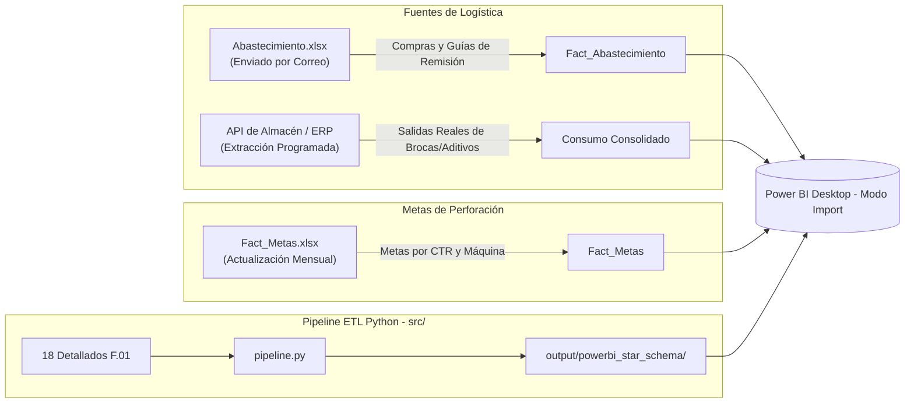

# 📊 Mapeo de Actividades, Diferencias de Esquema y Estrategia Power BI

> [!NOTE]
> Este documento detalla la resolución de los requerimientos especificados en `repuesta.txt`:
> 1. Mapeo exhaustivo de diferencias entre los 18 Reportes Detallados (`RD.402.P.01.F.01`) y el catálogo histórico `ACTY.xlsx` / Base Global.
> 2. Identificación de orígenes de datos de logística (**Abastecimiento** y **Consumo Consolidado**).
> 3. Integración de **Fact_Metas**.
> 4. Estrategia de carga desacoplada en **Power BI Desktop (Modo Import)** alimentada por el nuevo generador de Esquema Estrella.

---

## 1. Mapeo de Actividades: Detallados F.01 (135 Cols) vs. Base Histórica ACTY (68 Actividades)

### 📌 Diagnóstico del Esquema
* **Reportes Detallados Actuales (`RD.402.P.01.F.01`)**:
  * Tienen **69 columnas de tiempos, disponibilidad y eventos**, de las cuales **36 son actividades operativas atómicas directas** agrupadas por subtotales (`TOTAL OPERACIÓN`, `TOTAL PREPARACIÓN`, `TOTAL MANTTO.`, `TOTAL STAND BY OPERATIVO`, `TOTAL STAND BY INOPERATIVO`, `TOTAL STAND BY CLIENTE`).
* **Base Histórica / ACTY (`ACTY.xlsx`)**:
  * Contiene **68 actividades**. Muchas de ellas representan denominaciones operativas legacy o agrupadas que en los detallados modernos se registran bajo columnas estandarizadas o en el campo de `OBSERVACIONES` / `COMENTARIOS`.

### 🔄 Matriz de Mapeo y Homologación

| Categoría BI | Actividad en Base Histórica (ACTY) | Columna Canónica en Detallado F.01 | Clasificación Disponibilidad | Responsable Oficial |
| :--- | :--- | :--- | :---: | :--- |
| **EFECTIVAS** | `PERFORACION` | `Perforación` | NO AFECTA | OPERACIONES |
| **EFECTIVAS** | `REPERFORACION` | `Perforación` (con obs.) | NO AFECTA | OPERACIONES |
| **EFECTIVAS** | `PERFORACION_DE_PERNO_DE_ANCLAJE` | `Perforación` | NO AFECTA | OPERACIONES |
| **OPERATIVO** | `RIMADO` | `Rimado` | NO AFECTA | OPERACIONES |
| **OPERATIVO** | `ASENTADO_/_RETIRO_DE_REVESTIMIENTO_CASING` | `Asentado / Retiro DE REVESTIMIENTO (CASING)` | NO AFECTA | OPERACIONES |
| **OPERATIVO** | `INSTALACION_PVC` | `Asentado / Retiro DE REVESTIMIENTO (CASING)` | NO AFECTA | OPERACIONES |
| **OPERATIVO** | `ACONDICIONAMIENTO_DE_POZO` | `Calibración de pozo` / `Despeje de pozo` | NO AFECTA | OPERACIONES |
| **OPERATIVO** | `CEMENTACION` | `Tapón de Pozo` | NO AFECTA | OPERACIONES |
| **OPERATIVO** | `SELLADO_DE_SONDAJE` | `Tapón de Pozo` | NO AFECTA | OPERACIONES |
| **OPERATIVO** | `MEDICION_DE_DESVIACION` | `Medición de Trayectoria / Orientación de Testigo` | NO AFECTA | OPERACIONES |
| **OPERATIVO** | `PRUEBAS_DE_SUELO` / `PRUEBA_PZ` | `Prueba de Presión Lugeon / Lefranc` | NO AFECTA | OPERACIONES |
| **OPERATIVO** | `RECUPERACION_DE_TUBERIAS_POR_ATRAPAMIENTO` | `Recuperación de Pozo` / `Recuperación de Herramientas` | NO AFECTA | OPERACIONES |
| **OPERATIVO** | `CHARLA_Y_REPARTO_DE_GUARDIA` | `Inspección Prevencional / IPERC / OPT / Charlas` | NO AFECTA | OPERACIONES |
| **OPERATIVO** | `CAPACITACION` | `Charla Integral / Comité / Capacitación` | NO AFECTA | OPERACIONES |
| **OPERATIVO** | `MANIPULACION_DE_TUBERIAS` | `Maniobra de Barras y Tuberias` | NO AFECTA | OPERACIONES |
| **OPERATIVO** | `INSTALACION_DE_RED_DE_AGUA_O_DRENAJE` | `Abastecimiento de Agua` / `Tendido de Tuberías` | NO AFECTA | OPERACIONES |
| **OPERATIVO** | `TRASLADO_DE_MAQUINA` / `TRASLADO_ENTRE_CAMARAS` | `Traslado e Instalación` | NO AFECTA | OPERACIONES |
| **OPERATIVO** | `ORDEN_Y_LIMPIEZA` / `POZA_DE_SEDIMENTACION` | `Limpieza de Área / Desbroce / Poza de Lodos` | NO AFECTA | OPERACIONES |
| **OPERATIVO** | `TRASLADO_DE_PERSONAL` | `Traslado de Personal` | NO AFECTA | OPERACIONES |
| **MANTENIMIENTO**| `MANTTO_PREVENTIVO` | `Mantenimiento Programado` | AFECTA | MANTENIMIENTO |
| **MANTENIMIENTO**| `MANTTO_CORRECTIVO` | `Mantenimiento Mecánico` / `Mantenimiento Eléctrico` | AFECTA | MANTENIMIENTO |
| **MANTENIMIENTO**| `CHECK_LIST` | `Check List Pre Uso` | NO AFECTA | OPERACIONES |
| **STAND BY INOP.**| `FALTA_DE_PERSONAL` | `Falta de Personal` | AFECTA | GESTION HUMANA |
| **STAND BY INOP.**| `FALTA/PROBLEMAS_MATERIALES` | `Falta de Insumos / Herramientas` | AFECTA | LOGISTICA |
| **STAND BY INOP.**| `ESPERAS_INOPERATIVAS` | `Esperas Inoperativas` | AFECTA | OPERACIONES |
| **STAND BY INOP.**| `FALLAS_DE_EQUIPO` | `Falla Mecánica` / `Eléctrica` / `Hidráulica` | AFECTA | MANTENIMIENTO |
| **STAND BY INOP.**| `FALLA_DE_BOMBA` / `GENERADOR` | `Falla de Bomba de Agua` / `Falla de Grupo Electrógeno` | AFECTA | OPERACIONES |
| **STAND BY INOP.**| `PARE_RD` | `Tiempos Muertos` | AFECTA | OPERACIONES |
| **STAND BY CLI.** | `FALTA_DE_AGUA` | `Falta de Agua` | AFECTA | CLIENTE |
| **STAND BY CLI.** | `FALTA_DE_ENERGIA` / `VENTILACION` | `Parada por Seguridad / Bloqueo` / `Parada Solicitada Cliente` | AFECTA | CLIENTE |
| **STAND BY CLI.** | `CONDICIONES_CLIMATICAS` | `Condiciones Climáticas Adversas` | AFECTA | CLIENTE |
| **STAND BY CLI.** | `FALTA_HABILITACION_CAMARA` / `SCOOP` | `Falta de Frente / Área` | AFECTA | CLIENTE |
| **STAND BY CLI.** | `APOYO_A_GEOLOGIA` / `ESPERA_PROGRAMA`| `Parada por Geología / Supervisión` | AFECTA | CLIENTE |
| **STAND BY CLI.** | `PARALIZACION_COMUNAL` / `FIESTAS` | `Parada por Comunidad / Social` | AFECTA | CLIENTE |
| **STAND BY CLI.** | `ESPERA_DE_ORDEN_CLIENTE` | `Espera de Decisiones del Cliente` | AFECTA | CLIENTE |
| **STAND BY CLI.** | `PARE_CIA` | `Parada Solicitada por Cliente` | AFECTA | CLIENTE |

---

## 2. Orígenes de Datos de Logística y Metas

1. **`Fact_Abastecimiento`**:
   * **Origen:** Archivo Excel provisto periódicamente por Logística vía correo.
   * **Estructura (15 cols):** `MES`, `FECHA`, `CONTRATO`, `TRA`, `DESCRIPCION`, `UND`, `CANT`, `PRECIO`, `TOTAL`, `FAMILIA`, `TIPO`, `C.COSTO`, `CODTRA`, `GUIA`, `cod`.
2. **`Consumo Consolidado`**:
   * **Origen:** Extracción automatizada desde API de almacén / ERP corporativo.
   * **Estructura (20 cols):** `CTR`, `GS`, `Fecha`, `Maquina`, `Codigo`, `Descripcion`, `Serie`, `Cant`, `UM`, `Familia`, `Costo`, `Total`, `ACTIVOS`, `Item`, `MARCA`, `TIPO`, `DESCARGA`, `ALTURA_BROCA`, `MODELO`, `LINEA`.
3. **`Fact_Metas`**:
   * **Origen:** Excel mensual de planeamiento operativo.
   * **Estructura (5 cols):** `CTR`, `MES OPERATIVO`, `META METRAJE`, `MAQUINA`, `TIPO_MAQUINA`.

---

## 3. Generador de Esquema Estrella Automatizado (`src/export_star_schema.py`)

Se ha incorporado como **Paso 4** del pipeline integral en [`src/pipeline.py`](file:///C:/proyectos%20python/detallados/src/pipeline.py). Genera automáticamente en `output/powerbi_star_schema/`:

1. [`Fact_Metraje.csv`](file:///C:/proyectos%20python/detallados/output/powerbi_star_schema/Fact_Metraje.csv): 2,906 registros con metraje por guardia, broca, perforista y llave `KEY_OPERACION`.
2. [`Fact_Tiempos.csv`](file:///C:/proyectos%20python/detallados/output/powerbi_star_schema/Fact_Tiempos.csv): 1,587 registros unpivoteados clasificados por `Categoria`, `Afecta_Disp` y `Responsable`.
3. [`Dim_Maquina.csv`](file:///C:/proyectos%20python/detallados/output/powerbi_star_schema/Dim_Maquina.csv): 55 máquinas activas.
4. [`Dim_Personal.csv`](file:///C:/proyectos%20python/detallados/output/powerbi_star_schema/Dim_Personal.csv): 524 trabajadores (perforistas y ayudantes con nombres normalizados).
5. [`Fact_Personal_Asignado.csv`](file:///C:/proyectos%20python/detallados/output/powerbi_star_schema/Fact_Personal_Asignado.csv): 5,844 asignaciones guardia-personal (puente M:M).
6. [`Dim_Sondaje.csv`](file:///C:/proyectos%20python/detallados/output/powerbi_star_schema/Dim_Sondaje.csv): 228 sondajes con avance acumulado, fechas y profundidad programada para Gantt.
7. [`Dim_CTR.csv`](file:///C:/proyectos%20python/detallados/output/powerbi_star_schema/Dim_CTR.csv): 18 centros de trabajo mineros con zona geográfica.

---

## 4. Estrategia de Implementación en Power BI (Modo Import Local)

1. **Desacoplamiento del Live Connection:**
   * En lugar de depender de un dataset remoto opaco, Power BI Desktop cargará directamente los archivos CSV generados en `output/powerbi_star_schema/`.
2. **Ventajas Operativas:**
   * **Velocidad de Carga Instantánea:** Los CSVs limpios y normalizados cargan en segundos sin fórmulas intermedias pesadas de Excel.
   * **Auditoría Previa Garantizada:** Todo dato que entra a Power BI ha pasado por el validador estricto y la conciliación del 95.17% contra Control Interno.
   * **Portabilidad Total:** Funciona en cualquier máquina cambiando únicamente la ruta raíz en `config.py`.
