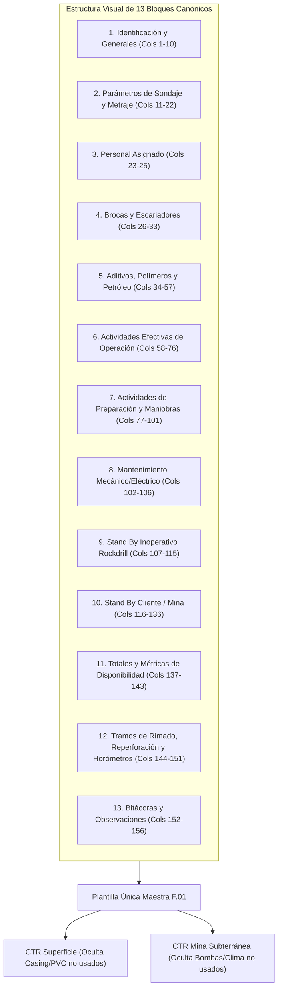

# 📑 Propuesta de Estandarización del Reporte Detallado (`RD.402.P.01.F.01`)

> [!NOTE]
> **Objetivo del Informe:**
> Presentar una propuesta técnica, integral y estandarizada de columnas y estructura visual para la nueva plantilla del **Reporte Detallado por Equipo (`RD.402.P.01.F.01`)** de Rockdrill a mediano plazo.
> 
> Esta propuesta:
> 1. **Conserva la estructura base visual y lógica** del formato F.01 para que los administradores de contrato (admins) en mina mantengan total familiaridad y ergonomía de llenado.
> 2. **Unifica todas las actividades históricas (156 columnas)** de `HISTORICO-PERDLAP140.xlsx` / `ACTY.xlsx` y de los 18 contratos mineros (superficie e interior mina).
> 3. **Permite la ocultación dinámica de columnas** por contrato sin alterar la posición relativa ni romper el pipeline automatizado.

---

## 🏛️ 1. Arquitectura y Principios de Diseño de la Nueva Plantilla

### 🎯 Directrices Clave para los Administradores de Contrato (Admins):
* **Fila 23 y Fila 24 (Encabezado Combinado Estándar):**
  * La **Fila 23** define el *Bloque / Categoría Mayor* (ej. `STAND BY CLIENTE`, `MANTENIMIENTO`, `CONSUMO DE ADITIVOS`).
  * La **Fila 24** define la *Actividad Específica o Unidad* (ej. `Falta de Agua`, `Espera de Scoop`, `Bentonita (Saco)`).
* **Entrada de Datos desde la Fila 25:**
  * Cada fila representa un tramo o evento operativo en la guardia.
* **Flexibilidad por Contrato:**
  * Si un CTR no realiza ciertas actividades (por ejemplo, `Pruebas de Presión Lugeon` en interior mina o `Instalación de Obturador`), la columna simplemente se **oculta visualmente en Excel** (`Ocultar Columna`), pero **mantiene su posición en el libro**. Esto garantiza que ningún script ETL se desalinee.

---

## 📋 2. Catálogo Exhaustivo de las 156 Columnas Propuestas

A continuación se detalla la matriz maestra de 156 columnas organizadas en sus 13 secciones operativas:

### 🔹 Bloque 1: Identificación y Generales (10 Columnas)
| # | Encabezado Fila 23 (Grupo) | Encabezado Fila 24 (Columna) | Tipo de Dato | Validación / Regla |
| :-: | :--- | :--- | :---: | :--- |
| **1** | GENERAL | `N°` | Entero | Autoincremental por guardia |
| **2** | GENERAL | `ZONA` | Texto | Lista: `CENTRO`, `SUR`, `NORTE` |
| **3** | GENERAL | `CTR` | Texto | Código oficial de contrato (ej. `CONDESTABLE`) |
| **4** | GENERAL | `MAQUINA` | Texto | Código SAP corporativo (ej. `XRD80ITH-001`) |
| **5** | GENERAL | `TURNO` | Texto / Num | `1` o `A` (Día) / `2` o `B` (Noche) |
| **6** | GENERAL | `GRUPO` | Texto | Letra de guardia (ej. `A`, `B`, `C`, `D`) |
| **7** | GENERAL | `MES` | Texto | Mes operativo (ej. `AGOSTO`) |
| **8** | GENERAL | `FECHA` | Fecha | Formato `DD/MM/YYYY` |
| **9** | GENERAL | `AÑO` | Entero | Formato `YYYY` (ej. `2026`) |
| **10**| GENERAL | `GUARDIAS` | Numérico | Constante `1` o `0.5` si es media guardia |

---

### 🔹 Bloque 2: Parámetros de Sondaje y Metraje (12 Columnas)
| # | Encabezado Fila 23 (Grupo) | Encabezado Fila 24 (Columna) | Tipo de Dato | Validación / Regla |
| :-: | :--- | :--- | :---: | :--- |
| **11**| SONDAJE | `SONDAJE` | Texto | Código de taladro (ej. `CND-24-015`) |
| **12**| SONDAJE | `PROFUNDIDAD DE SONDAJE` | Decimal | Profundidad total programada en metros ($m$) |
| **13**| SONDAJE | `LINEA` | Texto | Diámetro: `NQ`, `HQ`, `BQ`, `PQ`, `HWT` |
| **14**| SONDAJE | `INCLINACIÓN` | Decimal | Grados de inclinación (ej. `-90°`, `-45°`) |
| **15**| METRAJE | `DESDE` | Decimal | Metraje inicial del tramo ($m$) |
| **16**| METRAJE | `HASTA` | Decimal | Metraje final del tramo ($m$) |
| **17**| METRAJE | `METRAJE X GUARDIA` | Decimal | Fórmula: `=HASTA - DESDE` ($m$) |
| **18**| METRAJE | `HORAS EXTRAS` | Decimal | Horas adicionales fuera de guardia ($hrs$) |
| **19**| METRAJE | `METRAJE X DÍA` | Decimal | Suma diaria de la máquina ($m$) |
| **20**| METRAJE | `METROS ACUMULADO` | Decimal | Acumulado histórico del sondaje ($m$) |
| **21**| METRAJE | `METROS PROYECTADO` | Decimal | Proyección contractual ($m$) |
| **22**| METRAJE | `METROS META` | Decimal | Meta diaria asignada ($m$) |

---

### 🔹 Bloque 3: Personal Asignado (3 Columnas)
| # | Encabezado Fila 23 (Grupo) | Encabezado Fila 24 (Columna) | Tipo de Dato | Validación / Regla |
| :-: | :--- | :--- | :---: | :--- |
| **23**| PERSONAL | `PERFORISTA` | Texto | Nombre estandarizado (Apellido Paterno + Nombres) |
| **24**| PERSONAL | `AYUDANTE 1` | Texto | Nombre estandarizado del primer ayudante |
| **25**| PERSONAL | `AYUDANTE 2` | Texto | Nombre estandarizado del segundo ayudante (opcional) |

---

### 🔹 Bloque 4: Brocas y Escariadores (8 Columnas)
| # | Encabezado Fila 23 (Grupo) | Encabezado Fila 24 (Columna) | Tipo de Dato | Validación / Regla |
| :-: | :--- | :--- | :---: | :--- |
| **26**| HERRAMIENTAS | `MARCA BROCA` | Texto | Marca de la broca diamantina (ej. `FORDIA`, `BOART`) |
| **27**| HERRAMIENTAS | `SERIE DE BROCA` | Texto | Número de serie grabado de fábrica |
| **28**| HERRAMIENTAS | `Nº BROCA` | Texto / Int | Correlativo de broca en el proyecto |
| **29**| HERRAMIENTAS | `ESTADO DE LA BROCA` | Texto | `NUEVA`, `USADA`, `DESCARTE`, `PULIDA` |
| **30**| HERRAMIENTAS | `MARCA ESCARIADOR` | Texto | Marca del reaming shell |
| **31**| HERRAMIENTAS | `Nº ESCARIADOR` | Texto / Int | Correlativo del escariador |
| **32**| HERRAMIENTAS | `ESTADO DEL ESCARIADOR` | Texto | `BUENO`, `REGULAR`, `DESCARTE` |
| **33**| HERRAMIENTAS | `CAMBIO BROCA` | Texto | `SI` / `NO` (Indica si se cambió en el turno) |

---

### 🔹 Bloque 5: Aditivos, Polímeros y Combustible (24 Columnas)
| # | Encabezado Fila 23 (Grupo) | Encabezado Fila 24 (Columna) | Tipo de Dato | Unidad |
| :-: | :--- | :--- | :---: | :--- |
| **34**| BENTONITA | `BENTONITA (PRODUCTO)` | Texto | Nombre del producto |
| **35**| BENTONITA | `CANT. DE BENTONITA` | Decimal | Cantidad consumida |
| **36**| BENTONITA | `UND. DE BENTONITA` | Texto | `BOLSA`, `SACO` |
| **37**| PAC | `PAC (PRODUCTO)` | Texto | Nombre del polímero celulósico |
| **38**| PAC | `CANT. DE PAC` | Decimal | Cantidad consumida |
| **39**| PAC | `UND. DE PAC` | Texto | `BOLSA`, `KG` |
| **40**| POLIMERO | `POLIMERO (PRODUCTO)` | Texto | Nombre del polímero sintético |
| **41**| POLIMERO | `CANT. DE POLIMERO` | Decimal | Cantidad consumida |
| **42**| POLIMERO | `UND. DE POLIMERO` | Texto | `GAL`, `LITRO`, `KG` |
| **43**| LUBRICANTES | `LUBRICANTES (PRODUCTO)` | Texto | Grasa para barras / aceite |
| **44**| LUBRICANTES | `CANT. DE LUBRICANTE` | Decimal | Cantidad consumida |
| **45**| LUBRICANTES | `UND. DE LUBRICANTE` | Texto | `BALDE`, `KG` |
| **46**| INHIBIDORES | `INHIBIDORES (PRODUCTO)` | Texto | Inhibidor de arcillas |
| **47**| INHIBIDORES | `CANT. DE INHIBIDOR` | Decimal | Cantidad consumida |
| **48**| INHIBIDORES | `UND. DE INHIBIDOR` | Texto | `GAL`, `LITRO` |
| **49**| ESTABILIZADOR | `ESTABILIZADOR (PRODUCTO)`| Texto | Estabilizador de pozo |
| **50**| ESTABILIZADOR | `CANT. DE ESTABILIZADOR` | Decimal | Cantidad consumida |
| **51**| ESTABILIZADOR | `UND. DE ESTABILIZADOR` | Texto | `BALDE`, `KG` |
| **52**| OTROS ADITIVOS| `CLASIFICACIÓN OTROS` | Texto | Categoría del insumo |
| **53**| OTROS ADITIVOS| `OTROS PRODUCTOS` | Texto | Descripción del producto |
| **54**| OTROS ADITIVOS| `CANT. DE OTROS` | Decimal | Cantidad consumida |
| **55**| OTROS ADITIVOS| `UND. DE OTROS` | Texto | Unidad de medida |
| **56**| COMBUSTIBLE | `CANT. DE PETROLEO` | Decimal | Galones despachados |
| **57**| COMBUSTIBLE | `GLN DE PETROLEO` | Texto | Unidad (`GLN`) |

---

### 🔹 Bloque 6: Actividades Efectivas y de Operación (19 Columnas)
*Categoría BI:* `EFECTIVAS` y `OPERATIVO` | *Afecta Disponibilidad:* `NO AFECTA` | *Responsable:* `OPERACIONES`

| # | Encabezado Fila 23 (Grupo) | Encabezado Fila 24 (Columna) | Categoría BI | Descripción Operativa |
| :-: | :--- | :--- | :---: | :--- |
| **58**| EFECTIVAS | `PERFORACIÓN` | `EFECTIVAS` | Horas netas de perforación y avance en roca |
| **59**| OPERATIVO | `RIMADO` | `OPERATIVO` | Ensanchamiento o repaso de diámetro |
| **60**| OPERATIVO | `ASENTADO / RETIRO DE REVESTIMIENTO (CASING)`| `OPERATIVO` | Colocación o recuperación de tubería casing |
| **61**| OPERATIVO | `INSTALACIÓN PVC` | `OPERATIVO` | Entubado de pozo con tubería ranurada PVC |
| **62**| OPERATIVO | `REPERFORACIÓN` | `OPERATIVO` | Repaso de tramos derrumbados o atascados |
| **63**| OPERATIVO | `LAVADO DE SONDAJE` | `OPERATIVO` | Inyección de agua para limpieza de detritos |
| **64**| OPERATIVO | `ACONDICIONAMIENTO DE SONDAJE` | `OPERATIVO` | Calibración, limpieza y estabilización |
| **65**| OPERATIVO | `ACONDICIONAMIENTO DE POZO` | `OPERATIVO` | Acondicionamiento previo a pruebas |
| **66**| OPERATIVO | `TRICONEADO` | `OPERATIVO` | Avance en sobrecapa con broca tricónica |
| **67**| OPERATIVO | `CEMENTACIÓN` | `OPERATIVO` | Inyección de lechada de cemento para sellado |
| **68**| OPERATIVO | `SELLADO DE SONDAJE` | `OPERATIVO` | Cierre final del pozo según norma ambiental |
| **69**| OPERATIVO | `PERFORACIÓN DE PERNO DE ANCLAJE` | `OPERATIVO` | Perforación para fijación de equipo en piso |
| **70**| OPERATIVO | `PRUEBAS DE SUELO` | `OPERATIVO` | Ensayos geotécnicos / SPT |
| **71**| OPERATIVO | `PRUEBA PZ` | `OPERATIVO` | Instalación o prueba de piezómetro |
| **72**| OPERATIVO | `MEDICIÓN DE DESVIACIÓN` | `OPERATIVO` | Mediciones con Devishot / Gyro / Reflex |
| **73**| OPERATIVO | `RECUPERACIÓN DE TUBERÍAS POR ATRAPAMIENTO` | `OPERATIVO` | Maniobras de rescate de sarta atascada |
| **74**| OPERATIVO | `RECUPERACIÓN DE TUBERÍAS POR ATRAPAMIENTO 2`| `OPERATIVO` | Segunda fase de pesca y rescate |
| **75**| OPERATIVO | `INSTALACIÓN DE OBTURADOR` | `OPERATIVO` | Colocación de packer para pruebas hidro |
| **76**| OPERATIVO | `INSTALACIÓN Y/O RETIRO DE CHAVETA` | `OPERATIVO` | Montaje/desmontaje de mordaza |

---

### 🔹 Bloque 7: Actividades de Preparación y Maniobras (25 Columnas)
*Categoría BI:* `OPERATIVO` | *Afecta Disponibilidad:* `NO AFECTA` | *Responsable:* `OPERACIONES`

| # | Encabezado Fila 23 (Grupo) | Encabezado Fila 24 (Columna) | Categoría BI | Descripción Operativa |
| :-: | :--- | :--- | :---: | :--- |
| **77**| PREPARACIÓN | `MEZCLADO DE LODOS` | `OPERATIVO` | Preparación de fluidos de perforación |
| **78**| PREPARACIÓN | `MANIPULACIÓN DE TUBERÍAS` | `OPERATIVO` | Acarreo y acomodo de barras |
| **79**| PREPARACIÓN | `CAMBIO DE LINEA` | `OPERATIVO` | Reducción de diámetro (ej. HQ a NQ) |
| **80**| PREPARACIÓN | `CAMBIO DE PUNTO` | `OPERATIVO` | Reubicación menor en la misma plataforma |
| **81**| PREPARACIÓN | `CAMBIO DE GUARDIA` | `OPERATIVO` | Relevo entre perforistas y entrega de frente |
| **82**| PREPARACIÓN | `TRASLADO ENTRE CÁMARAS DE PERFORACIÓN` | `OPERATIVO` | Movimiento de equipo en interior mina |
| **83**| PREPARACIÓN | `TRASLADO DE MÁQUINA` | `OPERATIVO` | Movilización principal entre plataformas |
| **84**| PREPARACIÓN | `TRASLADO DE EQUIPO ENTRE CABINAS` | `OPERATIVO` | Movimiento entre labores mineras |
| **85**| PREPARACIÓN | `TRASLADO DE ACCESORIOS` | `OPERATIVO` | Transporte de bombas, mangueras y herramientas|
| **86**| PREPARACIÓN | `TRASLADO DE PERSONAL` | `OPERATIVO` | Tiempo de viaje mina/superficie |
| **87**| PREPARACIÓN | `DESATE DE ROCAS` | `OPERATIVO` | Saneamiento y seguridad del frente de trabajo |
| **88**| PREPARACIÓN | `ORDEN Y LIMPIEZA` | `OPERATIVO` | 5S en plataforma de perforación |
| **89**| PREPARACIÓN | `RECOJO DE LAMA` | `OPERATIVO` | Limpieza de sedimentos y lodos |
| **90**| PREPARACIÓN | `POZA DE SEDIMENTACIÓN` | `OPERATIVO` | Construcción y limpieza de pozas de lodos |
| **91**| PREPARACIÓN | `ESTANDARIZACIÓN` | `OPERATIVO` | Adecuación de estándares de seguridad |
| **92**| PREPARACIÓN | `INSTALACIÓN DE RED DE AGUA O DRENAJE` | `OPERATIVO` | Tendido de tubería de agua y bombas |
| **93**| PREPARACIÓN | `INSTALACIÓN / DESINSTALACIÓN DE EQUIPOS`| `OPERATIVO` | Armado y anclaje de la máquina perforadora |
| **94**| PREPARACIÓN | `CHARLA Y REPARTO DE GUARDIA` | `OPERATIVO` | IPERC continuo y charla de 5 minutos |
| **95**| PREPARACIÓN | `CAPACITACIÓN` | `OPERATIVO` | Cursos obligatorios de seguridad |
| **96**| PREPARACIÓN | `AUDITORÍA INTERNA` | `OPERATIVO` | Inspección interna de SSOMA / Calidad |
| **97**| PREPARACIÓN | `MANIOBRAS DE CARGA Y DESCARGA` | `OPERATIVO` | Descarga de barras y cajas de testigos |
| **98**| PREPARACIÓN | `APOYO A OTRA MÁQUINA` | `OPERATIVO` | Asistencia de personal a equipo vecino |
| **99**| PREPARACIÓN | `APOYO A OTRO TURNO` | `OPERATIVO` | Apoyo extraordinario entre guardias |
| **100**|PREPARACIÓN | `REFRIGERIO` | `OPERATIVO` | Tiempo de almuerzo/cena según pacto |
| **101**|PREPARACIÓN | `MANIOBRAS DE PROBLEMAS GEOLÓGICOS` | `OPERATIVO` | Control de fallas, acuíferos o cavidades |

---

### 🔹 Bloque 8: Mantenimiento (5 Columnas)
*Categoría BI:* `MANTENIMIENTO` | *Responsable:* `MANTENIMIENTO` / `OPERACIONES`

| # | Encabezado Fila 23 (Grupo) | Encabezado Fila 24 (Columna) | Afecta Disp. | Responsable |
| :-: | :--- | :--- | :---: | :--- |
| **102**| MANTENIMIENTO | `MANTTO. PREVENTIVO` | AFECTA | MANTENIMIENTO |
| **103**| MANTENIMIENTO | `MANTTO. CORRECTIVO` | AFECTA | MANTENIMIENTO |
| **104**| MANTENIMIENTO | `CHECK LIST PRE USO` | NO AFECTA | OPERACIONES |
| **105**| MANTENIMIENTO | `ESPERA DE REPUESTO` | AFECTA | LOGISTICA / MANTTO |
| **106**| MANTENIMIENTO | `TOTAL MANTTO.` | FÓRMULA | `=SUMA(Col102:Col105)` |

---

### 🔹 Bloque 9: Stand By Inoperativo - Rockdrill (9 Columnas)
*Categoría BI:* `STAND BY INOPERATIVO` | *Afecta Disponibilidad:* `AFECTA` | *Responsable:* `ROCKDRILL`

| # | Encabezado Fila 23 (Grupo) | Encabezado Fila 24 (Columna) | Responsable Oficial |
| :-: | :--- | :--- | :--- |
| **107**| STAND BY INOP. | `FALTA DE PERSONAL` | GESTION HUMANA |
| **108**| STAND BY INOP. | `FALTA/PROBLEMAS MATERIALES` | LOGISTICA |
| **109**| STAND BY INOP. | `FALTA DE CAMIONETA Y/O CAMIÓN` | LOGISTICA / OPERACIONES |
| **110**| STAND BY INOP. | `FALTA DE CISTERNA` | OPERACIONES |
| **111**| STAND BY INOP. | `ESPERAS INOPERATIVAS` | OPERACIONES |
| **112**| STAND BY INOP. | `ESPERA DE EQUIPO DE MEDICIÓN` | OPERACIONES |
| **113**| STAND BY INOP. | `PARE RD` | OPERACIONES |
| **114**| STAND BY INOP. | `OTROS RD` | OPERACIONES |
| **115**| STAND BY INOP. | `TOTAL STAND BY INOPERATIVO` | FÓRMULA (`=SUMA(Col107:Col114)`) |

---

### 🔹 Bloque 10: Stand By Cliente - Mina (21 Columnas)
*Categoría BI:* `STAND BY CLIENTE` | *Afecta Disponibilidad:* `AFECTA` | *Responsable:* `CLIENTE`

| # | Encabezado Fila 23 (Grupo) | Encabezado Fila 24 (Columna) | Responsable Oficial |
| :-: | :--- | :--- | :--- |
| **116**| STAND BY CLIENTE | `VOLADURA` | CLIENTE |
| **117**| STAND BY CLIENTE | `FALTA DE AGUA` | CLIENTE |
| **118**| STAND BY CLIENTE | `FALTA DE ENERGÍA` | CLIENTE |
| **119**| STAND BY CLIENTE | `FALTA DE VENTILACIÓN` | CLIENTE |
| **120**| STAND BY CLIENTE | `FALTA DE SERVICIOS` | CLIENTE |
| **121**| STAND BY CLIENTE | `ESPERA DE PROGRAMA` | CLIENTE |
| **122**| STAND BY CLIENTE | `ESPERA DE CÁMARA` | CLIENTE |
| **123**| STAND BY CLIENTE | `ESPERA DE SOSTENIMIENTO` | CLIENTE |
| **124**| STAND BY CLIENTE | `ESPERA DE SCOOP` | CLIENTE |
| **125**| STAND BY CLIENTE | `ESPERA DE MARCADO DE PUNTO` | CLIENTE |
| **126**| STAND BY CLIENTE | `APOYO A GEOLOGÍA` | CLIENTE |
| **127**| STAND BY CLIENTE | `AUDITORÍA EXTERNA` | CLIENTE |
| **128**| STAND BY CLIENTE | `F. DE HABILITACIÓN DE CÁMARA O PLATAFORMA` | CLIENTE |
| **129**| STAND BY CLIENTE | `ESPERA DE ORDEN CLIENTE` | CLIENTE |
| **130**| STAND BY CLIENTE | `CONDICIONES CLIMATICAS` | CLIENTE |
| **131**| STAND BY CLIENTE | `PARALIZACIÓN POR FIESTAS` | CLIENTE |
| **132**| STAND BY CLIENTE | `PARE CIA` | CLIENTE |
| **133**| STAND BY CLIENTE | `OTROS CLIENTE` | CLIENTE |
| **134**| STAND BY CLIENTE | `MOTIVO OTROS (BREVE EXPLICACION)` | CLIENTE |
| **135**| STAND BY CLIENTE | `STAND BY OPERATIVO` | Subtotal |
| **136**| STAND BY CLIENTE | `TOTAL STAND BY CLIENTE` | FÓRMULA (`=SUMA(Col116:Col134)`) |

---

### 🔹 Bloque 11: Totales, Horas y Disponibilidad (7 Columnas)
| # | Encabezado Fila 23 (Grupo) | Encabezado Fila 24 (Columna) | Tipo de Dato | Fórmula Estándar |
| :-: | :--- | :--- | :---: | :--- |
| **137**| TOTALES | `TIEMPO TOTAL` | Decimal | Horas del turno (12.00, 11.00 o 10.15) |
| **138**| TOTALES | `TIEMPO EFECTIVO - OPERATIVO` | Decimal | `=PERFORACIÓN + PREPARACIÓN` |
| **139**| TOTALES | `LOST TIME` | Decimal | `=MANTTO + STAND BY INOP + STAND BY CLI` |
| **140**| DISPONIBILIDAD | `HORAS EFECTIVAS` | Decimal | `=PERFORACIÓN` |
| **141**| DISPONIBILIDAD | `HORAS OPERATIVAS` | Decimal | `=HORAS EFECTIVAS + HORAS PREPARACIÓN` |
| **142**| DISPONIBILIDAD | `DISPONIBILIDAD MECÁNICA (%)` | Porcentaje | `=(TIEMPO TOTAL - MANTTO) / TIEMPO TOTAL` |
| **143**| DISPONIBILIDAD | `UTILIZACIÓN (%)` | Porcentaje | `=HORAS EFECTIVAS / TIEMPO TOTAL` |

---

### 🔹 Bloque 12: Detalle de Tramos (Rimados, Reperforaciones y Horómetros) (8 Columnas)
| # | Encabezado Fila 23 (Grupo) | Encabezado Fila 24 (Columna) | Tipo de Dato |
| :-: | :--- | :--- | :---: |
| **144**| RIMADO HWT/HQ | `RIMADO HWT/HQ DESDE` | Decimal |
| **145**| RIMADO HWT/HQ | `RIMADO HWT/HQ HASTA` | Decimal |
| **146**| RIMADO HWT/HQ | `RIMADO HWT/HQ METRAJE` | Decimal |
| **147**| REPERFORACIÓN | `REPERFORACIÓN DESDE` | Decimal |
| **148**| REPERFORACIÓN | `REPERFORACIÓN HASTA` | Decimal |
| **149**| REPERFORACIÓN | `REPERFORACIÓN METRAJE` | Decimal |
| **150**| HOROMETRO | `HOROMETRO DESDE` | Decimal |
| **151**| HOROMETRO | `HOROMETRO HASTA` | Decimal |

---

### 🔹 Bloque 13: Bitácora y Observaciones (5 Columnas)
| # | Encabezado Fila 23 (Grupo) | Encabezado Fila 24 (Columna) | Tipo de Dato |
| :-: | :--- | :--- | :---: |
| **152**| BITACORA | `TRABAJOS REALIZADOS BITACORA DE MANTTO.` | Texto |
| **153**| BITACORA | `REPUESTOS UTILIZADOS BITACORA DE MANTTO.` | Texto |
| **154**| GEOLOGÍA | `DESCRIPCIÓN LITOLÓGICA` | Texto |
| **155**| OBSERVACIONES| `COMENTARIOS OPERATIVOS` | Texto |
| **156**| OBSERVACIONES| `BITACORA MANTENIMIENTO` | Texto |

---

## 🛠️ 3. Plan de Implementación y Guía para Administradores de Contrato

1. **Plantilla Única Maestra (`RD.402.P.01.F.01_Master.xlsx`):**
   * Se crea un archivo maestro con las 156 columnas y fórmulas bloqueadas en filas de totales.
2. **Personalización de Vista por CTR (Sin Eliminar Columnas):**
   * En cada CTR, el administrador **oculta** (Hide) las columnas que no aplican a su operación.
   * *Ejemplo 1 (Mina Subterránea - Yauliyacu):* Oculta `Condiciones Climáticas` y `Triconeado`.
   * *Ejemplo 2 (Superficie - Tambojasa):* Oculta `Espera de Scoop` y `Traslado entre Cámaras`.
3. **Compatibilidad Inmediata con Python:**
   * El motor de extracción (`CalamineWorkbook`) lee las 156 columnas por posición y nombre canónico, garantizando **0 fallos de alineación**, sin importar qué columnas estén ocultas en la vista de Excel.
