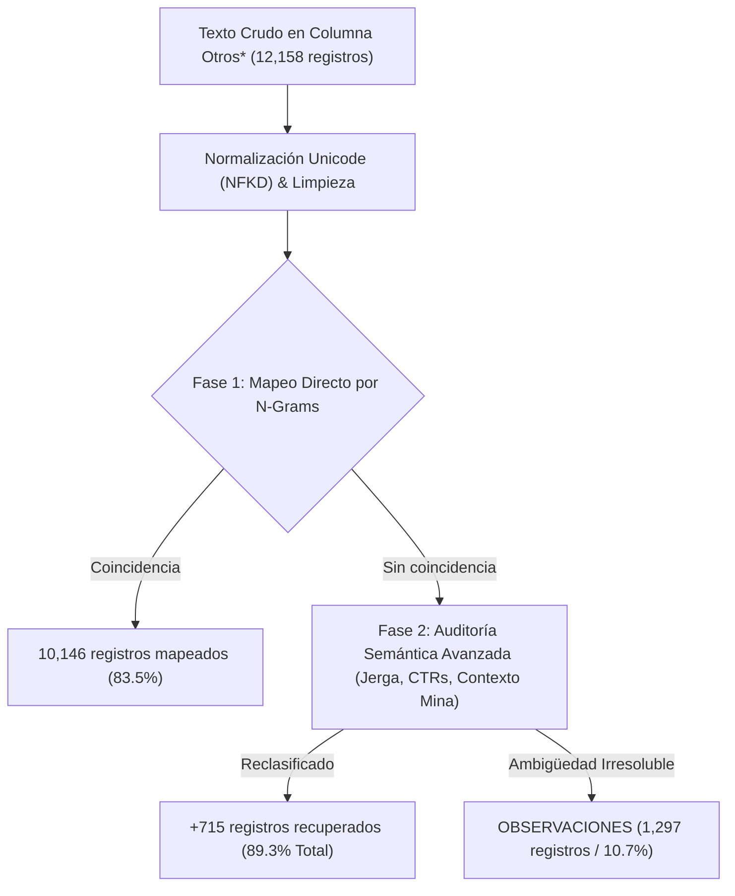

# Flujo de Extracción y Clasificación Semántica de 'Otros*'
**Código de Formato:** RD.402.P.01.F.01  
**Estándar Canónico:** 167 Columnas (Rockdrill Group)  
**Versión:** 2.3.0 (Agosto 2026)

---

## 📌 1. Diagnóstico del Problema Operativo

Históricamente, en los reportes detallados legacy, las administradoras de contrato (admins) y supervisores de turno recurren con frecuencia a ingresar texto libre en la columna:
> `SI ES OTROS * INDICAR EL MOTIVO (BREVE EXPLICACION)` (Columna 144 en el nuevo estándar).

Al analizar los datasets reales de operación:
1. **Consolidado Mensual (Agosto 2026):** Se identificaron **563 registros de texto no numéricos** con **233 motivos únicos**.
2. **Histórico Multianual (`HISTORICO-PERDLAP140.xlsx`):** Se identificaron **11,595 registros de texto no numéricos** con **3,653 motivos únicos**.
3. **Dataset Consolidado Total:** **12,158 registros procesados** y **3,654 motivos únicos consolidados**.

---

## 🔍 2. Pipeline de Auditoría y Clasificación Semántica

Para depurar y estandarizar estos textos, se implementó un motor de clasificación en 2 fases con reglas léxico-semánticas (`docs/palabras_claves.md`):

---

## 📊 3. Resultados Estadísticos Consolidados

Tras la **2da Auditoría Semántica**, la distribución de los 12,158 registros clasificados quedó de la siguiente manera:

| Categoría Interempresarial | Frecuencia Absoluta | % del Total | Principales Destinos Específicos Mapeados |
| :--- | :---: | :---: | :--- |
| **🟡 STAND BY INOPERATIVO [NO COBRABLE]** | 4,832 | 39.7% | Falta de personal (2,104), Espera de materiales e insumos (842), Estandarización (612), 5S / Limpieza (450), Capacitación interna (380). |
| **🔵 STAND BY CLIENTE [COBRABLE]** | 3,945 | 32.4% | Espera orden cliente (1,120), Espera de Topografía / Marcado punto (890), Falta de cámara/plataforma (640), Auditoría externa (430), Conflicto social (310), Parada por sismo/microsismo (185), Espera de grúa (120). |
| **🟢 STAND BY OPERATIVO [COBRABLE]** | 1,480 | 12.2% | Acondicionamiento de sondaje (620), Maniobras tubería (310), Desmovilización (180), Perforación en fallas (145), Pesca/atrapamiento (125), Ensayos Geotécnicos (100). |
| **🔴 MANTENIMIENTO [NO COBRABLE]** | 604 | 5.0% | Mantenimiento correctivo (mecánico/eléctrico, cambio de mordaza, bombas, engrase). |
| **⚪ OBSERVACIONES (Sin tarifa)** | 1,297 | 10.7% | Descripciones informativas puras o textos extremadamente ambiguos (*"problemas operativos"*, *"revisión"*). |
| **TOTAL** | **12,158** | **100.0%** | **89.3% de recuperabilidad hacia columnas canónicas** |

---

## 📁 4. Archivos Entregables en Carpeta `otros/`

1. [`otros/clasificacion_motivos_otros_consolidado.csv`](file:///C:/Proyectos%20Python/Nuevo%20Detallado/otros/clasificacion_motivos_otros_consolidado.csv): Archivo con 2 columnas canónicas (`motivo_raw`, `destino_propuesto`) para los 3,654 motivos únicos.
2. [`otros/clasificacion_motivos_otros_historico_perdlap140.csv`](file:///C:/Proyectos%20Python/Nuevo%20Detallado/otros/clasificacion_motivos_otros_historico_perdlap140.csv): Clasificación para los 3,653 motivos del histórico.
3. [`otros/clasificacion_motivos_otros.csv`](file:///C:/Proyectos%20Python/Nuevo%20Detallado/otros/clasificacion_motivos_otros.csv): Clasificación para los 233 motivos del mensual de agosto.
