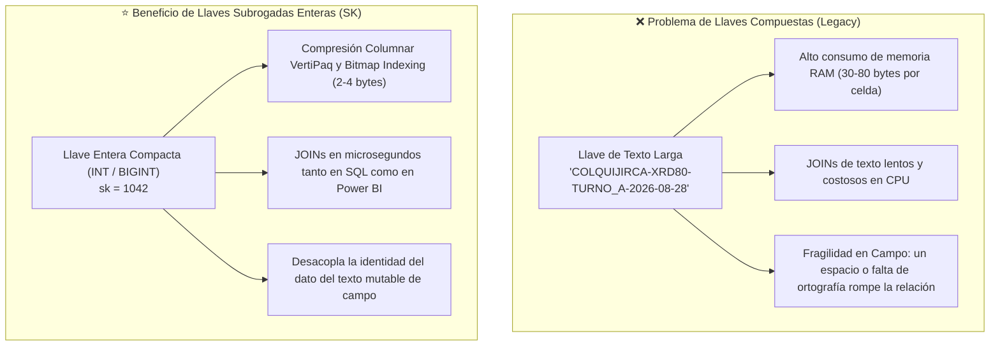
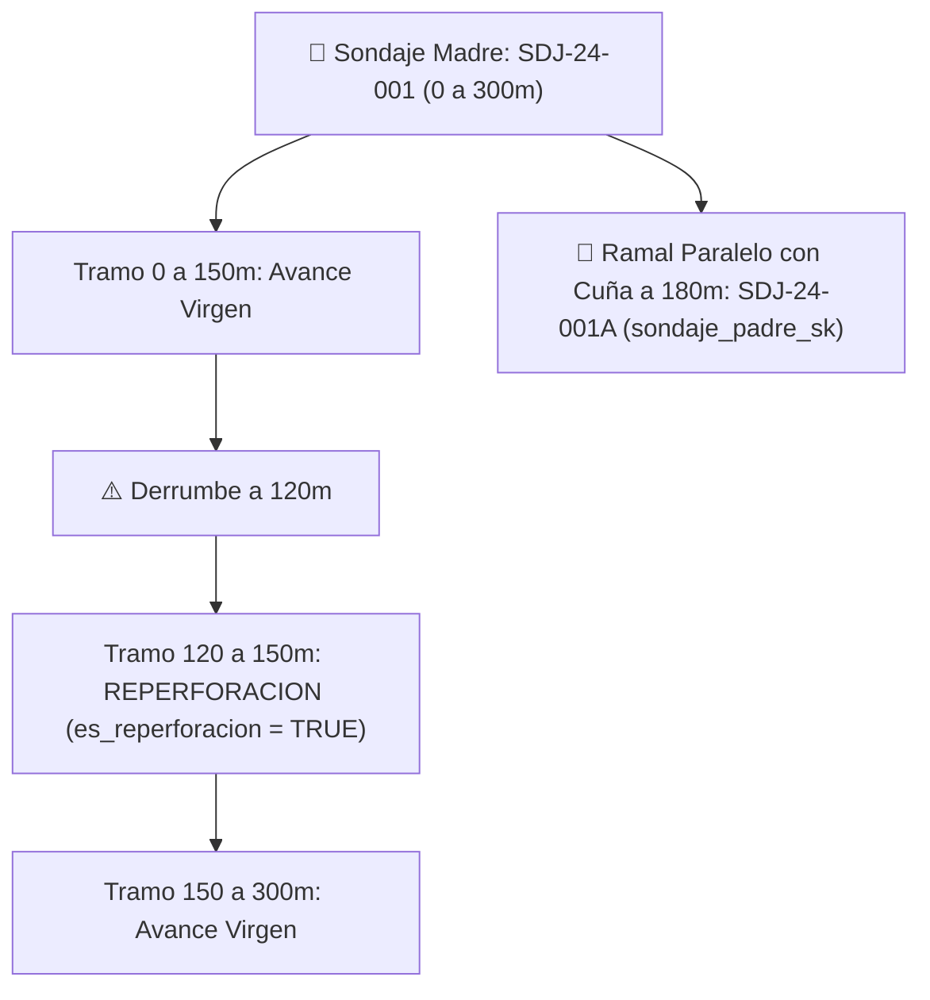

# 01. Arquitectura de Datos Empresarial, Diagrama ERD y Estándar SQL
**Proyecto**: Sistema Unificado de Business Intelligence y Analítica de Perforación  
**Ubicación**: `C:/Proyectos Python/Detallados/docs/01_ARQUITECTURA_EMPRESARIAL_ERD_Y_SQL.md`  
**Organización**: Rockdrill Group  
**Metodología**: Kimball Dimensional Modeling (Star / Snowflake Schema)  
**Compatibilidad**: ANSI SQL (PostgreSQL, Snowflake, Microsoft Fabric Delta Lake, Azure Synapse, BigQuery) y Power BI VertiPaq  
**Auditor de Calidad**: `project_governance_auditor`  

---

## 🏛️ 1. Justificación de Ingeniería: Llaves Subrogadas (`_sk`) vs. Llaves Compuestas

Uno de los pilares del diseño es el uso estricto de **Llaves Subrogadas Enteras (`_sk`)** en sustitución de llaves compuestas de texto (ej. `CONCAT(CTR, "-", MAQUINA, "-", TURNO, "-", FECHA)`):

### 🛡️ Manejo de Datos Faltantes en Etapa 1 (Excel + Power Query -> CSV)
Para que el pipeline **nunca falle («no explote»)** cuando en campo falte registrar un perforista, un insumo o una actividad, cada dimensión incorpora el **Registro Miembro Desconocido (`sk = -1`)**:
* `personal_sk = -1`: `"[NO ESPECIFICADO / PERSONAL PENDIENTE]"`
* `sondaje_sk = -1`: `"[SONDAJE NO ASIGNADO]"`
* `actividad_sk = -1`: `"[ACTIVIDAD NO CATALOGADA EN DETALLADO]"`
* `insumo_sk = -1`: `"[INSUMO NO REGISTRADO]"`

De este modo, cuando Power Query o Python lean un reporte detallado con campos en blanco, se asigna automáticamente `-1`, preservando la fila de hechos y alertando a la auditoría sin interrumpir el flujo.

---

## 🔄 2. Tratamiento de Tramos Físicos, Reperforaciones y Sondajes Paralelos

En perforación diamantina (DDH) los tramos `DESDE - HASTA` no siempre son lineales o únicos. Se contemplan tres escenarios operacionales:

1. **Avance Virgen (`AVANCE_VIRGEN`):** Perforación de roca nueva en avance progresivo continuo.
2. **Reperforación (`REPERFORACION`):** Repetición de un intervalo ya perforado debido a derrumbe, limpieza de pozo o atascamiento de tubería. El metraje se registra físicamente pero se marca con `es_reperforacion = TRUE` para diferenciar el **Metraje Bruto Facturable** del **Metraje Neto de Avance Geológico**.
3. **Ramales Paralelos y Desviaciones (`RAMAL_PARALELO`):** Taladros bifurcados desde un pozo madre (`sondaje_padre_sk`) mediante cuña desviadora o navajas.

---

## 📊 3. Diagrama de Entidad-Relación Detallado (Mermaid ERD)

```mermaid
erDiagram
    %% DIMENSIONES
    dim_tiempo_calendario {
        INT calendario_sk PK "YYYYMMDD o -1"
        DATE fecha_dt
        SMALLINT anio_operativo "Minero"
        VARCHAR mes_anio_operativo "ENE-26"
        INT periodo_operativo_sort "202601"
        BOOLEAN es_cierre_operativo "Día 25"
    }

    dim_contrato_minero {
        SMALLINT contrato_sk PK "-1 si falta"
        VARCHAR contrato_cd "COLQUIJIRCA, RAURA"
        VARCHAR cliente_minero
        VARCHAR zona_geografica "CENTRO, SUR, NORTE"
        VARCHAR tipo_operacion "SUBTERRANEA, SUPERFICIE"
    }

    dim_equipo_perforadora {
        SMALLINT equipo_sk PK "-1 si falta"
        VARCHAR equipo_cd "XRD80WDTH-001"
        VARCHAR modelo_fabricante "XRD80 WTDH"
        SMALLINT horas_dia_planeadas "24h"
        SMALLINT contrato_sk_asignado FK
    }

    dim_linea_diametro {
        SMALLINT linea_sk PK "-1 si falta"
        VARCHAR linea_cd "HQ, NQ, BQ, PQ, HWT"
        DECIMAL diametro_corona_mm
    }

    dim_personal {
        INT personal_sk PK "-1 si falta"
        VARCHAR personal_cd "DNI / Fotocheck"
        VARCHAR nombre_completo
        VARCHAR rol_estandarizado "PERFORISTA, AYUDANTE"
    }

    dim_sondaje_taladro {
        INT sondaje_sk PK "-1 si falta"
        VARCHAR sondaje_cd "CND-24-015, CND-24-015A"
        SMALLINT contrato_sk FK
        INT sondaje_padre_sk FK "Ramales"
        VARCHAR tipo_taladro "ORIGINAL, RAMAL, PILOTO"
        DECIMAL profundidad_programada_m
        DECIMAL inclinacion_grados
    }

    dim_taxonomia_actividad {
        SMALLINT actividad_sk PK "-1 si falta"
        VARCHAR nombre_actividad "Perforación"
        VARCHAR bloque_funcional "17 Bloques"
        VARCHAR categoria_disponibilidad "5 Categorías"
        BOOLEAN es_cobrable
        BOOLEAN impacta_disp_mecanica "MTTO"
    }

    dim_catalogo_insumo {
        INT insumo_sk PK "-1 si falta"
        VARCHAR insumo_cd "Código SAP"
        VARCHAR descripcion_insumo
        VARCHAR familia_insumo "DIAMANTADOS, ADITIVOS"
    }

    %% HECHOS Y PUENTES
    fact_perforacion_avance {
        BIGINT avance_id PK
        INT calendario_sk FK
        SMALLINT contrato_sk FK
        SMALLINT equipo_sk FK
        INT sondaje_sk FK
        INT perforista_sk FK
        VARCHAR turno_guardia "A, B"
        VARCHAR tipo_pase_perforacion "AVANCE_VIRGEN, REPERFO, RAMAL"
        BOOLEAN es_reperforacion
        DECIMAL desde_m
        DECIMAL hasta_m
        DECIMAL metraje_guardia_m
        BOOLEAN tiene_anomalia
        VARCHAR codigo_anomalia_campo
    }

    fact_horas_operativas {
        BIGINT hora_evento_id PK
        INT calendario_sk FK
        SMALLINT contrato_sk FK
        SMALLINT equipo_sk FK
        SMALLINT actividad_sk FK
        VARCHAR turno_guardia "A, B"
        DECIMAL horas_reportadas "0 a 24h"
        BOOLEAN es_cobrable
        VARCHAR categoria_disponibilidad
        BOOLEAN tiene_desbalance_guardia
        VARCHAR codigo_anomalia_campo
    }

    fact_metas_mensuales {
        INT meta_id PK
        SMALLINT contrato_sk FK
        SMALLINT equipo_sk FK
        INT periodo_operativo_sort "202601"
        DECIMAL meta_metraje_m
        DECIMAL horas_programadas_mes "720h"
    }

    brg_cuadrilla_guardia {
        BIGINT asignacion_id PK
        INT calendario_sk FK
        SMALLINT equipo_sk FK
        INT personal_sk FK
        VARCHAR rol_desempenado
        DECIMAL horas_laboradas "12h"
    }

    %% RELACIONES 1:N UNIDIRECCIONALES
    dim_tiempo_calendario ||--o{ fact_perforacion_avance : "1:N"
    dim_tiempo_calendario ||--o{ fact_horas_operativas : "1:N"
    dim_tiempo_calendario ||--o{ brg_cuadrilla_guardia : "1:N"
    dim_contrato_minero ||--o{ fact_perforacion_avance : "1:N"
    dim_contrato_minero ||--o{ fact_horas_operativas : "1:N"
    dim_contrato_minero ||--o{ fact_metas_mensuales : "1:N"
    dim_equipo_perforadora ||--o{ fact_perforacion_avance : "1:N"
    dim_equipo_perforadora ||--o{ fact_horas_operativas : "1:N"
    dim_equipo_perforadora ||--o{ fact_metas_mensuales : "1:N"
    dim_personal ||--o{ fact_perforacion_avance : "1:N"
    dim_personal ||--o{ brg_cuadrilla_guardia : "1:N"
    dim_sondaje_taladro ||--o{ fact_perforacion_avance : "1:N"
    dim_sondaje_taladro ||--o{ dim_sondaje_taladro : "1:N (Padre-Hijo)"
    dim_taxonomia_actividad ||--o{ fact_horas_operativas : "1:N"
```

---

## 💻 4. Código DDL ANSI SQL Completo

El script DDL ejecutable se encuentra en:  
👉 [`C:/Proyectos Python/Detallados/sql/01_schema_ddl_enterprise.sql`](file:///C:/Proyectos%20Python/Detallados/sql/01_schema_ddl_enterprise.sql).
