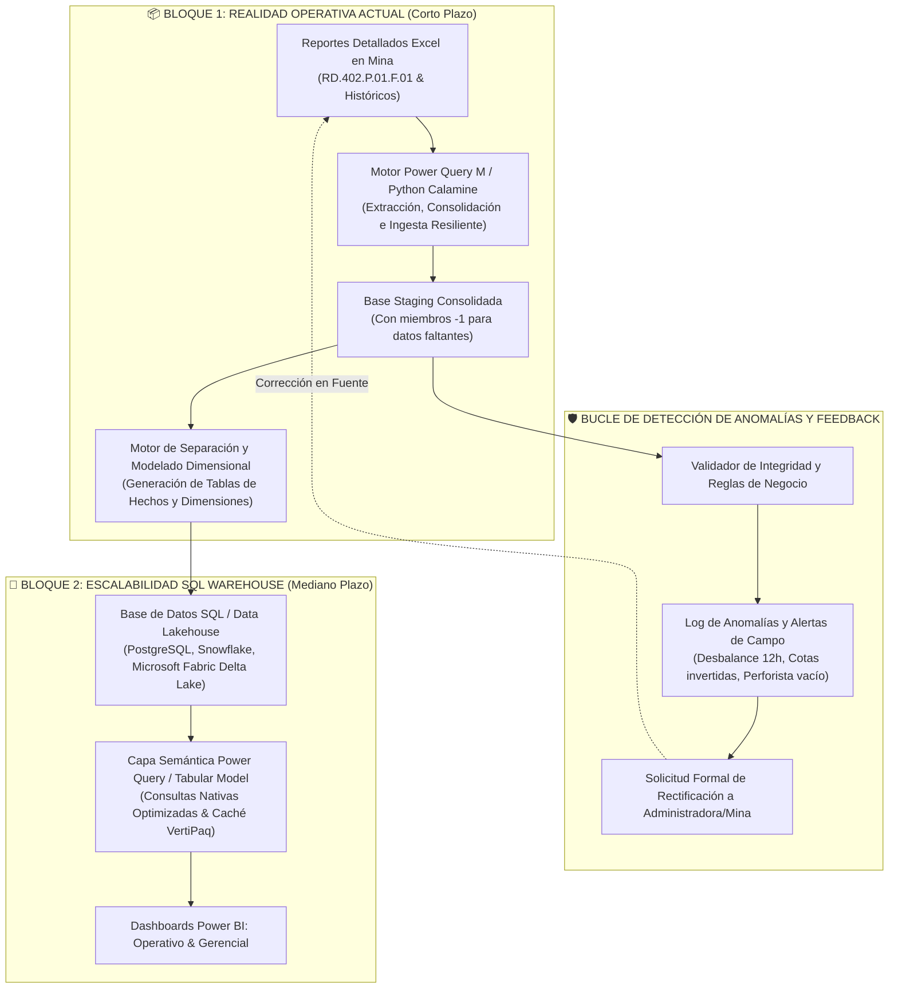
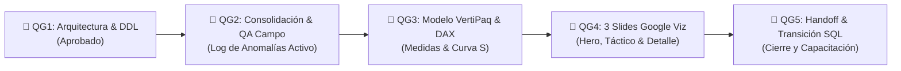

# 04. Plan de Gobernanza del Proyecto, Enfoque en Dos Bloques y Quality Gates
**Proyecto**: Sistema Unificado de Business Intelligence y Analítica de Perforación  
**Ubicación**: `C:/Proyectos Python/Detallados/docs/04_PLAN_GOBERNANZA_WBS_Y_QUALITY_GATES.md`  
**Organización**: Rockdrill Group  
**Auditor Principal**: `project_governance_auditor`  
**Framework de Gestión**: PMI PMBOK & Data Governance Institute (DGI)  

---

## 🏗️ 1. Arquitectura de Gobernanza en Dos Bloques (Pies en la Tierra)

Reconociendo que la fuente de verdad actual reside en los reportes detallados Excel llenados por personas en campo, la implementación se estructura en **dos bloques evolutivos sin retrabajo**:

### 🔹 Bloque 1: Extracción, Consolidación y Deconstrucción Dimensional (Corto Plazo)
* **Objetivo:** Recopilar y estandarizar todos los detallados provenientes de los 18 contratos mineros mediante conectores de Power Query M y scripts Calamine de alta velocidad.
* **Separación de Datos:** Deconstruir la base monolítica en tablas de hechos (`fact_perforacion_avance`, `fact_horas_operativas`, `fact_metas_mensuales`) y dimensiones normalizadas.
* **Resiliencia:** Si faltan datos (ej. perforista no registrado, insumo en blanco), el sistema no explota; asigna automáticamente la llave `sk = -1` (`[NO ESPECIFICADO]`) y marca la fila para auditoría.

### 🔹 Bloque 2: Persistencia en SQL Warehouse y Capa Semántica (Mediano Plazo)
* **Objetivo:** Migrar el almacenamiento a un motor SQL nativo (PostgreSQL / Snowflake / Fabric) utilizando el DDL provisto en [`sql/01_schema_ddl_enterprise.sql`](file:///C:/Proyectos%20Python/Detallados/sql/01_schema_ddl_enterprise.sql).
* **Eficiencia:** La limpieza y estructuración semántica se mantiene en Power Query / VertiPaq, garantizando consultas sub-segundo y cero retrabajo arquitectural.

---

## 🛡️ 2. Protocolo de Detección de Anomalías de Campo (Sin Auto-Reparación Ciega)

Dado que la calidad de la analítica depende de la veracidad de los datos capturados por personas en mina, el pipeline **no repara a ciegas ni asume datos ficticios**, sino que aísla las anomalías y genera un **Informe de Rectificación para Campo**:

| Código de Anomalía | Condición Detectada | Riesgo de Negocio | Acción de Rectificación Requerida |
| :--- | :--- | :--- | :--- |
| `ERR_BALANCE_HORAS` | Suma de guardia $\neq 12.0\text{ h}$ ($<11.5\text{h}$ o $>12.5\text{h}$) | Distorsión de Disponibilidad Mecánica y horas cobrables | Solicitar a la administradora el balanceo de la bitácora diaria |
| `ERR_MONOTONIA_COTAS` | Cota $HASTA < DESDE$ o $METRAJE \neq HASTA - DESDE$ | Inconsistencia en avance físico y riesgo de sobre-facturación | Rectificar las cotas físicas con el reporte diario del perforista |
| `ERR_PERFORISTA_NULO` | Campo perforista vacío o texto no identificable | Pérdida de trazabilidad en el ranking de rendimiento | Asignar temporalmente `sk = -1` y solicitar fotocheck a la mina |
| `ERR_TIEMPO_NO_CATALOGADO` | Actividad no reconocida en los 17 bloques | Pérdida de visibilidad en paradas y cobrabilidad | Asignar temporalmente `sk = -1` y mapear al catálogo canónico |
| `ERR_DESCUADRE_F04` | Metraje diario detallado $\neq$ Reporte Control Interno | Discrepancia en conciliación de valorizaciones | Cruzar con el Residente de Mina para cuadratura al 100.00% |

---

## 🚪 3. Marco de 5 Quality Gates (Auditoría Formal)

| Quality Gate | Criterios de Aprobación Auditados por `project_governance_auditor` |
| :---: | :--- |
| **QG1** | • Esquema Kimball con llaves subrogadas enteras (`_sk`) y soporte de miembros desconocidos (`-1`). • Soporte estructural para reperforaciones y ramales paralelos. • DDL ANSI SQL validado. |
| **QG2** | • Ingesta resiliente de archivos Excel (cero caídas por celdas vacías). • Generación activa del Log de Anomalías de Campo. • Cobertura de pruebas unitarias $> 95\%$. |
| **QG3** | • Modelo tabular en estrella con relaciones 1:N unidireccionales. • Conciliación del 100.00% de metraje contra Control Interno. • Medidas DAX de DM %, Penetración M/H y prorrateo 26 al 25. |
| **QG4** | • Cumplimiento de los 3 Slides bajo principios Google Data Viz (Hero Slide, Control Táctico y Desglose Granular). • Tiempo de respuesta en slicers $< 1.0\text{ s}$. |
| **QG5** | • Sincronización viva de la documentación en Obsidian y Graphify. • Plan de transición al Bloque 2 (SQL Warehouse) documentado y listo. |
