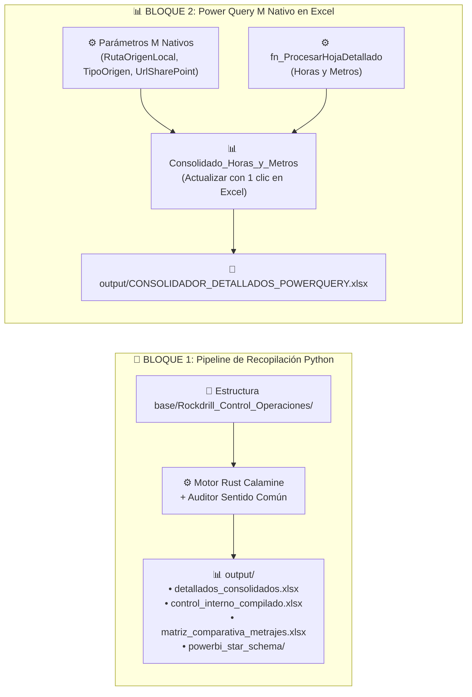

# 05. Guía de Arquitectura Modular y Power Query Nativo en Excel
**Proyecto**: Sistema Unificado de Business Intelligence y Analítica de Perforación  
**Ubicación**: `C:/Proyectos Python/Detallados/docs/05_GUIA_CONSTRUCCION_EXCEL_POWERQUERY_Y_MCP.md`  
**Libro Excel Nativo**: [`C:/Proyectos Python/Detallados/output/CONSOLIDADOR_DETALLADOS_POWERQUERY.xlsx`](file:///C:/Proyectos%20Python/Detallados/output/CONSOLIDADOR_DETALLADOS_POWERQUERY.xlsx)  
**Código M Puro**: [`C:/Proyectos Python/Detallados/power_query_m/CONSULTAS_POWERQUERY_M_PARAMETRIZADAS.txt`](file:///C:/Proyectos%20Python/Detallados/power_query_m/CONSULTAS_POWERQUERY_M_PARAMETRIZADAS.txt)  
**Organización**: Rockdrill Group  

---

## 📦 1. Arquitectura Separada en Dos Bloques ("Docker-Style")

El sistema se estructura en **dos bloques desacoplados e independientes**:

---

## 🎯 2. Foco Estratégico Exclusivo: Horas y Metros

Siguiendo la directiva de negocio, la ingesta y consultas de Power Query se concentran estrictamente en los dos motores de rentabilidad de la perforación:

1. **Metraje de Perforación (`METRAJE`)**:
   - Medición por cota ($HASTA - DESDE$) y avance por guardia.
   - Asociación a la clave de conciliación `ID_CLAVE_UNICA = YYYYMMDD-MAQUINA-TURNO`.
2. **Distribución de Horas Operativas e Inoperativas**:
   - `Perforación` (Horas efectivas).
   - `TOTAL MANTTO.` (Mantenimiento no cobrable).
   - `TOTAL STAND BY OPERATIVO` (Standby operativo cobrable).
   - `TOTAL STAND BY INOPERATIVO` (Standby inoperativo no cobrable).
   - `TOTAL STAND BY CLIENTE` (Standby imputable al cliente cobrable).
   - `TOTAL HOROMETRO` (Lectura acumulada de horómetro).

---

## ⚡ 3. Funcionamiento de las Consultas Nativas en Excel

El archivo [`CONSOLIDADOR_DETALLADOS_POWERQUERY.xlsx`](file:///C:/Proyectos%20Python/Detallados/output/CONSOLIDADOR_DETALLADOS_POWERQUERY.xlsx) contiene los objetos COM y Power Query M inyectados en el modelo de datos de Excel:

### ¿Cómo actualizar los datos en Excel?
1. Abre el archivo en Microsoft Excel.
2. Ve a la pestaña **Datos** $\rightarrow$ **Actualizar todo** (o `Ctrl + Alt + F5`).
3. Power Query ejecutará las consultas M de forma transparente en segundo plano, leerá todas las carpetas `CTR_*/02_Detallado/` y volcará los datos consolidados.

### ¿Cómo modificar o inspeccionar los parámetros?
1. En Excel, ve a **Datos** $\rightarrow$ **Consultas y conexiones** $\rightarrow$ **Editor de Power Query**.
2. En el panel izquierdo verás la sección de **Parámetros**:
   - `RutaOrigenLocal`: Cambia la ruta de la carpeta si te trasladas de equipo.
   - `TipoOrigen`: Cambia entre `"LOCAL"` y `"CLOUD"`.
   - `UrlSharePoint`: URL de la biblioteca en SharePoint Online.
