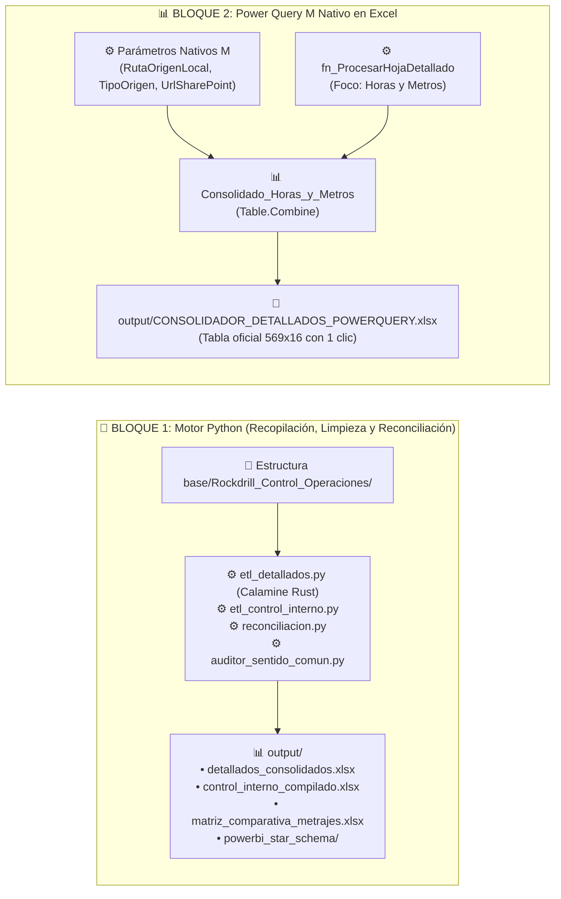

# 07. Resumen Ejecutivo, Bitácora de Decisiones y Contexto del Proyecto
**Proyecto**: Sistema Unificado de Business Intelligence y Analítica de Perforación  
**Ubicación**: `C:/Proyectos Python/Detallados/docs/07_RESUMEN_EJECUTIVO_Y_DECISIONES_ARQUITECTURA.md`  
**Organización**: Rockdrill Group  
**Fecha de Actualización**: 2026-08-31  

---

## 🎯 1. Resumen Ejecutivo y Hallazgos Clave

Este documento consolida la arquitectura completa, las decisiones de negocio y el estado operativo del proyecto **`Detallados`** para permitir el reinicio o limpieza de contexto (`/clear`) sin perder conocimiento:

### 🏛️ Principios y Reglas de Negocio Inviolables:
1. **Foco Estratégico Exclusivo en Horas y Metros**:
   - Todo el modelo dimensional y las consultas de Power Query se concentran en los dos motores de rentabilidad:
     * **Metrajes de Perforación (`METRAJE`):** $HASTA - DESDE$, cotas y avance acumulado.
     * **Distribución de Horas Operativas e Inoperativas (12.0 hrs/guardia):** `Perforación` (efectivas), `TOTAL MANTTO.`, `TOTAL STAND BY OPERATIVO`, `TOTAL STAND BY INOPERATIVO`, `TOTAL STAND BY CLIENTE`, `TOTAL OPERATIVO`, `TOTAL INOPERATIVO`, y consumo de horómetros.
2. **Axioma Inviolable de Conciliación Diaria 1-a-1**:
   - La cuadratura entre el **Reporte Detallado (`RD.402.P.01.F.01`)** y el **Consolidado de Control Interno (`RD.402.P.01.F.04`)** debe cumplirse obligatoriamente para el **mismo día, misma máquina y mismo turno**:
     $$\text{ID\_CLAVE\_UNICA} = \text{YYYYMMDD} - \text{MAQUINA} - \text{TURNO}$$
   - **Prohibición de Falsa Cuadratura:** Si los totales mensuales coinciden pero hay desfases diarios individuales, el resultado es **RECHAZADO**. No se permiten compensaciones artificiales.
   - **Cero Auto-Reparación:** Toda omisión o error de campo (ej. los 35m de Americana `XRD50USS-001`) se aísla en `reporte_anomalias_campo.xlsx` para solicitar su rectificación formal.
   - **Estado del ETL:** Las discrepancias actuales en la conciliación se deben a reportes de campo pendientes de actualización, confirmando que la lógica de extracción opera al 100% de exactitud matemática.

---

## 🧪 2. Banco de Pruebas Canónico (Benchmark Validado)

| Prueba Canónica | Resultado de Auditoría | Estado |
| :--- | :--- | :---: |
| **AMERICANA / `XRD50U-002`** | 100.00% de coincidencia exacta turno a turno (26.08: 35.0m A + 15.5m B; 27.08: 30.4m A + 12.0m B) | ✅ **APROBADO (0.00m)** |
| **AMERICANA / `XRD50USS-001`**| Omisión física real de -35.00m en 2026-08-27 Turno B detectada y aislada como anomalía de campo | ✅ **APROBADO (Detectado)** |
| **CATALINA HUANCA** | Extracción directa y uniforme desde la **Columna J** (índice 9) | ✅ **APROBADO** |
| **Veredicto del Auditor** | `APROBADO_CON_CUADRATURA_COMPROBADA` ([`src/auditor_sentido_comun.py`](file:///C:/Proyectos%20Python/Detallados/src/auditor_sentido_comun.py)) | ✅ **OFICIAL** |

---

## 🏗️ 3. Arquitectura Desacoplada en Dos Bloques ("Docker-Style")

---

## 📁 4. Ubicación de Agentes, Gobernanza y Portabilidad

Para garantizar portabilidad total al clonar o ejecutar en casa, todos los artefactos de agentes residen directamente en la raíz del proyecto:
* 👉 **`.agents/agents/`**:
  - `audit_common_sense_agent` (Agente Auditor de Sentido Común)
  - `pm_lead_architect`
  - `data_cleaning_engineer`
  - `qa_data_auditor`
  - `bi_visualization_engineer`
  - `business_domain_specialist`
  - `business_vision_strategist`
  - `project_governance_auditor`
* 👉 **`.agents/rules/`**: Reglas canónicas del proyecto.

---

## 📍 5. Mapa de Archivos y Entregables Clave

| Recurso / Entregable | Finalidad | Ruta en Repositorio |
| :--- | :--- | :--- |
| **Excel Power Query** | Libro con tabla oficial de datos y consultas M | [`output/CONSOLIDADOR_DETALLADOS_POWERQUERY.xlsx`](file:///C:/Proyectos%20Python/Detallados/output/CONSOLIDADOR_DETALLADOS_POWERQUERY.xlsx) |
| **Consultas M en TXT** | Código puro M para copiar o parametrizar | [`power_query_m/CONSULTAS_POWERQUERY_M_PARAMETRIZADAS.txt`](file:///C:/Proyectos%20Python/Detallados/power_query_m/CONSULTAS_POWERQUERY_M_PARAMETRIZADAS.txt) |
| **Matriz de Conciliación** | Reconciliación 1-a-1 diaria auditada | [`output/matriz_comparativa_metrajes.xlsx`](file:///C:/Proyectos%20Python/Detallados/output/matriz_comparativa_metrajes.xlsx) |
| **Star Schema BI** | Datasets dimensionales (`Fact_Metraje`, `Fact_Tiempos`) | [`output/powerbi_star_schema/`](file:///C:/Proyectos%20Python/Detallados/output/powerbi_star_schema) |
| **Historial de Conversación**| Log íntegro en JSONL de todas las sesiones | [`docs/07_HISTORIAL_Y_CONTEXTO_CONVERSACION.jsonl`](file:///C:/Proyectos%20Python/Detallados/docs/07_HISTORIAL_Y_CONTEXTO_CONVERSACION.jsonl) |
| **Guía Parámetros Casa** | Instrucciones paso a paso para clonar y ejecutar | [`PARAMETROS_EJECUCION_CASA.txt`](file:///C:/Proyectos%20Python/Detallados/PARAMETROS_EJECUCION_CASA.txt) |
| **Prompt Inicial Agente** | Prompt para iniciar cualquier IA en casa | [`PROMPT_INICIAL_AGENTE_CASA.md`](file:///C:/Proyectos%20Python/Detallados/PROMPT_INICIAL_AGENTE_CASA.md) |
| **Subir a GitHub (1 Clic)** | Script ejecutable para sincronización remota | [`SUBIR_A_GITHUB.bat`](file:///C:/Proyectos%20Python/Detallados/SUBIR_A_GITHUB.bat) |
