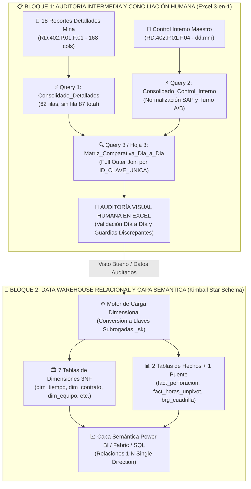
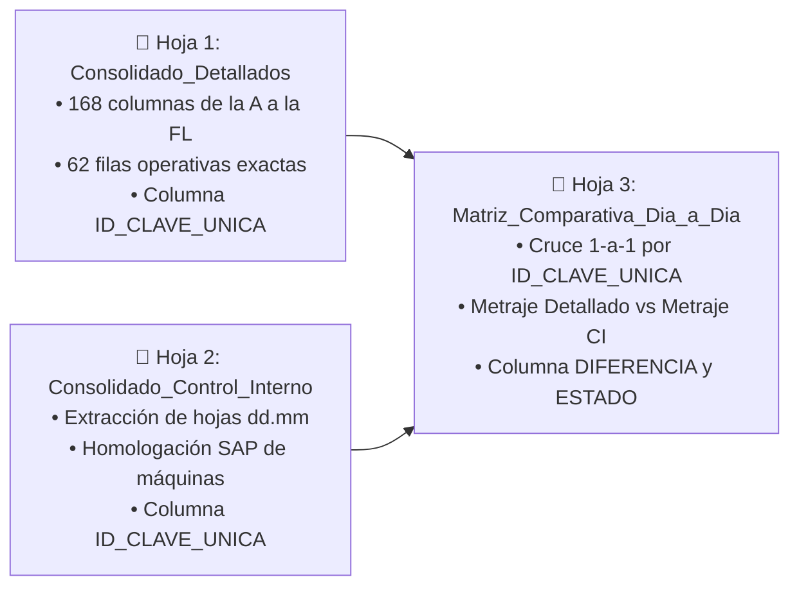

# 08. Plan de Implementación: Estructura Relacional Empresarial y Protocolo de Auditoría Humana (Sincerado)
**Proyecto**: Sistema Unificado de Business Intelligence y Analítica de Perforación  
**Ubicación**: `C:/Proyectos Python/Detallados/docs/08_PLAN_IMPLEMENTACION_ESTRUCTURA_RELACIONAL_SINCERADA.md`  
**Organización**: Rockdrill Group  
**Auditor Principal**: `audit_common_sense_agent` & Auditor Humano en Mina  
**Framework**: Kimball Dimensional Modeling & ANSI SQL  

---

## 📌 1. Fundamento Arquitectónico y Enfoque en Dos Bloques

Siguiendo las especificaciones maestras de [`docs/01_ARQUITECTURA_EMPRESARIAL_ERD_Y_SQL.md`](file:///C:/Proyectos%20Python/Detallados/docs/01_ARQUITECTURA_EMPRESARIAL_ERD_Y_SQL.md), [`docs/04_PLAN_GOBERNANZA_WBS_Y_QUALITY_GATES.md`](file:///C:/Proyectos%20Python/Detallados/docs/04_PLAN_GOBERNANZA_WBS_Y_QUALITY_GATES.md) y el estándar DDL [`sql/01_schema_ddl_enterprise.sql`](file:///C:/Proyectos%20Python/Detallados/sql/01_schema_ddl_enterprise.sql), la arquitectura se divide en dos bloques operativos:

> [!IMPORTANT]
> **Regla de Gobernanza Inviolable (Puerta de Calidad Humana):**  
> Ningún dato debe transitar a las tablas de hechos y dimensiones del Data Warehouse sin antes haber pasado por la **auditoría visual humana en el libro Excel 3-en-1**. La clave primaria natural `ID_CLAVE_UNICA` (`YYYYMMDD-MAQUINA-TURNO`) existe específicamente para permitir la comparación celda por celda por parte de una persona real.

---

## 📑 2. El Entregable Inmediato: Libro Excel de Auditoría 3-en-1

Para habilitar la auditoría humana día a día, se han generado 3 consultas Power Query M en [`apppowerbi/00_CONSULTAS_AUDITORIA_3_EN_1.txt`](file:///C:/Proyectos%20Python/Detallados/apppowerbi/00_CONSULTAS_AUDITORIA_3_EN_1.txt):

### 🔍 Estructura de Columnas en la Hoja 3 (`Matriz_Comparativa_Dia_a_Dia`):
1. **`FECHA`**: Fecha de la guardia (formato `YYYY-MM-DD`).
2. **`CTR`**: Contrato normalizado (ej. `AMERICANA`, `CHUNGAR`, `COBRIZA`).
3. **`MAQUINA`**: Código de máquina oficial homologado a SAP (ej. `XRD90U-021`, `LF90D ST-002`).
4. **`TURNO`**: Turno estandarizado (`A` = Día, `B` = Noche).
5. **`METRAJE_DETALLADOS_M`**: Metraje total extraído del reporte detallado `RD.402.P.01.F.01`.
6. **`METRAJE_CONTROL_INTERNO_M`**: Metraje reportado en Control Interno `RD.402.P.01.F.04`.
7. **`DIFERENCIA_M`**: `[METRAJE_DETALLADOS_M] - [METRAJE_CONTROL_INTERNO_M]`.
8. **`ESTADO_AUDITORIA`**: 
   * `✅ CUADRA EXACTO` ($|\Delta| < 0.01\text{ m}$)
   * `⚠️ DIFERENCIA DECIMAL MENOR` ($|\Delta| < 2.00\text{ m}$)
   * `❌ PENDIENTE EN DETALLADO` (Reportado en CI pero en 0.00m en Detallado)
   * `⚠️ SOLO EN DETALLADO` (Reportado en Detallado pero no en CI)
   * `❌ DISCREPANCIA REAL` (Variación mayor a 2m para revisión con mina)
9. **`ID_CLAVE_UNICA`**: Identificador único (`20260830-XRD90U-021-A`).

---

## 🏛️ 3. Plan de Implementación de la Estructura Relacional (Sincerado con 168 Columnas)

Una vez completada la auditoría humana, los datos se estructuran en el **Modelo Dimensional Kimball de Grado Empresarial**:

### 📐 Arquitectura de Llaves Duales:
* **En Capa Staging / Auditoría:** Llave Natural de Texto `ID_CLAVE_UNICA` (`YYYYMMDD-MAQUINA-TURNO`) para trazabilidad humana y cruces rápidos en Excel.
* **En Capa Data Warehouse / Power BI:** **Llaves Subrogadas Enteras (`_sk`)** de 4 bytes para compresión columnar VertiPaq, JOINs en nanosegundos y soporte de miembros desconocidos (`sk = -1`).

```mermaid
erDiagram
    dim_tiempo_calendario ||--o{ fact_perforacion_avance : "calendario_sk (1:N)"
    dim_tiempo_calendario ||--o{ fact_horas_operativas : "calendario_sk (1:N)"
    dim_tiempo_calendario ||--o{ brg_cuadrilla_guardia : "calendario_sk (1:N)"
    
    dim_contrato_minero ||--o{ fact_perforacion_avance : "contrato_sk (1:N)"
    dim_contrato_minero ||--o{ fact_horas_operativas : "contrato_sk (1:N)"
    dim_contrato_minero ||--o{ fact_metas_mensuales : "contrato_sk (1:N)"
    
    dim_equipo_perforadora ||--o{ fact_perforacion_avance : "equipo_sk (1:N)"
    dim_equipo_perforadora ||--o{ fact_horas_operativas : "equipo_sk (1:N)"
    dim_equipo_perforadora ||--o{ fact_metas_mensuales : "equipo_sk (1:N)"
    dim_equipo_perforadora ||--o{ brg_cuadrilla_guardia : "equipo_sk (1:N)"
    
    dim_linea_diametro ||--o{ fact_perforacion_avance : "linea_sk (1:N)"
    
    dim_personal ||--o{ fact_perforacion_avance : "perforista_sk (1:N)"
    dim_personal ||--o{ brg_cuadrilla_guardia : "personal_sk (1:N)"
    
    dim_sondaje_taladro ||--o{ fact_perforacion_avance : "sondaje_sk (1:N)"
    dim_taxonomia_actividad ||--o{ fact_horas_operativas : "actividad_sk (1:N)"

    dim_tiempo_calendario {
        INT calendario_sk PK "YYYYMMDD o -1"
        DATE fecha_dt
        SMALLINT anio_operativo
        VARCHAR mes_anio_operativo "ENE-26"
        INT periodo_operativo_sort "202601"
        BOOLEAN es_cierre_operativo "Día 25"
    }

    dim_contrato_minero {
        SMALLINT contrato_sk PK "-1 si falta"
        VARCHAR contrato_cd "COLQUIJIRCA, RAURA"
        VARCHAR cliente_minero
        VARCHAR zona_geografica
        VARCHAR tipo_operacion "SUBTERRANEA, SUPERFICIE"
    }

    dim_equipo_perforadora {
        SMALLINT equipo_sk PK "-1 si falta"
        VARCHAR equipo_cd "XRD80WDTH-001"
        VARCHAR codigo_sap "SAP-XRD80"
        VARCHAR modelo_fabricante
        SMALLINT contrato_sk_asignado FK
    }

    dim_linea_diametro {
        SMALLINT linea_sk PK "-1 si falta"
        VARCHAR linea_cd "HQ, NQ, BQ, PQ, HWT"
        DECIMAL diametro_corona_mm
        DECIMAL diametro_testigo_mm
    }

    dim_personal {
        INT personal_sk PK "-1 si falta"
        VARCHAR personal_cd "DNI / Fotocheck"
        VARCHAR nombre_completo
        VARCHAR rol_estandarizado "PERFORISTA, AYUDANTE"
    }

    dim_sondaje_taladro {
        INT sondaje_sk PK "-1 si falta"
        VARCHAR sondaje_cd "CND-24-015"
        SMALLINT contrato_sk FK
        INT sondaje_padre_sk FK "Ramales"
        VARCHAR tipo_taladro "ORIGINAL, RAMAL, REPERFO"
    }

    dim_taxonomia_actividad {
        SMALLINT actividad_sk PK "-1 si falta"
        VARCHAR nombre_actividad "116 actividades"
        VARCHAR bloque_funcional "17 bloques"
        VARCHAR categoria_disponibilidad "5 categorías"
        BOOLEAN es_cobrable
        BOOLEAN impacta_disp_mecanica
    }

    fact_perforacion_avance {
        BIGINT avance_id PK
        INT calendario_sk FK
        SMALLINT contrato_sk FK
        SMALLINT equipo_sk FK
        INT sondaje_sk FK
        INT perforista_sk FK
        SMALLINT linea_sk FK
        VARCHAR turno_guardia "A, B"
        DECIMAL desde_m
        DECIMAL hasta_m
        DECIMAL metraje_guardia_m
        BOOLEAN es_reperforacion
        VARCHAR id_clave_unica "Llave de Auditoría"
    }

    fact_horas_operativas {
        BIGINT hora_evento_id PK
        INT calendario_sk FK
        SMALLINT contrato_sk FK
        SMALLINT equipo_sk FK
        SMALLINT actividad_sk FK
        VARCHAR turno_guardia "A, B"
        DECIMAL horas_reportadas "0 a 24h"
        BOOLEAN es_cobrable
        VARCHAR categoria_disponibilidad
        VARCHAR id_clave_unica "Llave de Auditoría"
    }

    brg_cuadrilla_guardia {
        BIGINT asignacion_id PK
        INT calendario_sk FK
        SMALLINT equipo_sk FK
        INT personal_sk FK
        VARCHAR rol_desempenado "PERFORISTA, AYUDANTE 1, AYUDANTE 2"
        DECIMAL horas_laboradas "12h"
        VARCHAR id_clave_unica "Llave de Auditoría"
    }
```

---

## 🗺️ 4. Mapeo Sincerado de las 168 Columnas Oficiales a las Tablas de Destino

| Rango de Columnas Excel | Bloque Funcional Original | Tabla Dimensional / Hechos de Destino | Tratamiento en Modelo |
| :--- | :--- | :--- | :--- |
| **Cols A a G (0 a 6)** | Metadatos Generales (Fecha, Sondaje, Línea, Perforista, Ayudantes, Turno) | `dim_tiempo_calendario` `dim_sondaje_taladro` `dim_linea_diametro` `dim_personal` `brg_cuadrilla_guardia` | Se normalizan en dimensiones con llaves enteras (`_sk`) y miembros desconocidos (`-1`). Las cuadrillas pasan a la tabla puente. |
| **Cols H a J (7 a 9)** | Avance Físico (Desde, Hasta, Metraje) | `fact_perforacion_avance` | Se almacenan como métricas continuas, calculando avance neto y discriminando reperforaciones. |
| **Cols K a N (10 a 13)** | Tiempos Operativos Directos (Perforación, Rimado, Casing, Reperfo) | `fact_horas_operativas` | Unpivoting a filas: `categoria_disponibilidad = 'Tiempo Efectivo'`, `es_cobrable = TRUE`. |
| **Cols O y P (14 y 15)** | Mantenimiento (Preventivo, Correctivo) | `fact_horas_operativas` | Unpivoting a filas: `categoria_disponibilidad = 'Mantenimiento'`, `impacta_disp_mecanica = TRUE`. |
| **Cols Q a AI (16 a 34)** | Maniobras Operativas (19 Maniobras) | `fact_horas_operativas` | Unpivoting a filas: `categoria_disponibilidad = 'Stand By Operativo'`. |
| **Cols AJ a BC (35 a 54)** | Ensayos Geotécnicos (20 Ensayos) | `fact_horas_operativas` | Unpivoting a filas: `categoria_disponibilidad = 'Stand By Operativo'`, `es_cobrable = TRUE`. |
| **Cols BD a BX (55 a 75)** | Soporte y Seguridad (21 Actividades) | `fact_horas_operativas` | Unpivoting a filas: `categoria_disponibilidad = 'Stand By Inoperativo'`, `es_cobrable = FALSE`. |
| **Cols BY a CY (76 a 102)** | Condiciones Cliente (27 Eventos) | `fact_horas_operativas` | Unpivoting a filas: `categoria_disponibilidad = 'Stand By Cliente'`, `es_cobrable = TRUE`. |
| **Cols CZ a FL (103 a 167)** | Insumos, Aditivos y Diamantados (65 Columnas) | `dim_catalogo_insumo` `fact_consumo_insumos` *(Fase 3)* | Catálogo de insumos con familias (Lodos, Grasas, Brocas, Escariadores). |

---

## 🚦 5. Próximos Pasos y Secuencia de Ejecución

1. **Paso 1 (Inmediato):** Copiar y pegar las consultas de [`apppowerbi/00_CONSULTAS_AUDITORIA_3_EN_1.txt`](file:///C:/Proyectos%20Python/Detallados/apppowerbi/00_CONSULTAS_AUDITORIA_3_EN_1.txt) en el libro Excel de auditoría.
2. **Paso 2 (Humano):** El usuario/auditor revisa la hoja 3 (`Matriz_Comparativa_Dia_a_Dia`) y valida visualmente las discrepancias.
3. **Paso 3 (Aprobación):** Una vez firmado el visto bueno de la conciliación, se aprueba la ejecución del script ETL para poblar el modelo dimensional definitivo.
