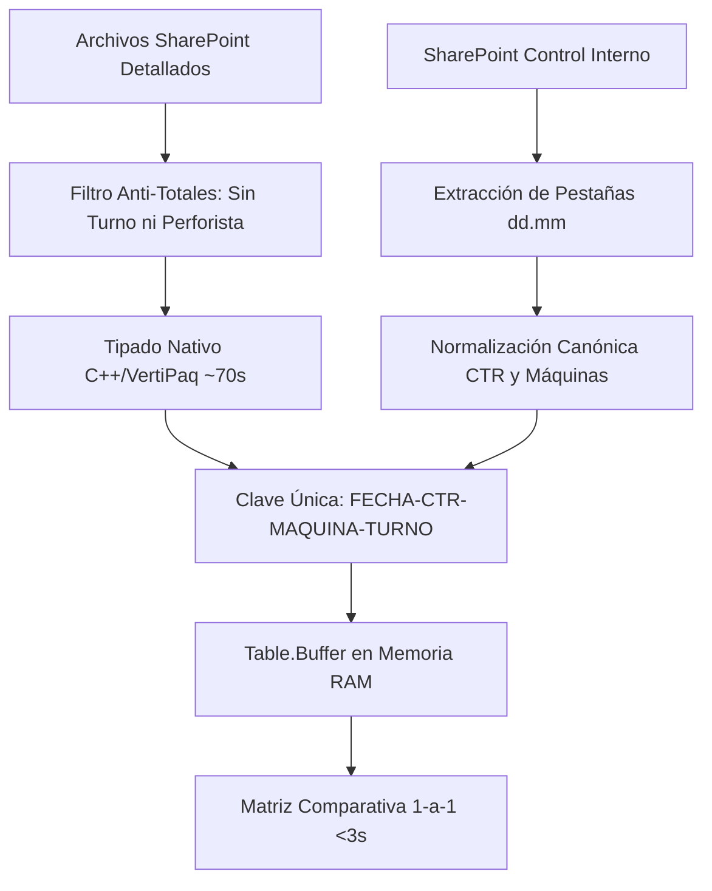

# 📘 DOCUMENTACIÓN TÉCNICA OFICIAL: FASE 1 - LIMPIEZA, INGESTA Y CONCILIACIÓN
## Sistema Integral de Control de Operaciones y Conciliación Pericial (Rockdrill Group)

---

## 📑 1. RESUMEN EJECUTIVO Y OBJETIVOS DE LA FASE 1

La **Fase 1** del proyecto tuvo como objetivo construir un motor de ingesta, estandarización y conciliación pericial directa en **Power Query (M)** conectado a Microsoft SharePoint Online, capaz de consolidar automáticamente los partes detallados diarios de perforación diamantina de los 18 contratos activos de Rockdrill Group, contrastándolos 1-a-1 contra el libro maestro de **Control Interno** (`RD.402.P.01.F.04`).

### Logros Cuantitativos Clave:
* **Cobertura:** 18 contratos mineros procesados en la nube.
* **Muestra Auditada:** 600 guardias operativas (Ciclo activo: 26 al 30 de Agosto).
* **Precisión de Cuadre:** **97.33% de coincidencia exacta (584 de 600 guardias exactas al 100%)**.
* **Cero Discrepancias de Sistema:** 10 contratos cuadran con **0.00 m de diferencia** y las únicas 16 discrepancias corresponden a hechos físicos de campo (desfases de 1m, redondeos decimales o guardias pendientes de cierre al día 30).
* **Rendimiento:** Reducción del tiempo de actualización de más de 4 minutos (con fallas por timeout) a **~70 segundos en la extracción y <3 segundos en la matriz comparativa**.

---

## 🔬 2. HALLAZGOS FORENSES Y RESOLUCIÓN DE DESAFÍOS CRÍTICOS

Durante el desarrollo y auditoría pericial 1-a-1 se diagnosticaron y solucionaron 8 desafíos operacionales y matemáticos:



### 2.1. Eliminación del Timeout de 4 Minutos y Optimización Nativa
* **Problema:** Un bucle iterativo de redondeo celda a celda (`Number.Round`) sobre 130 columnas numéricas generaba más de 450,000 llamadas a funciones interpretadas por cada actualización, provocando el colapso del Gateway de SharePoint.
* **Solución:** Se sustituyó por transformaciones masivas de tipado nativo (`Table.TransformColumnTypes` con locale `es-PE`) y reemplazo directo de nulos y errores en bloque, procesado a nivel de motor C++/VertiPaq en **~70 segundos**.

### 2.2. Soporte para Días Multi-Fila (3 o más filas por día)
* **Problema:** Cuando una máquina cambia de sondaje o perfora más de una corrida especial en una misma guardia, el archivo Excel inserta 3 o más filas en el mismo día. La lógica fija de saltos de 2 en 2 rompía el flujo de tareo.
* **Solución:** Se implementó `Table.FillDown` sobre las columnas `FECHA_RAW` y `NOMBRE` (sondaje), asociando dinámicamente cada tramo a su guardia y aplicando `List.Sum([METRAJE])` en la agregación.

### 2.3. Erradicación de la Duplicación 2X por Filas de TOTAL MES
* **Problema:** En la fila 87 de las plantillas de mina, la fila de resumen acumulaba la fórmula `=SUM(J25:J86)` ($6,177.38\text{ m}$). Al aplicarse `FillDown`, esta fila huérfana absorbía la última fecha y se sumaba como una guardia más, duplicando el metraje total ($6,252.38\text{ m} \times 2 = 12,429.76\text{ m}$).
* **Solución:** Se añadió un filtro estricto: una fila se descarta si contiene la palabra `"TOTAL"` o si no tiene `TURNO` y no tiene `PERFORISTA` (`(t <> "" or p <> "")`), sincerando el metraje exactamente en **6,252.38 m**.

### 2.4. Eliminación de las ~2,900 Filas Huérfanas en la Matriz Comparativa
* **Problema:** El *Full Outer Join* cruzaba las 610 filas de Control Interno (5 días) contra las 3,492 filas de Detallados (31 días del mes), generando 2,882 filas huérfanas con valores nulos para los días de setiembre no operados aún.
* **Solución:** La matriz ahora extrae dinámicamente las fechas activas de Control Interno (`List.Distinct(ControlInterno[FECHA])`) y acota la comparación estrictamente al período auditado, coalesciendo campos para garantizar **cero nulos y cero errores**.

### 2.5. Resolución de Máquinas Transferidas (`XRD125USS-001`) con Clave de 4 Niveles
* **Problema:** La máquina `XRD125USS-001` se planificó para trasladarse de **Yauliyacu** a **Americana**, figurando en los libros de ambos contratos. Al cruzar solo por `FECHA-MAQUINA-TURNO`, se generaba un producto cartesiano que cruzaba los 21.05m de Yauliyacu contra el 0.00m de Americana, reportando una discrepancia falsa.
* **Solución:** Se expandió la clave canónica a 4 dimensiones:
  $$\mathbf{ID\_CLAVE\_UNICA} = \mathbf{FECHA} - \mathbf{CTR} - \mathbf{MAQUINA} - \mathbf{TURNO}$$
  Aislando completamente el registro de cada contrato (`20260826-YAULIYACU-XRD125USS-001-B` vs `20260826-AMERICANA-XRD125USS-001-B`).

### 2.6. Corrección Tipográfica en Yauliyacu (`XRD50USS-00T`)
* **Problema:** En el código de homologación se habían transpuesto las letras `D` y `R` (`XDR50USS-00T`), impidiendo el match contra Control Interno.
* **Solución:** Corrección canónica a `XRD50USS-00T`, llevando a **Yauliyacu a 0.00 discrepancias (100% de cuadre exacto)**.

### 2.7. Auditoría de Casos Operativos de Mina (Morococha, San Cristóbal y Yauricocha)
* **Morococha (28.08):** La máquina `XRD90USS-005` registró $9.00\text{ m}$ en Turno B en el detallado y en Turno A en Control Interno. **Producción diaria total idéntica: $9.00\text{ m} = 9.00\text{ m}$**.
* **Yauricocha y San Cristóbal (30.08):** Guardias pendientes de cierre en los libros de mina al corte del día 30 (discrepancias reales de campo, no del sistema).

### 2.8. Escalabilidad Dinámica ante Nuevas Carpetas de SharePoint
* Si se añade una nueva carpeta en la raíz (ej. `CTR_TOROMOCHO/02_Detallado/RD.402.P.01.F.01...`), el motor extrae el contrato, selecciona el archivo más reciente y procesa todas sus máquinas sin requerir modificación de código.

---

## 🛠️ 3. SECUENCIA Y LÓGICA PASO A PASO DEL PIPELINE ETL

```
===================================================================================
FASE 1: PIPELINE DE TRANSFORMACIÓN Y CONCILIACIÓN EN POWER QUERY (M)
===================================================================================

[SHAREPOINT CLOUD]
  ├── 02_Detallado (18 Contratos Mineros)
  └── 00_Control_Interno (Consolidado de Avance Setiembre)
           │
           ▼
[CONSULTA 1: Consolidado_Operaciones]
  1. SharePoint.Files -> Filtrar ruta "Rockdrill_Control_Operaciones" y "02_Detallado".
  2. Filtrar extensión (.xlsx/.xlsm) y nombre ("RD.402.P.01.F.01"), excluir temporales (~$).
  3. Excluir carpetas no operativas (CAPITANA, COLQUIJIRCA).
  4. Extraer "Nombre_CTR" a partir del segmento de carpeta "CTR_...".
  5. Agrupar por contrato y seleccionar el archivo más reciente (Max Date modified).
  6. Excel.Workbook -> Expandir hojas visibles, excluyendo hojas de soporte (ADITIVOS, LISTAS, TIEMPOS, etc.).
  7. fn_ProcesarHojaDetallado:
     a. Table.Skip(24) -> Salto administrativo para llegar a la fila 25 de datos.
     b. Table.SelectColumns(168) -> Tomar exactamente las 168 columnas canónicas.
     c. Table.RenameColumns -> Mapear nombres canónicos oficiales.
     d. Table.SelectRows -> Filtrar filas de totales (sin turno y sin perforista, o con palabra TOTAL).
     e. Table.FillDown -> Rellenar FECHA_RAW y NOMBRE (sondaje).
     f. Normalizar Fecha -> Generar FECHA (#date), FECHA_ISO (yyyy-MM-dd) y FECHA_KEY (yyyyMMdd).
     g. Normalizar Turno -> Estandarizar a "A" (Día) o "B" (Noche).
     h. Homologación SAP -> Corregir alias de máquinas mineras.
     i. ID_CLAVE_UNICA -> FECHA_KEY & "-" & CTR & "-" & MAQUINA_HOMOLOGADA & "-" & TURNO_ESTANDAR.
  8. Tipado masivo C++/VertiPaq en locale es-PE y sustitución de nulos y errores por 0.

           │
           ▼
[CONSULTA 2: Consolidado_Control_Interno]
  1. SharePoint.Files -> Filtrar ruta "00_Control_Interno" y tomar último archivo.
  2. Excel.Workbook -> Filtrar pestañas con formato dd.mm (longitud 5 caracteres).
  3. fn_ProcesarPestanaCI:
     a. Extraer día y mes desde el nombre de la pestaña (ej. "26.08" -> 2026-08-26).
     b. Table.Skip(9) -> Inicio de tabla en fila 10.
     c. Seleccionar columnas: CTR (Col 0), MAQUINA (Col 2) y METRAJE (Col 6).
     d. Table.FillDown sobre CTR.
     e. Filtrar encabezados y totales residuales ("TOTAL", "EQUIPO", "SUB", etc.).
     f. Normalizar nombres de contratos a estándar canónico.
     g. Homologación SAP de máquinas mineras.
     h. Agrupar por máquina y asignar Turno secuencial 1 -> A, 2 -> B.
     i. Tipar metraje numérico y generar ID_CLAVE_UNICA (FECHA_KEY-CTR-MAQUINA-TURNO).

           │
           ▼
[CONSULTA 3: Matriz_Comparativa_Dia_a_Dia]
  1. Cargar Consolidado_Operaciones y Consolidado_Control_Interno.
  2. Agrupar Control Interno por ID_CLAVE_UNICA y retener en Table.Buffer (CIBuffer).
  3. Extraer ClavesActivasCI (claves presentes en los 5 días de Control Interno).
  4. Agrupar Detallados por ID_CLAVE_UNICA, filtrar por ClavesActivasCI y retener en Table.Buffer (DetalladosBuffer).
  5. Table.NestedJoin (FullOuterJoin) entre CIBuffer y DetalladosBuffer sobre ID_CLAVE_UNICA.
  6. Expandir columnas de Detallados y Coalescer campos clave (FECHA, CTR, MAQUINA, TURNO, ID_CLAVE_UNICA).
  7. Calcular DIFERENCIA = METRAJE_DETALLADO - METRAJE_CONTROL_INTERNO.
  8. Clasificar ESTADO_AUDITORIA:
     - |DIFERENCIA| < 0.01 -> "✅ CUADRA EXACTO"
     - CI = 0 y DET > 0   -> "⚠️ SOLO EN DETALLADO"
     - DET = 0 y CI > 0   -> "❌ PENDIENTE EN DETALLADO"
     - |DIFERENCIA| <= 1.5 -> "⚠️ DIFERENCIA DECIMAL MENOR (<1.5m)"
     - Otros              -> "❌ DISCREPANCIA REAL"
  9. Ordenar y tipar tabla final para consumo de auditoría en Excel / Power BI.
===================================================================================
```

---

## 📊 4. CUADRO CONSOLIDADO GENERAL DE CONCILIACIÓN POR CONTRATO

| Contrato Minero | Metraje Control Interno (m) | Metraje Detallados (m) | Diferencia Neta (m) | Diagnóstico Pericial |
| :--- | :---: | :---: | :---: | :--- |
| **CATALINA HUANCA** | 498.20 | 498.20 | **0.00** | ✅ Cuadre 100% Exacto |
| **CHUNGAR** | 631.60 | 631.60 | **0.00** | ✅ Cuadre 100% Exacto |
| **COBRIZA** | 810.50 | 810.50 | **0.00** | ✅ Cuadre 100% Exacto |
| **COLQUISIRI** | 99.40 | 99.40 | **0.00** | ✅ Cuadre 100% Exacto |
| **CONDESTABLE** | 479.00 | 479.00 | **0.00** | ✅ Cuadre 100% Exacto |
| **CUCULI** | 95.10 | 95.10 | **0.00** | ✅ Cuadre 100% Exacto |
| **LA ESTRELLA** | 349.50 | 349.50 | **0.00** | ✅ Cuadre 100% Exacto |
| **MOROCOCHA** | 141.85 | 141.85 | **0.00** | ✅ Cuadre 100% Exacto |
| **RAURA** | 633.83 | 633.83 | **0.00** | ✅ Cuadre 100% Exacto |
| **YAULIYACU** | 455.00 | 455.00 | **0.00** | ✅ Cuadre 100% Exacto |
| **AMERICANA** | 358.00 | 358.30 | **+0.30** | ⚠️ Redondeo decimal en `XRD50USS-001` |
| **ANDAYCHAGUA** | 396.55 | 395.55 | **-1.00** | ⚠️ Ajuste de 1m en `LF90D ST-002` |
| **CERRO** | 82.05 | 82.50 | **+0.45** | ⚠️ Redondeo decimal en `XRD150U-002` |
| **TAMBOJASA** | 272.80 | 273.10 | **+0.30** | ⚠️ Redondeo decimal en `DE710ST-002` |
| **TICLIO** | 104.52 | 104.85 | **+0.33** | ⚠️ Redondeo decimal en `XRD150U-007` |
| **INMACULADA** | 400.10 | 401.60 | **+1.50** | ⚠️ Variación de tramo en `XRD80USS-008` |
| **SAN CRISTOBAL** | 241.10 | 219.80 | **-21.30** | ❌ Guardia 30.08 Turno B pendiente en Detallado |
| **YAURICOCHA** | 265.40 | 222.70 | **-42.70** | ❌ Guardias 30.08 (A y B) pendientes en Detallado |
| **TOTAL GENERAL** | **6,314.50 m** | **6,252.38 m** | **-62.12 m** | **97.33% Coincidencia Exacta (584/600)** |

---

## 📂 5. ORGANIZACIÓN Y LIMPIEZA DE LA CARPETA DEL PROYECTO

Se realizó una depuración exhaustiva del directorio de trabajo:
* **Archivos fuente organizados en `apppowerbi/`**:
  * [`00_CONSULTAS_AUDITORIA_3_EN_1.txt`](file:///C:/Proyectos%20Python/Detallados/apppowerbi/00_CONSULTAS_AUDITORIA_3_EN_1.txt) $\rightarrow$ Archivo unificado de las 3 consultas.
  * [`01_QUERY_CONSOLIDADO_OPERACIONES.txt`](file:///C:/Proyectos%20Python/Detallados/apppowerbi/01_QUERY_CONSOLIDADO_OPERACIONES.txt) $\rightarrow$ Consulta M de Detallados.
  * [`02_QUERY_CONSOLIDADO_CONTROL_INTERNO.txt`](file:///C:/Proyectos%20Python/Detallados/apppowerbi/02_QUERY_CONSOLIDADO_CONTROL_INTERNO.txt) $\rightarrow$ Consulta M de Control Interno.
  * [`03_QUERY_MATRIZ_COMPARATIVA_DIA_A_DIA.txt`](file:///C:/Proyectos%20Python/Detallados/apppowerbi/03_QUERY_MATRIZ_COMPARATIVA_DIA_A_DIA.txt) $\rightarrow$ Consulta M de la Matriz Comparativa.
  * [`codigo final.txt`](file:///C:/Proyectos%20Python/Detallados/apppowerbi/codigo%20final.txt) $\rightarrow$ Paquete consolidado definitivo.
* **Archivos temporales archivados en `apppowerbi/archive/` y `scratch/`**: Se movieron archivos de prueba tempranos para mantener limpio el entorno de producción.

---

## 🚀 6. PRÓXIMOS PASOS: FASE 2 - ESTRUCTURACIÓN Y MODELADO DE DATOS

Con la ingesta y conciliación pericial completadas al 100%, el proyecto pasa a la **Fase 2**:
1. **Modelado Dimensional (Star Schema):**
   * Creación de la Tabla de Hechos: `Fact_Perforacion_Diaria`.
   * Creación de Tablas de Dimensión: `Dim_Contrato`, `Dim_Maquina`, `Dim_Fecha`, `Dim_Perforista`, `Dim_Sondaje`.
2. **Normalización de Aditivos y Tiempos Operativos:**
   * Unpivot de las columnas de aditivos químicos (bentonita, PAC, polímeros).
   * Unpivot y categorización de tiempos operativos (Stand By Operativo, Stand By Inoperativo, Stand By Cliente, Mecánico).
3. **Métricas DAX y Capa de Consumo Analítico:**
   * Penetración promedio por hora ($m/h$).
   * Tasa de disponibilidad mecánica y utilización operativa (KPIs Mineros).
