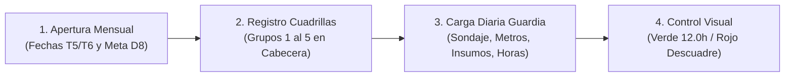

# Instructivo de Trabajo: Llenado del Reporte Detallado (RD.402.P.01.I.01)

## 1. Flujo Operativo Diario de 4 Pasos

---

## 2. Parámetros de Cabecera (Período Productivo)
* **Fecha Inicio (T5) y Fecha Fin (T6):** Registrar las fechas oficiales del ciclo productivo (ej. `26/08/2026` al `25/09/2026`).
* **Mes (W5):** Se genera automáticamente en **MAYÚSCULAS** (`=UPPER(TEXT(T6,"MMMM"))`).
* **Meta Mensual (D8):** Metraje mensual planificado por control de proyectos.
* **Cuadrillas Titulares (H8..AM15):** Ingresar nombres de Perforista y Ayudantes de cada grupo.

---

## 3. Protocolos para Casos Cotidianos
1. **Guardia de Perforación Normal:**
   * Digitar Sondaje (B), Línea (D) y cota final en Hasta (G).
   * Seleccionar Grupo (I) $	o$ carga automática de personal.
   * Seleccionar Estado de Broca (V).
   * Distribuir horas en BA..EO hasta obtener **12.0h en Col EP (🟢 Verde)**.
   * Registrar Horómetro Final en FF.
2. **Guardia sin Avance (Standby 12.0h):**
   * Dejar celda Hasta (G) vacía $	o$ Metraje mostrará 0.0m.
   * Seleccionar Grupo de turno.
   * Colocar 12.0h en la columna del evento de parada (ej. DO por agua, DQ por energía).
   * Verificar semáforo Verde en EP.
3. **Cambio de Sondaje en Turno:**
   * Al escribir el nuevo código de pozo en Col B, la celda **DESDE (Col F) se reinicia automáticamente en 0.0 m**.
4. **Personal de Suplencia / Reemplazo:**
   * Seleccionar el Grupo habitual y **sobreescribir el nombre del suplente directamente a mano** en la celda correspondiente (L, M o N).
