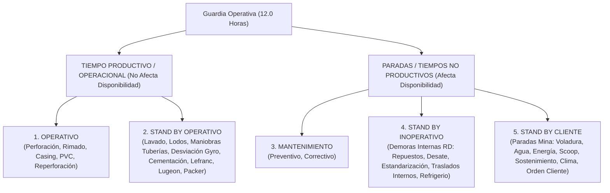

# 💎 Base de Conocimiento del Negocio y Operaciones de Perforación Diamantina (`RD.402.P.01.F.01`)

> **Rockdrill Group — Control de Operaciones & Valorizaciones**  
> *Documento Central de Conocimiento Operacional, Comercial (PU) y Estructura Semántica*

---

## 🏛️ 1. Modelo de Negocio y Estructura Operativa

La operación de perforación diamantina (DDH - *Diamond Core Drilling*) en minería subterránea y de superficie se rige por contratos basados en:
1. **Metraje Perforado ($/m):** Escalonado por diámetro (`PQ`, `HQ`, `NQ`, `BQ`, `HWT`) y por tramos de profundidad (ej. 0–100m, 101–200m, 201–400m, >600m).
2. **Horas Facturables (Tarifa Horaria $/hr):**
   - *Stand By Cliente:* Paradas atribuibles a la mina (falta de agua, energía, voladura, scoop, sostenimiento, orden cliente, clima, etc.).
   - *Horas Operativas Adicionales:* Maniobras de cementación y fraguado, instalación/retiro de casing, anclado de máquina, pruebas hidrogeológicas (Lugeon/Lefranc), medición de desviación con Reflex Gyro, y recuperación de testigos/pesca por geología adversa.
3. **Servicios Especiales y Alquileres ($/mes o $/und):**
   - Alquiler de bombas sumergibles, camiones cisterna, equipos giroscópicos.
   - Suministro de packers mecánicos/neumáticos, tubería permanente dejada en pozo (casing/PVC) y aditivos especiales.
4. **Horas No Facturables / Paradas Internas (Afectan Disponibilidad y OEE):**
   - Mantenimiento preventivo y correctivo de la perforadora.
   - Espera de repuestos Rockdrill.
   - Paradas internas (refrigerios, capacitaciones internas, falta de personal/herramientas, desate de rocas, orden y limpieza).

---

## ⏱️ 2. Convención Canónica de las 5 Categorías Interempresariales

La imputación de horas de guardia (12.0 hrs por turno) es una convención estricta entre Rockdrill y las compañías mineras (Volcan, Buenaventura, Nexa, Condestable, Catalina Huanca, Alpayana, etc.):



---

## 📖 3. Glosario de Términos Operacionales Estandarizados

| Término | Categoría Principal | Definición Operacional y Criterio de Negocio |
| :--- | :--- | :--- |
| **Acondicionamiento de Sondaje** | `STAND BY OPERATIVO` | Complicaciones litológicas; uso de aditivos (bentonita, polímeros) para estabilizar paredes, reducir torque y recuperar retorno de agua. |
| **Anclado de Máquina** | `STAND BY OPERATIVO` | Perforación de perno de anclaje, instalación y fijación rígida de la máquina a roca/concreto. |
| **Asentado / Retiro de Casing** | `OPERATIVO` | Instalación o extracción de tubería de revestimiento (`HWT`/`HQ`/`PQ`) para proteger el collar o aislar zonas fracturadas. |
| **Cambio de Línea** | `STAND BY OPERATIVO` | Maniobra de cambio de diámetro de barras de perforación (ej. de HQ a NQ o de NQ a BQ) y ajuste de accesorios. |
| **Cambio de Punto** | `STAND BY INOPERATIVO` | Finalización de un pozo y reposicionamiento del equipo dentro de la misma cámara o plataforma. |
| **Capacitación Interna / Externa** | `STAND BY INOPERATIVO` / `STAND BY CLIENTE` | Repartos de guardia, GCOM, traslape, IPERC (Interna) vs inducción/charlas de la compañía minera (Externa). |
| **Cementación y Fraguado** | `STAND BY OPERATIVO` | Inyección de lechada de cemento en intervalos con fallas o pérdida severa de agua, incluyendo tiempo de fraguado y reperforación. |
| **Condiciones Climáticas** | `STAND BY CLIENTE` | Paradas por tormenta eléctrica, lluvias torrenciales o nieve en operaciones de superficie. |
| **Espera de Orden Cliente** | `STAND BY CLIENTE` | Tiempo detenido esperando confirmación de geología de mina para continuar o detener el pozo. |
| **Espera de Repuesto** | `STAND BY INOPERATIVO` | Parada por falta de repuestos o herramientas atribuible a la cadena logística de Rockdrill. |
| **Espera de Scoop / Sostenimiento** | `STAND BY CLIENTE` | Mina no libera la galería o no ejecuta el desate/emmallado/limpieza de carga. |
| **Estandarización / Desestandarización** | `STAND BY INOPERATIVO` | Entablado, instalación de geomembranas, cartelería de seguridad, paneles, iluminación y orden del punto. |
| **Falta de Agua / Energía / Ventilación** | `STAND BY CLIENTE` | Interrupción de suministros industriales esenciales provistos por la mina. |
| **Lavado de Sondaje** | `STAND BY OPERATIVO` | Inyección de fluido para limpiar detritos (*cuttings*) antes de reiniciar perforación o extraer barras. |
| **Maniobras por Descarga/Carga** | `STAND BY OPERATIVO` | Retiro de columnas de barras para prevenir atrapamientos ante colapsos de falla. |
| **Medición de Desviación (Gyro)** | `STAND BY OPERATIVO` | Medición direccional del sondaje (inclinación y azimut) con instrumental especializado (Reflex Gyro). |
| **Mezclado de Lodos** | `STAND BY OPERATIVO` | Homogenización de agua con bentonita, pac y polímeros para refrigerar la broca y estabilizar el pozo. |
| **Obturación con Packer** | `STAND BY OPERATIVO` | Sello temporal o permanente con tapón expandible (*packer*) para control de caudal de agua o ensayos. |
| **Paralización por Estrés Térmico** | `STAND BY CLIENTE` | Parada obligatoria por normativa de seguridad cuando la temperatura en interior mina excede los límites permisibles. |
| **Perforación en Fallas Fracturadas** | `STAND BY OPERATIVO` | Perforación en zona de falla litológica con baja velocidad de avance y alto riesgo operativo. |
| **Pruebas Geotécnicas (Lefranc / Lugeon / SPT)** | `STAND BY OPERATIVO` | Ensayos de permeabilidad hidrogeológica por tramos de profundidad (0-300m, 301-600m, 601-1000m) y medición de nivel freático. |
| **Recuperación de Materiales (Pesca)** | `STAND BY OPERATIVO` | Maniobras de pesca de barras, tubos interiores o brocas atrapadas en el taladro por causas geológicas. |
| **Reperforación** | `OPERATIVO` | Acción de volver a perforar un tramo colapsado u obstruido. |
| **Rimado** | `OPERATIVO` | Ensanchamiento del diámetro del pozo para permitir el paso de tubería de revestimiento (*casing*). |
| **Traslado entre Cámaras / Plataformas** | `STAND BY OPERATIVO` / `STAND BY INOP` | Movilización integral de perforadora, bombas, tinas de lodos y accesorios entre puntos de perforación. |
| **Voladura** | `STAND BY CLIENTE` | Evacuación obligatoria del frente de perforación por disparo de mineral/desmonte en mina. |

---

## 📑 4. Estructura Familiar del Reporte Diario (`RD.402.P.01.F.01`)

```text
Filas 1 a 20   : Encabezado institucional, Horómetros, Datos de Turno y Cuadrilla.
Fila 21        : Super-encabezado "TIEMPOS" (abarca las columnas horarias).
Fila 22        : Bloques Canónicos Mayores (DÍAS, SONDAJE, AVANCE DIARIO, COMPARATIVO, BROCA, ESCARIADOR, ADITIVOS, COMBUSTIBLE, OPERATIVO, MANTENIMIENTO, STAND BY OPERATIVO, STAND BY INOPERATIVO, STAND BY CLIENTE, RESUMEN HORAS, TRAMOS, BITÁCORAS).
Fila 23        : Subencabezados de Actividad / Parámetros (ej. Perforación, Preventivo, Voladura, Bentonita).
Fila 24        : Atributos / Unidades de Medida (CANT., UND., DESDE, HASTA, METRAJE, TOTAL).
Fila 25 en ad. : Filas de Datos de Producción Diaria (1 fila por guardia).
```
