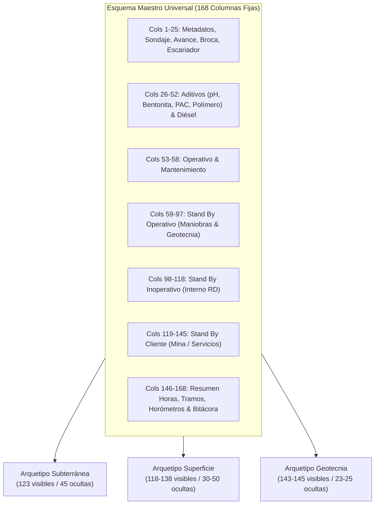

# ESTUDIO DE INCIDENCIA HISTÓRICA, MATRIZ DE VISIBILIDAD POR CTR Y GUÍA DE PROTECCIÓN DE PLANTILLAS
**Documento Técnico Oficial:** Formato `RD.402.P.01.F.01` — Versión 3.1.0 (168 Columnas)  
**Empresa:** Rockdrill Group — Control de Operaciones, Valorizaciones & Business Intelligence  
**Dataset Analizado:** 63,095 Guardias Históricas (`HISTORICO-PERDLAP140`), Dataset Agosto 2026, 18 Contratos `PU` y 12,158 Registros de `Otros*`  
**Fecha de Emisión:** 24 de Agosto de 2026  

---

## 🎯 1. Resumen Ejecutivo y Diagnóstico

Para garantizar que el formato **RD.402.P.01.F.01** sea a la vez **100% estandarizado** para el pipeline de datos (Power BI y Python) y **extremadamente ergonómico** para las administradoras de contrato en campo, se implementó una arquitectura de **Visibilidad Paramétrica**:

1. **Invariabilidad Estructural:** Todas las plantillas de los 21 CTRs contienen físicamente las **168 columnas canónicas en la misma posición (1 a 168)**.
2. **Máscara de Visibilidad por CTR:** Se ocultan las columnas que no aplican a la operación de cada mina (ej. pozas de sedimentación o tormenta eléctrica en minas subterráneas, o gases y falta de ventilación en tajos abiertos de superficie).
3. **Protección de Celdas:** Las cabeceras (filas 1 a 24), columnas ocultas y celdas con fórmulas de metraje, subtotales y horómetros están protegidas con contraseña (`RD2026`). Las administradoras pueden ingresar datos libremente en las celdas de guardia sin riesgo de descalibrar las fórmulas.

---

## 📊 2. Distribución y Frecuencia Histórica por CTR

Del análisis empírico de las **63,095 guardias registradas**, se clasificaron los contratos en 3 arquetipos operacionales:

| Arquetipo de CTR | CTRs Incluidos | Columnas Visibles | Columnas Ocultas | Criterio Técnico y Operacional |
| :--- | :--- | :---: | :---: | :--- |
| **A. Subterránea Estándar** | Catalina Huanca, Cobriza, San Cristóbal, Andaychagua, Yauliyacu, Americana, Morococha, Yumpag, Ticlio, Tambojasa | **123** | **45** | Se priorizan esperas de ventilación, gases, sostenimiento, scoop, servicios de mina (aire comprimido) y desate. Se ocultan ensayos de geotecnia no contratados y factores climáticos de superficie. |
| **B. Superficie / Tajo Abierto** | Colquijirca, Colquisiri, La Estrella, Cuculí | **118 – 138** | **30 – 50** | Se priorizan condiciones climáticas (tormenta eléctrica/alerta roja), accesos, pozas y red de drenaje. Se ocultan esperas de ventilación de mina y scoop subterráneo. |
| **C. Subterránea con Geotecnia / Especiales** | Inmaculada, Chungar, Raura, Condestable, Romina, Cerro de Pasco, Yauricocha | **143 – 145** | **23 – 25** | Se habilita el set completo de ensayos geotécnicos (Lefranc, Lugeon, SPT, Shelby), instrumentación (Casagrande, Cuerda Vibrante, Inclinómetro) y cementaciones. |

---

## 📋 3. Matriz Oficial de Visibilidad de los 21 CTRs

| N° | Contrato (CTR) | Zona / Región | Tipo de Operación | Cols Visibles | Cols Ocultas | Nombre de Archivo Generado |
| :---: | :--- | :--- | :--- | :---: | :---: | :--- |
| **1** | **INMACULADA** | Ayacucho | Subterránea + Geotecnia | 143 | 25 | `RD.402.P.01.F.01_INMACULADA.xlsx` |
| **2** | **CATALINA HUANCA** | Ayacucho | Subterránea | 123 | 45 | `RD.402.P.01.F.01_CATALINA_HUANCA.xlsx` |
| **3** | **COBRIZA** | Huancavelica | Subterránea | 123 | 45 | `RD.402.P.01.F.01_COBRIZA.xlsx` |
| **4** | **CHUNGAR** | Pasco | Subterránea + Geotecnia | 143 | 25 | `RD.402.P.01.F.01_CHUNGAR.xlsx` |
| **5** | **COLQUIJIRCA** | Pasco | Superficie | 138 | 30 | `RD.402.P.01.F.01_COLQUIJIRCA.xlsx` |
| **6** | **SAN CRISTOBAL** | Junín | Subterránea | 123 | 45 | `RD.402.P.01.F.01_SAN_CRISTOBAL.xlsx` |
| **7** | **CONDESTABLE** | Lima Sur | Subterránea + Superficie | 145 | 23 | `RD.402.P.01.F.01_CONDESTABLE.xlsx` |
| **8** | **RAURA** | Huánuco | Subterránea + Geotecnia | 143 | 25 | `RD.402.P.01.F.01_RAURA.xlsx` |
| **9** | **ANDAYCHAGUA** | Junín | Subterránea | 123 | 45 | `RD.402.P.01.F.01_ANDAYCHAGUA.xlsx` |
| **10** | **YAULIYACU** | Casapalca | Subterránea | 123 | 45 | `RD.402.P.01.F.01_YAULIYACU.xlsx` |
| **11** | **AMERICANA** | Casapalca | Subterránea | 123 | 45 | `RD.402.P.01.F.01_AMERICANA.xlsx` |
| **12** | **MOROCOCHA** | Junín | Subterránea | 123 | 45 | `RD.402.P.01.F.01_MOROCOCHA.xlsx` |
| **13** | **ROMINA** | Huaral | Subterránea + Superficie | 145 | 23 | `RD.402.P.01.F.01_ROMINA.xlsx` |
| **14** | **COLQUISIRI** | Huaral | Superficie | 138 | 30 | `RD.402.P.01.F.01_COLQUISIRI.xlsx` |
| **15** | **YUMPAG** | Pasco | Subterránea | 123 | 45 | `RD.402.P.01.F.01_YUMPAG.xlsx` |
| **16** | **LA ESTRELLA** | Junín | Superficie | 118 | 50 | `RD.402.P.01.F.01_LA_ESTRELLA.xlsx` |
| **17** | **CERRO DE PASCO** | Pasco | Subterránea + Superficie | 145 | 23 | `RD.402.P.01.F.01_CERRO_DE_PASCO.xlsx` |
| **18** | **TICLIO** | Pasco | Subterránea | 123 | 45 | `RD.402.P.01.F.01_TICLIO.xlsx` |
| **19** | **CUCULI** | Lima | Superficie | 118 | 50 | `RD.402.P.01.F.01_CUCULI.xlsx` |
| **20** | **TAMBOJASA** | Ica | Subterránea | 123 | 45 | `RD.402.P.01.F.01_TAMBOJASA.xlsx` |
| **21** | **YAURICOCHA** | Yauyos | Subterránea + Geotecnia | 143 | 25 | `RD.402.P.01.F.01_YAURICOCHA.xlsx` |

---

## 🔒 4. Mecanismos de Seguridad y Protección de Celdas

Para blindar la integridad del reporte ante manipulaciones no deseadas, se configuró el motor de OpenPyXL con las siguientes políticas:

1. **Celdas Bloqueadas (`Locked = True`):**
   - Encabezados de 4 niveles (Filas 1 a 24).
   - Columnas calculadas de metraje: `Col 10` (`METRAJE`) y `Col 15` (`TOTAL metraje del dia`).
   - Bloque de Resumen de Horas: `Cols 146 a 152` (`TIEMPO TOTAL`, `OPERATIVO`, `LOST TIME`, `MANTTO`, `SB OPERATIVO`, `SB INOPERATIVO`, `SB CLIENTE`).
   - Tramos Especiales y Horómetros: `Cols 155, 156, 159, 160, 163, 164`.
   - Todas las columnas ocultas.
2. **Celdas Desbloqueadas (`Locked = False`):**
   - Celdas de captura diaria de las filas 25 a 86: Datos de sondaje, profundidades `DESDE/HASTA`, cuadrilla, consumo de aditivos, diésel, horas de actividades y observaciones.
3. **Permisos de Usuario en Hoja Protegida:**
   - La administradora puede seleccionar celdas, aplicar autofiltros, ordenar datos y dar formato sin necesidad de desproteger la hoja.
   - **Clave de Desprotección SIG:** `RD2026`.

---

## 💡 5. Sugerencias de Formulación y Automatización para Admins

1. **Cálculo Automático de Metraje:**
   `=IF(G25-F25>=0, G25-F25, 0)` *(Evita números negativos si hay error de tipeo)*.
2. **Suma Exacta de Horas de Guardia:**
   `=SUM(BA25:EO25)` *(Abarca las 93 columnas de tiempo desde Perforación hasta SBC4)*.
3. **Subtotales Desglosados:**
   - Operativo: `=SUM(BA25:BD25)`
   - Mantenimiento: `=SUM(BE25:BF25)`
   - Stand By Operativo: `=SUM(BG25:CS25)`
   - Stand By Inoperativo: `=SUM(CT25:DN25)`
   - Stand By Cliente: `=SUM(DO25:EO25)`
4. **Listas Desplegables de Validación Integradas:**
   - Turno: `A`, `B`
   - Línea: `PQ`, `HQ`, `NQ`, `BQ`
   - Estado de Broca: `N` (Nueva), `U` (Usada), `D` (Descartada), `P` (Pulida)
   - Estado de Escariador: `N`, `U`, `D`
   - Horas Extras: `0`, `1`, `2`, `3`, `4`
