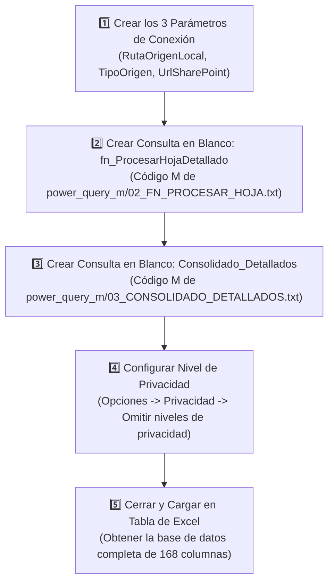

# 📘 Guía Paso a Paso: Implementación del Recopilador de 168 Columnas en Excel Power Query
**Proyecto**: Sistema Unificado de Business Intelligence y Analítica de Perforación  
**Organización**: Rockdrill Group  
**Documento Técnico**: `docs/GUIA_PASO_A_PASO_POWERQUERY_RECOPILADOR.md`  
**Archivos de Código M**: Carpeta [`power_query_m/`](file:///C:/Proyectos%20Python/Detallados/power_query_m)  
**Libro Excel Preconfigurado**: [`output/CONSOLIDADOR_DETALLADOS_POWERQUERY.xlsx`](file:///C:/Proyectos%20Python/Detallados/output/CONSOLIDADOR_DETALLADOS_POWERQUERY.xlsx)  

---

## 🔍 1. Diagnóstico del Error Previo en `TablasValidas`

El error anterior en Power Query al expandir o combinar (`TablasValidas` / `Table.Combine`) se debía a dos motivos técnicos de la arquitectura de Power Query:

1. **Reapertura de Binarios en Bucle de Filas (`Excel.Workbook` anidado):**  
   Al llamar a `Excel.Workbook([Content])` dentro de una función de fila sobre una tabla que ya había listado los archivos con `Folder.Files`, Power Query activa el mecanismo de seguridad **`Formula.Firewall` (Nivel de Privacidad)** o agota el búfer de descompresión zip, produciendo un registro de error `[Error]` en lugar de un `type table`.
2. **Disparidad de Nombres de Cabeceras entre Hojas:**  
   Al construir dinámicamente nombres combinando la Fila 23 y 24, si una hoja tenía un espacio adicional o columna vacía (ej. `XP_54`), los nombres de columnas no coincidían entre hojas, generando cientos de columnas dispersas con valores nulos o fallando en `Table.Combine`.

### 💡 Solución Implementada (Arquitectura Determinista de 168 Columnas):
- **Apertura Única de Libro:** Se invoca `Excel.Workbook([Content])` una sola vez en la consulta principal y se pasa directamente la tabla `[Data]` ya desempaquetada a la función `fn_ProcesarHojaDetallado`.
- **Mapeo Posicional Fijo (168 Columnas):** La función selecciona estrictamente las primeras 168 columnas (de la `Column1` a la `Column168`) y les asigna los 168 nombres oficiales canónicos de una sola vez. Así, **el 100% de las hojas produce exactamente el mismo esquema de columnas**.
- **Bloque de Protección `try ... otherwise`:** Si alguna hoja está vacía o contiene formatos corruptos, retorna una tabla vacía controlada sin romper el proceso general.

---

## 🚀 2. Guía de Configuración Paso a Paso en Excel

Si deseas crear las consultas desde cero en cualquier libro de Excel o Power BI Desktop, sigue estos pasos:

---

### Paso 1: Configurar los Parámetros de Origen
1. En Excel, ve a la pestaña **Datos** $\rightarrow$ **Obtener datos** $\rightarrow$ **Iniciar editor de Power Query**.
2. En el menú superior, haz clic en **Administrar parámetros** $\rightarrow$ **Nuevo parámetro**.
3. Crea los 3 parámetros indicados en [`power_query_m/01_PARAMETROS.txt`](file:///C:/Proyectos%20Python/Detallados/power_query_m/01_PARAMETROS.txt):
   - **`RutaOrigenLocal`**: Tipo = *Texto*, Valor sugerido = `C:\Proyectos Python\Detallados\Estructura base\Rockdrill_Control_Operaciones`.
   - **`TipoOrigen`**: Tipo = *Texto*, Valor sugerido = `LOCAL` (o `CLOUD`).
   - **`UrlSharePoint`**: Tipo = *Texto*, Valor sugerido = `https://rockdrillgroup.sharepoint.com/sites/Operaciones/Rockdrill_Control_Operaciones`.

---

### Paso 2: Crear la Función `fn_ProcesarHojaDetallado`
1. En el panel izquierdo de Power Query, haz clic derecho en un área vacía $\rightarrow$ **Nueva consulta** $\rightarrow$ **Otros orígenes** $\rightarrow$ **Consulta en blanco**.
2. En la pestaña **Inicio**, haz clic en **Editor avanzado**.
3. Borra todo el código existente y pega el contenido íntegro de [`power_query_m/02_FN_PROCESAR_HOJA.txt`](file:///C:/Proyectos%20Python/Detallados/power_query_m/02_FN_PROCESAR_HOJA.txt).
4. En el panel lateral derecho (*Propiedades*), cambia el nombre de la consulta a:  
   👉 **`fn_ProcesarHojaDetallado`**

---

### Paso 3: Crear la Consulta Consolidadora `Consolidado_Detallados`
1. Haz clic derecho en el panel izquierdo $\rightarrow$ **Nueva consulta** $\rightarrow$ **Otros orígenes** $\rightarrow$ **Consulta en blanco**.
2. Haz clic en **Editor avanzado**.
3. Borra el código existente y pega el contenido íntegro de [`power_query_m/03_CONSOLIDADO_DETALLADOS.txt`](file:///C:/Proyectos%20Python/Detallados/power_query_m/03_CONSOLIDADO_DETALLADOS.txt).
4. En el panel lateral derecho (*Propiedades*), renombra la consulta a:  
   👉 **`Consolidado_Detallados`**

---

### Paso 4: Ajustar la Configuración de Privacidad (Evitar Formula Firewall)
Para que Power Query combine sin bloqueos las carpetas locales con las funciones de transformación:
1. En la ventana del Editor de Power Query, ve a **Archivo** $\rightarrow$ **Opciones y configuración** $\rightarrow$ **Opciones de consulta**.
2. En la sección **GLOBAL**, selecciona **Privacidad**.
3. Marca la opción: **"Omitir siempre los niveles de privacidad"** (o *"Combinar datos según la configuración de nivel de privacidad de cada origen"*).
4. Haz clic en **Aceptar**.

---

### Paso 5: Cerrar y Cargar los Datos en Excel
1. En la pestaña **Inicio**, haz clic en **Cerrar y cargar en...**
2. Selecciona **Tabla** en una **Hoja de cálculo nueva**.
3. Excel ejecutará la consulta y cargará todas las filas consolidadas de los 18 contratos con las **168 columnas canónicas completas** (desde la Col A `FECHA` hasta la Col FL `COMENTARIOS`).
4. Para actualizar los datos en el futuro ante nuevos reportes descargados, solo presiona **`Ctrl + Alt + F5`** (o *Datos $\rightarrow$ Actualizar todo*).

---

## 📂 3. Mapa de Archivos TXT con el Código Fuente M

| Archivo TXT | Finalidad | Ruta en el Repositorio |
| :--- | :--- | :--- |
| **`01_PARAMETROS.txt`** | Definición de parámetros M de conexión local/nube | [`power_query_m/01_PARAMETROS.txt`](file:///C:/Proyectos%20Python/Detallados/power_query_m/01_PARAMETROS.txt) |
| **`02_FN_PROCESAR_HOJA.txt`** | Función transformadora robusta con mapeo a 168 columnas | [`power_query_m/02_FN_PROCESAR_HOJA.txt`](file:///C:/Proyectos%20Python/Detallados/power_query_m/02_FN_PROCESAR_HOJA.txt) |
| **`03_CONSOLIDADO_DETALLADOS.txt`** | Consulta consolidadora multicarpetas para los 18 CTRs | [`power_query_m/03_CONSOLIDADO_DETALLADOS.txt`](file:///C:/Proyectos%20Python/Detallados/power_query_m/03_CONSOLIDADO_DETALLADOS.txt) |
| **`CONSULTAS_POWERQUERY_M_PARAMETRIZADAS.txt`** | Archivo maestro que consolida todo el código M en un solo lugar | [`power_query_m/CONSULTAS_POWERQUERY_M_PARAMETRIZADAS.txt`](file:///C:/Proyectos%20Python/Detallados/power_query_m/CONSULTAS_POWERQUERY_M_PARAMETRIZADAS.txt) |
