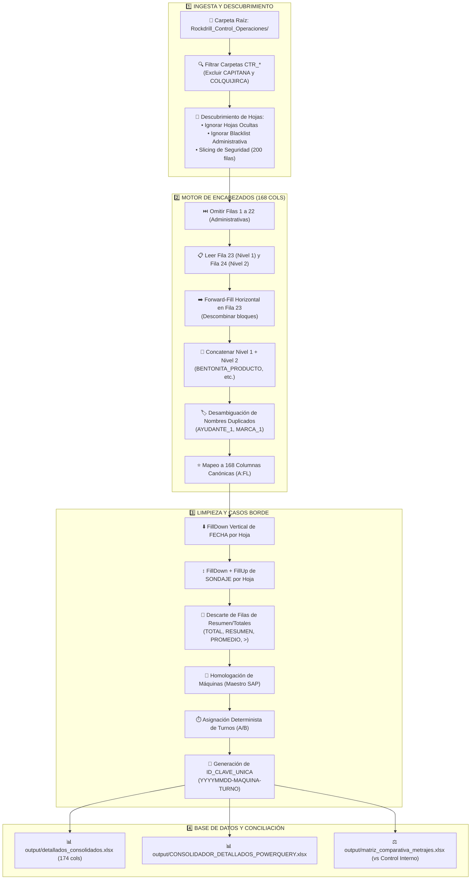
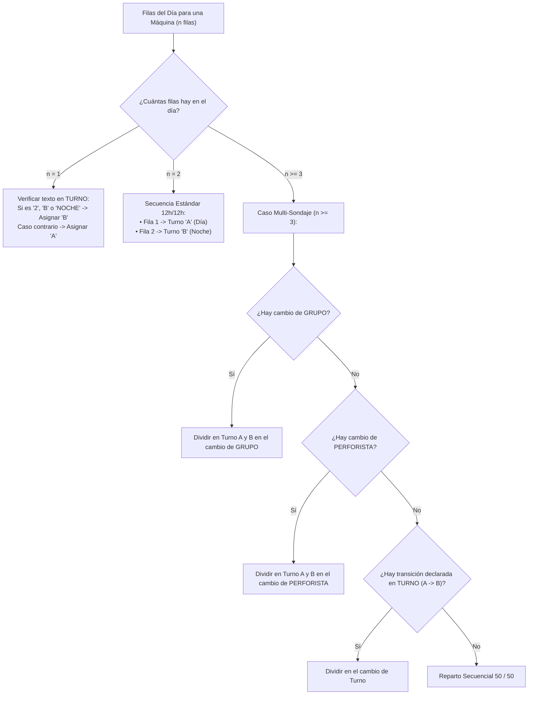

# 📘 Guía Técnica Definitiva: Pipeline ETL, Construcción de Encabezados y Casos Borde
**Proyecto**: Sistema Unificado de Business Intelligence y Analítica de Perforación  
**Organización**: Rockdrill Group  
**Documento Técnico**: `docs/GUIA_TECNICA_CONSTRUCCION_ENCABEZADOS_Y_PIPELINE_ETL.md`  
**Destinatarios**: Ingenieros de Datos, Arquitectos ETL y Modelos de Lenguaje (LLMs)  

---

## 🎯 1. Propósito y Alcance del Documento

Este documento constituye la **guía maestra de ingeniería de datos** para comprender, replicar o reconstruir desde cero el flujo de extracción, transformación, limpieza y conciliación de los **Reportes Detallados de Avance de Perforación (`RD.402.P.01.F.01`)** de los 18 contratos mineros de Rockdrill Group.

Contiene la especificación exhaustiva de cada fase:
1. Filtrado de carpetas y descarte de pestañas no operativas.
2. Construcción de encabezados a partir de plantillas con doble fila y celdas combinadas.
3. Tratamiento de propagación vertical (`FillDown` y `FillUp`) en fechas y sondajes.
4. Filtrado de filas operativas reales y descarte de totales de pie de página.
5. Resolución de casos borde (turnos multi-sondaje, homologación de máquinas SAP, manejo de archivos bloqueados y `Formula.Firewall` en Power Query M).

---

## 🏗️ 2. Arquitectura General del Flujo de Datos



---

## 📑 3. Fase 1: Descubrimiento y Filtrado Estricto de Hojas

Cada libro de reporte detallado (`RD.402.P.01.F.01_*.xlsx`) contiene decenas de pestañas. No todas representan máquinas de perforación activas. El flujo debe aplicar un filtro de 3 compuertas:

### 1. Compuerta de Hojas Ocultas (Hidden / VeryHidden):
- Las pestañas archivadas u ocultas por las administradoras no deben procesarse.
- **En Python**: Inspeccionar `xl/workbook.xml` en el paquete zip del archivo `.xlsx` y verificar que el atributo `state` no sea `hidden` ni `veryHidden` (función [`get_visible_sheet_names`](file:///C:/Proyectos%20Python/Detallados/src/utils.py#L20-L50)).
- **En Power Query M**: Filtrar la columna del metadata de `Excel.Workbook`:
  ```powerquery
  Table.SelectRows(ExpandirHojas, each [Kind] = "Sheet" and [Hidden] = false)
  ```

### 2. Compuerta de Blacklist Administrativa:
- Se descartan de forma estricta las pestañas con nombres no operativos:
  $$\text{BLACKLIST} = \{\text{"ADITIVOS"}, \text{"GENERAL"}, \text{"LISTAS"}, \text{"TIEMPOS"}, \text{"Tiempos"}, \text{"RESUMEN"}, \text{"GRAFICOS"}, \text{"MAESTRO"}, \text{"PARAMETROS"}, \text{"GLOSARIO"}\}$$
- Toda hoja que no esté en la blacklist corresponde al nombre local de una **máquina de perforación**.

### 3. Compuerta de Slicing de Seguridad (Bypass de Hojas Gigantes Vacías):
- Algunas plantillas contienen hojas residuales con 1,000,000 de filas en blanco que saturan la memoria RAM.
- **Regla**: Leer únicamente las primeras **200 filas** de la hoja (`raw_rows[:200]`).
- Si la hoja tiene $\le 24$ filas, se descarta inmediatamente por no contener datos operativos (`MIN_ROWS = 24`).

---

## 🏷️ 4. Fase 2: Procedimiento de Creación y Normalización de Encabezados

La plantilla `RD.402.P.01.F.01` presenta una cabecera de doble fila con celdas combinadas horizontales:

```
Fila 23 (Nivel 1): | FECHA | SONDAJE | ... | BENTONITA (Combinada Cols Z:AB) | PAC (Cols AC:AE) | ... |
Fila 24 (Nivel 2): |       |         | ... | PRODUCTO | CANT. | UND.         | PRODUCTO | ...   | ... |
```

### Algoritmo Paso a Paso de Construcción de Cabeceras (Dual-Row):

```python
def build_dual_row_headers_from_rows(rows: List[List], skip: int = 22) -> Optional[List[str]]:
    # 1. Extraer las filas 23 y 24 (índices 22 y 23 base 0)
    primary_values = rows[skip]      # Fila 23
    sub_values = rows[skip + 1]      # Fila 24

    # 2. Forward-Fill Horizontal sobre Fila 23 (Descombinar bloques)
    filled_primary = []
    for val in primary_values:
        val_str = str(val).strip() if val is not None else ""
        if val_str != "":
            filled_primary.append(val_str)
        else:
            if filled_primary:
                filled_primary.append(filled_primary[-1])  # Propagar nombre del bloque
            else:
                filled_primary.append("XP")                # Prefijo seguro para columnas iniciales

    # 3. Concatenación Inteligente Nivel 1 + Nivel 2
    headers = []
    for i in range(len(filled_primary)):
        t1 = filled_primary[i]
        t2_raw = sub_values[i] if i < len(sub_values) else None
        t2 = str(t2_raw).strip() if t2_raw is not None else ""

        if t1 == "XP":
            headers.append(t2 if t2 else f"XP_{i}")
        elif t2 == "":
            headers.append(t1)
        else:
            headers.append(f"{t1}_{t2}")

    # 4. Desambiguación Secuencial de Duplicados (Uniquify)
    seen = {}
    unique_headers = []
    for h in headers:
        if h in seen:
            seen[h] += 1
            unique_headers.append(f"{h}_{seen[h]}")
        else:
            seen[h] = 0
            unique_headers.append(h)

    return unique_headers
```

### ⚡ Estrategia Determinista para Power Query M:
En Power Query M, la construcción dinámica de cabeceras hoja por hoja suele generar inconsistencias de nombres entre contratos. Por ello, la arquitectura oficial de Power Query M utiliza **Mapeo Posicional Fijo de las 168 Columnas**:
1. Se descartan las primeras 24 filas (`Table.Skip(hojaTabla, 24)`), dejando la Fila 25 como fila 1.
2. Se toman las primeras 168 columnas físicas (`Column1` a `Column168`).
3. Se renombran en bloque a los 168 nombres oficiales canónicos. **Esto garantiza que el 100% de las hojas produzca el mismo esquema y `Table.Combine` nunca falle.**

---

## 🧹 5. Fase 3: Normalización de Datos y Celdas Combinadas

### 1. Propagación Vertical de Fecha (`FillDown` en Columna A):
- En campo, las administradoras combinan visualmente las celdas de fecha de un mismo día (ej. día 26 en Fila 25, y Fila 26 en blanco para el turno noche).
- **Regla Crítica**: El `FillDown` de `FECHA` debe ejecutarse **estrictamente por máquina y por hoja**, jamás sobre el consolidado global para evitar que la fecha de una máquina se contamine con la siguiente.

### 2. Propagación Bidireccional de Sondaje (`FillDown` + `FillUp` en Columna B):
- El nombre del taladro/sondaje (ej. `CND-24-015`) puede estar ubicado en la primera fila, en la fila central o combinado.
- **Regla**: Aplicar `ffill()` seguido de `bfill()` por hoja. Si toda la hoja carece de sondaje, asignar `"SIN SONDAJE"`.

### 3. Filtrado de Filas No Operativas y Pies de Página:
- Se descarta cualquier fila que cumpla cualquiera de estas condiciones:
  * `FECHA` nula o vacía tras el filldown.
  * Texto en `FECHA` o `SONDAJE` que contenga: `TOTAL`, `TOTAL GENERAL`, `RESUMEN`, `PROMEDIO`, `SUMA`, `TOTAL AVANCE`.
  * Texto en `SONDAJE` que inicie con `>`.
  * Filas donde no exista avance (`METRAJE <= 0`), ni tramos (`DESDE`/`HASTA`), ni comentarios, ni sondaje válido.

---

## ⏱️ 6. Fase 4: Algoritmo Determinista de Asignación de Turnos (A/B)

Cada máquina opera en 2 guardias diarias de 12.0 horas. La asignación de turnos sigue una jerarquía determinista:



### Generación de la Clave Primaria Inviolable:
$$\text{ID\_CLAVE\_UNICA} = \text{YYYYMMDD} - \text{MAQUINA\_HOMOLOGADA} - \text{TURNO\_ESTANDAR}$$
*Ejemplo:* `20260826-XRD50U-002-A`, `20260826-XRD50U-002-B`.

---

## 🚜 7. Fase 5: Homologación de Máquinas (Matriz de Excepciones SAP)

Las hojas de cálculo en campo suelen tener nombres informales que no coinciden con la contabilidad oficial de **Control Interno (`RD.402.P.01.F.04`)**.

El módulo carga dinámicamente la hoja `Exepciones` de [`Maestros_Maquinas.xlsx`](file:///C:/Proyectos%20Python/Detallados/Estructura%20base/Rockdrill_Control_Operaciones/Maestro_Maquinas/Maestros_Maquinas.xlsx) y aplica las sustituciones:

| Contrato (CTR) | Nombre en Pestaña Detallado | Código Oficial Control Interno (SAP) |
| :--- | :--- | :--- |
| **CHUNGAR** | `XRD90U-03` / `XRD90U-003` | `XRD90U-021` |
| **ANDAYCHAGUA** | `LF90DST-002` | `LF90D ST-002` |
| **ANDAYCHAGUA** | `XRD90U-017` | `XRD150U-001` |
| **CATALINA HUANCA** | `XRD50-003` | `XRD50U-003` |
| **CATALINA HUANCA** | `XRD100U-01` | `XRD100U-001` |
| **COBRIZA** | `XRD90U-008` | `XRD150U-008` |
| **INMACULADA** | `XRD150-004` | `XRD150USS-004` |
| **INMACULADA** | `XRD250-001` | `XRD250U-001` |
| **INMACULADA** | `XRD80U-008` | `XRD80USS-008` |
| **INMACULADA** | `XRD90U-012 (XRD150)` | `XRD90U-012` |
| **MOROCOCHA** | `XRD90USS-002` | `XRD90USS-005` |
| **MOROCOCHA** | `XRD150USS` | `XRD150USS-002` |
| **TAMBOJASA** | `DE710ST-002` | `DE710T-002` |
| **TICLIO** | `XRD150USS-001` / `XRD150USS-007` | `XRD150U-007` |
| **YAULIYACU** | `XRD50USS-001` / `XRD50USS-00T` | `XDR50USS-00T` |

---

## 🛡️ 8. Resumen de Buenas Prácticas para Evitar Errores Comunes

1. **Evitar Formula Firewall en Power Query M:**  
   Nunca llamar a `Excel.Workbook([Content])` dentro de una función aplicada fila a fila tras listar carpetas con `Folder.Files`. Abrir el libro en la consulta padre y pasar la tabla de datos ya extraída.
2. **Preservar Tipos de Datos sin Corrupción:**  
   Campos como `HOROMETRO - DESDE`, `HASTA`, `METRAJE` deben limpiarse con parsers numéricos que soporten comas y puntos decimales sin truncar decimales (`clean_number_value`).
3. **Manejo Seguro de Archivos Abiertos en Excel:**  
   Si el usuario tiene abierto `detallados_consolidados.xlsx` o `matriz_comparativa_metrajes.xlsx`, capturar `PermissionError` y escribir una copia con sufijo `_actualizada.xlsx` para no detener la ejecución del pipeline.
