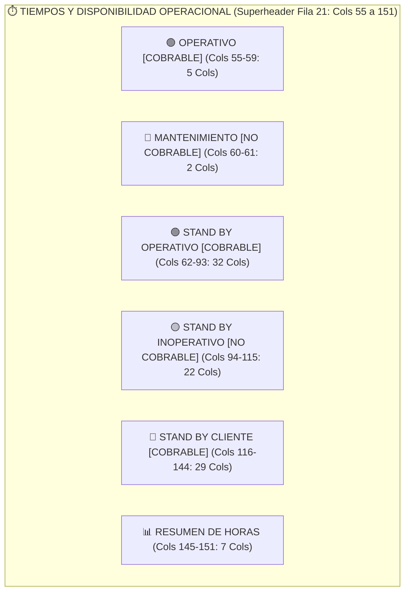

# INFORME TÉCNICO: CATÁLOGO MAESTRO DE 167 COLUMNAS Y ALINEAMIENTO SEMÁNTICO DE MOTIVOS 'OTROS*'
**Formato Oficial:** RD.402.P.01.F.01 — Reporte Detallado de Avance por Equipo  
**Empresa:** Rockdrill Group — Control de Operaciones & Valorizaciones  
**Fecha:** 20 de Agosto de 2026  
**Versión:** 2.3.0

---

## 🎯 1. Resumen Ejecutivo y Alcance

El presente informe documenta la arquitectura técnica final de la **Plantilla Maestra Estandarizada (167 Columnas)** y detalla la metodología de **alineamiento y reclasificación semántica de motivos históricos de "Otros\*"**.

Históricamente, en los 18 contratos mineros de Rockdrill, las administradoras de contrato (admins) y supervisores de guardia han utilizado la columna de texto libre *"SI ES OTROS \* INDICAR EL MOTIVO"* para registrar incidencias operacionales diversas. Mediante la auditoría de más de **12,158 registros de campo** (563 del mensual de agosto y 11,595 del histórico multianual), se identificó que el **89.3% de dichos textos corresponden a causas operacionales concretas** que ahora cuentan con una columna dedicada en el estándar maestro.

---

## 📋 2. Catálogo Maestro Completo de las 167 Columnas Canónicas

El formato respeta estrictamente la jerarquía legacy de 4 filas de encabezado (Filas 21 a 24) y la convención interempresarial de 5 categorías de tiempo:

### Tabla Exhaustiva de las 167 Columnas

| N° | Fila 22: Categoría / Bloque | Fila 23: Nombre / Actividad | Fila 24: Atributo / Unidad | Tipo de Dato | Cobrabilidad / Naturaleza | Responsable |
| :---: | :--- | :--- | :--- | :---: | :--- | :--- |
| **1** | DÍAS | DÍAS | DÍAS | Fecha | NO APLICA | OPERACIONES |
| **2** | GENERAL | N° | N° | Entero | NO APLICA | OPERACIONES |
| **3** | GENERAL | ZONA | ZONA | Texto | NO APLICA | OPERACIONES |
| **4** | GENERAL | CTR | CTR | Texto | NO APLICA | ADMINISTRACIÓN |
| **5** | GENERAL | MÁQUINA | MÁQUINA | Texto | NO APLICA | OPERACIONES |
| **6** | GENERAL | MES | MES | Texto | NO APLICA | ADMINISTRACIÓN |
| **7** | GENERAL | AÑO | AÑO | Entero | NO APLICA | ADMINISTRACIÓN |
| **8** | SONDAJE | SONDAJE | SONDAJE | Texto | NO APLICA | GEOLOGÍA / CLIENTE |
| **9** | SONDAJE | PROFUNDIDAD | PROFUNDIDAD | Decimal | NO APLICA | GEOLOGÍA / CLIENTE |
| **10** | SONDAJE | LINEA | LINEA | Texto | NO APLICA | OPERACIONES |
| **11** | SONDAJE | INCLINACIÓN | INCLINACIÓN | Decimal | NO APLICA | GEOLOGÍA / CLIENTE |
| **12** | AVANCE DIARIO | DESDE | DESDE | Decimal | COBRABLE (M / HR) | OPERACIONES |
| **13** | AVANCE DIARIO | HASTA | HASTA | Decimal | COBRABLE (M / HR) | OPERACIONES |
| **14** | AVANCE DIARIO | TURNO | TURNO | Texto | NO APLICA | OPERACIONES |
| **15** | AVANCE DIARIO | GRUPO | GRUPO | Entero | NO APLICA | OPERACIONES |
| **16** | AVANCE DIARIO | METRAJE | METRAJE | Decimal | COBRABLE (M) | OPERACIONES |
| **17** | AVANCE DIARIO | HORAS EXTRAS | HORAS EXTRAS | Decimal | NO APLICA | OPERACIONES |
| **18** | AVANCE DIARIO | PERFORISTA | PERFORISTA | Texto | NO APLICA | RRHH / OPERACIONES |
| **19** | AVANCE DIARIO | AYUDANTE 1 | AYUDANTE 1 | Texto | NO APLICA | RRHH / OPERACIONES |
| **20** | AVANCE DIARIO | AYUDANTE 2 | AYUDANTE 2 | Texto | NO APLICA | RRHH / OPERACIONES |
| **21** | AVANCE DIARIO | TOTAL METRAJE DÍA | TOTAL METRAJE DÍA | Decimal | COBRABLE (M) | OPERACIONES |
| **22** | COMPARATIVO | ACUMULADO | ACUMULADO | Decimal | NO APLICA | SISTEMA / BI |
| **23** | COMPARATIVO | PROYECTADO | PROYECTADO | Decimal | NO APLICA | PLANEAMIENTO |
| **24** | COMPARATIVO | META | META | Decimal | NO APLICA | PLANEAMIENTO |
| **25** | BROCA | MARCA | MARCA | Texto | NO APLICA | LOGÍSTICA |
| **26** | BROCA | SERIE | SERIE | Texto | NO APLICA | LOGÍSTICA |
| **27** | BROCA | N° BROCA | N° BROCA | Texto | NO APLICA | OPERACIONES |
| **28** | BROCA | ESTADO DE LA BROCA | ESTADO DE LA BROCA | Texto | NO APLICA | OPERACIONES |
| **29** | ESCARIADOR | MARCA | MARCA | Texto | NO APLICA | LOGÍSTICA |
| **30** | ESCARIADOR | N° ESCARIADOR | N° ESCARIADOR | Texto | NO APLICA | OPERACIONES |
| **31** | ESCARIADOR | ESTADO DEL ESCARIADOR | ESTADO DEL ESCARIADOR | Texto | NO APLICA | OPERACIONES |
| **32** | ADITIVOS (X UNIDADES) | BENTONITA | PRODUCTO | Texto | NO APLICA | LOGÍSTICA |
| **33** | ADITIVOS (X UNIDADES) | BENTONITA | CANT. | Decimal | CONSUMO | OPERACIONES |
| **34** | ADITIVOS (X UNIDADES) | BENTONITA | UND. | Texto | NO APLICA | LOGÍSTICA |
| **35** | ADITIVOS (X UNIDADES) | PAC | PRODUCTO | Texto | NO APLICA | LOGÍSTICA |
| **36** | ADITIVOS (X UNIDADES) | PAC | CANT. | Decimal | CONSUMO | OPERACIONES |
| **37** | ADITIVOS (X UNIDADES) | PAC | UND. | Texto | NO APLICA | LOGÍSTICA |
| **38** | ADITIVOS (X UNIDADES) | POLIMERO | PRODUCTO | Texto | NO APLICA | LOGÍSTICA |
| **39** | ADITIVOS (X UNIDADES) | POLIMERO | CANT. | Decimal | CONSUMO | OPERACIONES |
| **40** | ADITIVOS (X UNIDADES) | POLIMERO | UND. | Texto | NO APLICA | LOGÍSTICA |
| **41** | ADITIVOS (X UNIDADES) | LUBRICANTES | PRODUCTO | Texto | NO APLICA | LOGÍSTICA |
| **42** | ADITIVOS (X UNIDADES) | LUBRICANTES | CANT. | Decimal | CONSUMO | OPERACIONES |
| **43** | ADITIVOS (X UNIDADES) | LUBRICANTES | UND. | Texto | NO APLICA | LOGÍSTICA |
| **44** | ADITIVOS (X UNIDADES) | INHIBIDORES | PRODUCTO | Texto | NO APLICA | LOGÍSTICA |
| **45** | ADITIVOS (X UNIDADES) | INHIBIDORES | CANT. | Decimal | CONSUMO | OPERACIONES |
| **46** | ADITIVOS (X UNIDADES) | INHIBIDORES | UND. | Texto | NO APLICA | LOGÍSTICA |
| **47** | ADITIVOS (X UNIDADES) | ESTABILIZADOR | PRODUCTO | Texto | NO APLICA | LOGÍSTICA |
| **48** | ADITIVOS (X UNIDADES) | ESTABILIZADOR | CANT. | Decimal | CONSUMO | OPERACIONES |
| **49** | ADITIVOS (X UNIDADES) | ESTABILIZADOR | UND. | Texto | NO APLICA | LOGÍSTICA |
| **50** | ADITIVOS (X UNIDADES) | OTROS | PRODUCTO | Texto | NO APLICA | LOGÍSTICA |
| **51** | ADITIVOS (X UNIDADES) | OTROS | CANT. | Decimal | CONSUMO | OPERACIONES |
| **52** | ADITIVOS (X UNIDADES) | OTROS | UND. | Texto | NO APLICA | LOGÍSTICA |
| **53** | COMBUSTIBLE | PETROLEO | CANT. | Decimal | CONSUMO | OPERACIONES |
| **54** | COMBUSTIBLE | PETROLEO | GLN | Texto | NO APLICA | LOGÍSTICA |
| **55** | OPERATIVO [COBRABLE] | Perforación | Perforación | Decimal | COBRABLE (PRODUCTIVO) | OPERACIONES |
| **56** | OPERATIVO [COBRABLE] | Rimado | Rimado | Decimal | COBRABLE (PRODUCTIVO) | OPERACIONES |
| **57** | OPERATIVO [COBRABLE] | Asentado / Retiro de revestimiento (Casing) | Asentado / Retiro de revestimiento (Casing) | Decimal | COBRABLE (PRODUCTIVO) | OPERACIONES |
| **58** | OPERATIVO [COBRABLE] | Instalación PVC | Instalación PVC | Decimal | COBRABLE (PRODUCTIVO) | OPERACIONES |
| **59** | OPERATIVO [COBRABLE] | Reperforación | Reperforación | Decimal | COBRABLE (PRODUCTIVO) | OPERACIONES |
| **60** | MANTENIMIENTO [NO COBRABLE] | Preventivo | Preventivo | Decimal | NO COBRABLE (MANTTO) | MANTENIMIENTO |
| **61** | MANTENIMIENTO [NO COBRABLE] | Correctivo | Correctivo | Decimal | NO COBRABLE (MANTTO) | MANTENIMIENTO |
| **62** | STAND BY OPERATIVO [COBRABLE] | Lavado de sondaje | Lavado de sondaje | Decimal | COBRABLE (OPERATIVO) | OPERACIONES |
| **63** | STAND BY OPERATIVO [COBRABLE] | Mezclado de lodos | Mezclado de lodos | Decimal | COBRABLE (OPERATIVO) | OPERACIONES |
| **64** | STAND BY OPERATIVO [COBRABLE] | Manipulación de tuberías | Manipulación de tuberías | Decimal | COBRABLE (OPERATIVO) | OPERACIONES |
| **65** | STAND BY OPERATIVO [COBRABLE] | Maniobras por descarga y carga de tuberías | Maniobras por descarga y carga de tuberías | Decimal | COBRABLE (OPERATIVO) | OPERACIONES |
| **66** | STAND BY OPERATIVO [COBRABLE] | Acondicionamiento de sondaje | Acondicionamiento de sondaje | Decimal | COBRABLE (OPERATIVO) | OPERACIONES |
| **67** | STAND BY OPERATIVO [COBRABLE] | Cambio de línea | Cambio de línea | Decimal | COBRABLE (OPERATIVO) | OPERACIONES |
| **68** | STAND BY OPERATIVO [COBRABLE] | Recuperación de sondaje | Recuperación de sondaje | Decimal | COBRABLE (OPERATIVO) | OPERACIONES |
| **69** | STAND BY OPERATIVO [COBRABLE] | Recuperación de materiales / atrapamiento (pesca) | Recuperación de materiales / atrapamiento (pesca) | Decimal | COBRABLE (OPERATIVO) | OPERACIONES |
| **70** | STAND BY OPERATIVO [COBRABLE] | Traslado entre cámaras de perforación | Traslado entre cámaras de perforación | Decimal | COBRABLE (OPERATIVO) | OPERACIONES |
| **71** | STAND BY OPERATIVO [COBRABLE] | Desmovilización | Desmovilización | Decimal | COBRABLE (OPERATIVO) | OPERACIONES |
| **72** | STAND BY OPERATIVO [COBRABLE] | Maniobras de problemas geológicos | Maniobras de problemas geológicos | Decimal | COBRABLE (OPERATIVO) | OPERACIONES |
| **73** | STAND BY OPERATIVO [COBRABLE] | Perforación en fallas y/o terrenos altamente fracturados | Perforación en fallas y/o terrenos altamente fracturados | Decimal | COBRABLE (OPERATIVO) | OPERACIONES |
| **74** | STAND BY OPERATIVO [COBRABLE] | Medición de Desviación | Medición de Desviación | Decimal | COBRABLE (OPERATIVO) | OPERACIONES |
| **75** | STAND BY OPERATIVO [COBRABLE] | Orientación de Testigos | Orientación de Testigos | Decimal | COBRABLE (OPERATIVO) | OPERACIONES |
| **76** | STAND BY OPERATIVO [COBRABLE] | Anclado de máquina de perforación | Anclado de máquina de perforación | Decimal | COBRABLE (OPERATIVO) | OPERACIONES |
| **77** | STAND BY OPERATIVO [COBRABLE] | Perforación de perno de anclaje | Perforación de perno de anclaje | Decimal | COBRABLE (OPERATIVO) | OPERACIONES |
| **78** | STAND BY OPERATIVO [COBRABLE] | Cementación | Cementación | Decimal | COBRABLE (OPERATIVO) | OPERACIONES |
| **79** | STAND BY OPERATIVO [COBRABLE] | Obturación de sondaje con packer | Obturación de sondaje con packer | Decimal | COBRABLE (OPERATIVO) | OPERACIONES |
| **80** | STAND BY OPERATIVO [COBRABLE] | Ensayo Lefranc | Ensayo Lefranc | Decimal | COBRABLE (OPERATIVO) | OPERACIONES |
| **81** | STAND BY OPERATIVO [COBRABLE] | Ensayo Lugeon | Ensayo Lugeon | Decimal | COBRABLE (OPERATIVO) | OPERACIONES |
| **82** | STAND BY OPERATIVO [COBRABLE] | Prueba SPT | Prueba SPT | Decimal | COBRABLE (OPERATIVO) | OPERACIONES |
| **83** | STAND BY OPERATIVO [COBRABLE] | Prueba Shelby | Prueba Shelby | Decimal | COBRABLE (OPERATIVO) | OPERACIONES |
| **84** | STAND BY OPERATIVO [COBRABLE] | Pruebas Geotécnicas | Pruebas Geotécnicas | Decimal | COBRABLE (OPERATIVO) | OPERACIONES |
| **85** | STAND BY OPERATIVO [COBRABLE] | Prueba de nivel freático | Prueba de nivel freático | Decimal | COBRABLE (OPERATIVO) | OPERACIONES |
| **86** | STAND BY OPERATIVO [COBRABLE] | Ensayo Air Lift | Ensayo Air Lift | Decimal | COBRABLE (OPERATIVO) | OPERACIONES |
| **87** | STAND BY OPERATIVO [COBRABLE] | Ensayo Slug Test | Ensayo Slug Test | Decimal | COBRABLE (OPERATIVO) | OPERACIONES |
| **88** | STAND BY OPERATIVO [COBRABLE] | Instalación de piezómetro Casagrande | Instalación de piezómetro Casagrande | Decimal | COBRABLE (OPERATIVO) | OPERACIONES |
| **89** | STAND BY OPERATIVO [COBRABLE] | Instalación de piezómetro de cuerda vibrante | Instalación de piezómetro de cuerda vibrante | Decimal | COBRABLE (OPERATIVO) | OPERACIONES |
| **90** | STAND BY OPERATIVO [COBRABLE] | Instalación de inclinómetro | Instalación de inclinómetro | Decimal | COBRABLE (OPERATIVO) | OPERACIONES |
| **91** | STAND BY OPERATIVO [COBRABLE] | Instalación de piezómetro multinivel | Instalación de piezómetro multinivel | Decimal | COBRABLE (OPERATIVO) | OPERACIONES |
| **92** | STAND BY OPERATIVO [COBRABLE] | Prueba de lectura de inclinómetro | Prueba de lectura de inclinómetro | Decimal | COBRABLE (OPERATIVO) | OPERACIONES |
| **93** | STAND BY OPERATIVO [COBRABLE] | Toma de lecturas cuerda vibrante | Toma de lecturas cuerda vibrante | Decimal | COBRABLE (OPERATIVO) | OPERACIONES |
| **94** | STAND BY INOPERATIVO [NO COBRABLE] | Desate de rocas | Desate de rocas | Decimal | NO COBRABLE (INTERNO RD) | GESTIÓN RD |
| **95** | STAND BY INOPERATIVO [NO COBRABLE] | Orden y limpieza | Orden y limpieza | Decimal | NO COBRABLE (INTERNO RD) | GESTIÓN RD |
| **96** | STAND BY INOPERATIVO [NO COBRABLE] | Recojo de lama | Recojo de lama | Decimal | NO COBRABLE (INTERNO RD) | GESTIÓN RD |
| **97** | STAND BY INOPERATIVO [NO COBRABLE] | Poza de sedimentación | Poza de sedimentación | Decimal | NO COBRABLE (INTERNO RD) | GESTIÓN RD |
| **98** | STAND BY INOPERATIVO [NO COBRABLE] | Estandarización | Estandarización | Decimal | NO COBRABLE (INTERNO RD) | GESTIÓN RD |
| **99** | STAND BY INOPERATIVO [NO COBRABLE] | Desestandarización | Desestandarización | Decimal | NO COBRABLE (INTERNO RD) | GESTIÓN RD |
| **100** | STAND BY INOPERATIVO [NO COBRABLE] | Instalación de red de agua o drenaje | Instalación de red de agua o drenaje | Decimal | NO COBRABLE (INTERNO RD) | GESTIÓN RD |
| **101** | STAND BY INOPERATIVO [NO COBRABLE] | Instalación / Desinstalación de equipos | Instalación / Desinstalación de equipos | Decimal | NO COBRABLE (INTERNO RD) | GESTIÓN RD |
| **102** | STAND BY INOPERATIVO [NO COBRABLE] | Traslado de accesorios | Traslado de accesorios | Decimal | NO COBRABLE (INTERNO RD) | GESTIÓN RD |
| **103** | STAND BY INOPERATIVO [NO COBRABLE] | Auditoría Interna | Auditoría Interna | Decimal | NO COBRABLE (INTERNO RD) | GESTIÓN RD |
| **104** | STAND BY INOPERATIVO [NO COBRABLE] | Capacitación (Interna) | Capacitación (Interna) | Decimal | NO COBRABLE (INTERNO RD) | GESTIÓN RD |
| **105** | STAND BY INOPERATIVO [NO COBRABLE] | Cambio de punto | Cambio de punto | Decimal | NO COBRABLE (INTERNO RD) | GESTIÓN RD |
| **106** | STAND BY INOPERATIVO [NO COBRABLE] | Espera de repuestos mecánicos | Espera de repuestos mecánicos | Decimal | NO COBRABLE (INTERNO RD) | MANTENIMIENTO |
| **107** | STAND BY INOPERATIVO [NO COBRABLE] | Espera de materiales e insumos de perforación | Espera de materiales e insumos de perforación | Decimal | NO COBRABLE (INTERNO RD) | LOGÍSTICA |
| **108** | STAND BY INOPERATIVO [NO COBRABLE] | Traslado de personal | Traslado de personal | Decimal | NO COBRABLE (INTERNO RD) | GESTIÓN RD |
| **109** | STAND BY INOPERATIVO [NO COBRABLE] | Refrigerio | Refrigerio | Decimal | NO COBRABLE (INTERNO RD) | GESTIÓN RD |
| **110** | STAND BY INOPERATIVO [NO COBRABLE] | Traslado de máquina (Interno RD) | Traslado de máquina (Interno RD) | Decimal | NO COBRABLE (INTERNO RD) | GESTIÓN RD |
| **111** | STAND BY INOPERATIVO [NO COBRABLE] | Falta de personal | Falta de personal | Decimal | NO COBRABLE (INTERNO RD) | GESTIÓN RD |
| **112** | STAND BY INOPERATIVO [NO COBRABLE] | Falta / Problemas herramientas RD | Falta / Problemas herramientas RD | Decimal | NO COBRABLE (INTERNO RD) | GESTIÓN RD |
| **113** | STAND BY INOPERATIVO [NO COBRABLE] | Paralización por fiestas | Paralización por fiestas | Decimal | NO COBRABLE (INTERNO RD) | GESTIÓN RD |
| **114** | STAND BY INOPERATIVO [NO COBRABLE] | Pare RD | Pare RD | Decimal | NO COBRABLE (INTERNO RD) | GESTIÓN RD |
| **115** | STAND BY INOPERATIVO [NO COBRABLE] | Otros* | Otros* | Decimal | NO COBRABLE (INTERNO RD) | GESTIÓN RD |
| **116** | STAND BY CLIENTE [COBRABLE] | Voladura | Voladura | Decimal | COBRABLE (CLIENTE / MINA) | CLIENTE / MINA |
| **117** | STAND BY CLIENTE [COBRABLE] | Falta de agua | Falta de agua | Decimal | COBRABLE (CLIENTE / MINA) | CLIENTE / MINA |
| **118** | STAND BY CLIENTE [COBRABLE] | Falta de energía | Falta de energía | Decimal | COBRABLE (CLIENTE / MINA) | CLIENTE / MINA |
| **119** | STAND BY CLIENTE [COBRABLE] | Falta de ventilación | Falta de ventilación | Decimal | COBRABLE (CLIENTE / MINA) | CLIENTE / MINA |
| **120** | STAND BY CLIENTE [COBRABLE] | Falta de servicios | Falta de servicios | Decimal | COBRABLE (CLIENTE / MINA) | CLIENTE / MINA |
| **121** | STAND BY CLIENTE [COBRABLE] | Espera de programa | Espera de programa | Decimal | COBRABLE (CLIENTE / MINA) | CLIENTE / MINA |
| **122** | STAND BY CLIENTE [COBRABLE] | Espera de cámara | Espera de cámara | Decimal | COBRABLE (CLIENTE / MINA) | CLIENTE / MINA |
| **123** | STAND BY CLIENTE [COBRABLE] | Espera de sostenimiento | Espera de sostenimiento | Decimal | COBRABLE (CLIENTE / MINA) | CLIENTE / MINA |
| **124** | STAND BY CLIENTE [COBRABLE] | Espera de scoop | Espera de scoop | Decimal | COBRABLE (CLIENTE / MINA) | CLIENTE / MINA |
| **125** | STAND BY CLIENTE [COBRABLE] | Espera de marcado de punto | Espera de marcado de punto | Decimal | COBRABLE (CLIENTE / MINA) | CLIENTE / MINA |
| **126** | STAND BY CLIENTE [COBRABLE] | Espera de Topografía | Espera de Topografía | Decimal | COBRABLE (CLIENTE / MINA) | CLIENTE / MINA |
| **127** | STAND BY CLIENTE [COBRABLE] | Espera de grúa | Espera de grúa | Decimal | COBRABLE (CLIENTE / MINA) | CLIENTE / MINA |
| **128** | STAND BY CLIENTE [COBRABLE] | Traslado de máquina (Cliente) | Traslado de máquina (Cliente) | Decimal | COBRABLE (CLIENTE / MINA) | CLIENTE / MINA |
| **129** | STAND BY CLIENTE [COBRABLE] | Apoyo a geología | Apoyo a geología | Decimal | COBRABLE (CLIENTE / MINA) | CLIENTE / MINA |
| **130** | STAND BY CLIENTE [COBRABLE] | Auditoría externa | Auditoría externa | Decimal | COBRABLE (CLIENTE / MINA) | CLIENTE / MINA |
| **131** | STAND BY CLIENTE [COBRABLE] | Capacitación (Externa Cliente) | Capacitación (Externa Cliente) | Decimal | COBRABLE (CLIENTE / MINA) | CLIENTE / MINA |
| **132** | STAND BY CLIENTE [COBRABLE] | Falta de habilitación de cámara o plataforma | Falta de habilitación de cámara o plataforma | Decimal | COBRABLE (CLIENTE / MINA) | CLIENTE / MINA |
| **133** | STAND BY CLIENTE [COBRABLE] | Espera de orden cliente | Espera de orden cliente | Decimal | COBRABLE (CLIENTE / MINA) | CLIENTE / MINA |
| **134** | STAND BY CLIENTE [COBRABLE] | Condiciones climáticas | Condiciones climáticas | Decimal | COBRABLE (CLIENTE / MINA) | CLIENTE / MINA |
| **135** | STAND BY CLIENTE [COBRABLE] | Inundación | Inundación | Decimal | COBRABLE (CLIENTE / MINA) | CLIENTE / MINA |
| **136** | STAND BY CLIENTE [COBRABLE] | Paralización por estrés térmico o alta temperatura | Paralización por estrés térmico o alta temperatura | Decimal | COBRABLE (CLIENTE / MINA) | CLIENTE / MINA |
| **137** | STAND BY CLIENTE [COBRABLE] | Parada por sismo/microsismo | Parada por sismo/microsismo | Decimal | COBRABLE (CLIENTE / MINA) | CLIENTE / MINA |
| **138** | STAND BY CLIENTE [COBRABLE] | Conflicto social | Conflicto social | Decimal | COBRABLE (CLIENTE / MINA) | CLIENTE / MINA |
| **139** | STAND BY CLIENTE [COBRABLE] | Paralización cliente | Paralización cliente | Decimal | COBRABLE (CLIENTE / MINA) | CLIENTE / MINA |
| **140** | STAND BY CLIENTE [COBRABLE] | Pare Cía | Pare Cía | Decimal | COBRABLE (CLIENTE / MINA) | CLIENTE / MINA |
| **141** | STAND BY CLIENTE [COBRABLE] | Prueba PZ | Prueba PZ | Decimal | COBRABLE (CLIENTE / MINA) | CLIENTE / MINA |
| **142** | STAND BY CLIENTE [COBRABLE] | Trabajos paralelos mina | Trabajos paralelos mina | Decimal | COBRABLE (CLIENTE / MINA) | CLIENTE / MINA |
| **143** | STAND BY CLIENTE [COBRABLE] | Otros* | Otros* | Decimal | COBRABLE (CLIENTE / MINA) | CLIENTE / MINA |
| **144** | STAND BY CLIENTE [COBRABLE] | SI ES OTROS * INDICAR EL MOTIVO (BREVE EXPLICACION) |  | Texto | NO APLICA | OPERACIONES |
| **145** | RESUMEN DE HORAS | TIEMPO TOTAL | TIEMPO TOTAL | Decimal | TOTAL HORAS | SISTEMA |
| **146** | RESUMEN DE HORAS | TIEMPO EFECTIVO - OPERATIVO | TIEMPO EFECTIVO - OPERATIVO | Decimal | TOTAL HORAS | SISTEMA |
| **147** | RESUMEN DE HORAS | LOST TIME | LOST TIME | Decimal | TOTAL HORAS | SISTEMA |
| **148** | RESUMEN DE HORAS | TOTAL MANTTO. | TOTAL MANTTO. | Decimal | TOTAL HORAS | SISTEMA |
| **149** | RESUMEN DE HORAS | STAND BY OPERATIVO | STAND BY OPERATIVO | Decimal | TOTAL HORAS | SISTEMA |
| **150** | RESUMEN DE HORAS | STAND BY INOPERATIVO | STAND BY INOPERATIVO | Decimal | TOTAL HORAS | SISTEMA |
| **151** | RESUMEN DE HORAS | STAND BY CLIENTE | STAND BY CLIENTE | Decimal | TOTAL HORAS | SISTEMA |
| **152** | RIMADO CON CASING HWT/HQ | DESDE | DESDE | Decimal | METRAJE ESPECIAL | OPERACIONES |
| **153** | RIMADO CON CASING HWT/HQ | HASTA | HASTA | Decimal | METRAJE ESPECIAL | OPERACIONES |
| **154** | RIMADO CON CASING HWT/HQ | METRAJE | METRAJE | Decimal | METRAJE ESPECIAL | OPERACIONES |
| **155** | RIMADO CON CASING HWT/HQ | TOTAL | TOTAL | Decimal | METRAJE ESPECIAL | OPERACIONES |
| **156** | RE-PERFORACIÓN | DESDE | DESDE | Decimal | METRAJE ESPECIAL | OPERACIONES |
| **157** | RE-PERFORACIÓN | HASTA | HASTA | Decimal | METRAJE ESPECIAL | OPERACIONES |
| **158** | RE-PERFORACIÓN | METRAJE | METRAJE | Decimal | METRAJE ESPECIAL | OPERACIONES |
| **159** | RE-PERFORACIÓN | TOTAL | TOTAL | Decimal | METRAJE ESPECIAL | OPERACIONES |
| **160** | HOROMETRO | DESDE | DESDE | Decimal | HORAS MOTOR | MANTENIMIENTO |
| **161** | HOROMETRO | HASTA | HASTA | Decimal | HORAS MOTOR | MANTENIMIENTO |
| **162** | HOROMETRO | ACUMULADO | ACUMULADO | Decimal | HORAS MOTOR | MANTENIMIENTO |
| **163** | HOROMETRO | TOTAL | TOTAL | Decimal | HORAS MOTOR | MANTENIMIENTO |
| **164** | BITACORA DE MANTENIMIENTO | TRABAJOS REALIZADOS |  | Texto | NO APLICA | MANTENIMIENTO |
| **165** | BITACORA DE MANTENIMIENTO | REPUESTOS UTILIZADOS |  | Texto | NO APLICA | MANTENIMIENTO |
| **166** | OBSERVACIONES | DESCRIPCIÓN LITOLÓGICA |  | Texto | NO APLICA | OPERACIONES |
| **167** | OBSERVACIONES | COMENTARIOS |  | Texto | NO APLICA | OPERACIONES |

---

## 🔍 3. Casos de Estudio: Alineamiento de Motivos Crudos de "Otros*" hacia Columnas Canónicas

A continuación se presentan los casos más representativos de textos libres extraídos de los reportes históricos y el criterio técnico/contractual aplicado para su asignación a las columnas oficiales:

### Caso 1: Estallido de Roca / Desprendimiento Geomecánico
- **Texto Crudo en Excel:** *"Parada por estallido de roca en corona"*, *"desprendimiento de bancos geomecánicos"*, *"esperando cuadro y shotcrete por estallido"*.
- **Columna Canónica Asignada:** `Espera de sostenimiento` (Columna 123) / `STAND BY CLIENTE [COBRABLE]`.
- **Criterio Técnico:** El estallido de roca (*rockburst*) y la inestabilidad geomecánica de las cajas de la labor son responsabilidad de la infraestructura y geomecánica de la mina. La cuadrilla de perforación debe detenerse hasta que el cliente instale pernos helicoidales, malla electrosoldada o shotcrete para garantizar la seguridad.

### Caso 2: Corte / Caída de Presión de Aire Comprimido Mina
- **Texto Crudo en Excel:** *"Sin aire comprimido en rampa"*, *"baja presion de linea de aire mina no levanta bomba wilden"*, *"corte de aire por mantenimiento de compresor cliente"*.
- **Columna Canónica Asignada:** `Falta de servicios` (Columna 120) / `STAND BY CLIENTE [COBRABLE]`.
- **Criterio Técnico:** El aire comprimido es un servicio industrial primario provisto por la empresa minera. Al caer la presión de la red mina, las bombas de lodos neumáticas y los winches de izaje quedan inoperativos, constituyendo un Stand By Cliente facturable.

### Caso 3: Presencia de Humo, Monóxido (CO) y Gases de Voladura
- **Texto Crudo en Excel:** *"Se evacúa por CO2 elevado"*, *"manga de ventilación rota mina"*, *"mucho humo de disparo contiguo no se puede ingresar"*.
- **Columna Canónica Asignada:** `Falta de ventilación` (Columna 119) / `STAND BY CLIENTE [COBRABLE]`.
- **Criterio Técnico:** La ventilación secundaria y la inyección de aire fresco en interior mina son responsabilidad contractual de la minera. El exceso de gases tóxicos impide el ingreso bajo estándares del D.S. 024-2016-EM.

### Caso 4: Acondicionamiento de Lodos, Retorno y Pérdida de Fluido
- **Texto Crudo en Excel:** *"Acondicionamiento de sondaje"*, *"estabilizando sondaje con polimero"*, *"bombeo de agua y lechada bentonitica"*, *"recuperacion de retorno de agua"*.
- **Columna Canónica Asignada:** `Acondicionamiento de sondaje` (Columna 66) / `STAND BY OPERATIVO [COBRABLE]`.
- **Criterio Técnico:** Las maniobras de inyección de aditivos químicos (bentonita, PAC, polímeros) para sellar fracturas y recuperar el retorno de perforación son actividades operativas tarifadas contractualmente por hora.

### Caso 5: Topografía vs Marcado de Punto
- **Texto Crudo en Excel:** *"Esperando topografo para azimut"*, *"alineamiento topográfico de máquina"*, *"levantamiento topogáfico de taladro finalizado"*.
- **Columna Canónica Asignada:** `Espera de Topografía` (Columna 126) / `STAND BY CLIENTE [COBRABLE]`.
- **Criterio Técnico:** Se independizó de `Espera de marcado de punto` (Columna 125) para diferenciar la espera del equipo de topografía de mina (alineamiento láser, azimut e inclinación) de la entrega física y geológica del punto en plataforma.

### Caso 6: Movilidad y Transporte Mina (Camión / Camioneta / Grúa)
- **Texto Crudo en Excel:** *"Sin camioneta para traslado de cuadrilla"*, *"camión grúa mina ocupado en rampa"*, *"falta de movilidad cliente"*.
- **Columna Canónica Asignada:** `Espera de grúa` (Columna 127) o `Falta de servicios` (Columna 120) / `STAND BY CLIENTE [COBRABLE]`.
- **Criterio Técnico:** Cuando el contrato comercial estipula que el cliente suministra la movilidad de ingreso o el camión grúa para izaje pesado, su indisponibilidad se carga al cliente.

### Caso 7: Parada por Sismo / Microsismo / Evacuación OCP
- **Texto Crudo en Excel:** *"Parada por replicas de sismo"*, *"evento microsismico en nivel 400"*, *"evacuacion por alerta sismica mina"*.
- **Columna Canónica Asignada:** `Parada por sismo/microsismo` (Columna 137) / `STAND BY CLIENTE [COBRABLE]`.
- **Criterio Técnico:** Protocolo de evacuación y seguridad ordenado por el Centro de Control de Operaciones (OCP) de la mina ante eventos naturales o liberación de esfuerzos en el macizo rocoso.

### Caso 8: Conflicto Social / Paro Comunal
- **Texto Crudo en Excel:** *"Bloqueo de garita por comunidad"*, *"paro comunal no dejan pasar guardia"*, *"huelga de transportistas locales"*.
- **Columna Canónica Asignada:** `Conflicto social` (Columna 138) / `STAND BY CLIENTE [COBRABLE]`.
- **Criterio Técnico:** Paralización originada por factores del entorno social y comunitario ajenos a la contratista, imputables al cliente minero.

### Caso 9: Espera de Repuestos Mecánicos vs Materiales de Perforación
- **Texto Crudo en Excel A:** *"Esperando manguera de 1 pulgada de taller"*, *"valvula de cabezal en reparacion mecanica"*.
  - $\to$ **Asignación:** `Espera de repuestos mecánicos` (Columna 106) / `STAND BY INOPERATIVO [NO COBRABLE]` (Costo atribuible al área/proveedor de mantenimiento).
- **Texto Crudo en Excel B:** *"Espera de sistema de perforación"*, *"falta de broca HQ de almacen"*, *"espera de core barrel"*.
  - $\to$ **Asignación:** `Espera de materiales e insumos de perforación` (Columna 107) / `STAND BY INOPERATIVO [NO COBRABLE]` (Costo atribuible a logística interna Rockdrill).

### Caso 10: Auditorías Reguladoras y Fiscalizaciones
- **Texto Crudo en Excel:** *"Visita de Osinergmin"*, *"auditoria Sunafil a taladro"*, *"visita corporativa de seguridad HOC"*, *"visita del Brocal"*.
- **Columna Canónica Asignada:** `Auditoría externa` (Columna 130) / `STAND BY CLIENTE [COBRABLE]`.
- **Criterio Técnico:** Parada por inspección de entidades fiscalizadoras del Estado o la alta gerencia corporativa de la empresa minera.

---

## 📈 4. Matriz de Conversión Rápida para Administradoras de Contrato (Admins)

| Frase Habitual en Campo (Texto Admin) | ¿A qué Columna Debe Ir? | Col N° | Categoría Interempresarial |
| :--- | :--- | :---: | :--- |
| *"Estallido de roca / desprendimiento"* | `Espera de sostenimiento` | **123** | 🔵 STAND BY CLIENTE [COBRABLE] |
| *"Sin aire comprimido mina"* | `Falta de servicios` | **120** | 🔵 STAND BY CLIENTE [COBRABLE] |
| *"Mucho humo / gases / CO2"* | `Falta de ventilación` | **119** | 🔵 STAND BY CLIENTE [COBRABLE] |
| *"Agua en labor / cámara anegada"* | `Inundación` | **135** | 🔵 STAND BY CLIENTE [COBRABLE] |
| *"Esperando topógrafo / azimut"* | `Espera de Topografía` | **126** | 🔵 STAND BY CLIENTE [COBRABLE] |
| *"Lodo / Bentonita / Retorno"* | `Acondicionamiento de sondaje` | **66** | 🟢 STAND BY OPERATIVO [COBRABLE] |
| *"Desarme integral / fin de pozo"* | `Desmovilización` | **71** | 🟢 STAND BY OPERATIVO [COBRABLE] |
| *"Tubería atrapada / pesca"* | `Recuperación de materiales / atrapamiento (pesca)` | **69** | 🟢 STAND BY OPERATIVO [COBRABLE] |
| *"Sismo / réplica / microsismo"* | `Parada por sismo/microsismo` | **137** | 🔵 STAND BY CLIENTE [COBRABLE] |
| *"Bloqueo comunal / paro"* | `Conflicto social` | **138** | 🔵 STAND BY CLIENTE [COBRABLE] |
| *"Falta manguera / pistón / motor"* | `Espera de repuestos mecánicos` | **106** | 🟡 STAND BY INOPERATIVO [NO COBRABLE] |
| *"Falta broca / core barrel / aditivo"* | `Espera de materiales e insumos de perforación` | **107** | 🟡 STAND BY INOPERATIVO [NO COBRABLE] |
| *"Charla 5 min / IPERC / PETS"* | `Capacitación (Interna)` | **104** | 🟡 STAND BY INOPERATIVO [NO COBRABLE] |
| *"Refrigerio / almuerzo / cena"* | `Refrigerio` | **109** | 🟡 STAND BY INOPERATIVO [NO COBRABLE] |
| *"Falta perforista / ayudante"* | `Falta de personal` | **111** | 🟡 STAND BY INOPERATIVO [NO COBRABLE] |
| *"Osinergmin / Sunafil"* | `Auditoría externa` | **130** | 🔵 STAND BY CLIENTE [COBRABLE] |
| *"Problemas operativos diversos"* | `OBSERVACIONES` (Comentarios) | **167** | ⚪ NO APLICA (Observaciones) |
