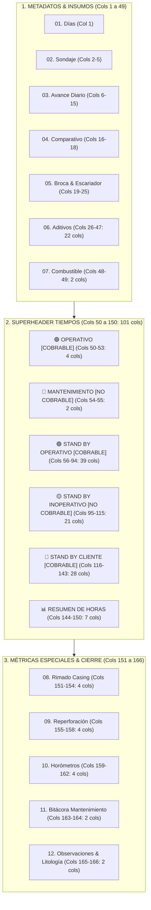

# INFORME TÉCNICO OFICIAL: ESTRUCTURA LÓGICA DE 166 COLUMNAS Y GLOSARIO DE TÉRMINOS OPERACIONALES
**Documento Técnico Definitivo:** Formato `RD.402.P.01.F.01` — Reporte Detallado de Avance por Equipo  
**Empresa:** Rockdrill Group — Control de Operaciones, Valorizaciones & Business Intelligence  
**Archivo Fuente Auditado:** `Plantilla Nuevo Detallado.xlsx` (Raíz del Proyecto)  
**Fecha de Emisión:** 21 de Agosto de 2026  
**Versión:** 3.0.0 (Versión Final Oficial)

---

## 🎯 1. Evaluación de Ordenamiento, Jerarquía y Estructura Lógica

Tras la auditoría exhaustiva celda por celda de la **Plantilla Nuevo Detallado (166 Columnas)**, se concluye que el diseño alcanza un nivel óptimo de **madurez operacional, consistencia matemática y compatibilidad analítica**.

### ✅ Aspectos Sobresalientes de la Estructura:
1. **Flujo Cronológico Natural:** Inicia con la identificación del sondaje y cuadrilla, continúa con los consumos de insumos del turno, se adentra en la distribución de las 12 horas del turno de perforación y culmina con los tramos especiales y bitácoras.
2. **Alineación con la Convención Interempresarial:** Cumple al 100% las 5 macro-categorías inamovibles de disponibilidad y facturación de la industria minera peruana e internacional.
3. **Slots de Expansión Inteligentes (`SBO1..5`, `SBI1..4`, `SBC1..4`):** Permite que contratos con condiciones geográficas o contractuales atípicas asignen columnas reservadas sin desplazar las columnas canónicas ni quebrar el pipeline de ingesta a Power BI (`RESIDENTES.pbix`).
4. **Desglose Especializado de Geotecnia e Hidrogeología:** Resuelve de raíz la dispersión de datos al consolidar Lefranc, Lugeon, SPT, Shelby, Piezómetros (Casagrande/Cuerda Vibrante), Inclinómetros, Air Lift y Slug Test.

---

## 📋 2. Catálogo Maestro de las 166 Columnas Oficiales

| N° | Col | Fila 22: Bloque / Categoría Mayor | Fila 23: Nombre / Actividad | Fila 24: Atributo / Unidad | Cobrabilidad / Naturaleza |
| :---: | :---: | :--- | :--- | :--- | :--- |
| **1** | A | DÍAS | DÍAS | DÍAS | NO APLICA |
| **2** | B | SONDAJE | NOMBRE | NOMBRE | NO APLICA |
| **3** | C | SONDAJE | PROFUNDIDAD | PROFUNDIDAD | NO APLICA |
| **4** | D | SONDAJE | LINEA | LINEA | NO APLICA |
| **5** | E | SONDAJE | INCLINACIÓN | INCLINACIÓN | NO APLICA |
| **6** | F | AVANCE DIARIO | DESDE | DESDE | COBRABLE (M / HR) |
| **7** | G | AVANCE DIARIO | HASTA | HASTA | COBRABLE (M / HR) |
| **8** | H | AVANCE DIARIO | TURNO (A=1;B=2) | TURNO (A=1;B=2) | NO APLICA |
| **9** | I | AVANCE DIARIO | GRUPO | GRUPO | NO APLICA |
| **10** | J | AVANCE DIARIO | METRAJE | METRAJE | COBRABLE (M) |
| **11** | K | AVANCE DIARIO | HORAS EXTAS | HORAS EXTAS | NO APLICA |
| **12** | L | AVANCE DIARIO | PERFORISTA | PERFORISTA | NO APLICA |
| **13** | M | AVANCE DIARIO | AYUDANTE | AYUDANTE | NO APLICA |
| **14** | N | AVANCE DIARIO | AYUDANTE | AYUDANTE | NO APLICA |
| **15** | O | AVANCE DIARIO | TOTAL metraje del dia | TOTAL metraje del dia | COBRABLE (M) |
| **16** | P | COMPARATIVO | ACUMULADO | ACUMULADO | NO APLICA |
| **17** | Q | COMPARATIVO | PROYECTADO | PROYECTADO | NO APLICA |
| **18** | R | COMPARATIVO | META | META | NO APLICA |
| **19** | S | BROCA | MARCA | MARCA | NO APLICA |
| **20** | T | BROCA | SERIE | SERIE | NO APLICA |
| **21** | U | BROCA | Nº BROCA | Nº BROCA | NO APLICA |
| **22** | V | BROCA | ESTADO DE LA BROCA | ESTADO DE LA BROCA | NO APLICA |
| **23** | W | ESCARIADOR | MARCA | MARCA | NO APLICA |
| **24** | X | ESCARIADOR | Nº ESCARIADOR | Nº ESCARIADOR | NO APLICA |
| **25** | Y | ESCARIADOR | ESTADO DEL ESCARIADOR | ESTADO DEL ESCARIADOR | NO APLICA |
| **26** | Z | ADITIVOS (X UNIDADES) | BENTONITA | PRODUCTO | CONSUMO |
| **27** | AA | ADITIVOS (X UNIDADES) | BENTONITA | CANT. | CONSUMO |
| **28** | AB | ADITIVOS (X UNIDADES) | BENTONITA | UND. | NO APLICA |
| **29** | AC | ADITIVOS (X UNIDADES) | PAC | PRODUCTO | CONSUMO |
| **30** | AD | ADITIVOS (X UNIDADES) | PAC | CANT. | CONSUMO |
| **31** | AE | ADITIVOS (X UNIDADES) | PAC | UND. | NO APLICA |
| **32** | AF | ADITIVOS (X UNIDADES) | POLIMERO | PRODUCTO | CONSUMO |
| **33** | AG | ADITIVOS (X UNIDADES) | POLIMERO | CANT. | CONSUMO |
| **34** | AH | ADITIVOS (X UNIDADES) | POLIMERO | UND. | NO APLICA |
| **35** | AI | ADITIVOS (X UNIDADES) | LUBRICANTES | PRODUCTO | CONSUMO |
| **36** | AJ | ADITIVOS (X UNIDADES) | LUBRICANTES | CANT. | CONSUMO |
| **37** | AK | ADITIVOS (X UNIDADES) | LUBRICANTES | UND. | NO APLICA |
| **38** | AL | ADITIVOS (X UNIDADES) | INHIBIDORES | PRODUCTO | CONSUMO |
| **39** | AM | ADITIVOS (X UNIDADES) | INHIBIDORES | CANT. | CONSUMO |
| **40** | AN | ADITIVOS (X UNIDADES) | INHIBIDORES | UND. | NO APLICA |
| **41** | AO | ADITIVOS (X UNIDADES) | ESTABILIZADOR | PRODUCTO | CONSUMO |
| **42** | AP | ADITIVOS (X UNIDADES) | ESTABILIZADOR | CANT. | CONSUMO |
| **43** | AQ | ADITIVOS (X UNIDADES) | ESTABILIZADOR | UND. | NO APLICA |
| **44** | AR | ADITIVOS (X UNIDADES) | OTROS | CLASIFICACIÓN | CONSUMO |
| **45** | AS | ADITIVOS (X UNIDADES) | OTROS | PRODUCTO | CONSUMO |
| **46** | AT | ADITIVOS (X UNIDADES) | OTROS | CANT. | CONSUMO |
| **47** | AU | ADITIVOS (X UNIDADES) | OTROS | UND. | NO APLICA |
| **48** | AV | COMBUSTIBLE | PETROLEO | CANT. | CONSUMO |
| **49** | AW | COMBUSTIBLE | PETROLEO | GLN | NO APLICA |
| **50** | AX | OPERATIVO | Perforación | Perforación | COBRABLE (PRODUCTIVO) |
| **51** | AY | OPERATIVO | Rimado | Rimado | COBRABLE (PRODUCTIVO) |
| **52** | AZ | OPERATIVO | Asentado / Retiro de revestimiento (Casing) | Asentado / Retiro de revestimiento (Casing) | COBRABLE (PRODUCTIVO) |
| **53** | BA | OPERATIVO | RePerforación | RePerforación | COBRABLE (PRODUCTIVO) |
| **54** | BB | MANTENIMIENTO | Preventivo | Preventivo | NO COBRABLE (MANTTO) |
| **55** | BC | MANTENIMIENTO | Correctivo | Correctivo | NO COBRABLE (MANTTO) |
| **56** | BD | STAND BY OPERATIVO | Lavado de sondaje | Lavado de sondaje | COBRABLE (OPERATIVO) |
| **57** | BE | STAND BY OPERATIVO | Mezclado de lodos | Mezclado de lodos | COBRABLE (OPERATIVO) |
| **58** | BF | STAND BY OPERATIVO | Manipulación de tuberías | Manipulación de tuberías | COBRABLE (OPERATIVO) |
| **59** | BG | STAND BY OPERATIVO | Acondicionamiento de sondaje | Acondicionamiento de sondaje | COBRABLE (OPERATIVO) |
| **60** | BH | STAND BY OPERATIVO | Cambio de línea | Cambio de línea | COBRABLE (OPERATIVO) |
| **61** | BI | STAND BY OPERATIVO | Recuperación de sondaje por problemas geologicos | Recuperación de sondaje por problemas geologicos | COBRABLE (OPERATIVO) |
| **62** | BJ | STAND BY OPERATIVO | Recuperación de materiales y o maniobras por atrapamiento | Recuperación de materiales y o maniobras por atrapamiento | COBRABLE (OPERATIVO) |
| **63** | BK | STAND BY OPERATIVO | Maniobras por descarga y carga de tuberías (por problemas geologicos) | Maniobras por descarga y carga de tuberías (por problemas geologicos) | COBRABLE (OPERATIVO) |
| **64** | BL | STAND BY OPERATIVO | Perforación en fallas y/o terrenos altamente fracturados | Perforación en fallas y/o terrenos altamente fracturados | COBRABLE (OPERATIVO) |
| **65** | BM | STAND BY OPERATIVO | Medición de Desviación | Medición de Desviación | COBRABLE (OPERATIVO) |
| **66** | BN | STAND BY OPERATIVO | Traslado entre cámaras de perforación | Traslado entre cámaras de perforación | COBRABLE (OPERATIVO) |
| **67** | BO | STAND BY OPERATIVO | Cambio de punto de perforacion | Cambio de punto de perforacion | COBRABLE (OPERATIVO) |
| **68** | BP | STAND BY OPERATIVO | Anclado de máquina de perforación | Anclado de máquina de perforación | COBRABLE (OPERATIVO) |
| **69** | BQ | STAND BY OPERATIVO | Perforación de perno de anclaje | Perforación de perno de anclaje | COBRABLE (OPERATIVO) |
| **70** | BR | STAND BY OPERATIVO | Cementación de perno de anclaje y fraguado | Cementación de perno de anclaje y fraguado | COBRABLE (OPERATIVO) |
| **71** | BS | STAND BY OPERATIVO | Cementado y fraguado de sondaje | Cementado y fraguado de sondaje | COBRABLE (OPERATIVO) |
| **72** | BT | STAND BY OPERATIVO | Obturación/Sellado de sondaje con packer | Obturación/Sellado de sondaje con packer | COBRABLE (OPERATIVO) |
| **73** | BU | STAND BY OPERATIVO | Sellado de Sondaje | Sellado de Sondaje | COBRABLE (OPERATIVO) |
| **74** | BV | STAND BY OPERATIVO | Inyección de lechada de cemento | Inyección de lechada de cemento | COBRABLE (OPERATIVO) |
| **75** | BW | STAND BY OPERATIVO | Ensayo Lefranc | Ensayo Lefranc | COBRABLE (OPERATIVO) |
| **76** | BX | STAND BY OPERATIVO | Ensayo Lugeon | Ensayo Lugeon | COBRABLE (OPERATIVO) |
| **77** | BY | STAND BY OPERATIVO | Prueba SPT | Prueba SPT | COBRABLE (OPERATIVO) |
| **78** | BZ | STAND BY OPERATIVO | Prueba Shelby | Prueba Shelby | COBRABLE (OPERATIVO) |
| **79** | CA | STAND BY OPERATIVO | Pruebas Geotécnicas | Pruebas Geotécnicas | COBRABLE (OPERATIVO) |
| **80** | CB | STAND BY OPERATIVO | Prueba de nivel freático | Prueba de nivel freático | COBRABLE (OPERATIVO) |
| **81** | CC | STAND BY OPERATIVO | Ensayo Air Lift | Ensayo Air Lift | COBRABLE (OPERATIVO) |
| **82** | CD | STAND BY OPERATIVO | Ensayo Slug Test | Ensayo Slug Test | COBRABLE (OPERATIVO) |
| **83** | CE | STAND BY OPERATIVO | Instalación de piezómetro Casagrande | Instalación de piezómetro Casagrande | COBRABLE (OPERATIVO) |
| **84** | CF | STAND BY OPERATIVO | Instalación de piezómetro de cuerda vibrante | Instalación de piezómetro de cuerda vibrante | COBRABLE (OPERATIVO) |
| **85** | CG | STAND BY OPERATIVO | Instalación de inclinómetro | Instalación de inclinómetro | COBRABLE (OPERATIVO) |
| **86** | CH | STAND BY OPERATIVO | Instalación de piezómetro multinivel | Instalación de piezómetro multinivel | COBRABLE (OPERATIVO) |
| **87** | CI | STAND BY OPERATIVO | Instrumentación, toma de presión de agua y caudal | Instrumentación, toma de presión de agua y caudal | COBRABLE (OPERATIVO) |
| **88** | CJ | STAND BY OPERATIVO | Prueba de lectura de inclinómetro | Prueba de lectura de inclinómetro | COBRABLE (OPERATIVO) |
| **89** | CK | STAND BY OPERATIVO | Toma de lecturas cuerda vibrante | Toma de lecturas cuerda vibrante | COBRABLE (OPERATIVO) |
| **90** | CL | STAND BY OPERATIVO | SBO1 | SBO1 | COBRABLE (OPERATIVO) |
| **91** | CM | STAND BY OPERATIVO | SBO2 | SBO2 | COBRABLE (OPERATIVO) |
| **92** | CN | STAND BY OPERATIVO | SBO3 | SBO3 | COBRABLE (OPERATIVO) |
| **93** | CO | STAND BY OPERATIVO | SBO4 | SBO4 | COBRABLE (OPERATIVO) |
| **94** | CP | STAND BY OPERATIVO | SBO5 | SBO5 | COBRABLE (OPERATIVO) |
| **95** | CQ | STAND BY INOPERATIVO | Desate de rocas | Desate de rocas | NO COBRABLE (INTERNO RD) |
| **96** | CR | STAND BY INOPERATIVO | Orden y limpieza | Orden y limpieza | NO COBRABLE (INTERNO RD) |
| **97** | CS | STAND BY INOPERATIVO | Recojo de lama | Recojo de lama | NO COBRABLE (INTERNO RD) |
| **98** | CT | STAND BY INOPERATIVO | Poza de sedimentación | Poza de sedimentación | NO COBRABLE (INTERNO RD) |
| **99** | CU | STAND BY INOPERATIVO | Estandarización y Desestandarización | Estandarización y Desestandarización | NO COBRABLE (INTERNO RD) |
| **100** | CV | STAND BY INOPERATIVO | Instalación de red de agua o drenaje | Instalación de red de agua o drenaje | NO COBRABLE (INTERNO RD) |
| **101** | CW | STAND BY INOPERATIVO | Instalación / Desinstalación de maquina | Instalación / Desinstalación de maquina | NO COBRABLE (INTERNO RD) |
| **102** | CX | STAND BY INOPERATIVO | Traslado de accesorios | Traslado de accesorios | NO COBRABLE (INTERNO RD) |
| **103** | CY | STAND BY INOPERATIVO | Auditoría Interna | Auditoría Interna | NO COBRABLE (INTERNO RD) |
| **104** | CZ | STAND BY INOPERATIVO | Charla, reparto de guardia, llenado de herramientas y reportes | Charla, reparto de guardia, llenado de herramientas y reportes | NO COBRABLE (INTERNO RD) |
| **105** | DA | STAND BY INOPERATIVO | Espera de repuestos mecánicos | Espera de repuestos mecánicos | NO COBRABLE (INTERNO RD) |
| **106** | DB | STAND BY INOPERATIVO | Espera de materiales e insumos de perforación | Espera de materiales e insumos de perforación | NO COBRABLE (INTERNO RD) |
| **107** | DC | STAND BY INOPERATIVO | Traslado de personal | Traslado de personal | NO COBRABLE (INTERNO RD) |
| **108** | DD | STAND BY INOPERATIVO | Refrigerio | Refrigerio | NO COBRABLE (INTERNO RD) |
| **109** | DE | STAND BY INOPERATIVO | Falta de personal | Falta de personal | NO COBRABLE (INTERNO RD) |
| **110** | DF | STAND BY INOPERATIVO | Paralización por fiestas | Paralización por fiestas | NO COBRABLE (INTERNO RD) |
| **111** | DG | STAND BY INOPERATIVO | Pare RD/ seguridad | Pare RD/ seguridad | NO COBRABLE (INTERNO RD) |
| **112** | DH | STAND BY INOPERATIVO | SBI1 | SBI1 | NO COBRABLE (INTERNO RD) |
| **113** | DI | STAND BY INOPERATIVO | SBI2 | SBI2 | NO COBRABLE (INTERNO RD) |
| **114** | DJ | STAND BY INOPERATIVO | SBI3 | SBI3 | NO COBRABLE (INTERNO RD) |
| **115** | DK | STAND BY INOPERATIVO | SBI4 | SBI4 | NO COBRABLE (INTERNO RD) |
| **116** | DL | STAND BY CLIENTE | Voladura | Voladura | COBRABLE (CLIENTE / MINA) |
| **117** | DM | STAND BY CLIENTE | Falta de agua | Falta de agua | COBRABLE (CLIENTE / MINA) |
| **118** | DN | STAND BY CLIENTE | Falta de energía | Falta de energía | COBRABLE (CLIENTE / MINA) |
| **119** | DO | STAND BY CLIENTE | Falta de ventilación | Falta de ventilación | COBRABLE (CLIENTE / MINA) |
| **120** | DP | STAND BY CLIENTE | Falta de servicios | Falta de servicios | COBRABLE (CLIENTE / MINA) |
| **121** | DQ | STAND BY CLIENTE | Espera Orden Cliente | Espera Orden Cliente | COBRABLE (CLIENTE / MINA) |
| **122** | DR | STAND BY CLIENTE | Espera de programa | Espera de programa | COBRABLE (CLIENTE / MINA) |
| **123** | DS | STAND BY CLIENTE | Espera de cámara | Espera de cámara | COBRABLE (CLIENTE / MINA) |
| **124** | DT | STAND BY CLIENTE | Espera de sostenimiento | Espera de sostenimiento | COBRABLE (CLIENTE / MINA) |
| **125** | DU | STAND BY CLIENTE | Espera de scoop | Espera de scoop | COBRABLE (CLIENTE / MINA) |
| **126** | DV | STAND BY CLIENTE | Espera de marcado de punto | Espera de marcado de punto | COBRABLE (CLIENTE / MINA) |
| **127** | DW | STAND BY CLIENTE | Espera de Topografía | Espera de Topografía | COBRABLE (CLIENTE / MINA) |
| **128** | DX | STAND BY CLIENTE | Espera de grúa | Espera de grúa | COBRABLE (CLIENTE / MINA) |
| **129** | DY | STAND BY CLIENTE | Espera por puebas de permeabilidad y/o ensayos | Espera por puebas de permeabilidad y/o ensayos | COBRABLE (CLIENTE / MINA) |
| **130** | DZ | STAND BY CLIENTE | Traslado de máquina | Traslado de máquina | COBRABLE (CLIENTE / MINA) |
| **131** | EA | STAND BY CLIENTE | Auditoría externa/ Osinergmin | Auditoría externa/ Osinergmin | COBRABLE (CLIENTE / MINA) |
| **132** | EB | STAND BY CLIENTE | Capacitación (Externa Cliente) | Capacitación (Externa Cliente) | COBRABLE (CLIENTE / MINA) |
| **133** | EC | STAND BY CLIENTE | Falta de habilitación de cámara o plataforma | Falta de habilitación de cámara o plataforma | COBRABLE (CLIENTE / MINA) |
| **134** | ED | STAND BY CLIENTE | Espera de orden cliente | Espera de orden cliente | COBRABLE (CLIENTE / MINA) |
| **135** | EE | STAND BY CLIENTE | Condiciones climáticas | Condiciones climáticas | COBRABLE (CLIENTE / MINA) |
| **136** | EF | STAND BY CLIENTE | Inundación | Inundación | COBRABLE (CLIENTE / MINA) |
| **137** | EG | STAND BY CLIENTE | Paralización por estrés térmico o alta temperatura | Paralización por estrés térmico o alta temperatura | COBRABLE (CLIENTE / MINA) |
| **138** | EH | STAND BY CLIENTE | Parada por sismo/microsismo | Parada por sismo/microsismo | COBRABLE (CLIENTE / MINA) |
| **139** | EI | STAND BY CLIENTE | Conflicto social | Conflicto social | COBRABLE (CLIENTE / MINA) |
| **140** | EJ | STAND BY CLIENTE | SBC1 | SBC1 | COBRABLE (CLIENTE / MINA) |
| **141** | EK | STAND BY CLIENTE | SBC2 | SBC2 | COBRABLE (CLIENTE / MINA) |
| **142** | EL | STAND BY CLIENTE | SBC3 | SBC3 | COBRABLE (CLIENTE / MINA) |
| **143** | EM | STAND BY CLIENTE | SBC4 | SBC4 | COBRABLE (CLIENTE / MINA) |
| **144** | EN | RESUMEN DE HORAS | TIEMPO TOTAL | TIEMPO TOTAL | TOTAL HORAS |
| **145** | EO | RESUMEN DE HORAS | TIEMPO EFECTIVO - OPERATIVO | TIEMPO EFECTIVO - OPERATIVO | TOTAL HORAS |
| **146** | EP | RESUMEN DE HORAS | LOST TIME | LOST TIME | TOTAL HORAS |
| **147** | EQ | RESUMEN DE HORAS | Mantenimiento | Mantenimiento | TOTAL HORAS |
| **148** | ER | RESUMEN DE HORAS | Stand By Operativo | Stand By Operativo | TOTAL HORAS |
| **149** | ES | RESUMEN DE HORAS | Stand By Inoperativo | Stand By Inoperativo | TOTAL HORAS |
| **150** | ET | RESUMEN DE HORAS | Stand By Cliente | Stand By Cliente | TOTAL HORAS |
| **151** | EU | RIMADO CON CASING HWT/HQ | DESDE | DESDE | METRAJE ESPECIAL |
| **152** | EV | RIMADO CON CASING HWT/HQ | HASTA | HASTA | METRAJE ESPECIAL |
| **153** | EW | RIMADO CON CASING HWT/HQ | METRAJE | METRAJE | METRAJE ESPECIAL |
| **154** | EX | RIMADO CON CASING HWT/HQ | TOTAL | TOTAL | METRAJE ESPECIAL |
| **155** | EY | RE-PERFORACIÓN | DESDE | DESDE | METRAJE ESPECIAL |
| **156** | EZ | RE-PERFORACIÓN | HASTA | HASTA | METRAJE ESPECIAL |
| **157** | FA | RE-PERFORACIÓN | METRAJE | METRAJE | METRAJE ESPECIAL |
| **158** | FB | RE-PERFORACIÓN | TOTAL | TOTAL | METRAJE ESPECIAL |
| **159** | FC | HOROMETRO | DESDE | DESDE | HORAS MOTOR |
| **160** | FD | HOROMETRO | HASTA | HASTA | HORAS MOTOR |
| **161** | FE | HOROMETRO | ACUMULADO | ACUMULADO | HORAS MOTOR |
| **162** | FF | HOROMETRO | TOTAL | TOTAL | HORAS MOTOR |
| **163** | FG | BITACORA DE MANTENIMIENTO | TRABAJOS REALIZADOS | TRABAJOS REALIZADOS | NO APLICA |
| **164** | FH | BITACORA DE MANTENIMIENTO | REPUESTOS UTILIZADOS | REPUESTOS UTILIZADOS | NO APLICA |
| **165** | FI | OBSERVACIONES | DESCRIPCIÓN LITOLÓGICA | DESCRIPCIÓN LITOLÓGICA | NO APLICA |
| **166** | FJ | OBSERVACIONES | COMENTARIOS | COMENTARIOS | NO APLICA |

---

## 📖 3. Glosario de Términos Operacionales y Contractuales

A continuación se define formalmente cada concepto presente en la plantilla, indicando su propósito operacional, imputación contractual y contexto técnico de campo:

### A. Metadatos, Sondaje y Avance
- **`SONDAJE (NOMBRE)`:** Identificador alfanumérico único del pozo o taladro diamantino programado por el área de Geología de la empresa minera (ej. `DDH-2026-045`, `UG-CON-350-01`).
- **`PROFUNDIDAD PROGRAMADA`:** Longitud total proyectada del taladro en metros lineales (m) según el programa geológico.
- **`LÍNEA / DIÁMETRO`:** Diámetro de la sarta de perforación y sacatestigos (*Core Barrel*). Estándares Wireline: **PQ** ($85.0\text{ mm}$ testigo / $122.6\text{ mm}$ pozo), **HQ** ($63.5\text{ mm}$ testigo / $96.0\text{ mm}$ pozo), **NQ** ($47.6\text{ mm}$ testigo / $75.7\text{ mm}$ pozo), **BQ** ($36.4\text{ mm}$ testigo / $60.0\text{ mm}$ pozo).
- **`INCLINACIÓN / DIP`:** Ángulo de perforación del taladro respecto al plano horizontal, expresado en grados sexagesimales (positivo hacia arriba en interior mina, negativo hacia abajo en superficie, ej. $-60^\circ$, $+45^\circ$).
- **`DESDE / HASTA`:** Profundidad inicial y final en metros lineales alcanzada por la broca durante la guardia de 12 horas.
- **`METRAJE (GUARDIA)`:** Avance lineal efectivo en metros ($M = \text{HASTA} - \text{DESDE}$).
- **`TOTAL METRAJE DEL DÍA`:** Suma del avance lineal acumulado en 24 horas (Guardia A + Guardia B).

---

### B. Herramientas de Corte e Insumos
- **`BROCA DIAMANTINA`:** Herramienta de corte impregnada con matriz de diamantes sintéticos encargada de desgastar la roca y cortar el testigo cilíndrico.
- **`ESCARIADOR (REAMING SHELL)`:** Componente cilíndrico diamantado ubicado inmediatamente detrás de la broca, cuya función es calibrar y mantener el diámetro exacto del pozo y estabilizar el tubo sacatestigos.
- **`BENTONITA`:** Arcilla montmorillonita sódica de alta viscosidad utilizada para generar revoque en las paredes del taladro y transportar recortes (*cuttings*).
- **`PAC (POLIANIÓNICO CELULOSA)`:** Polímero orgánico reductor de filtrado y viscosificador para control de pérdida de fluidos en formaciones permeables.
- **`POLÍMERO SINTÉTICO (PHPA)`:** Poliacrilamida parcialmente hidrolizada utilizada para encapsular arcillas expansivas, estabilizar lutitas y mejorar la lubricidad de la sarta.
- **`INHIBIDORES DE ARCILLAS / ESTABILIZADOR`:** Aditivos químicos diseñados para prevenir el hinchamiento (*swelling*) y desmoronamiento de lutitas o fallas reactivas.

---

### C. Categoría 1: OPERATIVO [COBRABLE]
Actividades de perforación y revestimiento facturadas por metro lineal avanzado o tarifa horaria operativa:
- **`Perforación`:** Tiempo en que la broca diamantina se encuentra rotando y cortando roca en el fondo del taladro con retorno de testigo.
- **`Rimado`:** Operación de ensanchamiento o rectificación del diámetro del taladro con una broca escariadora o zapata rimadora para permitir el paso de tubería de revestimiento.
- **`Asentado / Retiro de revestimiento (Casing)`:** Maniobra de instalación o extracción de tubería de protección metálica (**HWT**, **HW**, **NW**) para aislar tramos superficiales fracturados o sobrecapa (*overburden*).
- **`RePerforación`:** Repasado y corte de tramos ya perforados que colapsaron o sufrieron derrumbe interno antes de alcanzar el fondo libre.

---

### D. Categoría 2: MANTENIMIENTO [NO COBRABLE]
Interrupciones por intervención sobre los componentes mecánicos, hidráulicos o eléctricos de la máquina de perforación:
- **`Mantenimiento Preventivo`:** Parada planificada para ejecución de pautas por horómetro (PM 250, PM 500, PM 1000 hrs: cambio de aceites hidráulicos, filtros, engrase general y chequeo de presiones).
- **`Mantenimiento Correctivo`:** Parada intempestiva por avería mecánica o eléctrica de la perforadora, cabezal de rotación, bombas de lodos (FMC/Bean), winche wireline o mangueras hidráulicas.

---

### E. Categoría 3: STAND BY OPERATIVO [COBRABLE]
Maniobras operacionales necesarias, estabilización del pozo, ensayos geotécnicos e instrumentación hidrogeológica:
- **`Lavado de sondaje`:** Inyección y circulación de agua limpia a alta presión para desalojar detritos y sedimentos antes de ingresar la sarta o cambiar broca.
- **`Mezclado de lodos`:** Tiempo dedicado a la hidratación, mezcla y homogenización de lodos de perforación y aditivos en las pozas o tinas.
- **`Manipulación de tuberías`:** Acople, desacople y verificación de roscas de barras de perforación en la plataforma.
- **`Acondicionamiento de sondaje`:** Bombeo de mezclas espesas de bentonita/polímero para estabilizar fracturas, recuperar el retorno de agua y controlar torque excesivo.
- **`Cambio de línea`:** Reducción programada o forzada del diámetro de perforación (ej. de HQ a NQ o de NQ a BQ) debido a profundidad o dificultades del terreno.
- **`Recuperación de sondaje por problemas geológicos`:** Maniobras de rescate del pozo ante colapsos severos de pared o cavernas litológicas.
- **`Recuperación de materiales y o maniobras por atrapamiento (Pesca)`:** Operaciones de extracción de herramientas, tubos interiores (*Core Barrel*) o barras atascadas mediante machos de pesca (*taper taps* / *spears*).
- **`Maniobras por descarga y carga de tuberías`:** Sacada y bajada completa de toda la columna de barras para cambio de broca desgastada o inspección de zapata.
- **`Perforación en fallas y/o terrenos altamente fracturados`:** Avance a parámetros reducidos (baja RPM y penetración controlada) en zonas de cizalla geológica.
- **`Medición de Desviación (Gyro / Reflex)`:** Toma de lecturas de azimut, inclinación y trayectoria espacial del pozo mediante sondas giroscópicas o multi-shot.
- **`Anclado de máquina de perforación`:** Fijación de la base de la perforadora al piso de la cámara o plataforma mediante cáncamos o pernos para evitar vibraciones.
- **`Perforación y Cementación de perno de anclaje`:** Perforación de taladros cortos e inyección de resina/lechada para asegurar los pernos de fijación.
- **`Cementado y fraguado de sondaje / Inyección de lechada`:** Inyección de cemento en el pozo para sellar acuíferos o consolidar zonas cavernosas, incluyendo el tiempo de fraguado.
- **`Obturación/Sellado de sondaje con packer`:** Instalación de obturadores neumáticos/mecánicos (*Packers*) para aislar horizontes permeables y realizar pruebas hidráulicas.
- **`Ensayo Lefranc`:** Ensayo de permeabilidad in situ a carga constante o variable para determinar la conductividad hidráulica en suelos o rocas blandas.
- **`Ensayo Lugeon`:** Prueba de permeabilidad en roca bajo presiones de agua escalonadas (unidades Lugeon: $1\text{ Lugeon} = 1\text{ L/min/metro a }10\text{ bar}$).
- **`Prueba SPT (Standard Penetration Test)`:** Ensayo geotécnico de penetración dinámica para medir la compacidad de estratos de suelo mediante conteo de golpes ($N$).
- **`Prueba Shelby`:** Muestreo de suelos cohesivos inalterados mediante hincado de tubo de pared delgada (*Shelby tube*).
- **`Pruebas Geotécnicas`:** Ensayos integrales de caracterización geomecánica de roca o suelo.
- **`Prueba de nivel freático`:** Medición de la profundidad del nivel freático estático en el pozo con sonda piezométrica (*pozoómetro*).
- **`Ensayo Air Lift`:** Limpieza y desarrollo hidráulico del pozo mediante inyección de aire comprimido para inducir surgencia de agua subterránea.
- **`Ensayo Slug Test`:** Prueba hidrogeológica de permeabilidad mediante la introducción o extracción instantánea de un volumen conocido (*slug*).
- **`Instalación de piezómetro Casagrande`:** Instalación de tubo de PVC ranurado con celda de filtro poroso para monitoreo del nivel piezométrico.
- **`Instalación de piezómetro de cuerda vibrante`:** Colocación de transductor electrónico (*Vibrating Wire*) para monitoreo continuo de presión de poros.
- **`Instalación de inclinómetro`:** Instalación de tubería especial ranurada para medir desplazamientos horizontales y deformaciones en taludes o macizos.
- **`Instalación de piezómetro multinivel`:** Sistema de múltiples sensores piezométricos aislados a distintas profundidades en un solo taladro.
- **`Instrumentación, toma de presión de agua y caudal`:** Mediciones de caudal de surgencia con vertedero o manómetros en boca de pozo.
- **`Prueba de lectura de inclinómetro / Toma de lecturas cuerda vibrante`:** Adquisición de datos en campo con sonda digital (*Inclinometer Probe*) o datalogger/readout.
- **`SBO1 a SBO5`:** Columnas reservadas (*Wildcards*) para actividades operacionales cobrables específicas de cada contrato minero.

---

### F. Categoría 4: STAND BY INOPERATIVO [NO COBRABLE]
Demoras internas imputables a la gestión de Rockdrill (cuadrilla, logística interna, mantenimiento y seguridad interna):
- **`Desate de rocas`:** Inspección y purga manual de rocas sueltas en la corona o hastiales de la cámara subterránea con barretillas.
- **`Orden y limpieza (5S)`:** Limpieza, recojo de residuos y acondicionamiento de la plataforma de trabajo.
- **`Recojo de lama`:** Extracción y limpieza de detritos y lodos acumulados en las canaletas o piso de la labor.
- **`Poza de sedimentación`:** Limpieza, dragado y adecuación de las pozas de decantación de agua de perforación.
- **`Estandarización y Desestandarización`:** Montaje y desmontaje de entablados de madera, bandejas de contención ambiental y geomembranas.
- **`Instalación de red de agua o drenaje`:** Tendido de mangueras internas desde el punto de abastecimiento de la mina hasta la perforadora.
- **`Instalación / Desinstalación de máquina`:** Montaje de mástil, conexión de tableros eléctricos y conexiones iniciales de la perforadora.
- **`Traslado de accesorios`:** Acarreo manual o mecánico de cajas de testigos, tuberías y aditivos hacia la plataforma.
- **`Auditoría Interna`:** Inspección de seguridad y control operacional ejecutada por el área HSEQ o Residencia de Rockdrill.
- **`Charla, reparto de guardia, llenado de herramientas y reportes`:** Charla de seguridad de 5 minutos, elaboración de IPERC Continuo, verificación de PETS y relevo de turno.
- **`Espera de repuestos mecánicos`:** Demora por abastecimiento de componentes mecánicos o eléctricos asignados al taller de mantenimiento.
- **`Espera de materiales e insumos de perforación`:** Demora por entrega de brocas, escariadores, tubos interiores (*core barrel*) o aditivos asignados a la cadena logística interna de Rockdrill.
- **`Traslado de personal`:** Tiempo de viaje de la cuadrilla desde el campamento/bocamina hasta la cámara de trabajo.
- **`Refrigerio`:** Tiempo reglamentario asignado para alimentación de la cuadrilla (almuerzo / cena).
- **`Falta de personal`:** Inoperatividad del equipo por cuadrilla incompleta (ausentismo, descansos médicos o falta de relevo).
- **`Paralización por fiestas`:** Parada acordada por festividades oficiales (Fiestas Patrias, Día del Minero, Navidad, Año Nuevo).
- **`Pare RD/ seguridad`:** Detención preventiva de labores ordenada por la supervisión de Rockdrill al detectar una condición de riesgo inminente.
- **`SBI1 a SBI4`:** Columnas reservadas (*Wildcards*) para demoras internas no cobrables específicas de cada contrato.

---

### G. Categoría 5: STAND BY CLIENTE [COBRABLE]
Paradas operacionales imputables a la empresa minera/cliente (servicios mina, autorizaciones, interferencias y factores del entorno):
- **`Voladura`:** Parada obligatoria por horario de chispeo/disparo en tajos o labores subterráneas contiguas y tiempo de evacuación.
- **`Falta de agua`:** Interrupción en la línea de agua industrial suministrada por la mina o baja presión en red general.
- **`Falta de energía`:** Corte de fluido eléctrico en la subestación de mina, caída de tensión o mantenimiento de líneas de alta tensión del cliente.
- **`Falta de ventilación`:** Paralización por manga rota, ventilador apagado o acumulación de gases tóxicos (CO, $CO_2$, $NO_x$) por encima de los LMP.
- **`Falta de servicios`:** Corte en la red de aire comprimido industrial u otros suministros primarios de la minera indispensables para operar.
- **`Espera Orden Cliente / Espera de programa`:** Perforadora detenida a la espera de confirmación geológica, cambio de objetivo o validación de fin de pozo por el cliente.
- **`Espera de cámara`:** Retraso en la entrega física de la labor o plataforma de perforación por avance de minado del cliente.
- **`Espera de sostenimiento`:** Parada por estallido de roca (*rockburst*), desprendimientos o espera de colocación de pernos, malla o shotcrete por geomecánica de la mina.
- **`Espera de scoop`:** Detención por carguío, acarreo o limpieza de carga de marina con equipo pesado (*Scoop / Dumper*) en la cámara de perforación.
- **`Espera de marcado de punto`:** Demora en la entrega formal de las coordenadas y azimut geológico en terreno.
- **`Espera de Topografía`:** Espera del equipo de topógrafos de la mina para alineación láser de la máquina o levantamiento del collar del pozo.
- **`Espera de grúa`:** Falta de disponibilidad del camión grúa o equipo de izaje pesado provisto contractualmente por la empresa minera.
- **`Espera por pruebas de permeabilidad y/o ensayos`:** Tiempo en que la máquina está parada esperando al técnico o geólogo especialista del cliente para iniciar ensayos.
- **`Traslado de máquina (Cliente)`:** Remolque o transporte de la perforadora ejecutado con equipo pesado o tracción de la mina.
- **`Auditoría externa / Osinergmin`:** Parada por inspección de entidades reguladoras del Estado (Osinergmin, Sunafil, Minem) o visitas corporativas de la alta dirección de la minera.
- **`Capacitación (Externa Cliente)`:** Parada de toda la unidad minera por cursos obligatorios de inducción o seguridad organizados por el cliente.
- **`Falta de habilitación de cámara o plataforma`:** Deslizamientos en rampa, accesos bloqueados por desmonte o falta de pase que impiden llegar a la labor.
- **`Condiciones climáticas`:** Paralización en superficie por tormenta eléctrica (Alerta Roja), nevada, lluvia torrencial o neblina densa.
- **`Inundación`:** Inundación de la cámara o plataforma debido al colapso o sobrecarga del sistema de bombeo principal de la mina.
- **`Paralización por estrés térmico o alta temperatura`:** Detención laboral en cámaras subterráneas con temperatura de bulbo húmedo superior a los límites permitidos.
- **`Parada por sismo/microsismo`:** Protocolo de evacuación de emergencia y evaluación geomecánica tras sismos o eventos microsísmicos.
- **`Conflicto social`:** Bloqueo de garitas, huelgas comunales o paros regionales ajenos a Rockdrill.
- **`SBC1 a SBC4`:** Columnas reservadas (*Wildcards*) para paradas cliente cobrables específicas de cada contrato.

---

### H. Resumen de Horas, Tramos Especiales y Cierre
- **`TIEMPO TOTAL`:** Suma aritmética de todas las horas de la guardia ($50\text{ a }143$), que debe totalizar $12.0\text{ hrs}$ en turnos completos.
- **`TIEMPO EFECTIVO - OPERATIVO`:** Horas netas dedicadas a perforación, rimado y casing.
- **`LOST TIME`:** Horas no productivas totales ($\text{Mantenimiento} + \text{Stand By Operativo} + \text{Stand By Inoperativo} + \text{Stand By Cliente}$).
- **`RIMADO CON CASING HWT/HQ (METRAJE)`:** Metros lineales específicos entubados con tubería de gran diámetro ($HWT/HQ$).
- **`RE-PERFORACIÓN (METRAJE)`:** Metros lineales reperforados para recuperar pozo.
- **`HORÓMETRO (TOTAL)`:** Horas reales de funcionamiento del motor diésel o eléctrico de la perforadora ($\text{Hasta} - \text{Desde}$).
- **`BITÁCORA DE MANTENIMIENTO`:** Registro descriptivo de trabajos mecánicos y repuestos utilizados.
- **`DESCRIPCIÓN LITOLÓGICA & COMENTARIOS`:** Resumen geológico del testigo recuperado (tipo de roca, alteración, mineralización) e incidencias de la guardia.

---

## 🛠️ 4. Recomendaciones de Calibración de Fórmulas en Excel

Para asegurar que los cálculos automáticos en el libro de Excel no omitan ninguna columna tras la incorporación del catálogo completo de 166 columnas, se recomienda aplicar las siguientes fórmulas en las filas de guardia (ej. fila 75):

1. **`Col 144 / EN (TIEMPO TOTAL)`:**
   `=SUM(AX75:EM75)` *(Suma todas las 94 columnas de tiempos desde Perforación AX hasta SBC4 EM)*.
2. **`Col 145 / EO (TIEMPO EFECTIVO - OPERATIVO)`:**
   `=SUM(AX75:BA75)` *(Suma las 4 columnas de Operativo: Perforación a Reperforación)*.
3. **`Col 146 / EP (LOST TIME)`:**
   `=SUM(EQ75:ET75)` *(Suma Mantenimiento + SB Operativo + SB Inoperativo + SB Cliente)*.
4. **`Col 147 / EQ (Mantenimiento)`:**
   `=SUM(BB75:BC75)` *(Suma Preventivo y Correctivo)*.
5. **`Col 148 / ER (Stand By Operativo)`:**
   `=SUM(BD75:CP75)` *(Suma desde Lavado BD hasta SBO5 CP: 39 columnas completas)*.
6. **`Col 149 / ES (Stand By Inoperativo)`:**
   `=SUM(CQ75:DK75)` *(Suma desde Desate CQ hasta SBI4 DK: 21 columnas completas)*.
7. **`Col 150 / ET (Stand By Cliente)`:**
   `=SUM(DL75:EM75)` *(Suma desde Voladura DL hasta SBC4 EM: 28 columnas completas)*.
8. **`Col 15 / O (TOTAL Metraje del Día)`:**
   `=J75+J76` *(Suma guardia día Turno A y guardia noche Turno B)*.
