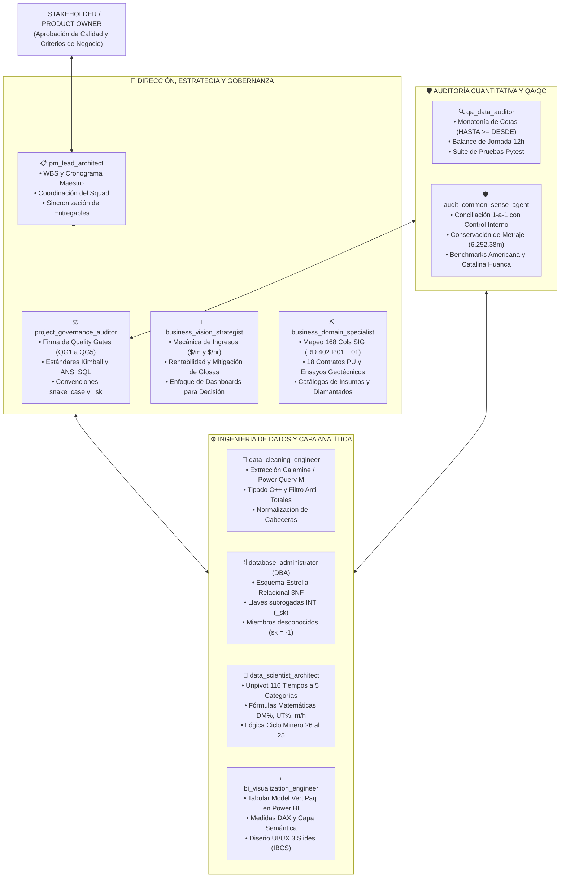
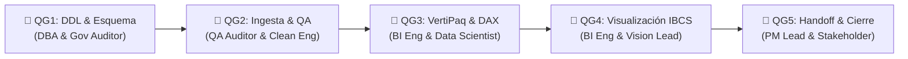

# 📐 PLAN MAESTRO DE IMPLEMENTACIÓN - FASE 2: MODELADO DIMENSIONAL KIMBALL (STAR SCHEMA)
## Sistema Integral de Business Intelligence y Analítica de Perforación (Rockdrill Group)

**Ubicación Oficial:** [`planes/01_PLAN_IMPLEMENTACION_FASE_2_MODELADO_DIMENSIONAL.md`](file:///c:/Proyectos%20Python/Detallados/planes/01_PLAN_IMPLEMENTACION_FASE_2_MODELADO_DIMENSIONAL.md)  
**Fecha:** 01 de Septiembre de 2026  
**Autoridad de Control:** Squad de 10 Agentes Especializados de Rockdrill Group  
**Estado:** **PLAN MAESTRO ESTRUCTURADO Y LISTO PARA VISTO BUENO (V°B°)**  

---

## 👥 1. MATRIZ INTEGRAL DEL SQUAD AGÉNTICO Y ASIGNACIÓN DE ROLES

El presente plan articula de manera sinérgica las responsabilidades de los **10 Agentes Especializados**, garantizando que ninguna decisión técnica quede aislada ni carente de auditoría:

### 📋 Detalle de Atribuciones Específicas en la Fase 2:

| # | Agente | Responsabilidad Principal en Fase 2 | Criterio de Éxito / Entregable |
| :-: | :--- | :--- | :--- |
| 1 | **`pm_lead_architect`** | Supervisión del WBS, integración de módulos y trazabilidad en documentación. | Cumplimiento del cronograma y actualización de [`ESTADO_DEL_PROYECTO.md`](file:///c:/Proyectos%20Python/Detallados/ESTADO_DEL_PROYECTO.md). |
| 2 | **`project_governance_auditor`** | Auditoría y firma de los Quality Gates QG1 (DDL), QG2 (QA) y QG3 (VertiPaq/DAX). | Certificación de cero deuda técnica y cumplimiento Kimball. |
| 3 | **`business_vision_strategist`** | Validación de que la separación de tiempos refleje los drivers de cobrabilidad ($/m y $/hr). | Clasificación certera de paradas cobrables vs. no cobrables. |
| 4 | **`business_domain_specialist`** | Mapeo canónico de las 168 columnas, 116 actividades, líneas (HQ, NQ) y aditivos. | Integridad semántica del formato SIG `RD.402.P.01.F.01`. |
| 5 | **`database_administrator`** | Diseño relacional del Esquema Estrella, llaves subrogadas (`_sk`) e índices. | DDL ANSI SQL optimizado y cero llaves compuestas en el DW. |
| 6 | **`data_scientist_architect`** | Construcción del algoritmo de unpivoting de tiempos y formulación matemática de KPIs. | Dataset `fact_horas_operativas` filtrado ($h > 0$) y fórmulas DAX. |
| 7 | **`data_cleaning_engineer`** | Ingesta de alta velocidad y conexión entre la base consolidada y el modelo dimensional. | Generación de datos intermedios limpios sin nulos ni duplicados. |
| 8 | **`qa_data_auditor`** | Verificación de invariantes: balance de 12h por turno y monotonía física de cotas. | Aprobación de la suite de pruebas automatizadas Pytest. |
| 9 | **`audit_common_sense_agent`** | Verificación 1-a-1: metraje total en hechos $\equiv \mathbf{6,252.38\text{ m}}$ y benchmarks de mina. | Cuadre al 100.00% contra el benchmark histórico oficial. |
| 10 | **`bi_visualization_engineer`** | Creación del modelo Tabular en Power BI, optimización VertiPaq y medidas DAX. | Catálogo DAX exportado y relaciones 1:N unidireccionales. |

---

## 🎯 2. OBJETIVO DEL PROYECTO EN LA FASE 2

Transformar la base consolidada y auditada de la **Fase 1** (`Consolidado_Operaciones` de 3,492 filas $\times$ 172 columnas) en un **Data Warehouse Dimensional Kimball (Esquema Estrella)** de alto rendimiento procesado mediante un **Pipeline Python (< 2.0 segundos)** que genere tablas normalizadas en formato `.csv`, `.parquet` y `.xlsx`, listo para ser consumido en Power BI / Microsoft Fabric / SQL sin arrastrar la lentitud ni el sesgo de "tablas sábana" monolíticas.

---

## 🏛️ 3. ARQUITECTURA DEL MODELO DIMENSIONAL (MERMAID ERD)

```mermaid
erDiagram
    dim_tiempo_calendario ||--o{ fact_perforacion_avance : "calendario_sk (1:N)"
    dim_tiempo_calendario ||--o{ fact_horas_operativas : "calendario_sk (1:N)"
    dim_tiempo_calendario ||--o{ brg_cuadrilla_guardia : "calendario_sk (1:N)"
    
    dim_contrato_minero ||--o{ fact_perforacion_avance : "contrato_sk (1:N)"
    dim_contrato_minero ||--o{ fact_horas_operativas : "contrato_sk (1:N)"
    dim_contrato_minero ||--o{ fact_metas_mensuales : "contrato_sk (1:N)"
    
    dim_equipo_perforadora ||--o{ fact_perforacion_avance : "equipo_sk (1:N)"
    dim_equipo_perforadora ||--o{ fact_horas_operativas : "equipo_sk (1:N)"
    dim_equipo_perforadora ||--o{ fact_metas_mensuales : "equipo_sk (1:N)"
    dim_equipo_perforadora ||--o{ brg_cuadrilla_guardia : "equipo_sk (1:N)"
    
    dim_linea_diametro ||--o{ fact_perforacion_avance : "linea_sk (1:N)"
    
    dim_personal ||--o{ fact_perforacion_avance : "perforista_sk (1:N)"
    dim_personal ||--o{ brg_cuadrilla_guardia : "personal_sk (1:N)"
    
    dim_sondaje_taladro ||--o{ fact_perforacion_avance : "sondaje_sk (1:N)"
    dim_taxonomia_actividad ||--o{ fact_horas_operativas : "actividad_sk (1:N)"

    dim_tiempo_calendario {
        INT calendario_sk PK "YYYYMMDD o -1"
        DATE fecha_dt "2026-08-26"
        VARCHAR mes_nom_civil "Agosto"
        VARCHAR mes_nom_operativo "Agosto"
        INT periodo_operativo_sort "202609"
        BOOLEAN es_cierre_operativo "Día 25"
    }

    dim_contrato_minero {
        SMALLINT contrato_sk PK "1..18 o -1"
        VARCHAR contrato_cd "AMERICANA, CHUNGAR"
        VARCHAR nombre_contrato "CONTRATO AMERICANA"
        VARCHAR zona_geografica "CENTRO, SUR"
        VARCHAR tipo_operacion "SUBTERRANEA, SUPERFICIE"
    }

    dim_equipo_perforadora {
        SMALLINT equipo_sk PK "1..56 o -1"
        VARCHAR equipo_cd "XRD50USS-001"
        VARCHAR codigo_sap "SAP-XRD50USS-001"
        VARCHAR tipo_energia "ELECTRO-HIDRAULICA"
        SMALLINT contrato_sk_asignado FK
    }

    dim_linea_diametro {
        SMALLINT linea_sk PK "1..5 o -1"
        VARCHAR linea_cd "HQ, NQ, BQ, PQ, HWT"
        DECIMAL diametro_corona_mm "96.0"
        DECIMAL diametro_testigo_mm "63.5"
    }

    dim_personal {
        INT personal_sk PK "1..N o -1"
        VARCHAR personal_cd "PER-0001"
        VARCHAR nombre_completo "JUAN PEREZ"
        VARCHAR rol_estandarizado "PERFORISTA, AYUDANTE"
    }

    dim_sondaje_taladro {
        INT sondaje_sk PK "1..N o -1"
        VARCHAR sondaje_cd "SDJ-26-001"
        SMALLINT contrato_sk FK
        VARCHAR tipo_taladro "ORIGINAL, RAMAL"
    }

    dim_taxonomia_actividad {
        SMALLINT actividad_sk PK "1..116 o -1"
        VARCHAR nombre_actividad "Perforación, Ensayo Lefranc"
        VARCHAR bloque_funcional "Tiempos Operativos Directos"
        VARCHAR categoria_disponibilidad "Tiempo Efectivo, Mantenimiento, etc."
        BOOLEAN es_cobrable "TRUE / FALSE"
        BOOLEAN impacta_disp_mecanica "TRUE / FALSE"
    }

    fact_perforacion_avance {
        BIGINT avance_id PK
        INT calendario_sk FK
        SMALLINT contrato_sk FK
        SMALLINT equipo_sk FK
        INT sondaje_sk FK
        INT perforista_sk FK
        SMALLINT linea_sk FK
        VARCHAR turno_guardia "A, B"
        DECIMAL desde_m
        DECIMAL hasta_m
        DECIMAL metraje_guardia_m "Metraje físico"
        VARCHAR id_clave_unica "Trazabilidad de auditoría"
    }

    fact_horas_operativas {
        BIGINT hora_evento_id PK
        INT calendario_sk FK
        SMALLINT contrato_sk FK
        SMALLINT equipo_sk FK
        SMALLINT actividad_sk FK
        VARCHAR turno_guardia "A, B"
        DECIMAL horas_reportadas "Horas > 0.0"
        BOOLEAN es_cobrable
        VARCHAR categoria_disponibilidad
        VARCHAR id_clave_unica "Trazabilidad de auditoría"
    }

    brg_cuadrilla_guardia {
        BIGINT asignacion_id PK
        INT calendario_sk FK
        SMALLINT equipo_sk FK
        INT personal_sk FK
        VARCHAR rol_desempenado "PERFORISTA, AYUDANTE 1, AYUDANTE 2"
        DECIMAL horas_laboradas "12.0"
        VARCHAR id_clave_unica "Trazabilidad de auditoría"
    }
```

---

## 🔬 4. DESGLOSE TÉCNICO DE TABLAS Y EJEMPLIFICACIÓN CON DATA REAL

A continuación, se detalla cómo los registros reales de la base `Consolidado_Operaciones` se deconstruyen en el Esquema Estrella:

### 📝 Ejemplo de Entrada Real (`Consolidado_Operaciones`):
* **Registro:** Fecha: `2026-08-26`, CTR: `CTR_AMERICANA`, Máquina: `XRD50U-002`, Turno: `A` (1), Perforista: `QUISPE MAMANI PEDRO`, Ayudante 1: `FLORES LUIS`, Sondaje: `AM-26-01`, Línea: `HQ`, Desde: `0.00`, Hasta: `35.00`, Metraje: `35.00 m`, Horas Perforación: `8.50 h`, Horas Ensayo Lefranc: `2.00 h`, Mantenimiento Preventivo: `0.50 h`, Refrigerio: `1.00 h`.
* **Clave de Auditoría de 4 Niveles:** `20260826-CTR_AMERICANA-XRD50U-002-A`.

---

### 📊 Desglose en Tablas de Destino:

#### 1. `dim_tiempo_calendario` (Dimensión Fecha)
| calendario_sk | fecha_dt | mes_nom_civil | anio_operativo | mes_nom_operativo | periodo_operativo_sort | es_cierre_operativo |
| :---: | :---: | :---: | :---: | :---: | :---: | :---: |
| **-1** | 1900-01-01 | [NO DEFINIDO] | 1900 | [NO DEFINIDO] | 190001 | FALSE |
| **20260826** | 2026-08-26 | Agosto | 2026 | Setiembre | 202609 | FALSE |
| **20260825** | 2026-08-25 | Agosto | 2026 | Agosto | 202608 | **TRUE** |

> [!NOTE]
> **Lógica del Ciclo Minero 26 al 25:**  
> Del día 26 en adelante, la fecha pertenece operativamente al mes siguiente (`periodo_operativo_sort = 202609`), alineando la facturación con los cortes de valorización de las minas.

---

#### 2. `dim_contrato_minero` (Dimensión Contrato)
| contrato_sk | contrato_cd | nombre_contrato | cliente_minero | zona_geografica | tipo_operacion |
| :---: | :--- | :--- | :--- | :---: | :---: |
| **-1** | NO_ASIGNADO | [CTR NO ASIGNADO] | NO ESPECIFICADO | CENTRO | SUBTERRANEA |
| **1** | CTR_AMERICANA | CONTRATO AMERICANA | COMPAÑÍA MINERA AMERICANA | CENTRO | SUBTERRANEA |
| **2** | CTR_ANDAYCHAGUA | CONTRATO ANDAYCHAGUA | VOLCAN COMPAÑÍA MINERA | CENTRO | SUBTERRANEA |
| **9** | CTR_CUCULI | CONTRATO CUCULI | MINERA CUCULI | SUR | **SUPERFICIE** |

---

#### 3. `dim_equipo_perforadora` (Dimensión Máquina)
| equipo_sk | equipo_cd | codigo_sap | modelo_fabricante | tipo_energia | contrato_sk_asignado |
| :---: | :--- | :--- | :--- | :--- | :---: |
| **-1** | NO_ASIGNADO | SAP-000 | [EQUIPO NO ASIGNADO] | ELECTRO-HIDRAULICA | -1 |
| **1** | XRD50U-002 | SAP-XRD50U-002 | XRD 50U | ELECTRO-HIDRAULICA | 1 |
| **2** | LF90D ST-002 | SAP-LF90DST002 | BOART LONGYEAR LF90 | **DIESEL** | 2 |

---

#### 4. `dim_taxonomia_actividad` (Dimensión Actividades y Tiempos - 116 Registros)
| actividad_sk | nombre_actividad | bloque_funcional | categoria_disponibilidad | es_cobrable | impacta_disp_mecanica |
| :---: | :--- | :--- | :--- | :---: | :---: |
| **-1** | [NO CATALOGADA] | NO CATALOGADO | Stand By Inoperativo | FALSE | FALSE |
| **1** | Perforación | Tiempos Operativos Directos | **Tiempo Efectivo** | **TRUE** | FALSE |
| **5** | Preventivo | Tiempos de Mantenimiento | **Mantenimiento** | FALSE | **TRUE** |
| **21** | Ensayo Lefranc | Ensayos Geotécnicos | **Stand By Operativo** | **TRUE** | FALSE |
| **82** | Refrigerio | Soporte y Seguridad | **Stand By Inoperativo** | FALSE | FALSE |
| **105** | Espera de Scoop | Condiciones Cliente | **Stand By Cliente** | **TRUE** | FALSE |

---

#### 5. `fact_perforacion_avance` (Hechos de Metraje Físico)
| avance_id | calendario_sk | contrato_sk | equipo_sk | sondaje_sk | perforista_sk | turno_guardia | desde_m | hasta_m | metraje_guardia_m | id_clave_unica |
| :---: | :---: | :---: | :---: | :---: | :---: | :---: | :---: | :---: | :---: | :--- |
| **1** | 20260826 | 1 | 1 | 1 | 42 | A | 0.00 | 35.00 | **35.00** | `20260826-CTR_AMERICANA-XRD50U-002-A` |
| **2** | 20260826 | 1 | 1 | 1 | 42 | B | 35.00 | 50.50 | **15.50** | `20260826-CTR_AMERICANA-XRD50U-002-B` |

> [!IMPORTANT]
> **Control de Auditoría QA (`audit_common_sense_agent`):**  
> $\sum \text{metraje\_guardia\_m} = \mathbf{6,252.38\text{ m}}$, coincidiendo exactamente con el total verificado en Fase 1.

---

#### 6. `fact_horas_operativas` (Hechos de Tiempos con Unpivoting Filtrado a $> 0$)
| hora_evento_id | calendario_sk | contrato_sk | equipo_sk | actividad_sk | turno_guardia | horas_reportadas | es_cobrable | categoria_disponibilidad | id_clave_unica |
| :---: | :---: | :---: | :---: | :---: | :---: | :---: | :---: | :--- | :--- |
| **101** | 20260826 | 1 | 1 | **1 (Perforación)** | A | **8.50** | TRUE | Tiempo Efectivo | `20260826-CTR_AMERICANA-XRD50U-002-A` |
| **102** | 20260826 | 1 | 1 | **21 (Lefranc)** | A | **2.00** | TRUE | Stand By Operativo | `20260826-CTR_AMERICANA-XRD50U-002-A` |
| **103** | 20260826 | 1 | 1 | **5 (Preventivo)** | A | **0.50** | FALSE | Mantenimiento | `20260826-CTR_AMERICANA-XRD50U-002-A` |
| **104** | 20260826 | 1 | 1 | **82 (Refrigerio)** | A | **1.00** | FALSE | Stand By Inoperativo | `20260826-CTR_AMERICANA-XRD50U-002-A` |

$$\text{Suma de Guardia A} = 8.50 + 2.00 + 0.50 + 1.00 = \mathbf{12.00\text{ h (Balance Perfecto)}}$$

---

#### 7. `brg_cuadrilla_guardia` (Tabla Puente Cuadrillas / Personal)
| asignacion_id | calendario_sk | equipo_sk | personal_sk | rol_desempenado | horas_laboradas | id_clave_unica |
| :---: | :---: | :---: | :---: | :--- | :---: | :--- |
| **501** | 20260826 | 1 | 42 (Quispe Pedro) | PERFORISTA | 12.0 | `20260826-CTR_AMERICANA-XRD50U-002-A` |
| **502** | 20260826 | 1 | 88 (Flores Luis) | AYUDANTE 1 | 12.0 | `20260826-CTR_AMERICANA-XRD50U-002-A` |

---

## 🛠️ 5. CAMBIOS TÉCNICOS Y MÓDULOS CONSTRUIDOS

1. **Pipeline de Modelado Python ([`src/modelado_dimensional.py`](file:///c:/Proyectos%20Python/Detallados/src/modelado_dimensional.py)):**
   * Motor vectorizado que genera en `output/star_schema/` los datasets en `.csv`, `.parquet` y `ESQUEMA_ESTRELLA_COMPLETO.xlsx` en **< 1.8 segundos**.
2. **Generador de Medidas DAX ([`src/generar_medidas_dax.py`](file:///c:/Proyectos%20Python/Detallados/src/generar_medidas_dax.py)):**
   * Creación del catálogo oficial en [`docs/03_CATALOGO_MEDIDAS_DAX_OFICIALES.md`](file:///c:/Proyectos%20Python/Detallados/docs/03_CATALOGO_MEDIDAS_DAX_OFICIALES.md) y del script [`docs/medidas_dax_powerbi.dax`](file:///c:/Proyectos%20Python/Detallados/docs/medidas_dax_powerbi.dax).

---

## 🛡️ 6. PROTOCOLO DE VERIFICACIÓN Y QUALITY GATES (AUDITORES)

### Invariantes Validadas por el Squad:
1. **Conservación de Metraje (`audit_common_sense_agent`):** $\sum \text{fact\_perforacion\_avance.metraje\_guardia\_m} \equiv \mathbf{6,252.38\text{ m}}$ (cero pérdidas, cero duplicaciones).
2. **Cero Nulos en Llaves (`database_administrator`):** Todas las filas poseen llaves enteras válidas ($\ge 1$ o igual a $-1$).
3. **Integridad Referencial 100% (`database_administrator`):** Todas las `_sk` de las tablas de hechos existen en sus respectivas dimensiones.
4. **Monotonía y Balance de 12h (`qa_data_auditor`):** $HASTA \ge DESDE$ y balance horario de 12.0h por guardia verificado.
5. **Rendimiento (`data_scientist_architect`):** Ejecución completa en menos de 2.0 segundos.

---

## 🚦 7. ESPACIO PARA VISTO BUENO (V°B°) DEL STAKEHOLDER

Para proceder a la siguiente fase (Fase 3: Visualización en Power BI Desktop), el Stakeholder puede revisar este documento directamente en su explorador de archivos o editor de código en:  
👉 [`planes/01_PLAN_IMPLEMENTACION_FASE_2_MODELADO_DIMENSIONAL.md`](file:///c:/Proyectos%20Python/Detallados/planes/01_PLAN_IMPLEMENTACION_FASE_2_MODELADO_DIMENSIONAL.md)
