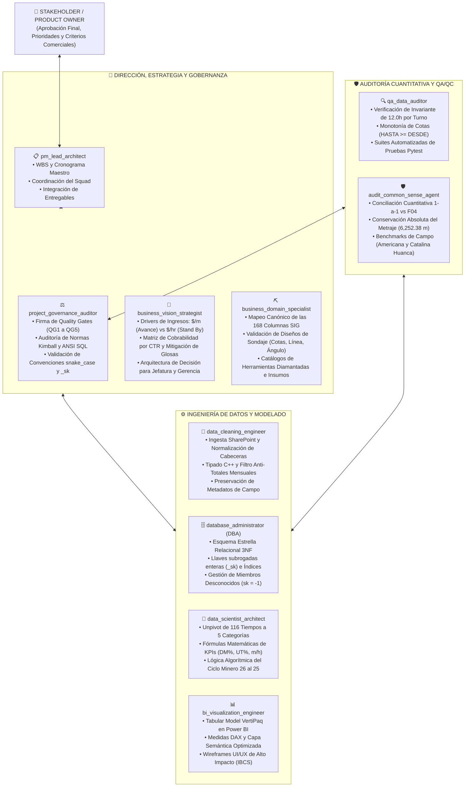
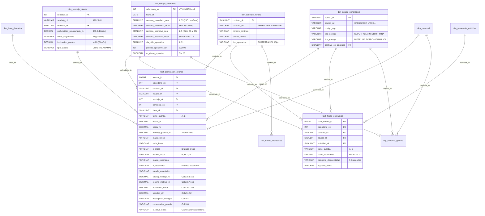
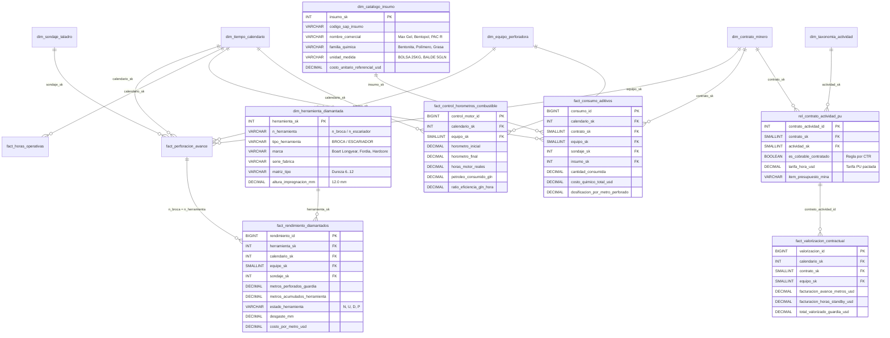
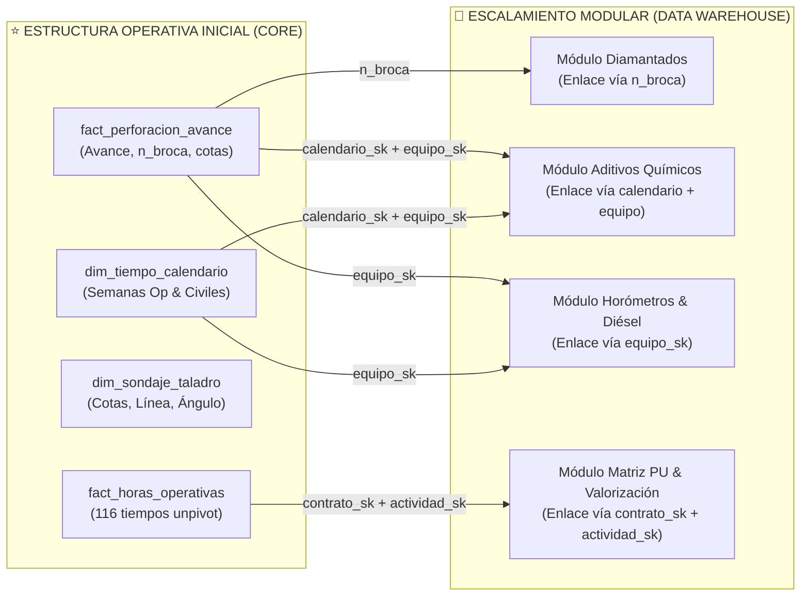

# 📐 PLAN MAESTRO DE IMPLEMENTACIÓN - FASE 2: MODELADO DIMENSIONAL KIMBALL Y ESTRATEGIA DE ESCALABILIDAD
## Sistema Integral de Business Intelligence y Analítica de Perforación (Rockdrill Group)

**Ubicación Oficial:** [`planes/01_PLAN_IMPLEMENTACION_FASE_2_MODELADO_DIMENSIONAL.md`](file:///c:/Proyectos%20Python/Detallados/planes/01_PLAN_IMPLEMENTACION_FASE_2_MODELADO_DIMENSIONAL.md)  
**Fecha de Emisión:** 02 de Septiembre de 2026  
**Autoridad de Control:** Squad de 10 Agentes Especializados de Rockdrill Group  
**Estado:** **DOCUMENTO DE PLANIFICACIÓN ESTRUCTURADO — PENDIENTE DE REVISIÓN Y VISTO BUENO (V°B°) EXPRESO DEL STAKEHOLDER**  
*(Nota de Gobernanza: Conforme a la instrucción expresa del Stakeholder, este documento es de carácter estrictamente consultivo y de diseño; no se ha ejecutado ninguna acción en base de datos ni sincronización Git sin previa autorización).*

---

## 👥 1. MATRIZ DEL SQUAD DE 10 AGENTES ESPECIALIZADOS Y GOBERNANZA

El diseño y validación de este plan involucra de manera coordinada a los **10 Agentes Especializados**, garantizando que las perspectivas técnica, operacional, financiera y de auditoría se encuentren plenamente cubiertas:

---

## 🎯 2. ACLARACIONES OPERATIVAS Y DEFINICIONES DE ARQUITECTURA

En respuesta puntual a las directrices operativas del Stakeholder, se establecen las siguientes definiciones de diseño:

### 2.1. Dimensión Tiempo: Semanas Civiles vs. Semanas Operativas
Para brindar soporte tanto a la contabilidad general de la empresa como a la operación en mina, `dim_tiempo_calendario` incorporará dos sistemas de semanas:
1. **Semana Calendario Civil (`semana_calendario_num`):**
   * Estándar ISO de Lunes a Domingo, numerada del 1 al 52/53 desde el primer lunes del año civil.
   * *Etiqueta:* `semana_calendario_label` (ej. `Sem 35 (2026)`).
   * *Uso:* Análisis corporativo comparativo tradicional y cruces con RRHH/Finanzas.
2. **Semana Operativa Transcurrida (`semana_operativa_num`):**
   * Lógica del Ciclo Minero: Inicia el día 26 del mes anterior y culmina el día 25 del mes en curso.
   * Divide el período mensual en bloques secuenciales de **7 días calendario transcurridos**, independientemente del día de la semana civil en que inicie el día 26:
     * **Días 1 al 7 del ciclo (ej. 26 al 01/02):** Semana Operativa 1 (`Semana Op 1`).
     * **Días 8 al 14 del ciclo:** Semana Operativa 2 (`Semana Op 2`).
     * **Días 15 al 21 del ciclo:** Semana Operativa 3 (`Semana Op 3`).
     * **Días 22 al 28 del ciclo:** Semana Operativa 4 (`Semana Op 4`).
     * **Días 29 al Cierre (días 29 a 30 o 31):** Semana Operativa 5 / Cierre (`Semana Op 5 (Cierre)`).
   * *Fórmula de asignación:* `((dia_ciclo_operativo - 1) // 7) + 1`.
   * *Atributo complementario:* `dia_ciclo_operativo` (entero de 1 a 31 que mide el día relativo dentro del mes operativo).

---

### 2.2. Contratos Mineros y Tipo de Servicio de Equipos
* **En `dim_contrato_minero`:** Se **mantiene el campo `tipo_operacion` con el valor `SUBTERRANEA`** para la totalidad de los 18 contratos mineros de Rockdrill Group, preservando la clasificación comercial contractual del negocio.
* **En `dim_equipo_perforadora`:** Para reflejar la realidad operativa donde máquinas superficiales ejecutan servicios específicos (como proyectos Greenfield, plataformas de superficie, taladros de alivio o piezómetros exteriores), se incorpora el atributo **`tipo_servicio` / `ambiente_operacion`**:
  * `SUPERFICIE`: Equipos montados sobre orugas o camión diseñados para operar en plataformas exteriores (ej. `DE710ST`, `LF90D ST`, o equipos de superficie asignados a contratos como `CUCULI`).
  * `INTERIOR MINA`: Equipos modulares electrohidráulicos compactos diseñados para operar en galerías y cámaras subterráneas (ej. `XRD50U`, `XRD80U`, `XRD90U`, `TL55`).

---

### 2.3. Dimensión Sondaje (`dim_sondaje_taladro`): Identificación Técnica Completa
**Aclaración Crítica del Stakeholder:** Los atributos técnicos del diseño del sondaje entregados por Geología mina son indispensables para identificar el pozo y deben figurar en la dimensión:
* **`profundidad_programada_m` (Col C):** Profundidad objetivo proyectada del taladro según el plan geológico (ej. 300.0 m). Permite calcular el % de avance global del sondaje contra su meta de diseño.
* **`linea_programada` / `linea_collar` (Col D):** Diámetro inicial planificado de emboquille o collar del pozo (PQ, HQ, NQ, BQ).
* **`inclinacion_grados` (Col E):** Ángulo de inclinación planificado del pozo respecto a la horizontal (ej. -45°, -60°, -90°).
* **`tipo_taladro`:** Identifica si el pozo es `ORIGINAL` o un desvío secundario `RAMAL_PARALELO`.
* *Estructura limpia resultante:* `sondaje_sk`, `sondaje_cd`, `contrato_sk`, `profundidad_programada_m`, `linea_programada`, `inclinacion_grados`, `tipo_taladro`.  
*(Las cotas físicas de avance guardia a guardia `desde_m`, `hasta_m`, y el diámetro real de corte continúan registrándose en `fact_perforacion_avance`).*

---

### 2.4. Taxonomía de Tiempos, Propagación Dinámica y Cobrabilidad por CTR

#### A. ¿Qué ocurre si una actividad cambia de nombre o de categoría?
**Respuesta Técnica (DBA & Data Scientist Lead):**
Gracias a la implementación de **Llaves Subrogadas Enteras (`actividad_sk`)**, la tabla de hechos `fact_horas_operativas` **nunca almacena texto ni descripciones fijas**, sino únicamente el identificador numérico de la actividad (ej. `actividad_sk = 62` para *Lavado de sondaje*).
* **Escenario 1 (Cambio de Nombre):** Si la empresa decide renombrar una actividad en el catálogo, basta con actualizar el campo `nombre_actividad` en esa única fila de `dim_taxonomia_actividad`. Instantáneamente, todas las 3,965 transacciones de hechos y todos los visuales de Power BI reflejan el nuevo nombre sin reprocesar la base histórica.
* **Escenario 2 (Cambio de Categoría):** Si una actividad pasa de *Stand By Operativo* a *Tiempo Efectivo - Operativo*, o de *Stand By Operativo* a *Stand By Cliente*, **únicamente se actualiza el registro en la dimensión**. Al abrir Power BI, todas las medidas (`[Horas Efectivas]`, `[Horas Stand By Operativo]`, `[DM %]`, `[UT %]`) se reclasifican dinámicamente de forma 100% automática.

#### B. Cobrabilidad Variable por Contrato (CTR)
En la minería peruana, la cobrabilidad de una actividad no siempre es estática:
* Un cliente minero (CTR A) puede reconocer como **Cobrable** el tiempo de *Asentado de Casing* o *Ensayo Lefranc* bajo una tarifa horaria de Precios Unitarios (PU).
* Otro cliente (CTR B) puede estipular que el asentado de casing está incluido dentro del precio por metro perforado y, por ende, es **No Cobrable** por hora.

**Solución Arquitectónica:**
1. **Capa Inicial (Fase 2):** En `dim_taxonomia_actividad` se mantiene el atributo `es_cobrable_estandar`, que refleja la regla general del estándar SIG de Rockdrill.
2. **Capa Escalada (Boceto DW Final):** Se introduce la matriz relacional de precios unitarios **`rel_contrato_actividad_pu`**, que asocia `contrato_sk` con `actividad_sk` para registrar:
   * `es_cobrable_contratado` (`TRUE` / `FALSE` específico para ese CTR).
   * `tarifa_hora_usd` (Tarifa horaria pactada en el anexo de precios del contrato).
   * `aplica_a_partir_de_horas` (Franquicias de espera antes de facturar).

---

### 2.5. Trazabilidad de Herramientas de Corte: Brocas y Escariadores
Para asegurar la compatibilidad con el futuro módulo de rendimiento de diamantados, la tabla `fact_perforacion_avance` preservará en su estructura inicial los 7 campos de diamantados:
* **Brocas (Cols 19-22):** `marca_broca`, `serie_broca`, **`n_broca`** (identificador único del activo) y `estado_broca` (Nueva, Usada, Descartada, Pulida).
* **Escariadores (Cols 23-25):** `marca_escariador`, **`n_escariador`** (identificador único del activo) y `estado_escariador`.
* **Garantía de Escalabilidad:** El campo `n_broca` actúa como la clave natural de enlace con el Data Warehouse para calcular metros perforados acumulados, tasa de desgaste de la matriz (mm/m) y costo por metro cortado.

---

## 🗺️ 3. MAPEO EXHAUSTIVO COLUMNA POR COLUMNA (168 COLUMNAS DEL FORMATO SIG `RD.402.P.01.F.01`)

A continuación se detalla la correspondencia estricta de las 168 columnas del reporte diario, demostrando que **ningún dato queda descartado ni perdido en el modelo**:

| N° Col | Letra | Nombre Oficial SIG en Detallado | Bloque Funcional | Tratamiento en Estructura Inicial (Fase 2) | Destino en Estructura Escalada (Data Warehouse Final) |
| :---: | :---: | :--- | :--- | :--- | :--- |
| **1** | A | DÍAS | Fecha y Turno | `dim_tiempo_calendario.fecha_dt` | `dim_tiempo_calendario` |
| **2** | B | NOMBRE | Sondaje | `dim_sondaje_taladro.sondaje_cd` | `dim_sondaje_taladro` |
| **3** | C | PROFUNDIDAD | Sondaje | `dim_sondaje_taladro.profundidad_programada_m` | `dim_sondaje_taladro` |
| **4** | D | LINEA | Sondaje | `dim_sondaje_taladro.linea_programada` & `dim_linea_diametro` | `dim_linea_diametro` |
| **5** | E | INCLINACIÓN | Sondaje | `dim_sondaje_taladro.inclinacion_grados` | `dim_sondaje_taladro` & `fact_trayectoria` |
| **6** | F | DESDE | Avance Físico | `fact_perforacion_avance.desde_m` | `fact_perforacion_avance` |
| **7** | G | HASTA | Avance Físico | `fact_perforacion_avance.hasta_m` | `fact_perforacion_avance` |
| **8** | H | TURNO (A=1;B=2) | Avance Físico | `fact_perforacion_avance.turno_guardia` | `fact_perforacion_avance` |
| **9** | I | GRUPO | Cuadrilla | `brg_cuadrilla_guardia.grupo_cuadrilla` | `brg_cuadrilla_guardia` |
| **10** | J | METRAJE | Avance Físico | `fact_perforacion_avance.metraje_guardia_m` | `fact_perforacion_avance` |
| **11** | K | HORAS EXTRAS | Cuadrilla | `brg_cuadrilla_guardia.horas_extras` | `brg_cuadrilla_guardia` |
| **12** | L | PERFORISTA | Cuadrilla | `dim_personal` & `fact_perforacion_avance.perforista_sk` | `dim_personal` |
| **13** | M | AYUDANTE 1 | Cuadrilla | `dim_personal` & `brg_cuadrilla_guardia.personal_sk` | `dim_personal` |
| **14** | N | AYUDANTE 2 | Cuadrilla | `dim_personal` & `brg_cuadrilla_guardia.personal_sk` | `dim_personal` |
| **15** | O | TOTAL metraje del dia | Avance Físico | Derivado dinámico en DAX (`[Metraje Día]`) & Check QA | Capa Semántica DAX |
| **16** | P | ACUMULADO | Comparativo | Derivado dinámico en DAX (`[Metraje Acumulado]`) & Check QA | Capa Semántica DAX |
| **17** | Q | PROYECTADO | Comparativo | `fact_metas_mensuales.proyectado_m` | `fact_metas_mensuales` |
| **18** | R | META | Comparativo | `fact_metas_mensuales.meta_metraje_m` | `fact_metas_mensuales` |
| **19** | S | MARCA (Broca) | Brocas | `fact_perforacion_avance.marca_broca` | `dim_herramienta_diamantada.marca` |
| **20** | T | SERIE (Broca) | Brocas | `fact_perforacion_avance.serie_broca` | `dim_herramienta_diamantada.serie_fabrica` |
| **21** | U | Nº BROCA | Brocas | `fact_perforacion_avance.n_broca` (Key de Enlace) | `dim_herramienta_diamantada.n_herramienta` |
| **22** | V | ESTADO DE LA BROCA | Brocas | `fact_perforacion_avance.estado_broca` | `fact_rendimiento_diamantados.estado` |
| **23** | W | MARCA (Escariador) | Escariadores | `fact_perforacion_avance.marca_escariador` | `dim_herramienta_diamantada.marca` |
| **24** | X | Nº ESCARIADOR | Escariadores | `fact_perforacion_avance.n_escariador` (Key de Enlace) | `dim_herramienta_diamantada.n_herramienta` |
| **25** | Y | ESTADO DEL ESCARIADOR | Escariadores | `fact_perforacion_avance.estado_escariador` | `fact_rendimiento_diamantados.estado` |
| **26..28** | Z..AB | BENTONITA (Prod, Cant, Und) | Aditivos | Staging normalizado en `Consolidado_Operaciones` | `fact_consumo_aditivos` |
| **29..31** | AC..AE | PAC (Prod, Cant, Und) | Aditivos | Staging normalizado en `Consolidado_Operaciones` | `fact_consumo_aditivos` |
| **32..34** | AF..AH | POLIMERO (Prod, Cant, Und) | Aditivos | Staging normalizado en `Consolidado_Operaciones` | `fact_consumo_aditivos` |
| **35..37** | AI..AK | LUBRICANTES (Prod, Cant, Und) | Aditivos | Staging normalizado en `Consolidado_Operaciones` | `fact_consumo_aditivos` |
| **38..40** | AL..AN | CONTROLADOR PH (Prod, Cant, Und)| Aditivos | Staging normalizado en `Consolidado_Operaciones` | `fact_consumo_aditivos` |
| **41..43** | AO..AQ | INHIBIDORES (Prod, Cant, Und) | Aditivos | Staging normalizado en `Consolidado_Operaciones` | `fact_consumo_aditivos` |
| **44..46** | AR..AT | ESTABILIZADOR (Prod, Cant, Und) | Aditivos | Staging normalizado en `Consolidado_Operaciones` | `fact_consumo_aditivos` |
| **47..50** | AU..AX | OTROS ADITIVOS (Clas, Prod, Cant)| Aditivos | Staging normalizado en `Consolidado_Operaciones` | `fact_consumo_aditivos` |
| **51..52** | AY..AZ | PETROLEO (Cantidad y Galones) | Combustible | `fact_perforacion_avance.petroleo_gln` | `fact_control_horometros_combustible` |
| **53** | BA | Perforación | Tiempo Operativo | `fact_horas_operativas` (Tiempo Efectivo) | `fact_horas_operativas` |
| **54** | BB | Rimado | Tiempo Operativo | `fact_horas_operativas` (Tiempo Efectivo) | `fact_horas_operativas` |
| **55** | BC | Asentado / Retiro de revestimiento | Tiempo Operativo | `fact_horas_operativas` (Tiempo Efectivo) | `fact_horas_operativas` |
| **56** | BD | RePerforación | Tiempo Operativo | `fact_horas_operativas` (Tiempo Efectivo) | `fact_horas_operativas` |
| **57** | BE | Preventivo | Mantenimiento | `fact_horas_operativas` (Mantenimiento) | `fact_horas_operativas` |
| **58** | BF | Correctivo | Mantenimiento | `fact_horas_operativas` (Mantenimiento) | `fact_horas_operativas` |
| **59..77** | BG..BY | Maniobras Operativas (19 cols) | Stand By Op | `fact_horas_operativas` (Stand By Operativo) | `fact_horas_operativas` |
| **78..97** | BZ..CS | Ensayos Geotécnicos (20 cols) | Geotecnia | `fact_horas_operativas` (Stand By Operativo) | `fact_horas_operativas` |
| **98..118**| CT..DN | Soporte y Seguridad (21 cols) | Stand By Inop | `fact_horas_operativas` (Stand By Inoperativo) | `fact_horas_operativas` |
| **119..145**| DO..EO| Condiciones Cliente (27 cols) | Stand By Cliente | `fact_horas_operativas` (Stand By Cliente) | `fact_horas_operativas` |
| **146** | EP | TIEMPO TOTAL | Resumen Horas | Invariante de 12.0h en QA & validación de cuadre | Capa Semántica DAX |
| **147** | EQ | TIEMPO EFECTIVO - OPERATIVO | Resumen Horas | Invariante de suma en QA & validación de cuadre | Capa Semántica DAX |
| **148** | ER | LOST TIME | Resumen Horas | Invariante de suma en QA & validación de cuadre | Capa Semántica DAX |
| **149** | ES | Mantenimiento | Resumen Horas | Invariante de suma en QA & validación de cuadre | Capa Semántica DAX |
| **150** | ET | Stand By Operativo | Resumen Horas | Invariante de suma en QA & validación de cuadre | Capa Semántica DAX |
| **151** | EU | Stand By Inoperativo | Resumen Horas | Invariante de suma en QA & validación de cuadre | Capa Semántica DAX |
| **152** | EV | Stand By Cliente | Resumen Horas | Invariante de suma en QA & validación de cuadre | Capa Semántica DAX |
| **153..156**| EW..EZ| Rimado con Casing HWT/HQ (4 cols)| Metraje Especial | `fact_perforacion_avance.metraje_casing_m` | `fact_metrajes_especiales` |
| **157..160**| FA..FD| Re-Perforación (4 cols) | Metraje Especial | `fact_perforacion_avance.metraje_reperfo_m` | `fact_metrajes_especiales` |
| **161..164**| FE..FH| Horómetros (Desde, Hasta, Total) | Horómetro Motor | `fact_perforacion_avance.horometro_delta` | `fact_control_horometros_combustible` |
| **165..166**| FI..FJ| Bitácora de Mantenimiento | Bitácora Taller | Atributos de texto descriptivo en staging | `dim_bitacora_mantenimiento` |
| **167** | FK | DESCRIPCIÓN LITOLÓGICA | Observaciones | `fact_perforacion_avance.descripcion_litologica` | `dim_litologia_observaciones` |
| **168** | FL | COMENTARIOS | Observaciones | `fact_perforacion_avance.comentarios_guardia` | `dim_bitacora_observaciones` |

---

## 🏛️ 4. COMPARATIVA DE LAS DOS ESTRUCTURAS DE DATOS Y ESTRATEGIA DE ACOPLAMIENTO

Para responder al objetivo de escalabilidad sin introducir complejidad prematura ni retrabajo, se definen **dos estructuras de datos**:

### 4.1. Estructura 1: Inicial (Centrada en lo Operativo - Fase 2 Actual)
Optimiza la velocidad de procesamiento, el cuadre diario de 12 horas, la conciliación física de avance (6,252.38 m) y la disponibilidad de la flota:

---

### 4.2. Estructura 2: Escalada Final (Boceto del Data Warehouse Completo 360°)
Expande la arquitectura analítica hacia la rentabilidad financiera, el desgaste de diamantados, la logística de aditivos y la eficiencia de motores:

---

### 4.3. Demostración de Acoplamiento y Cero Retrabajo

1. **Invariabilidad de las Tablas Base:**  
   Las 7 dimensiones y 4 tablas de hechos de la Fase 2 permanecen intactas en nombres, granos y llaves subrogadas (`_sk`).
2. **Conexión Inmediata de Diamantados:**  
   Al almacenar el `n_broca` y `n_escariador` en `fact_perforacion_avance`, el módulo de diamantados no requiere ninguna migración; simplemente ejecuta un `INNER JOIN` para reconstruir la vida útil de cada broca en todos los taladros donde operó.
3. **Cálculo Financiero sin Afectar la Producción Física:**  
   La matriz `rel_contrato_actividad_pu` se une a `fact_horas_operativas` para multiplicar las horas por las tarifas pactadas, permitiendo que un cambio en las tarifas comerciales no altere jamás las horas operativas reportadas por los perforistas en campo.

---

## 🛡️ 5. PROTOCOLO DE AUDITORÍA Y CONTROL DE CALIDAD (QUALITY GATES)

El squad de auditores (`project_governance_auditor`, `audit_common_sense_agent`, `qa_data_auditor` y `database_administrator`) mantendrá la verificación continua sobre los siguientes puntos:

1. **Conservación Cuantitativa Absoluta:**  
   El metraje acumulado en cualquier consulta a hechos debe totalizar exactamente **6,252.38 m**, sin margen de error.
2. **Integridad de Claves Subrogadas:**  
   Cero valores nulos (`NULL`) en las llaves primarias o foráneas; todo dato no catalogado se mapea obligatoriamente al miembro desconocido (`sk = -1`).
3. **Validación de Jornada de 12.0 Horas:**  
   Cada guardia reportada debe balancear en 12.0 horas entre tiempo efectivo, mantenimiento y stand by.
4. **Monotonía Física de Cotas:**  
   $HASTA \ge DESDE$ y $METRAJE \equiv HASTA - DESDE$ en todos los registros.

---

## 🚦 6. ESPACIO PARA VISTO BUENO (V°B°) DEL STAKEHOLDER

Este plan maestro se encuentra formalmente documentado para tu análisis y evaluación.  
👉 Puedes revisarlo directamente en: [`planes/01_PLAN_IMPLEMENTACION_FASE_2_MODELADO_DIMENSIONAL.md`](file:///c:/Proyectos%20Python/Detallados/planes/01_PLAN_IMPLEMENTACION_FASE_2_MODELADO_DIMENSIONAL.md)

*Quedo a la espera de tus comentarios, ajustes o **Visto Bueno (V°B°) expreso** para dar inicio a cualquier ejecución técnica.*
