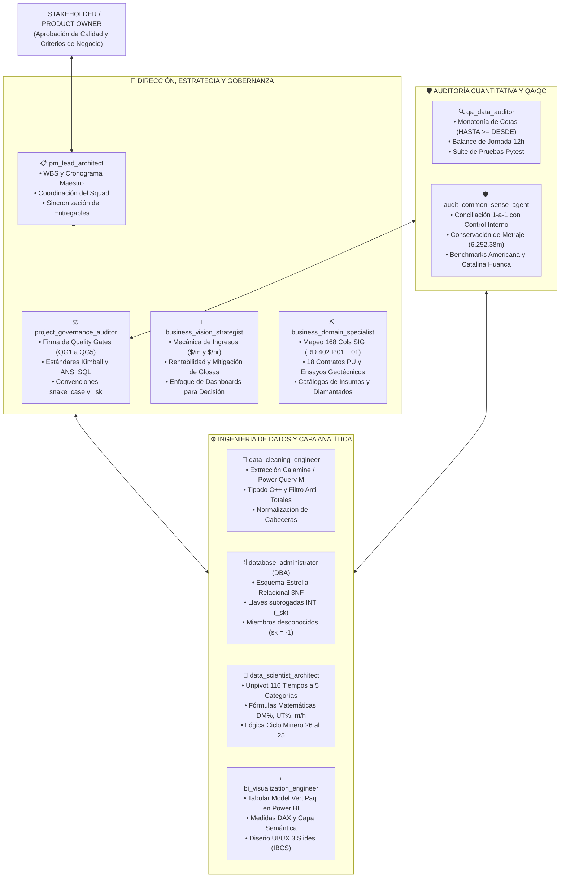
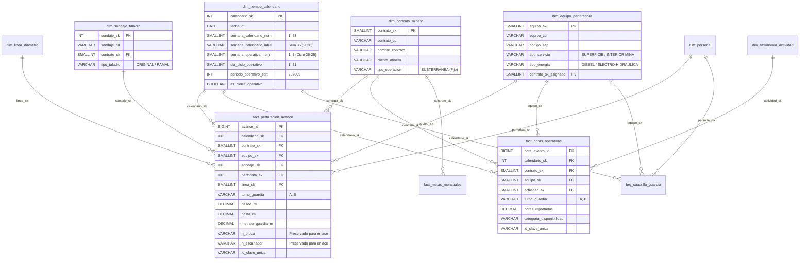
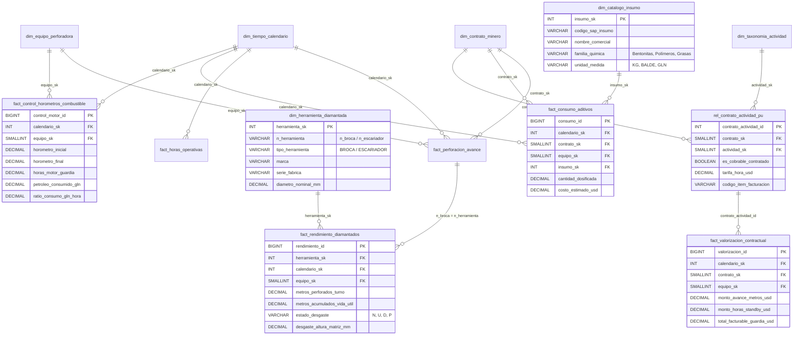
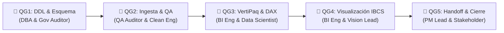

# 📐 PLAN MAESTRO DE IMPLEMENTACIÓN - FASE 2: MODELADO DIMENSIONAL KIMBALL Y ESTRATEGIA DE ESCALABILIDAD
## Sistema Integral de Business Intelligence y Analítica de Perforación (Rockdrill Group)

**Ubicación Oficial:** [`planes/01_PLAN_IMPLEMENTACION_FASE_2_MODELADO_DIMENSIONAL.md`](file:///c:/Proyectos%20Python/Detallados/planes/01_PLAN_IMPLEMENTACION_FASE_2_MODELADO_DIMENSIONAL.md)  
**Fecha de Actualización:** 02 de Septiembre de 2026  
**Autoridad de Control:** Squad de 10 Agentes Especializados de Rockdrill Group  
**Estado:** **PLAN MAESTRO ESTRUCTURADO Y PENDIENTE DE VISTO BUENO (V°B°) DEL STAKEHOLDER**  

---

## 👥 1. MATRIZ INTEGRAL DEL SQUAD AGÉNTICO Y ASIGNACIÓN DE ROLES

El presente plan articula de manera sinérgica las responsabilidades de los **10 Agentes Especializados**, garantizando que ninguna decisión técnica quede aislada ni carente de auditoría:

### 📋 Detalle de Atribuciones Específicas en la Fase 2:

| # | Agente | Responsabilidad Principal en Fase 2 | Criterio de Éxito / Entregable |
| :-: | :--- | :--- | :--- |
| 1 | **`pm_lead_architect`** | Supervisión del WBS, integración de módulos y trazabilidad en documentación. | Cumplimiento del cronograma y actualización de [`ESTADO_DEL_PROYECTO.md`](file:///c:/Proyectos%20Python/Detallados/ESTADO_DEL_PROYECTO.md). |
| 2 | **`project_governance_auditor`** | Auditoría y firma de los Quality Gates QG1 (DDL), QG2 (QA) y QG3 (VertiPaq/DAX). | Certificación de cero deuda técnica y cumplimiento Kimball. |
| 3 | **`business_vision_strategist`** | Validación de que la separación de tiempos refleje los drivers de cobrabilidad ($/m y $/hr). | Clasificación certera de paradas cobrables vs. no cobrables. |
| 4 | **`business_domain_specialist`** | Mapeo canónico de las 168 columnas, 116 actividades, líneas (HQ, NQ) y aditivos. | Integridad semántica del formato SIG `RD.402.P.01.F.01`. |
| 5 | **`database_administrator`** | Diseño relacional del Esquema Estrella, llaves subrogadas (`_sk`) e índices. | DDL ANSI SQL optimizado y cero llaves compuestas en el DW. |
| 6 | **`data_scientist_architect`** | Construcción del algoritmo de unpivoting de tiempos y formulación matemática de KPIs. | Dataset `fact_horas_operativas` filtrado ($h > 0$) y fórmulas DAX. |
| 7 | **`data_cleaning_engineer`** | Ingesta de alta velocidad y conexión entre la base consolidada y el modelo dimensional. | Generación de datos intermedios limpios sin nulos ni duplicados. |
| 8 | **`qa_data_auditor`** | Verificación de invariantes: balance de 12h por turno y monotonía física de cotas. | Aprobación de la suite de pruebas automatizadas Pytest. |
| 9 | **`audit_common_sense_agent`** | Verificación 1-a-1: metraje total en hechos $\equiv \mathbf{6,252.38\text{ m}}$ y benchmarks de mina. | Cuadre al 100.00% contra el benchmark histórico oficial. |
| 10 | **`bi_visualization_engineer`** | Creación del modelo Tabular en Power BI, optimización VertiPaq y medidas DAX. | Catálogo DAX exportado y relaciones 1:N unidireccionales. |

---

## 🎯 2. ACLARACIONES Y DECISIONES TÉCNICAS DE NEGOCIO (FEEDBACK STAKEHOLDER)

A partir de la retroalimentación directa del Stakeholder, se establecen 5 directrices inviolables de diseño:

### 2.1. Dimensión Tiempo: Semanas Calendario vs. Semanas Operativas
1. **Semana Calendario Civil (`semana_calendario_num`):**
   * Estándar ISO de Lunes a Domingo, numerada de la 1 a la 52/53 desde el inicio del año civil.
   * Utilidad: Análisis comparativo tradicional, reportería contable general y cruces con sistemas externos.
2. **Semana Operativa Transcurrida (`semana_operativa_num`):**
   * Lógica de Período Minero: Inicia el día 26 del mes anterior y concluye el día 25 del mes en curso.
   * División fija de 7 días independientemente del día de la semana en que caiga el día 26:
     * **Día Ciclo 1 a 7:** Semana Operativa 1 (`Semana Op 1`).
     * **Día Ciclo 8 a 14:** Semana Operativa 2 (`Semana Op 2`).
     * **Día Ciclo 15 a 21:** Semana Operativa 3 (`Semana Op 3`).
     * **Día Ciclo 22 a 28:** Semana Operativa 4 (`Semana Op 4`).
     * **Día Ciclo 29 al Cierre (Día 25):** Semana Operativa 5 / Días de Cierre (`Semana Op 5 (Cierre)`).
   * Fórmula algorítmica: `((dia_ciclo_operativo - 1) // 7) + 1`.

### 2.2. Contratos Mineros y Tipo de Servicio de Máquina
* **En `dim_contrato_minero`:** Se **mantiene el campo `tipo_operacion` como `SUBTERRÁNEA`** para la totalidad de los 18 contratos vigentes de Rockdrill Group, protegiendo la identidad contractual corporativa.
* **En `dim_equipo_perforadora`:** Se incorpora el atributo de servicio físico **`tipo_servicio` / `ambiente_operacion`** con valores:
  * `SUPERFICIE`: Equipos asignados a plataformas de superficie, proyectos Greenfield o pozos geotécnicos exteriores (ej. perforadoras sobre orugas `DE710ST`, `LF90D ST`, o sondajes superficiales de `CUCULI`).
  * `INTERIOR MINA`: Equipos compactos para galerías y cámaras subterráneas (ej. `XRD50U`, `XRD80U`, `XRD90U`, `TL55`).

### 2.3. Taxonomía de Tiempos y Cobrabilidad Contractual
* **Pregunta del Stakeholder:** *¿Si una actividad cambia de nombre o pasa de Standby Operativo a Operativo o a Standby Cliente, con cambiarlo en la dimensión se actualiza todo?*  
  **Respuesta Técnica (Rol DBA & Data Scientist):** **SÍ, TOTALMENTE**. Debido al uso de la llave subrogada `actividad_sk` en `fact_horas_operativas`, la tabla de hechos nunca almacena nombres de texto ni clasificaciones rígidas. Al modificar la fila correspondiente en `dim_taxonomia_actividad`, el cambio se propaga de forma instantánea a todas las filas de hechos, agregaciones y dashboards en Power BI sin reescribir una sola línea de transacciones.
* **Cobrabilidad Variable por Contrato:**  
  La cobrabilidad de una parada (ej. cementación, rimado de casing, esperas específicas) varía según los términos contractuales de cada CTR. El modelo contempla:
  1. En `dim_taxonomia_actividad`: Atributo `es_cobrable_estandar` (regla corporativa por defecto).
  2. En el modelo escalado: Tabla relacional de precios unitarios `rel_contrato_actividad_pu` con el atributo `es_cobrable_contratado` y `tarifa_hora_usd` específica por contrato.

### 2.4. Sondajes: Desacoplamiento de Profundidad, Línea e Inclinación
* En `dim_sondaje_taladro` **NO se incluyen** los atributos `profundidad`, `linea` ni `inclinacion`.
* **Justificación Minera:** Un sondaje diamantino es dinámico: el avance en metros cambia guardia a guardia, la línea de tubería se reduce progresivamente en profundidad (ej. inicia en HQ y se reduce a NQ), y la inclinación sufre deflexiones geológicas.
* Por lo tanto, `dim_sondaje_taladro` conserva únicamente su identidad: `sondaje_sk`, `sondaje_cd`, `contrato_sk` y `tipo_taladro` (`ORIGINAL` o `RAMAL_PARALELO`). La línea utilizada (`linea_sk`) y las cotas (`desde_m`, `hasta_m`, `metraje_guardia_m`) se registran en `fact_perforacion_avance`.

### 2.5. Herramientas de Corte: Identificador Único de Broca (`n_broca`) y Escariador
* En la estructura inicial se preservan los campos originales de herramientas:
  * **Brocas (Cols 19-22):** `marca_broca`, `serie_broca`, `n_broca` (identificador único del activo) y `estado_broca` (Nueva, Usada, Descartada, Pulida).
  * **Escariadores (Cols 23-25):** `marca_escariador`, `n_escariador` (identificador único del activo) y `estado_escariador`.
* El atributo `n_broca` se preserva como clave natural de integración para el futuro acoplamiento con la dimensión de herramientas diamantadas en la estructura escalada.

---

## 🗺️ 3. MAPEO EXHAUSTIVO COLUMNA POR COLUMNA (168 COLUMNAS SIG `RD.402.P.01.F.01`)

A continuación se detalla el destino de cada una de las 168 columnas oficiales en la arquitectura:

| N° Col | Letra | Nombre Oficial en Detallado | Bloque Funcional | Destino en Estructura Inicial (Fase 2) | Destino en Estructura Escalada (Fase 3 / DW) |
| :---: | :---: | :--- | :--- | :--- | :--- |
| **1** | A | DÍAS | Identificación | `dim_tiempo_calendario.fecha_dt` | `dim_tiempo_calendario` |
| **2** | B | NOMBRE | Sondaje | `dim_sondaje_taladro.sondaje_cd` | `dim_sondaje_taladro` |
| **3** | C | PROFUNDIDAD | Sondaje | Descartado de Dim (Variable física) | Atributo de auditoría en staging |
| **4** | D | LINEA | Sondaje | `dim_linea_diametro.linea_cd` | `dim_linea_diametro` |
| **5** | E | INCLINACIÓN | Sondaje | Descartado de Dim (Medición Gyro) | `fact_trayectoria_sondaje` (Geología) |
| **6** | F | DESDE | Avance Físico | `fact_perforacion_avance.desde_m` | `fact_perforacion_avance` |
| **7** | G | HASTA | Avance Físico | `fact_perforacion_avance.hasta_m` | `fact_perforacion_avance` |
| **8** | H | TURNO (A=1;B=2) | Avance Físico | `fact_perforacion_avance.turno_guardia` | `fact_perforacion_avance` |
| **9** | I | GRUPO | Cuadrilla | `brg_cuadrilla_guardia.grupo_cuadrilla` | `brg_cuadrilla_guardia` |
| **10** | J | METRAJE | Avance Físico | `fact_perforacion_avance.metraje_guardia_m` | `fact_perforacion_avance` |
| **11** | K | HORAS EXTRAS | Cuadrilla | `brg_cuadrilla_guardia.horas_extras` | `brg_cuadrilla_guardia` |
| **12** | L | PERFORISTA | Cuadrilla | `dim_personal` & `brg_cuadrilla_guardia` | `dim_personal` & `brg_cuadrilla_guardia` |
| **13** | M | AYUDANTE 1 | Cuadrilla | `dim_personal` & `brg_cuadrilla_guardia` | `dim_personal` & `brg_cuadrilla_guardia` |
| **14** | N | AYUDANTE 2 | Cuadrilla | `dim_personal` & `brg_cuadrilla_guardia` | `dim_personal` & `brg_cuadrilla_guardia` |
| **15** | O | TOTAL metraje del dia | Avance Físico | Descartado (Redundante; se calcula en DAX) | Calculado en Capa Semántica |
| **16** | P | ACUMULADO | Comparativo | Descartado (Redundante; Curva S en DAX) | Calculado en Capa Semántica |
| **17** | Q | PROYECTADO | Comparativo | `fact_metas_mensuales.proyectado_m` | `fact_metas_mensuales` |
| **18** | R | META | Comparativo | `fact_metas_mensuales.meta_metraje_m` | `fact_metas_mensuales` |
| **19** | S | MARCA (Broca) | Brocas | `fact_perforacion_avance.marca_broca` | `dim_herramienta_diamantada.marca` |
| **20** | T | SERIE (Broca) | Brocas | `fact_perforacion_avance.serie_broca` | `dim_herramienta_diamantada.serie` |
| **21** | U | Nº BROCA | Brocas | `fact_perforacion_avance.n_broca` (Key) | `dim_herramienta_diamantada.n_herramienta` |
| **22** | V | ESTADO DE LA BROCA | Brocas | `fact_perforacion_avance.estado_broca` | `fact_rendimiento_diamantados.estado` |
| **23** | W | MARCA (Escariador) | Escariadores | `fact_perforacion_avance.marca_escariador` | `dim_herramienta_diamantada.marca` |
| **24** | X | Nº ESCARIADOR | Escariadores | `fact_perforacion_avance.n_escariador` (Key) | `dim_herramienta_diamantada.n_herramienta` |
| **25** | Y | ESTADO DEL ESCARIADOR | Escariadores | `fact_perforacion_avance.estado_escariador` | `fact_rendimiento_diamantados.estado` |
| **26..50** | Z..AX | Consumo Aditivos (Bentonita, PAC, etc.) | Aditivos | Reservado en Staging / Validado en Consolidado | `fact_consumo_aditivos` (Unpivot) |
| **51..52** | AY..AZ | Diésel (Cantidad y Galones) | Combustible | `fact_horas_operativas.petroleo_gln` | `fact_control_horometros_combustible` |
| **53..56** | BA..BD | Tiempos Operativos Directos (4 cols) | Tiempos Directos | `fact_horas_operativas` (Tiempo Efectivo) | `fact_horas_operativas` |
| **57..58** | BE..BF | Mantenimiento Preventivo/Correctivo | Tiempos Mtto | `fact_horas_operativas` (Mantenimiento) | `fact_horas_operativas` |
| **59..77** | BG..BY | Maniobras Operativas (19 cols) | Maniobras | `fact_horas_operativas` (Stand By Operativo) | `fact_horas_operativas` |
| **78..97** | BZ..CS | Ensayos Geotécnicos (20 cols) | Geotecnia | `fact_horas_operativas` (Stand By Operativo) | `fact_horas_operativas` |
| **98..118** | CT..DN | Soporte y Seguridad (21 cols) | Soporte/Seg. | `fact_horas_operativas` (Stand By Inoperativo) | `fact_horas_operativas` |
| **119..145**| DO..EO | Condiciones Cliente (27 cols) | Cliente | `fact_horas_operativas` (Stand By Cliente) | `fact_horas_operativas` |
| **146..152**| EP..EV | Resúmenes de Horas (7 cols) | Resumen Horario | Validadores de Invariante 12h en QA | Reglas de Calidad / DAX Checks |
| **153..156**| EW..EZ | Rimado con Casing HWT/HQ (4 cols) | Metraje Especial | `fact_perforacion_avance.metraje_casing_m` | `fact_metrajes_especiales` |
| **157..160**| FA..FD | Reperforación (4 cols) | Metraje Especial | `fact_perforacion_avance.metraje_reperfo_m` | `fact_metrajes_especiales` |
| **161..164**| FE..FH | Horómetros Inicial/Final (4 cols) | Motor Perforadora | `fact_perforacion_avance.horometro_delta` | `fact_control_horometros_combustible` |
| **165..168**| FI..FL | Bitácora, Litología y Comentarios | Bitácora Campo | Campos de Texto descriptivo | `dim_bitacora_observaciones` |

---

## 🏛️ 4. COMPARATIVA Y ACOPLAMIENTO DE LAS DOS ESTRUCTURAS DE DATOS

### 4.1. Estructura 1: Inicial (Centrada en lo Operativo - Fase 2 Actual)
Diseñada para maximizar el rendimiento analítico inmediato de perforación, cuadrillas y tiempos:

---

### 4.2. Estructura 2: Escalada Final (Boceto del Data Warehouse Completo)
Muestra cómo la Estructura Inicial se expande de forma natural sin romper ninguna relación existente:

---

## 🔗 5. VIABILIDAD Y ACOPLAMIENTO FUTURO (CERO RETRABAJO)

1. **La Estructura Inicial es un Subconjunto Puro de la Final:**  
   Ninguna tabla creada en la Fase 2 será destruida ni renombrada al pasar a la Fase 3/DW. Las llaves subrogadas (`_sk`) ya implementadas actuarán como anclas de integración.
2. **Enlace de Brocas y Escariadores:**  
   Al mantener `n_broca` y `n_escariador` en `fact_perforacion_avance`, el módulo de diamantados solo requerirá ejecutar un `INNER JOIN` sobre este código para asociar el historial completo de vida útil de la corona.
3. **Escalamiento de Cobrabilidad por PU:**  
   La introducción de `rel_contrato_actividad_pu` permitirá cruzar `fact_horas_operativas` con las tarifas contractuales sin tocar las horas reportadas en mina.

---

## 🛡️ 6. PROTOCOLO DE VERIFICACIÓN Y ROLES EN LA AUDITORÍA

* **`audit_common_sense_agent`:** Valida que el metraje físico sume exactamente **6,252.38 m** en cualquier tabla de hechos.
* **`qa_data_auditor`:** Audita que cada guardia sume **12.0h** y que $HASTA \ge DESDE$.
* **`database_administrator`:** Verifica que no existan llaves foráneas huérfanas y que todas las tablas posean su miembro `sk = -1`.
* **`project_governance_auditor`:** Firma formalmente cada Quality Gate antes del pase a producción.

---

## 🚦 7. ESPACIO PARA VISTO BUENO (V°B°) DEL STAKEHOLDER

Este documento técnico se encuentra disponible directamente en el repositorio local para su revisión y visto bueno:  
👉 [`planes/01_PLAN_IMPLEMENTACION_FASE_2_MODELADO_DIMENSIONAL.md`](file:///c:/Proyectos%20Python/Detallados/planes/01_PLAN_IMPLEMENTACION_FASE_2_MODELADO_DIMENSIONAL.md)

*Nota: Conforme a la instrucción del Stakeholder, no se ha ejecutado ninguna alteración en la base de datos ni en el pipeline; únicamente se ha actualizado el plan para su previa aprobación.*
