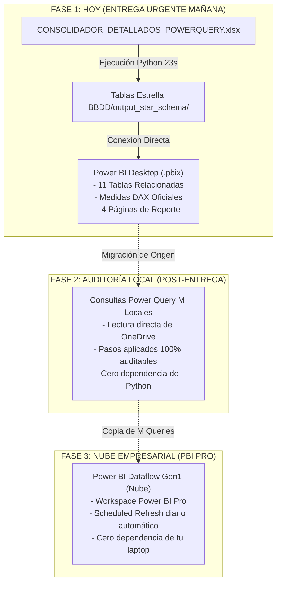
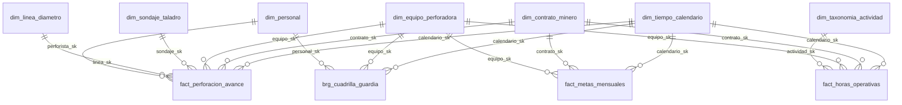

# 📊 PLAN MAESTRO: CONSTRUCCIÓN DEL DASHBOARD POWER BI & ESTRATEGIA DE TRANSICIÓN EN 3 FASES
## Rockdrill Group — Sistema Integral de Analítica de Perforación Diamantina

**Documento:** `planes/02_PLAN_CONSTRUCCION_DASHBOARD_POWER_BI.md`  
**Autor:** Squad de Business Intelligence, Arquitectura de Datos y Control de Gestión  
**Fecha:** Septiembre 2026  
**Audiencia:** Stakeholders, Ingenieros de Operaciones, Administradores de Contrato y Especialistas Power BI  

---

## 🎯 1. EVALUACIÓN DE VIABILIDAD DE LA ESTRATEGIA EN 3 FASES

> [!IMPORTANT]
> **Respuesta Directa de Arquitectura:**  
> **Sí, la estrategia propuesta es 100% VIABLE y representa el estándar de oro de la industria (Patrón Agile Delivery -> Auditabilidad Local -> Industrialización en Nube).**

### ¿Por qué funciona sin retrabajo?
El secreto de este enfoque reside en el **contrato de interfaz de datos**:
1. Las 11 tablas generadas por Python en `BBDD/output_star_schema/` poseen **exactamente los mismos nombres de tablas, nombres de columnas y tipos de datos** que producirán las consultas Power Query M y el futuro Dataflow en la nube.
2. Al construir hoy tu modelo de datos, tus relaciones y tus medidas DAX en Power BI Desktop sobre esta estructura estrella, **NUNCA tendrás que rehacer una sola medida ni volver a armar un solo gráfico**.
3. Cuando migres a la Fase 2 (Power Query M) o a la Fase 3 (Dataflow), únicamente cambiarás el *Origen de Datos* en el Editor de Power Query. El modelo relacional, las 35+ medidas DAX y las 4 páginas visuales se actualizarán instantáneamente sin romperse.



---

## 🏗️ 2. FASE 1: CONEXIÓN INMEDIATA EN POWER BI DESKTOP

Para armar el dashboard hoy mismo y entregarlo mañana:

### Paso 1: Importación de Datos
1. Abra **Power BI Desktop**.
2. En la cinta de opciones, seleccione **Obtener datos (Get Data) -> Libro de Excel**.
3. Seleccione el archivo maestro consolidado generado por el script:
   👉 `C:\Proyectos Python\Detallados\BBDD\output_star_schema\ESQUEMA_ESTRELLA_COMPLETO.xlsx`  
   *(O si prefiere rendimiento de alta velocidad VertiPaq, elija Obtener datos -> Carpeta y apunte a los archivos `.parquet` o `.csv` de `output_star_schema`)*.
4. Marque las **11 tablas tabulares**:
   * `dim_tiempo_calendario`
   * `dim_contrato_minero`
   * `dim_equipo_perforadora`
   * `dim_linea_diametro`
   * `dim_personal`
   * `dim_sondaje_taladro`
   * `dim_taxonomia_actividad`
   * `fact_perforacion_avance`
   * `fact_horas_operativas`
   * `brg_cuadrilla_guardia`
   * `fact_metas_mensuales`
5. Haga clic en **Cargar (Load)**.

### Paso 2: Configuración de Ordenación por Columnas ("Sort by Column")
Para garantizar que los gráficos temporales respeten el ciclo operativo minero (del 26 al 25) y los meses en orden cronológico:
* En `dim_tiempo_calendario`:
  * Seleccionar columna `mes_nom_civil` -> En la cinta *Herramientas de columnas* -> **Ordenar por columna** -> `mes_num_civil`.
  * Seleccionar columna `mes_nom_operativo` -> **Ordenar por columna** -> `mes_num_operativo`.
  * Seleccionar columna `mes_anio_operativo` -> **Ordenar por columna** -> `periodo_operativo_sort`.
  * Seleccionar columna `semana_operativa_label` -> **Ordenar por columna** -> `semana_operativa_num`.
  * Seleccionar columna `semana_calendario_label` -> **Ordenar por columna** -> `semana_calendario_num`.
  * Seleccionar columna `dia_semana_nom` -> **Ordenar por columna** -> `dia_semana_num`.

---

## 📐 3. ESQUEMA RELACIONAL EN POWER BI (DIAGRAM VIEW)

En la vista de **Modelo (Model View)** de Power BI Desktop, organice las tablas colocando las **Dimensiones arriba** y las **Tablas de Hechos abajo** (estándar Kimball).



### Matriz Oficial de Relaciones Físicas (Esquema Estrella Puro)

| Tabla Origen (1 - Dimensión) | Tabla Destino (* - Hechos / Puente) | Columna Unión | Cardinalidad | Dirección de Filtro | Estado |
| :--- | :--- | :--- | :---: | :---: | :---: |
| `dim_tiempo_calendario` | `fact_perforacion_avance` | `calendario_sk` | 1 a Varios (1:*) | Única (Single) | **Activa** |
| `dim_tiempo_calendario` | `fact_horas_operativas` | `calendario_sk` | 1 a Varios (1:*) | Única (Single) | **Activa** |
| `dim_tiempo_calendario` | `brg_cuadrilla_guardia` | `calendario_sk` | 1 a Varios (1:*) | Única (Single) | **Activa** |
| `dim_tiempo_calendario` | `fact_metas_mensuales` | `calendario_sk` | 1 a Varios (1:*) | Única (Single) | **Activa** |
| `dim_contrato_minero` | `fact_perforacion_avance` | `contrato_sk` | 1 a Varios (1:*) | Única (Single) | **Activa** |
| `dim_contrato_minero` | `fact_horas_operativas` | `contrato_sk` | 1 a Varios (1:*) | Única (Single) | **Activa** |
| `dim_contrato_minero` | `fact_metas_mensuales` | `contrato_sk` | 1 a Varios (1:*) | Única (Single) | **Activa** |
| `dim_equipo_perforadora`| `fact_perforacion_avance` | `equipo_sk` | 1 a Varios (1:*) | Única (Single) | **Activa** |
| `dim_equipo_perforadora`| `fact_horas_operativas` | `equipo_sk` | 1 a Varios (1:*) | Única (Single) | **Activa** |
| `dim_equipo_perforadora`| `brg_cuadrilla_guardia` | `equipo_sk` | 1 a Varios (1:*) | Única (Single) | **Activa** |
| `dim_equipo_perforadora`| `fact_metas_mensuales` | `equipo_sk` | 1 a Varios (1:*) | Única (Single) | **Activa** |
| `dim_sondaje_taladro` | `fact_perforacion_avance` | `sondaje_sk` | 1 a Varios (1:*) | Única (Single) | **Activa** |
| `dim_linea_diametro` | `fact_perforacion_avance` | `linea_sk` | 1 a Varios (1:*) | Única (Single) | **Activa** |
| `dim_personal` | `fact_perforacion_avance` | `perforista_sk` | 1 a Varios (1:*) | Única (Single) | **Activa** |
| `dim_personal` | `brg_cuadrilla_guardia` | `personal_sk` | 1 a Varios (1:*) | Única (Single) | **Activa** |
| `dim_taxonomia_actividad`| `fact_horas_operativas` | `actividad_sk` | 1 a Varios (1:*) | Única (Single) | **Activa** |

> [!WARNING]
> **REGLA DE ORO DE AMBIGÜEDAD (EVITAR AMBIGUOUS PATHS):**  
> **NO crear ninguna relación física entre `dim_sondaje_taladro` y `dim_contrato_minero`**. Si esa relación existe, Power BI detecta un lazo circular (*snowflake*) y desactiva la relación de `dim_sondaje_taladro` con `fact_perforacion_avance`. Al eliminar ese lazo, todas las 16 relaciones son 100% activas y el filtro fluye en estrella pura.

---

### 🗺️ Guía de Distribución Visual en el Canvas (Model View)

Para que el modelo sea visualmente ordenado, legible y cumpla con el estándar de arquitectura Kimball (*Bus Matrix Layout*), ordene las cajas de las tablas en dos niveles horizontales:

```text
+-------------------------------------------------------------------------------------------------------------------------------------+
|                                                  [NIVEL 1: FILA SUPERIOR - DIMENSIONES]                                             |
|                                                                                                                                     |
|  [dim_tiempo_calendario]   [dim_contrato_minero]   [dim_equipo_perforadora]   [dim_linea_diametro]   [dim_sondaje_taladro]            |
|            |                        |                         |                       |                      |                      |
|            |                        |                         |                       |                      |   [dim_personal]     |
|            |                        |                         |                       |                      |         |            |
|            |                        |                         |                       |                      |         |   [dim_taxonomia_actividad]
|            |                        |                         |                       |                      |         |                 |
+------------+------------------------+-------------------------+-----------------------+----------------------+---------+-----------------+
|                                                  [NIVEL 2: FILA INFERIOR - HECHOS Y PUENTE]                                         |
|                                                                                                                                     |
|         [fact_metas_mensuales]                 [fact_perforacion_avance]              [brg_cuadrilla_guardia]     [fact_horas_operativas]   |
|         (Metas de Planeamiento)                (Avance, Metraje, Pozos)               (Asignación Cuadrillas)     (Tiempos y Disponibilidad)|
|                                                                                                                                     |
+-------------------------------------------------------------------------------------------------------------------------------------+
```

* **Posición de las Dimensiones (Arriba):**
  * Coloque `dim_tiempo_calendario`, `dim_contrato_minero` y `dim_equipo_perforadora` hacia la izquierda y centro, ya que alimentan a múltiples tablas de hechos.
  * Coloque `dim_linea_diametro` y `dim_sondaje_taladro` justo encima de `fact_perforacion_avance`.
  * Coloque `dim_personal` encima de `brg_cuadrilla_guardia`.
  * Coloque `dim_taxonomia_actividad` encima de `fact_horas_operativas`.
* **Posición de los Hechos (Abajo):**
  * Las 4 tablas inferiores reciben flechas de filtro descendentes desde las dimensiones (filtro `1:*` de arriba hacia abajo).
  * La tabla flotante `_Medidas` va en la esquina superior izquierda sin líneas de conexión.

> [!TIP]
> **Regla de Oro VertiPaq:**  
> Oculte todas las llaves foráneas (`_sk`) en las tablas de hechos (`fact_perforacion_avance`, `fact_horas_operativas`, `fact_metas_mensuales`, `brg_cuadrilla_guardia`) en la vista de informe. Los usuarios solo deben filtrar arrastrando campos legibles desde las tablas de dimensiones (ej. `dim_contrato_minero[nombre_contrato]`, `dim_equipo_perforadora[modelo_fabricante]`).

---

## 🧮 4. CATÁLOGO MAESTRO DE MEDIDAS DAX

Cree una tabla vacía dedicada llamada `_Medidas` para centralizar todos los cálculos operativos y de negocio.

### A. Medidas de Metraje, Metas Oficiales y Proyección Dinámica
```dax
// 1. Metraje Total Perforado en Metros
Metraje Perforado (m) = 
SUM(fact_perforacion_avance[metraje_guardia_m])

// 2. Meta de Perforación Planificada (Alimentada desde METAS.xlsx)
Meta Metraje (m) = 
SUM(fact_metas_mensuales[meta_metraje_m])

// 3. Proyección Dinámica de Cierre de Mes (Run-rate por Ciclo Operativo 26 al 25)
Proyeccion Metraje Cierre (m) = 
VAR MetrajeReal = [Metraje Perforado (m)]
VAR DiasConDatos = DISTINCTCOUNT(fact_perforacion_avance[calendario_sk])
VAR DiasCicloTotal = 31 // Días del ciclo mensual operativo (del 26 al 25)
VAR RitmoDiarioPromedio = DIVIDE(MetrajeReal, DiasConDatos, 0)
VAR DiasRestantes = MAX(0, DiasCicloTotal - DiasConDatos)
RETURN
IF(
    DiasRestantes = 0,
    MetrajeReal, // Si el ciclo concluyó, la proyección es el avance real ejecutado
    MetrajeReal + (RitmoDiarioPromedio * DiasRestantes)
)

// 4. Porcentaje de Cumplimiento de Meta
% Cumplimiento Meta = 
DIVIDE([Metraje Perforado (m)], [Meta Metraje (m)], 0)

// 5. Metraje Especial: Casing (Revestimiento)
Metraje Casing (m) = 
SUM(fact_perforacion_avance[casing_metraje_m])

// 6. Metraje Especial: Re-perforación
Metraje Reperforacion (m) = 
SUM(fact_perforacion_avance[reperfo_metraje_m])

// 7. Número de Pozos / Sondajes Perforados
Nro Sondajes Activos = 
DISTINCTCOUNT(fact_perforacion_avance[sondaje_sk]) - IF(CALCULATE(COUNTROWS(fact_perforacion_avance), fact_perforacion_avance[sondaje_sk] = -1) > 0, 1, 0)
```

### B. Medidas de Tiempos y Taxonomía SIG (5 Categorías de Disponibilidad)
```dax
// 8. Total Horas Reportadas de Operación
Horas Reportadas Totales = 
SUM(fact_horas_operativas[horas_reportadas])

// 9. Horas Efectivas de Perforación (Tiempo Operativo Directo)
Horas Efectivas (Operativas) = 
CALCULATE(
    [Horas Reportadas Totales],
    dim_taxonomia_actividad[categoria_disponibilidad] = "Tiempo Efectivo - Operativo"
)

// 10. Horas de Mantenimiento (Preventivo y Correctivo)
Horas Mantenimiento = 
CALCULATE(
    [Horas Reportadas Totales],
    dim_taxonomia_actividad[categoria_disponibilidad] = "Mantenimiento"
)

// 11. Horas de Stand By Operativo (Maniobras y Ensayos Geotécnicos)
Horas Stand By Operativo = 
CALCULATE(
    [Horas Reportadas Totales],
    dim_taxonomia_actividad[categoria_disponibilidad] = "Stand By Operativo"
)

// 12. Horas de Stand By Cliente (Eventos Imputables al Cliente)
Horas Stand By Cliente = 
CALCULATE(
    [Horas Reportadas Totales],
    dim_taxonomia_actividad[categoria_disponibilidad] = "Stand By Cliente"
)

// 13. Horas de Stand By Inoperativo (Soporte, Seguridad y Traslados)
Horas Stand By Inoperativo = 
CALCULATE(
    [Horas Reportadas Totales],
    dim_taxonomia_actividad[categoria_disponibilidad] = "Stand By Inoperativo"
)

// 14. Total Horas Cobrables (Facturables)
Horas Facturables (Cobrables) = 
CALCULATE(
    [Horas Reportadas Totales],
    fact_horas_operativas[es_cobrable] = TRUE()
)

// 15. Total Horas No Cobrables
Horas No Cobrables = 
CALCULATE(
    [Horas Reportadas Totales],
    fact_horas_operativas[es_cobrable] = FALSE()
)
```

### C. KPIs Clave de Operación Minera (DM, UT, m/h)
```dax
// 16. Total Horas Calendario Disponibles (Guardias de 24h por equipo)
Horas Calendario Base = 
COUNTROWS(fact_perforacion_avance) * 12.0

// 17. Disponibilidad Mecánica (DM %)
// Fórmula oficial: (Horas Totales - Horas Mantenimiento) / Horas Totales
% Disponibilidad Mecanica (DM) = 
VAR HorasTot = [Horas Reportadas Totales]
VAR HorasMant = [Horas Mantenimiento]
RETURN
DIVIDE(HorasTot - HorasMant, HorasTot, 0)

// 18. Utilización Operativa (UT %)
// Fórmula oficial: Horas Efectivas / (Horas Totales - Horas Mantenimiento)
% Utilizacion (UT) = 
VAR HorasDisponibles = [Horas Reportadas Totales] - [Horas Mantenimiento]
RETURN
DIVIDE([Horas Efectivas (Operativas)], HorasDisponibles, 0)

// 19. Rendimiento de Perforación (Metros por Hora Efectiva)
Rendimiento Perforacion (m/h) = 
DIVIDE([Metraje Perforado (m)], [Horas Efectivas (Operativas)], 0)

// 20. Rendimiento Global por Guardia (Metros por Guardia de 12h)
Metros por Guardia (m/gd) = 
DIVIDE([Metraje Perforado (m)], COUNTROWS(fact_perforacion_avance), 0)
```

### D. Medidas de Combustible, Motor y Herramientas
```dax
// 21. Delta Horómetros de Motor (Horas trabajadas motor diesel/eléctrico)
Delta Horometros (h) = 
SUM(fact_perforacion_avance[horometro_delta])

// 22. Consumo Total de Petróleo Diesel (Galones)
Consumo Petroleo (gln) = 
SUM(fact_perforacion_avance[petroleo_gln])

// 23. Ratio de Eficiencia Energética (Galones por Metro Perforado)
Ratio Combustible (gln/m) = 
DIVIDE([Consumo Petroleo (gln)], [Metraje Perforado (m)], 0)

// 24. Número de Brocas Diamantadas Activas
Nro Brocas Utilizadas = 
CALCULATE(
    DISTINCTCOUNT(fact_perforacion_avance[n_broca]),
    fact_perforacion_avance[n_broca] <> "SIN_NUMERO"
)
```

---

## 🖥️ 5. ARQUITECTURA VISUAL: WIREFRAMES DE LAS 4 PÁGINAS DEL DASHBOARD

Diseñado bajo los estándares internacionales **IBCS (International Business Communication Standards)**: Fondo limpio (`#F8F9FA`), tipografía corporativa Segoe UI, paleta semántica fija (Azul = Operativo, Rojo = Mantenimiento, Amarillo = Standby, Verde = Metas).

---

### PÁGINA 1: RESUMEN EJECUTIVO DE OPERACIONES (Executive Dashboard)
*Objetivo:* Para la Gerencia General y Dirección de Operaciones. Diagnóstico en 5 segundos.

```
+-------------------------------------------------------------------------------------------------------------------+
|  ROCKDRILL GROUP | RESUMEN EJECUTIVO DE OPERACIONES                               Periodo: 26 Ago - 25 Set 2026   |
|  [Filtro Contrato: Todos]   [Filtro Equipo: Todos]   [Filtro Semana Op: Todas]   [Filtro Turno: Ambos]            |
+-------------------------------------------------------------------------------------------------------------------+
|  [KPI CARD 1]              |  [KPI CARD 2]             |  [KPI CARD 3]             |  [KPI CARD 4]                |
|  METRAJE PERFORADO         |  CUMPLIMIENTO DE META     |  DISPONIBILIDAD MECÁNICA  |  RENDIMIENTO EFECTIVO        |
|  7,502.91 m                |  94.2 %                   |  91.8 %                   |  1.58 m/h                    |
|  Meta: 7,960.00 m          |  Desv: -457.09 m          |  Obj: >= 90.0 % (En Meta) |  Meta: 1.50 m/h (+5.3%)      |
+----------------------------+---------------------------+---------------------------+------------------------------+
|  [GRÁFICO DE LÍNEAS Y BARRAS: AVANCE DIARIO Y ACUMULADO]                                                          |
|  Eje X: Fecha / Día de Ciclo (Día 1 a Día 31)                                                                     |
|  Barras: Metraje Diario Perforado (m)                                                                             |
|  Línea Verde: Metraje Acumulado Real vs Línea Punteada: Proyección Planificada de Cierre                          |
+-------------------------------------------------------------------------------------------------------------------+
|  [GRÁFICO DE BARRAS 100% APILADAS: 5 CATEGORÍAS DE HORAS] |  [RANKING TOP 10 CONTRATOS POR METRAJE]               |
|  Desglose de disponibilidad por Contrato Minero:          |  1. COBRIZA         : 903.10 m (12.0%)            |
|  [Azul: Operativo] [Rojo: Mantenimiento]                  |  2. RAURA           : 740.76 m ( 9.9%)            |
|  [Naranja: SB Operativo] [Morado: SB Cliente]             |  3. CHUNGAR         : 733.15 m ( 9.8%)            |
|  [Gris: SB Inoperativo]                                   |  4. CATALINA HUANCA : 676.80 m ( 9.0%)            |
+-------------------------------------------------------------------------------------------------------------------+
```

---

### PÁGINA 2: CONTROL DETALLADO DE PERFORACIÓN Y SONDAJES
*Objetivo:* Para la Superintendencia de Perforación y Geología Mina.

```
+-------------------------------------------------------------------------------------------------------------------+
|  ROCKDRILL GROUP | AVANCE DE TALADROS Y CONTROL GEOLÓGICO                                                         |
+-------------------------------------------------------------------------------------------------------------------+
|  [TABLA MATRIZ DE SONDAJES CON PARÁMETROS TÉCNICOS DE DISEÑO]                                                     |
|  Contrato  | Sondaje   | Tipo       | Diám | Prof. Meta | Cota Desde | Cota Hasta | Metraje Real | % Avance Pozo|
|  ----------+-----------+------------+------+------------+------------+------------+--------------+--------------|
|  AMERICANA | AME26117  | ORIGINAL   | HQ   | 140.00 m   | 0.00 m     | 138.50 m   | 138.50 m     |  98.9 %      |
|  AMERICANA | AME26118  | ORIGINAL   | HQ   | 300.00 m   | 0.00 m     | 214.20 m   | 214.20 m     |  71.4 %      |
|  ANDAYCHAG | AND26045  | ORIGINAL   | NQ   | 250.00 m   | 45.00 m    | 180.00 m   | 135.00 m     |  54.0 %      |
|  CHUNGAR   | CHU26012A | RAMAL PAR. | BQ   | 180.00 m   | 80.00 m    | 175.50 m   |  95.50 m     |  53.1 %      |
+-------------------------------------------------------------------------------------------------------------------+
|  [METRAJES ESPECIALES]                       |  [DISTRIBUCIÓN POR LÍNEA/DIÁMETRO]                                 |
|  - Casing Perforado / Revestido : 142.50 m   |  HQ  : 4,820.50 m (64.2%)                                         |
|  - Metraje de Reperforación     :  88.30 m   |  NQ  : 1,980.20 m (26.4%)                                         |
|  - Metraje Estándar             : 7,272.11 m |  PQ  :   450.00 m ( 6.0%)                                         |
|  Total                          : 7,502.91 m |  BQ  :   252.21 m ( 3.4%)                                         |
+-------------------------------------------------------------------------------------------------------------------+
```

---

### PÁGINA 3: ANÁLISIS DE TIEMPOS, PARADAS Y STAND BY
*Objetivo:* Para Jefatura de Mantenimiento y Control de Facturación/Contratos (Disputas de Horas Cobrables).

```
+-------------------------------------------------------------------------------------------------------------------+
|  ROCKDRILL GROUP | TAXONOMÍA DE TIEMPOS Y HORAS COBRABLES                                                         |
+-------------------------------------------------------------------------------------------------------------------+
|  [TARJETA RESUMEN FACTURACIÓN DE HORAS]                                                                           |
|  HORAS TOTALES: 42,060.00 h  |  HORAS COBRABLES: 34,850.00 h (82.9%)  |  HORAS NO COBRABLES: 7,210.00 h (17.1%)   |
+-------------------------------------------------------------------------------------------------------------------+
|  [DIAGRAMA DE PARETO: TOP 15 PARADAS QUE MÁS TIEMPO CONSUMIERON]                                                 |
|  Eje X: Nombre de la Actividad (de las 116 actividades catalogadas)                                                |
|  Barras: Horas Consumidas | Línea: % Acumulado                                                                    |
|  1. Mantenimiento Preventivo  : 2,450.0 h (Mantenimiento)                                                         |
|  2. Espera de Orden Cliente   : 1,820.0 h (Stand By Cliente - COBRABLE)                                           |
|  3. Manipulación de Tuberías  : 1,410.5 h (Stand By Operativo - COBRABLE)                                         |
|  4. Voladura en Mina          : 1,120.0 h (Stand By Cliente - COBRABLE)                                           |
|  5. Falta de Agua             :   980.0 h (Stand By Cliente - COBRABLE)                                           |
+-------------------------------------------------------------------------------------------------------------------+
|  [MATRIZ DE HORAS POR MÁQUINA Y ESTADO DE DISPONIBILIDAD]                                                         |
|  Máquina       | Operativo | Mantto | Stand By Op | SB Cliente | SB Inop | Total Horas | % Disp. Mecánica (DM)     |
+-------------------------------------------------------------------------------------------------------------------+
```

---

### PÁGINA 4: RENDIMIENTO DE CUADRILLAS Y CONSUMO DE HERRAMIENTAS
*Objetivo:* Para Supervisores de Campo, Jefes de Taller y Logística.

```
+-------------------------------------------------------------------------------------------------------------------+
|  ROCKDRILL GROUP | CONTROL DE CUADRILLAS, RENDIMIENTO Y HERRAMIENTAS                                              |
+-------------------------------------------------------------------------------------------------------------------+
|  [SCATTER PLOT: RENDIMIENTO POR PERFORISTA]      |  [CONTROL DE BROCAS DIAMANTADAS]                               |
|  Eje X: Horas Efectivas Trabajadas               |  Total Brocas Utilizadas : 343 unidades                        |
|  Eje Y: Metros Perforados Totales                |  Vida Media por Broca    : 21.87 m / broca                     |
|  Tamaño: m/h (Rendimiento)                       |  Ranking por Marca y Serie de mejor rendimiento               |
+--------------------------------------------------+----------------------------------------------------------------+
|  [TABLA DE ASIGNACIÓN DE CUADRILLAS Y HORAS EXTRAS]                                                               |
|  Personal                 | Rol                   | Turnos Trab. | Horas Normales | Horas Extras | Metros Logrados|
+-------------------------------------------------------------------------------------------------------------------+
```

---

## 🔄 6. ROADMAP DE MIGRACIÓN: DE PYTHON A POWER QUERY M Y A LA NUBE

Una vez que mañana entregues este dashboard funcionando con las tablas de Python, la migración a las siguientes fases será transparente:

```
+--------------------------------------------------------------------------------------------------------------+
|                                    CRONOGRAMA DE MIGRACIÓN EMPRESARIAL                                       |
+--------------------+---------------------------------------------------+-------------------------------------+
| Fase               | Actividad Técnica                                 | Estado / Plazo                      |
+--------------------+---------------------------------------------------+-------------------------------------+
| **Fase 1** (Hoy)   | Conectar PBIX a `BBDD/output_star_schema/`.       | **EJECUTAR HOY PARA ENTREGAR MAÑANA**|
|                    | Implementar Medidas DAX y 4 páginas IBCS.         |                                     |
| **Fase 2** (Día 2) | Implementar consultas M nativas en el `.pbix`.    | Post-entrega (Auditoría 1 a 1)      |
|                    | Comprobar que los números den 7,502.91 m exactos. |                                     |
| **Fase 3** (Día 3) | Copiar el código M a un **Dataflow Gen1**.        | Nube Power BI Pro (Gateway-Free)    |
|                    | Configurar refresco automático diario a las 06:00 | **Cero dependencia si te vas**      |
+--------------------+---------------------------------------------------+-------------------------------------+
```

---

## ✅ 7. CHECKLIST DE VERIFICACIÓN PARA TU REVISIÓN ANTES DE ARMAR EL BI

Antes de que abras Power BI Desktop para armarlo manualmente, valida que todo esté en orden:
- [x] Base oficial unificada: `CONSOLIDADOR_DETALLADOS_POWERQUERY.xlsx` (176 columnas, 3,505 filas).
- [x] Tablas generadas en `BBDD/output_star_schema/` (11 tablas en CSV, Parquet y `ESQUEMA_ESTRELLA_COMPLETO.xlsx`).
- [x] Invariante cuantitativo validado: Metraje Total = **7,502.91 m** (100.00% idéntico a Power Query).
- [x] Código de lanzamiento `.bat` limpio de errores de sintaxis y compatible con cualquier Windows.
- [ ] **Aprobación tuya de este plan para que procedas a armar el dashboard en Power BI Desktop.**
