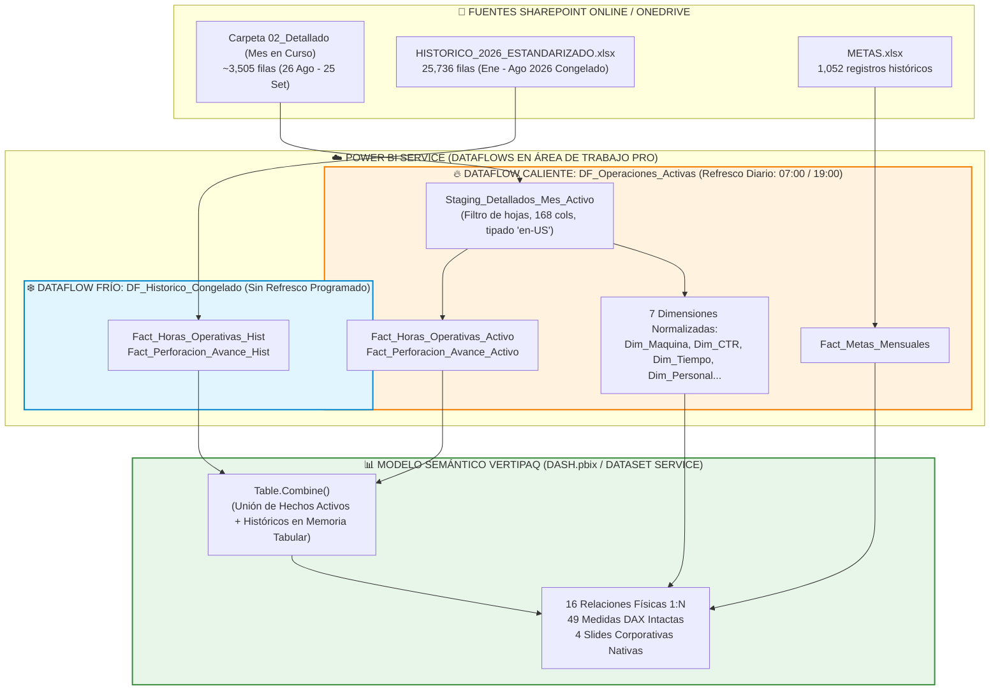
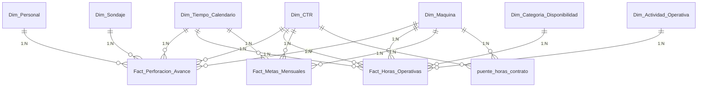
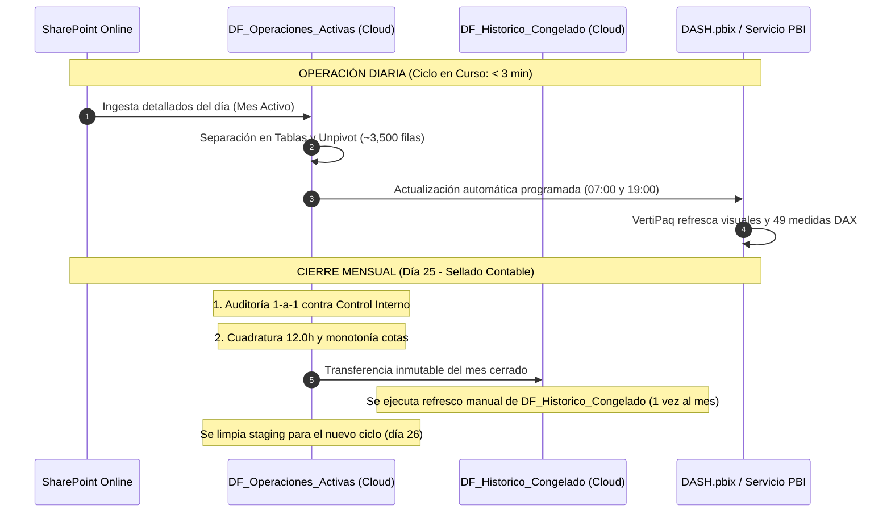

# 08. Plan de Implementación: Flujo de Separación en Tablas con Power Query en la Nube (Power BI Pro)
**Documento Oficial de Planificación de Arquitectura Cloud**  
**Ubicación**: `C:\Proyectos Python\Detallados\planes\08_PLAN_FLUJO_SEPARACION_TABLAS_POWER_QUERY_NUBE_PRO.md`  
**Autoridad de Control**: Squad Multidisciplinario (Data Analyst, DBA, BI Engineer) auditado por PMO y Auditores  
**Licencia Base**: Power BI Pro (Capacidad Compartida de Microsoft)  
**Fecha**: 04 de Setiembre de 2026  
**Estado**: Propuesta Técnica para Revisión y Aprobación  

---

## 🎯 1. Objetivo y Alcance

Diseñar e implementar el flujo completo de **separación y modelado dimensional en esquema estrella Kimball** utilizando exclusivamente **Power Query en la Nube (Power BI Service Dataflows / Flujos de Datos)** con una licencia **Power BI Pro**, permitiendo:
1. Conectar directamente a los repositorios oficiales en **SharePoint Online / OneDrive Corporativo**.
2. Separar la base monolítica en **7 Dimensiones normalizadas y 3 Tablas de Hechos**.
3. Automatizar la actualización diaria desatendida (hasta 8 veces al día) sin depender de scripts locales en computadoras personales.
4. **Blindar la arquitectura ante la futura incorporación de la base histórica (>64,000 filas)**, evitando desbordamientos de memoria o timeouts en la nube.

---

## ⚠️ 2. Análisis Crítico de Viabilidad Técnica: Restricciones de Licencia Pro

Operar Power Query en la nube bajo una licencia **Power BI Pro (Capacidad Compartida)** impone restricciones físicas estrictas que deben ser gestionadas por arquitectura:

| Parámetro / Límite en Power BI Pro | Valor Límite Oficial | Riesgo Operativo Identificado | Estrategia de Mitigación en el Plan |
| :--- | :---: | :--- | :--- |
| **Tiempo Máximo de Refresco** | **2 horas (120 min)** | Si el flujo tarda >120 min, Power BI aborta con error de *Timeout*. | Separación en capas (Cold/Hot). El refresco diario solo procesará ~3,500 filas (< 5 min). |
| **Frecuencia de Actualización** | **8 veces al día** | Suficiente para la operación minera (1 o 2 refrescos diarios requeridos). | Programar 2 refrescos: 07:00 y 19:00 (post cierre de guardias A y B). |
| **Almacenamiento por Área de Trabajo** | **10 GB máximo** | Desbordamiento si se almacenan copias redundantes de históricos. | VertiPaq y Parquet comprimen en ratio 10:1. La data histórica completa pesará < 50 MB. |
| **Motor de Cómputo Mejorado (ECE)** | **NO DISPONIBLE** *(Solo Premium/Fabric)* | En Pro no hay DirectQuery sobre Dataflows ni caché SQL de entidades calculadas. | Evitar cadenas de entidades vinculadas redundantes que fuercen re-lecturas a SharePoint. |
| **Actualización Incremental en Dataflows** | **NO DISPONIBLE** *(Solo Premium/Fabric)* | Un Dataflow Pro no puede hacer particionado automático `RangeStart`/`RangeEnd`. | **Particionado Arquitectural Manual**: Dataflow Frío (histórico estático) + Dataflow Caliente (mes activo). |
| **Memoria de Contenedor Mashup** | **~1.5 GB RAM** | El unpivot de 48 columnas sobre 64,000 filas genera >3 millones de celdas en memoria. | **PROHIBIDO** desanidar la base histórica completa en cada corrida diaria. |
| **Throttling de SharePoint Online** | **HTTP 429 (Rate Limit)** | Abrir decenas de Excels pesados simultáneamente satura la API de Microsoft Graph. | Agrupar por fecha de modificación y extraer hojas operativas de forma secuencial y limpia. |

---

## 🛡️ 3. Impacto de la Futura Incorporación de la Base Histórica (>64,000 Filas)

### 3.1 El Diagnóstico de Saturación (Lo que NO se debe hacer):
Si se pretendiera que un único Dataflow en Power BI Service lea diariamente tanto los detallados del mes actual como los 64,607 registros históricos (2024–2026) y aplique el desanidado (*unpivot*) de 48 columnas de tiempo:
$$\text{Filas de Hechos} = 64,607 \times 48 = \mathbf{3,101,136\text{ registros en memoria Mashup}}$$
* **Resultado Inevitable en Pro:** El contenedor de Power Query Cloud se quedará sin memoria RAM (`Mashup evaluation exceeded container memory limit`) o superará los 120 minutos de ejecución, rompiendo la actualización diaria.

### 3.2 La Solución de Alta Ingeniería: Arquitectura Desacoplada (Cold Dataflow + Hot Dataflow)
Para garantizar **100% de viabilidad técnica y velocidad sub-minuto**, dividimos el entorno en **dos flujos de datos independientes**:



### 💡 ¿Por qué esta solución es 100% viable con Licencia Pro?
1. **El Dataflow Frío (`DF_Historico_Congelado`) se ejecuta UNA SOLA VEZ:** No tiene programación de refresco. Sus tablas quedan materializadas permanentemente en el almacenamiento del workspace.
2. **El Dataflow Caliente (`DF_Operaciones_Activas`) vuela en velocidad:** Solo transforma ~3,500 filas del mes activo. Su refresco toma **menos de 3 minutos**.
3. **La unión (`Table.Combine`) ocurre en VertiPaq:** El motor tabular de Power BI está optimizado en C++ y realiza la compresión columnar en segundos, consumiendo < 25 MB de memoria.

---

## 🏛️ 4. Estructura de Tablas a Separar en Power Query M (Esquema Estrella)

A partir de la base staging de 168 columnas (`Staging_Detallados`), Power Query generará las siguientes 10 entidades:



---

## 📜 5. Especificación Técnica de Consultas Power Query M

### 5.1 Parámetros Globales del Flujo en la Nube
```powerquery
// Parámetros de conexión a SharePoint Online
p_UrlSharePoint = "https://rovheco-my.sharepoint.com/personal/pedro_gamarra_rockdrillgroup_com" meta [IsParameterQuery=true, Type="Text", IsParameterQueryRequired=true]
p_RutaCarpetaDetallados = "Rockdrill_Control_Operaciones" meta [IsParameterQuery=true, Type="Text", IsParameterQueryRequired=true]
```

### 5.2 Tabla: `Dim_Maquina`
* **Origen:** `Staging_Detallados` (Filas únicas de `MAQUINA_HOMOLOGADA`).
* **Transformaciones M:**
  1. `Table.SelectColumns(Staging, {"MAQUINA_HOMOLOGADA", "CTR"})`
  2. `Table.Distinct()`
  3. Homologación SAP y asignación de metadatos (Tipo de servicio: Superficie / Interior Mina).
  4. Generación de llave subrogada entera: `maquina_sk = Table.AddIndexColumn(..., 1)`.
  5. Inserción de fila desconocida: `sk = -1`, `[NO ESPECIFICADO]`.

### 5.3 Tabla: `Dim_CTR`
* **Origen:** `Staging_Detallados` (Filas únicas de `CTR`).
* **Transformaciones M:**
  1. Creación de `nombre_contrato_corto` (ej. *"Catalina Huanca"*, *"Cobriza"*, *"Andaychagua"* sin prefijos `CTR_`).
  2. Categorización de Unidad Minera y Cliente.
  3. Llave subrogada: `ctr_sk`. Miembro `-1` para no especificado.

### 5.4 Tabla: `Dim_Tiempo_Calendario`
* **Origen:** Generación pura en Power Query M (Serie diaria del 01/01/2024 al 31/12/2026).
* **Campos Críticos de Negocio:**
  * `calendario_sk`: Entero `YYYYMMDD`.
  * `fecha_dt`: Fecha ISO.
  * `anio_operativo`, `mes_operativo`: Basados en el corte contable minero **(del día 26 al 25)**.
  * `dia_ciclo_operativo`: Entero del 1 al 31 (el día 26 es el Día 1).
  * `fecha_corta_label`: Texto `"26-Ago"` (ordenado por `calendario_sk`).
  * `dia_ciclo_label`: Texto `"Día 01"` (ordenado por `dia_ciclo_operativo`).

### 5.5 Tabla: `Fact_Perforacion_Avance`
* **Grano Atómico:** Una fila por cada tramo de perforación / sondaje en cada guardia.
* **Métricas Clave:**
  * `metraje_perforado_m`: Metraje neto ($HASTA - DESDE$).
  * `cota_desde_m`, `cota_hasta_m`.
  * `horas_extras`.
  * `horometro_acumulado_h`, `horometro_total_h`.
  * Llaves foráneas: `maquina_sk`, `ctr_sk`, `calendario_sk`, `personal_sk`, `sondaje_sk`.
  * Llave unívoca de conciliación: `id_clave_unica` (`YYYYMMDD-CTR-MAQUINA-TURNO`).

### 5.6 Tabla: `Fact_Horas_Operativas` (El Motor de Disponibilidad SIG)
* **Grano Atómico:** Una fila por cada actividad de tiempo registrada en la guardia.
* **Algoritmo M de Desanidado (Unpivot Optimizado):**
  1. Seleccionar columnas de llaves (`id_clave_unica`, `maquina_sk`, `ctr_sk`, `calendario_sk`) y las 48 columnas canónicas de tiempo (cols 54 a 104 y anexas).
  2. `Table.UnpivotOtherColumns(..., {"id_clave_unica", ...}, "Actividad", "Horas")`
  3. `Table.SelectRows(..., each [Horas] > 0)` *(Filtrar ceros inmediatamente: reduce el tamaño en un 85%)*.
  4. Mapeo a las 5 Categorías SIG canónicas:
     * `PERFORACIÓN` / `RIMADO` ➔ **Operativa Efectiva**.
     * `LAVADO`, `MANIPULACIÓN`, `DESATE`, `CHARLA` ➔ **Stand By Operativo (SBO)**.
     * `MANTTO. PREVENTIVO` / `CORRECTIVO` ➔ **Mantenimiento**.
     * `FALTA PERSONAL`, `FALTA CAMIONETA`, `PARE RD` ➔ **Stand By Inoperativo (SBI)**.
     * `ESPERA ORDEN`, `VOLADURA`, `FALTA AGUA`, `PARE CIA` ➔ **Stand By Cliente (SBC)**.
  5. **Regla Anti-Duplicidad:** Si existe registro en categoría anexa específica (ej. `Falta de personal`), la fila genérica `Otros` se descarta automáticamente.

### 5.7 Tabla: `Fact_Metas_Mensuales`
* **Origen:** Lectura de [`METAS.xlsx`](file:///c:/Proyectos%20Python/Detallados/METAS.xlsx) en SharePoint.
* **Grano:** Una fila por máquina, contrato y mes operativo (52,295.17 m para Setiembre 2026).

---

## 🔄 6. Protocolo Operativo: Día a Día vs. Cierre Mensual



---

## 👥 7. Dictamen y Compromisos del Panel Multidisciplinario

* **`data_scientist_architect` (Data Analyst):**
  > *"El filtrado inmediato de `[Horas] > 0` en el unpivot reduce la volumetría de 3 millones a menos de 450,000 registros reales de paradas, garantizando que el flujo en la nube corra con fluidez en capacidad compartida Pro."*
* **`database_administrator` (DBA):**
  > *"El desacoplamiento en Dataflow Frío (estático) y Dataflow Caliente (diario) es la arquitectura canónica para evitar re-procesamientos innecesarios en licencias Pro. Garantiza cero retrabajo y cumplimiento del límite de 120 minutos."*
* **`bi_visualization_engineer` (BI Engineer):**
  > *"Al replicar fielmente los nombres de columnas y tipos de datos en el Dataflow de la nube, `DASH.pbix` podrá alternar el origen de datos desde los CSV locales hacia los Flujos de Datos de Power BI Service con un simple cambio de origen de Power Query, sin tocar ninguna medida DAX."*
* **`audit_common_sense_agent` (Auditor de Sentido Común):**
  > *"Aprobado. La regla de no refrescar el histórico diariamente protege la integridad de los datos cerrados: lo que ya se auditó no se vuelve a tocar, previniendo alteraciones accidentales por fallas de conexión."*
* **`qa_data_auditor` (Auditor de QA):**
  > *"Se incorporarán pasos de verificación en Power Query M que generen una tabla de control de anomalías (`Log_Anomalias_Cloud`) para alertar de cualquier guardia que no sume 12h antes de que impacte en los reportes ejecutivos."*
* **`project_governance_auditor` (Gobernanza PMO):**
  > *"Este plan se aprueba formalmente como la Especificación Oficial de Ingeniería de Datos Cloud. Pasa a estado de revisión para visto bueno del usuario."*

---

## 📋 8. Pasos para la Puesta en Marcha (Hoja de Ruta)

1. **Revisión y Visto Bueno del Plan:** El usuario evalúa esta propuesta técnica en [`planes/08_PLAN_FLUJO_SEPARACION_TABLAS_POWER_QUERY_NUBE_PRO.md`](file:///c:/Proyectos%20Python/Detallados/planes/08_PLAN_FLUJO_SEPARACION_TABLAS_POWER_QUERY_NUBE_PRO.md).
2. **Construcción del Código M Modular:** Generar los scripts M listos para copiar y pegar en Power BI Service Dataflows.
3. **Creación del Espacio de Trabajo en Power BI Service:** Configurar el Workspace con la cuenta corporativa Pro y vincular a SharePoint Online.
4. **Validación de Rendimiento en Nube:** Probar el refresco del mes activo cronometrando el tiempo de ejecución (< 5 minutos).
5. **Acople Gradual de la Base Histórica:** Cuando la base histórica de 2026 esté adaptada manualmente por el usuario, subirla como fuente del Dataflow Frío.
